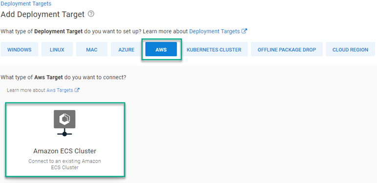
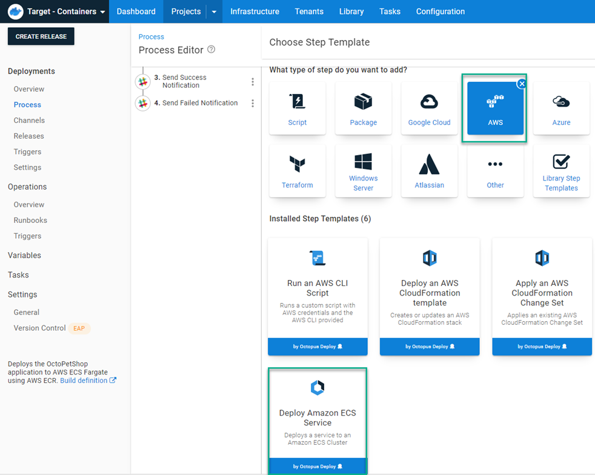

A little over a year ago, I wrote a [blog post](https://octopus.com/blog/aws-fargate) demonstrating how to deploy to AWS ECS using Octopus Deploy.  While the content showed you how to make it work, having to script out everything yourself using the AWS CLI wasn't exactly a stellar experience.  Octopus Depoloy version 2021.3 now includes an ECS deployment step that completely replaces everything from the original post!

## Amazon ECS Target
The new ECS step works similar to other steps in that they deploy to a newly created ECS target.  When creating a new target, select the AWS category, then the new ECS Target



As with other target types, you can also add the target via the API or use script commands.

### API
Registering a target via the API isn't anything new, there are many examples on how to do this.  However, the ECS step utilizes the new `Step UI Framework` (link?).  The `Endpoint` component of the JSON document for an ECS Target is different than other target types.  Below is an example script on how to register an ECS target via the API.

```powershell
# Define parameters
$baseUrl = $OctopusParameters['Global.Base.Url']
$apiKey = $OctopusParameters['Global.Api.Key']
$spaceId = $OctopusParameters['Octopus.Space.Id']
$spaceName = $OctopusParameters['Octopus.Space.Name']
$environmentName = $OctopusParameters['Octopus.Environment.Name']
$environmentId = $OctopusParameters['Octopus.Environment.Id']
$awsAccount = $OctopusParameters['AWS.Account']
$awsECSClusterName = $OctopusParameters['AWS.ECS.Cluster.Name']
$awsRegion = $OctopusParameters['AWS.Region.Name']
$name = $OctopusParameters['AWS.ECS.Cluster.Name']

# Get default machine policy
$machinePolicy = (Invoke-RestMethod -Method Get -Uri "$baseUrl/api/$spaceId/machinepolicies/all" -Headers @{"X-Octopus-ApiKey"="$apiKey"}) | Where-Object {$_.Name -eq "Default Machine Policy"}
Write-Output "Retrieved $($machinePolicy.Name) ..."

# Build JSON payload
$jsonPayload = @{
	Id = $null
    MachinePolicyId = $machinePolicy.Id
    Name = $name
    IsDisabled = $false
    HealthStatus = "Unknown"
    HasLatestCalamari = $true
    StatusSummary = $null
    IsInProcess = $true
    EndPoint = @{
    	DeploymentTargetType = "aws-ecs-target"
        DeploymentTargetTypeId = "aws-ecs-target"
        StepPackageId = "aws-ecs-target"
        StepPackageVersion = "1.0.0"
        Inputs = @{
        	clusterName = $awsECSClusterName
            region = $awsRegion
            awsAccount = $awsAccount
        }
        RelatedDocumentIds = @($awsAccount)
    	Id = $null
        CommunicationStyle = "StepPackage"
        Links = $null
        DefaultWorkerPoolId = ""
    }
    Links = $null
    TenantedDeploymentParticipation = "Untenanted"
    Roles = @(
    	"PetClinic-ECS"
    )
    EnvironmentIds = @(
    	$environmentId
    )
    TenantIds = @()
    TenantTags = @()
}

# Register the target to Octopus Deploy
Invoke-RestMethod -Method Post -Uri "$baseUrl/api/$spaceId/machines" -Headers @{"X-Octopus-ApiKey"="$apiKey"} -Body ($jsonPayload | ConvertTo-Json -Depth 10)
```

### Script commands
Target types that were developed using the Step UI Framework can take advantage of a new command to register their target types.  Below is an example of how to use the command to register an ECS Target

```powershell PowerShell
$inputs = @"
{
    "clusterName": "$($OctopusParameters["clusterName"])",
    "region": "$($OctopusParameters["region"])",
    "awsAccount": "$($OctopusParameters["awsAccount"])",
}
"@
New-OctopusTarget -Name $OctopusParameters["target_name"] -TargetId "aws-ecs-target" -Inputs $inputs -Roles $OctopusParameters["role"]
```
```bash Bash
read -r -d '' INPUTS <<EOT
{
    "clusterName": "$(get_octopusvariable "clusterName")",
    "name": "$(get_octopusvariable "target_name")",
    "awsAccount": "$(get_octopusvariable "awsAccount")",
}
EOT
new_octopustarget -n "$(get_octopusvariable "target_name")" -t "aws-ecs-target" --inputs "$INPUTS" --roles "$(get_octopusvariable "role")"
```

## The DEPLOY AMAZON ECS SERVICE step
To demonstrate the **DEPLOY AMAZON ECS SERVICE** step, this post will duplicate the deployment of the containerized version of the OctoPetShop application from the previous post using the new step.

### Adding the DEPLOY AMAZON ECS SERVICE step
To add the The **DEPLOY AMAZON ECS SERVICE** step, click on **ADD STEP**, choose AWS, then `Deploy Amazon ECS Service`



Once the step has been added fill in the form fields with same information from the script

:::info
In the script version, the `Register-ECSTaskDefinition` cmdlet takes a parameter `-Cpu 512`.  This value equates to `0.5 vCpu` in the new step (https://docs.aws.amazon.com/AmazonECS/latest/developerguide/task-cpu-memory-error.html).
:::
