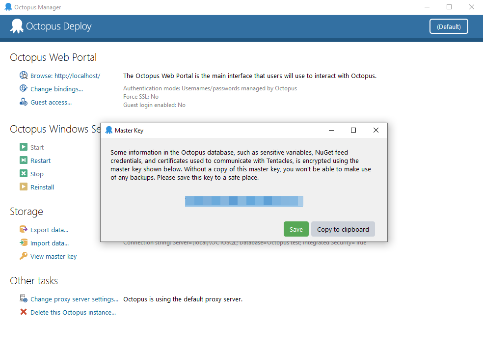
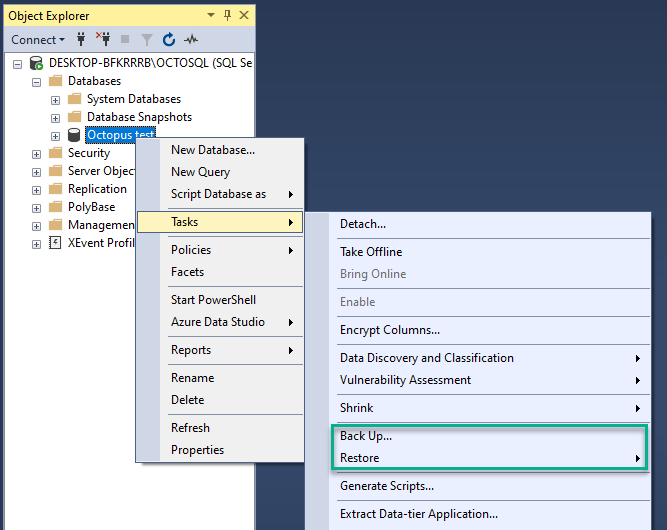
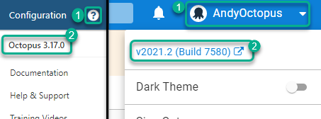
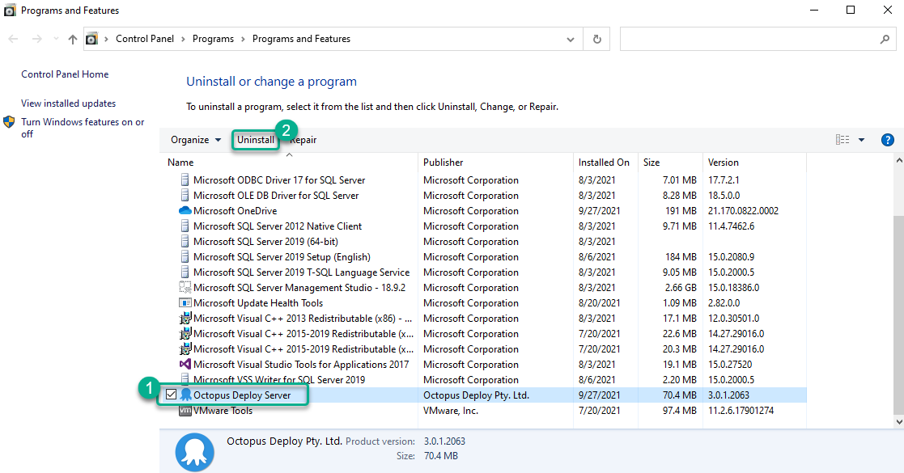
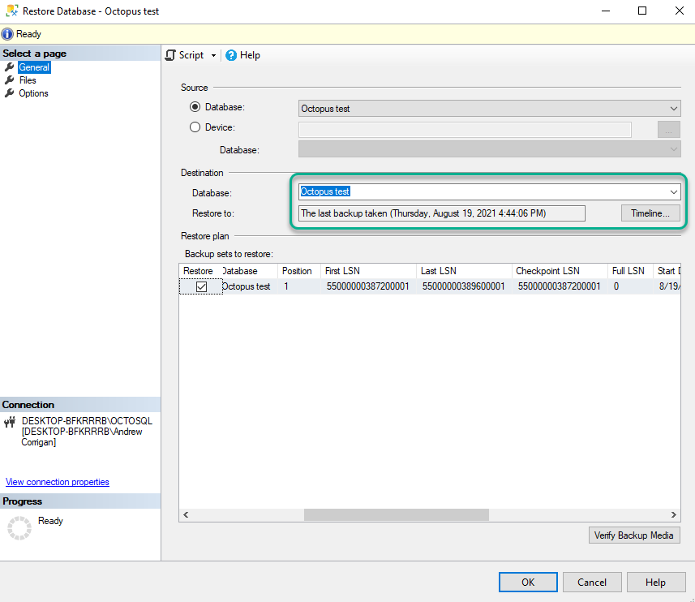

The phrase "if it ain’t broke, don’t fix it" doesn’t always work in the world of development. Octopus is no different, which is why we aim to improve how you deliver releases with major releases of our own. If you're not up to date with Octopus, you could be missing features that make deployments easier, more efficient, and help your teams to coordinate.

That said, we understand why some prefer to stick with older versions of Octopus. You may feel your current version does what you need, or a company policy could dictate staying a few versions behind to avoid risk. Maybe you fell behind on updates and worry about the time and resources to get back up to date.

For those in that last category especially, let’s see if we can ease your fears. With planning and the right method for your business, you can have confidence in upgrading from even our oldest 'modern' version.

In this post I run through:

- Features you’re missing out on by not upgrading
- What to back up before an upgrade, plus other considerations
- Ways to avoid risk when planning your upgrade
- An example in-place upgrade from 3.x to our latest version
- How to roll back should something go wrong
- How we can help if you have concerns or problems

## Features we’ve introduced since Octopus 3.1

If still on a 3.x version, you're missing out on Octopus’s evolution alongside modern deployment standards, plus a heap of new features.

Here’s a taste of what we added between Octopus 3.1 and 2021.2:

- Improved UI - new process editor, dark mode, and a global search
- Improvements to config files, including built-in support for JSON, XML, YAML, and property files
- [Spaces](https://octopus.com/docs/administration/spaces) - a way for different teams to only see and use what they need
- [Runbooks](https://octopus.com/docs/runbooks) - allows you to automate routine maintenance and emergency operations tasks
- [Tenants](https://octopus.com/docs/tenants) - create customer-specific pipelines for Software as a Service (SaaS) or multi-region deployments
- [Project exports and imports](https://octopus.com/docs/projects/export-import) - export one or more projects to import into other spaces or instances
- [Configuration as Code](https://octopus.com/docs/projects/version-control) - version control for Octopus projects (this is an early access preview)

We also added new platform integrations, including support for:

- Major cloud providers - Microsoft Azure, Amazon Web Service (AWS), and Google Cloud Platform (GCP)
- Kubernetes and AWS Elastic Container Service (ECS)
- Self-hosted Octopus on Linux
- Tentacles for Linux, ARM, and ARM64 
- Octopus Command Line (CLI) with Chocolatey, Homebrew, APT, and YUM
- Plugins for:
   - [Jenkins](https://plugins.jenkins.io/octopusdeploy/) (and full pipeline support)
   - [GitHub Actions](https://github.com/marketplace?type=actions&query=Octopus+)
   - [Jira](https://marketplace.atlassian.com/apps/1220376/octopus-deploy-for-jira?hosting=cloud&tab=overview)

## What to back up and how {#what-to-back-up-and-how}
      
### Master key
   
The master key is a unique security string that protects sensitive data held in the Octopus Deploy database. Without it, you can’t restore backups on a clean operating system.

:::warning
Aside from your database, this is the most important thing to back up before an upgrade. We cannot recover a lost master key.
:::
   
To back up the master key:
   
1. Open Octopus Manager on your server
1. Click **View master key** under the **Storage** heading
1. Here you can click either:
   - **Save** to store the master key in a text file
   - **Copy to clipboard** to paste it somewhere safe, such a password manager
   

 
### License key
   
You also need your license key to restore your instance.
   
To back up the license key:
   
1. Open the Octopus Web Portal and click **Configuration** in the top menu.
1. Select **License** from the left menu. Copy all the text from the XML box and paste it somewhere safe.
   
If you can’t find or don’t know your license key, [email our customer success team](mailto:customersuccess@octopus.com) and we can help recover it.
   
### Database
   
You should always back up your database before upgrading Octopus. Most database management tools have wizards to help you.

For example, to back up a database in Microsoft’s SQL Server Management Studio (SSMS):
   
1. Expand the **Databases** folder on your database server
1. Right-click the database, select **Tasks**, and click **Back Up…**
1. Use the **Destination** section to set where you want to store the backup and click **OK**
   

   
For those who prefer T-SQL commands, you can use the following command to save a backup to NAS or file share:
   
```
BACKUP DATABASE [OctopusDeploy]
          TO DISK = '\\SomeServer\SomeDrive\OctopusDeploy.bak'
             WITH FORMAT;
```
   
Always check with your database administrator if unsure.
   
### Data folders
   
Copy and store the following folders and all their data:
   
- C:\Octopus\Artifacts
- C:\Octopus\Packages
- C:\Octopus\Tasklogs

### Download the same version of Octopus you already use

You need your existing Octopus version to:

- [Roll back if there's a problem](#rolling-back-if-something-goes-wrong)
- Install on a clone or test environment if using one of our recommended [strategies to avoid risk](#strategies-to-avoid-risk)

To check your version, open the Octopus Web Portal and click the question mark in Octopus’s top right. The version number is at the top of the dropdown.

Then head to our [download archives](https://octopus.com/downloads/previous) to re-download that version.



## Other things to think about before upgrading

### Octopus licensing

You can use your Octopus license on 3 unique instances (determined by the database it connects to). If you think you’ll exceed your Octopus instance limit, [email our customer success team](mailto:customersuccess@octopus.com) for your options.

### Don't do too much at once

Though it could be tempting to use downtime from an Octopus upgrade for other tasks (such as changing your Octopus server's operating system or moving to a high-availability instance), we recommend focusing only on the upgrade.

Doing so will:

- Ensure the upgrade runs as smoothly as possible
- Prevent other tasks complicating the upgrade
- Reduce impact on your Octopus users
- Make the other tasks a little easier if you’re already on our latest version

## Strategies to avoid risk {#strategies-to-avoid-risk}

There are 2 recommended ways to avoid risk when upgrading Octopus. Both are simple but you should consider which is best for your business before you start.

Let’s break down the options.

### Method 1: Clone your instance and upgrade

Cloning your instance and upgrading the clone is our recommended method because it allows you to:

- Leave your main instance available while testing
- Have full confidence in the upgrade before committing to it
- Not worry about rolling back should something go wrong

The main steps for this method are:

1. Put your instance into maintenance mode
1. Back up the database
1. Take the instance out of maintenance
1. Restore the backup as a new database on the desired SQL Server
1. Download the same version of Octopus as your main instance and install it on a new server
1. Configure the new instance to point to the new copy of the database
1. Copy all files from backed-up folders from the main instance
1. Optional: Disable all deployment targets
1. Upgrade the cloned instance
1. Test the cloned instance, then check all API scripts, CI integrations, and deployments work
1. Decide whether to migrate to the new instance or perform new backups and upgrade your main instance

Read our upgrade documentation to see [this method’s steps](https://octopus.com/docs/administration/upgrading/guide/upgrading-from-octopus-3.x-to-modern#recommended-approach-create-a-cloned-instance) in more detail.

#### Considerations for this method

While the best bet for a smooth transition, this method can be time-intensive and needs downtime during migration. It can also be costly, as you must clone your entire environment. This means double the cost of hardware, licensing, or cloud services.

You also have the risk of ‘drift’ as teams continue to use the main instance during testing. If you think you need more than a week to figure things out, you could:

- Opt for method 2 instead
- Figure out any problems on the cloned instance and then restart on a fresh instance when comfortable

### Method 2: Create a new instance to test the process, then update with confidence

Some customers may not have the time or resources to complete the first method. Instead, you can create a small test instance with a few projects to gain confidence before upgrading on the main instance.

This method:

- Saves time and resources
- Has a shorter downtime
- Removes the risk of drift
- Is easy to roll back if something goes wrong

The main steps for this method are:

1. Download the same version of Octopus as your main instance and install it on a new virtual machine
1. Export some projects from the main instance and import them into the test instance
1. Download the latest version of Octopus
1. Back up the test instance database
1. Upgrade the test instance to the latest Octopus version
1. Test and verify the test instance
1. Put your main instance into maintenance mode
1. Back up the database on the main instance
1. Back up all folders on the main instance
1. Do an in-place upgrade of your main instance
1. Test the upgraded main instance
1. Take the main instance out of maintenance mode

Read our upgrade documentation to see [this method’s steps](https://octopus.com/docs/administration/upgrading/guide/upgrading-from-octopus-3.x-to-modern#alternative-approach-create-a-test-instance) in more detail.

#### Considerations for this method

With older versions of Octopus, you can only export all data using Octopus Manager, though you can get partial exports with a command line. Run the following command for each project you’d like to export for testing:

```
Octopus.Migrator.exe partial-export --instance=OctopusServer --project=AcmeWebStore --password=5uper5ecret --directory=C:\Temp\AcmeWebStore --ignore-history --ignore-deployments --ignore-machines
```

:::hint
In the latest versions of Octopus, we added a feature to easily [export and import projects between spaces and instances](https://octopus.com/blog/exporting-projects).
:::

### Upgrading a high availability Octopus setup

Upgrading a high availability instance of Octopus isn't that different from a normal upgrade, but there are things to note due to the extra nodes.

You must only upgrade one node before upgrading the others. The Octopus installer updates the database so upgrading all nodes at once can cause database problems.

The main steps for a high availability upgrade are:

1. Download the latest version of Octopus
1. Enable maintenance mode
1. Stop all the nodes
1. Back up the database and Octopus folders
1. Upgrade 1 node
1. Upgrade remaining nodes
1. Start all stopped nodes
1. Test upgraded instance
1. Disable maintenance mode

With high availability, the Octopus data folders are also likely stored on a network drive rather than on a node. You need to know this location to back up your files before the upgrade. Remember, the folders you should back up are:

-	Artifacts
-	Packages
-	Tasklogs

## An example in-place upgrade from 3.1

An in-place upgrade of Octopus is the same regardless of whether it's on your clone, test, or production instances.

If upgrading from a 3.X version, you should upgrade to 3.17 before making the jump to our latest version. This provides the most reliable upgrade path as there's a big difference between versions 3.1 and 3.17.

Thankfully, the upgrade process doesn’t take very long regardless of the Octopus version you’re running.

### Before you start

For this example upgrade, you should:

- Double check you’ve [backed up everything we already outlined](#what-to-back-up-and-how)
- Set up a project to test your deployments after each upgrade.
- Download the following Octopus versions from our website:
   - [The version you're already using](#download-the-same-version-of-Octopus-you-already-use)
   - [Octopus 3.17](https://octopus.com/downloads/3.17.14)
   - [Our latest version](https://octopus.com/downloads)

### Step 1: Enable maintenance mode

Once everything’s backed up, you should put your instance into maintenance mode. This will mean only Octopus admins can deploy.

To set maintenance mode, click **Configuration** in the top menu and select **Maintenance** from the left. Toggle **Maintenance mode** to **ON** and click **Save**.

### Step 2: Install Octopus 3.17

1. Close Octopus Manager and the Octopus Web Portal.
1. Run the installer for Octopus 3.17 and click **Finish** once complete.
1. Octopus will auto-update your config and SQL database, then open Octopus Manager.
1. Open the Octopus Web Portal and check the version is now 3.17 by clicking the question mark in the top right. The version is at the top of the menu.
1. Run a test deployment to check everything still works.

### Step 3: Install the latest version of Octopus

1. Close both Octopus Manager and the Octopus Web Portal.
1. Run the installer for Octopus’s latest version and click **Finish** once complete.
1. Octopus will auto-update your config and SQL database, then open Octopus.
1. Open the Octopus Web Portal and check the version is now the most recent by clicking your username in the top right. The version is at the top of the menu.
1. Run a test deployment to check everything still works.

### Step 4: Take Octopus out of maintenance mode

To remove maintenance mode, click **Configuration** in the top menu and select **Maintenance** from the left. Click **DISABLE MAINTENANCE MODE**.

## Rolling back if something goes wrong {#rolling-back-if-something-goes-wrong}

While we’re confident in Octopus’s upgrade process from modern versions, we know problems can still happen, particularly with complex setups.

If the unexpected does happen, you can easily roll back to your old version of Octopus.

### Step 1: Uninstall the new Octopus version

1. Close the Octopus Web Portal and Octopus Manager
1. Find Octopus Manager in the Windows Start menu or search using the Task Bar, right-click and select **Uninstall**
1. Select Octopus from your list of applications and click **Uninstall**



### Step 2: Restore the database

Use your database management tool to restore the database to its original state (with Microsoft’s SSMS, for example):

1. Expand the **Databases** folder on your database server.
1. Right-click the database, select **Tasks**, **Restore**, and select **Database**.
1. Use the wizard to select the correct backup or file. In my case, it defaulted to my last backup. Click **OK** when ready.
1. Click **OK** on the **Database restored successfully** popup to finish.



### Step 3: Restore Octopus folders

If rolling back on the original server, we recommend you copy the upgraded Octopus folders to a new location before restoring the originals. You can delete them once you know the rollback is a success. 

To restore the original versions:

1. Delete the contents of the following folders:
   -	C:\Octopus\Artifacts
   -	C:\Octopus\Packages
   -	C:\Octopus\Tasklogs
1. Copy the old versions of your files back into the same locations

If restoring to a clean server, you only need to copy the folders to C:\Octopus\.

### Step 4: Reinstall your previous version of Octopus

You can now reinstall your original version of Octopus.

1. Run the installer for your original Octopus version and click **Finish** once complete. If rolling back on a clean operating system, the Octopus Setup Wizard will prompt for your license key and master key before the install.
1. Octopus Manager should open automatically. You may need to manually start the Octopus server - just click **Start** on the left.
1. Open the Octopus Web Portal. You may get caching-related errors when the Web Portal opens the first time after the reinstall. If this happens, refresh the tab and Octopus should load fine.
1. Run a deployment to check everything still works.

## What's next?

After you've upgraded your Octopus instance, there are options to save yourself some work for future upgrades.

The first is to [automate Octopus upgrades](https://octopus.com/docs/administration/upgrading/guide/automate-upgrades). This allows Octopus to deploy new versions to itself, performing all essential steps and reducing downtime.

If an on-premises instance of Octopus Server is not a business need, you could [migrate to Octopus Cloud](https://octopus.com/docs/octopus-cloud/migrations). Using Octopus Cloud means you never have to worry about upgrading, and you get access to all our new features as soon as they're available.

## We can help

If you have any concerns or need help plotting your best upgrade approach, we’re always available. Our customer success team can provide instance reviews and support with planning or post-upgrade problems – we’re only [an email](mailto:customersuccess@octopus.com) away.

Happy deployments!
