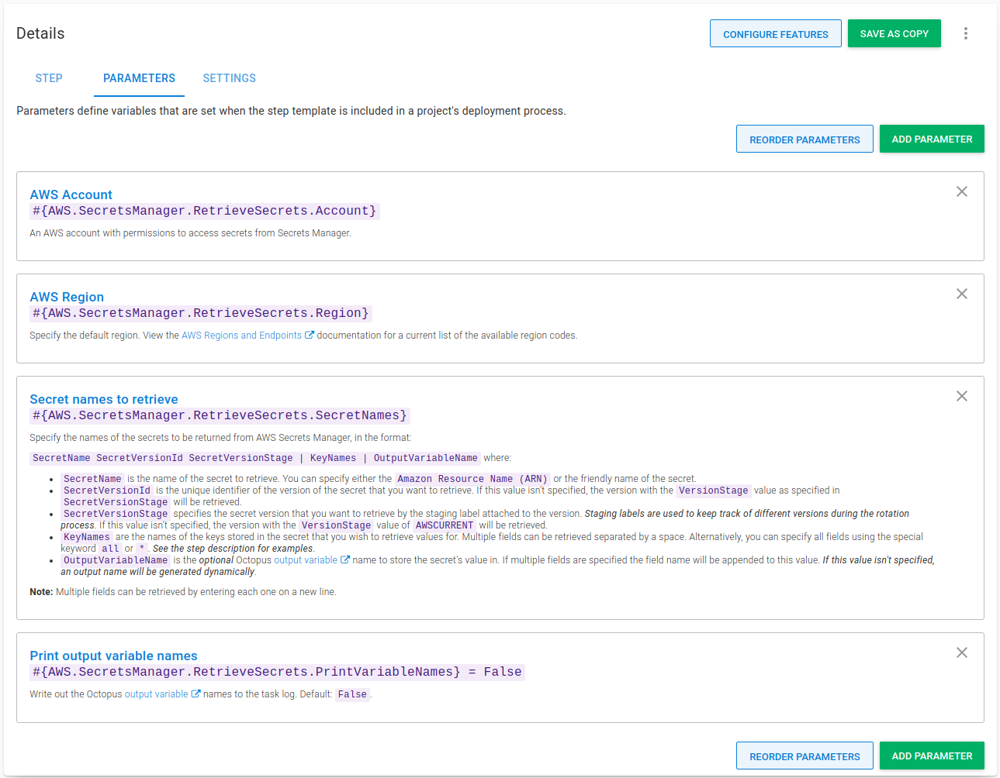
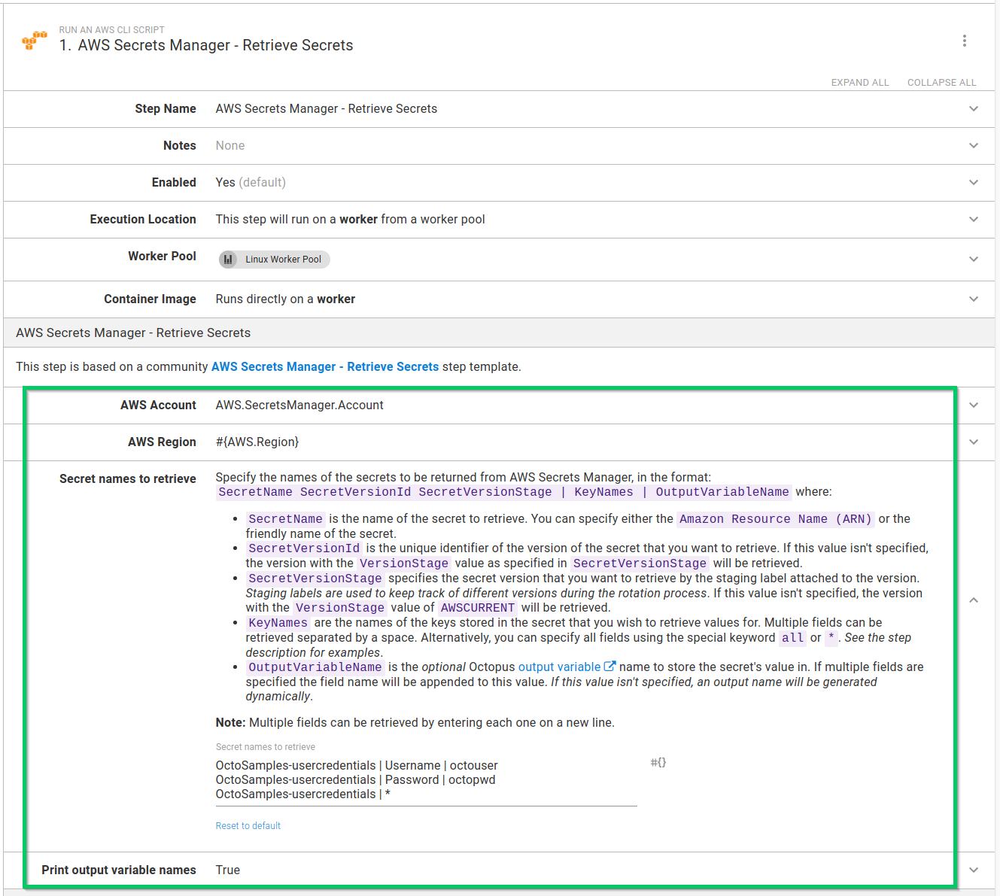
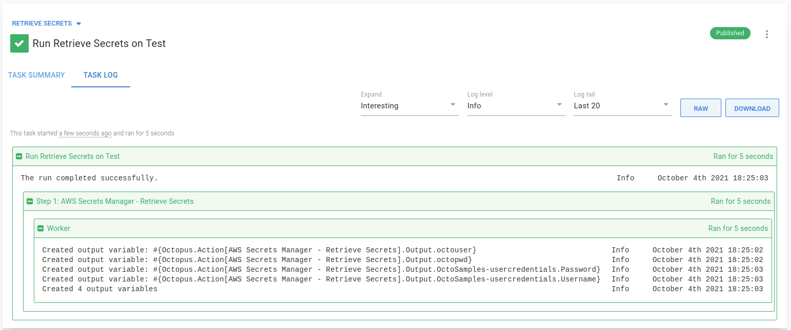

I've written several step templates that extend the functionality of Octopus to integrate with secrets managers, the last being [Google Cloud Secret Manager](https://octopus.com/blog/using-google-cloud-secret-manager-with-octopus). In this post, I cover another major cloud provider, Amazon Web Services (AWS).

I walk through the [AWS Secrets Manager - Retrieve Secrets](https://library.octopus.com/step-templates/5d5bd3ae-09a0-41ac-9a45-42a96ee6206a/actiontemplate-aws-secrets-manager-retrieve-secrets) step template, designed to retrieve secrets from AWS Secrets Manager for use in your deployments or runbooks.

:::hint
You can also read about:

- [Using Azure Key Vault with Octopus](https://octopus.com/blog/using-azure-key-vault-with-octopus)
- [Using HashiCorp Vault with Octopus](https://octopus.com/blog/using-hashicorp-vault-with-octopus-deploy)
- [Using Google Cloud Secret Manager with Octopus](https://octopus.com/blog/using-google-cloud-secret-manager-with-octopus)
:::

## Getting started

This post assumes some familiarity with [custom step templates](https://octopus.com/docs/projects/custom-step-templates) and the Octopus [Community Library](https://octopus.com/docs/projects/community-step-templates). 

In addition, this post doesn't go into great detail about AWS Secrets Manager concepts or how to set up Secrets Manager. You can learn more by reading the [User Guide](https://docs.aws.amazon.com/secretsmanager/latest/userguide/intro.html) from Amazon.

The step template in this post retrieves secrets from [AWS Secrets Manager](https://aws.amazon.com/secrets-manager/) using **AWS Command Line Interface** (AWS CLI), which is the AWS command-line tool. The **AWS CLI** tool must be available on the deployment target or Worker before the step can retrieve secrets successfully. The step template has been tested on both Windows and Linux (with PowerShell Core installed).

## Authenticating with AWS {#authenticating-with-aws}

Before you can retrieve secrets from AWS Secrets Manager, you must authenticate with AWS. In their [authentication and access control guide](https://docs.aws.amazon.com/secretsmanager/latest/userguide/auth-and-access.html), Amazon describes how they use [IAM permissions](https://docs.aws.amazon.com/IAM/latest/UserGuide/introduction.html) to control access to secrets:

> By using IAM permission policies, you control which users or services have access to your secrets. A permissions policy describes who can perform which actions on which resources. 

In Octopus, you can authenticate with AWS using an [AWS account](https://octopus.com/docs/infrastructure/accounts/aws) with appropriate permissions.

:::hint
To learn more about attaching IAM permission policies to secrets or identities with AWS Secrets Manager, review the [permission policies examples](https://docs.aws.amazon.com/secretsmanager/latest/userguide/auth-and-access_examples.html)
:::

## Retrieving secrets {#retrieving-secrets}

The [AWS Secrets Manager - Retrieve Secrets](https://library.octopus.com/step-templates/5d5bd3ae-09a0-41ac-9a45-42a96ee6206a/actiontemplate-aws-secrets-manager-retrieve-secrets) step template:

- Retrieves one or more secrets from AWS Secrets Manager 
- Extracts one or more key/value pairs from each of those secrets
- Creates sensitive output variables for each key/value pair retrieved

Like most cloud providers, AWS Secrets Manager supports [versioned secrets](https://docs.aws.amazon.com/secretsmanager/latest/userguide/getting-started.html#term_version) with the use of a version identifier and one or more staging labels. This is useful as it enables regular rotation for your secrets.

:::hint
Staging labels keep track of different versions during the rotation process. An AWS secret always has a version with the staging label `AWSCURRENT`, which is the current secret value.
:::

A secret in AWS Secrets Manager can store multiple values. Amazon recommends using a JSON text string with key/value pairs, for example:

```json
{
  "hostname"   : "test01.example-database.net",
  "hostport"   : "3458",
  "user"       : "octo_admin_user",
  "pwd"        : "M4eXT4a$uPeA$3cRetP@s5w0rd!"
}
```

This step template has been designed to retrieve multiple key/value pairs from one or more secrets.

Retrieving a single secret and its key/value pairs requires:

- An AWS account with permission to access the secret
- The default AWS [Region](https://docs.aws.amazon.com/general/latest/gr/rande.html#ec2_region) code
- The name and *optionally* the version of the secret and names of specific key/value pairs stored in the secret to create variables for

There's an advanced feature of the step template that offers support for retrieving multiple secrets at once. This requires entering each secret on a new line.

For each secret and key/value pair retrieved, a [sensitive output variable](https://octopus.com/docs/projects/variables/output-variables#sensitive-output-variables) is created for use in subsequent steps. By default, only a count of the number of variables created will be shown in the task log. To see the names of the variables in the task log, change the **Print output variable names** parameter to `True`.

### Step template parameters {#parameters}

The step template uses the following parameters:

- **AWS Account**: An [AWS account](https://octopus.com/docs/infrastructure/accounts/aws) with permissions to access secrets from Secret Manager.
- **AWS Region**: Specify the default region. View the [AWS Regions and Endpoints](https://docs.aws.amazon.com/general/latest/gr/rande.html#ec2_region) documentation for a current list of the available region codes.
- **Secret names to retrieve**: Specify the names of the secrets to return from AWS Secrets Manager, in the format:
`SecretName SecretVersionId SecretVersionStage | KeyNames | OutputVariableName` where:

  - **SecretName**: The name of the secret to retrieve. You can specify either the `Amazon Resource Name (ARN)` or the friendly name of the secret.
  - **SecretVersionId**: The unique identifier of the version of the secret you want to retrieve. If this value isn't specified, the current version is retrieved.
  - **SecretVersionStage**: The secret version that you want to retrieve by the staging label attached to the version. If this value isn't specified, the default staging label value of `AWSCURRENT` is used. *Note:* This value will be ignored if **SecretVersionId** is not specified.
  - **KeyNames**: The names of the keys stored in the secret that you wish to retrieve values for. Multiple fields can be retrieved separated by a space. Alternatively, you can specify all fields using the special keyword `all` or `*`.
  - **OutputVariableName** is the _optional_ Octopus [output variable](https://octopus.com/docs/projects/variables/output-variables) name to store the secret's value in. If multiple key/value pairs are specified the key/value name is appended to this value.

  :::warning
  If both **SecretVersionId** and **SecretVersionStage** are specified, they must point to the same secret version, otherwise, AWS usually returns a `NotFound` error.
  :::

  **Note:** Multiple secrets can be retrieved by entering each one on a new line. See the [examples](#secret-retrieval-examples) for more information.

- **Print output variable names**: Write out the Octopus [output variable](https://octopus.com/docs/projects/variables/output-variables) names to the task log. Default: `False`.



### Secret retrieval examples {#secret-retrieval-examples}

Let's use the example of a secret stored in AWS Secrets Manager named **OctoSamples-usercredentials** with two key/value pairs:

- Username
- Password

Here are some of the ways you can retrieve a secret and its key/value pairs:

1. `OctoSamples-usercredentials | Username | octousername`
   
   This retrieves the secret and extracts the value from the key/value named `Username` and saves it into a sensitive output variable named `octousername`.

2. `OctoSamples-usercredentials | Username Password | octocreds`
   
   This retrieves the secret and extracts the values from the key/values named `Username` and `Password` and saves them to two sensitive output variables named `octocreds.Username` and `octocreds.Password`.

3. `OctoSamples-usercredentials | * | octocreds`
   
   This retrieves the secret and extracts **all** key/values from the secret and saves them to sensitive output variables *prefixed* with `octocreds`.

4. `OctoSamples-usercredentials | all`
   
   This retrieves the secret and extracts **all** key/values from the secret and saves them to sensitive output variables *prefixed* with `OctoSamples-usercredentials`.

### Using the step {#using-the-step}

The **AWS Secrets Manager - Retrieve Secrets** step is added to deployment and runbook processes in the [same way as other steps](https://octopus.com/docs/projects/steps#adding-steps-to-your-deployment-processes).

After you add the step to your process, fill out the parameters in the step:



After you fill in the parameters, you can execute the step in a runbook or deployment process. On successful execution, any values from key/value pairs found in matching secrets are stored as sensitive output variables. If you configure your step to print the variable names, they appear in the task log:



In subsequent steps, output variables created can be used in your deployment or runbook.

:::hint
**Tip:** Remember to replace `AWS Secrets Manager - Retrieve Secrets` with the name of your step for any output variable names.
:::

## Conclusion

The [AWS Secrets Manager - Retrieve Secrets](https://library.octopus.com/step-templates/5d5bd3ae-09a0-41ac-9a45-42a96ee6206a/actiontemplate-aws-secrets-manager-retrieve-secrets) step template demonstrates that it's easy to integrate with AWS Secrets Manager and make use of secrets stored there with your Octopus deployments or runbooks.

Happy deployments!
