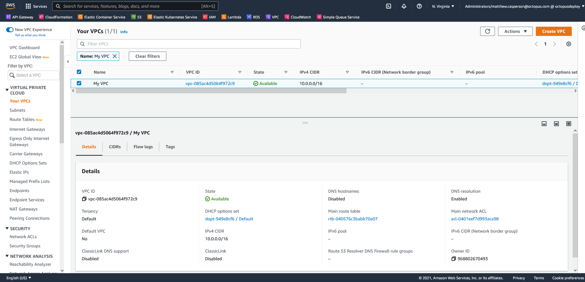

Virtual Private Clouds, or VPCs, are the backbone of any infrastructure deployed to AWS. Almost all resources require a VPC, and most resource segregation is done via VPCs.

Unfortunately, despite their ubiquity, creating VPCs is not quite as straight forward as they could be. In this post you'll learn the different types of VPCs available in AWS, and find an example CloudFormation template that used to deploy a simple VPC with private subnets.

## Types of subnets

AWS has two types of subnets: public and private.

A public subnet has a connection to the internet via an [internet gateway](https://docs.aws.amazon.com/vpc/latest/userguide/VPC_Internet_Gateway.html), and can host resources with public IP addresses. An internet gateway is defined by AWS as:

> a horizontally scaled, redundant, and highly available VPC component that allows communication between your VPC and the internet. 

A private subnet does not route traffic to an internet gateway. Resources in a private subnet do not have public IP addresses, and can only communicate with resources in other subnets within the same VPC.

One or mode subnets can be placed within a VPC. It is possible to mix and match public and private subnets within a VPC, allowing some resources in the VPC to access the internet, and some to only access other resources in the VPC.

In a VPC with public and private subnets, it is possible to route outgoing internet traffic from the private subnets through a [NAT gateway](https://docs.aws.amazon.com/vpc/latest/userguide/vpc-nat-gateway.html). Much like your home router, a NAT Gateway allows outbound internet traffic to be established, and for responses to those outbound requests to be routed back to the device in the private subnet. But a connection can not be initiated from an external connection through a NAT Gateway.

A VPC with private subnets is the easiest to configure, which you'll do in the next section.

## Creating a VPC with private subnets

The following CloudFormation template creates a VPC with two private subnets:

```yaml
Parameters:
  Tag:
    Type: String
    
Resources: 
  VPC:
    Type: "AWS::EC2::VPC"
    Properties:
      CidrBlock: "10.0.0.0/16"
      Tags:
      - Key: "Name"
        Value: !Ref "Tag"
        
  SubnetA:
    Type: "AWS::EC2::Subnet"
    Properties:
      AvailabilityZone: !Select 
        - 0
        - !GetAZs 
          Ref: 'AWS::Region'
      VpcId: !Ref "VPC"
      CidrBlock: "10.0.0.0/24"

  SubnetB:
    Type: "AWS::EC2::Subnet"
    Properties:
      AvailabilityZone: !Select 
        - 1
        - !GetAZs 
          Ref: 'AWS::Region'
      VpcId: !Ref "VPC"
      CidrBlock: "10.0.1.0/24"
      
  RouteTable:
    Type: "AWS::EC2::RouteTable"
    Properties:
      VpcId: !Ref "VPC"
      
Outputs:
  VpcId:
    Description: The VPC ID
    Value: !Ref VPC
```

The name of the VPC is defined by the `Tag` parameter:

```yaml
  Tag:
    Type: String
```

The VPC is defined as a [AWS::EC2::VPC](https://docs.aws.amazon.com/AWSCloudFormation/latest/UserGuide/aws-resource-ec2-vpc.html) resource. 

The `CidrBlock` property defines the Classless Inter-Domain Routing IP block defining the range of IP addresses available to the subnets associated with the VPC. `10.0.0.0/16` defines a block of IP addresses that all start with `10.0`.

Note the VPC has a tag called `Name`. The value of this tag is displayed in the AWS web console:

```yaml
  VPC:
    Type: "AWS::EC2::VPC"
    Properties:
      CidrBlock: "10.0.0.0/16"
      Tags:
      - Key: "Name"
        Value: !Ref "Tag"
```

Next you define two subnets with [AWS::EC2::Subnet](https://docs.aws.amazon.com/AWSCloudFormation/latest/UserGuide/aws-resource-ec2-subnet.html) resources.

Subnets are placed in [availability zones](https://docs.aws.amazon.com/AWSEC2/latest/UserGuide/using-regions-availability-zones.html) (AZs), which are isolated locations within a region. AZs have codes like `us-east-1` or `ap-southeast-2`, which are based on the region that the AZs are located in. Rather than hard code these AZ names, you can use the [`Select` intrinsic function](https://docs.aws.amazon.com/AWSCloudFormation/latest/UserGuide/intrinsic-function-reference-select.html) to return items from the [`GetAZs` array](https://docs.aws.amazon.com/AWSCloudFormation/latest/UserGuide/intrinsic-function-reference-getavailabilityzones.html), which will return an available AZ for the region in which the VPC is being created.

Each subnet has its own unique CIDR block. The first subnet defines the block `10.0.0.0/24`, which means all resources in this subnet have IP addresses that start with `10.0.0`. The second subnet defines the block `10.0.1.0/24`, which means all resources in the second subnet have IP addresses starting with `10.0.1`:

```yaml
  SubnetA:
    Type: "AWS::EC2::Subnet"
    Properties:
      AvailabilityZone: !Select 
        - 0
        - !GetAZs 
          Ref: 'AWS::Region'
      VpcId: !Ref "VPC"
      CidrBlock: "10.0.0.0/24"

  SubnetB:
    Type: "AWS::EC2::Subnet"
    Properties:
      AvailabilityZone: !Select 
        - 1
        - !GetAZs 
          Ref: 'AWS::Region'
      VpcId: !Ref "VPC"
      CidrBlock: "10.0.1.0/24"
```

Network connectivity between subnets is defined by a route table, created by the [AWS::EC2::RouteTable](https://docs.aws.amazon.com/AWSCloudFormation/latest/UserGuide/aws-resource-ec2-routetable.html) resource. The default route table allows connectivity between instances in each subnet, so you don't specify any additional routes here:

```yaml
  RouteTable:
    Type: "AWS::EC2::RouteTable"
    Properties:
      VpcId: !Ref "VPC"
```

To deploy this template, use the [Deploy an AWS CloudFormation template](https://octopus.com/docs/deployments/aws/cloudformation) step. The screenshot below shows the VPC in the AWS console once it has been created:



## Conclusion

VPCs with private subnets are the most simple to create, and this post you looked at a simple CloudFormation template to create a VPC with two private subnets. In the next post you'll learn how to create a VPC with public subnets.