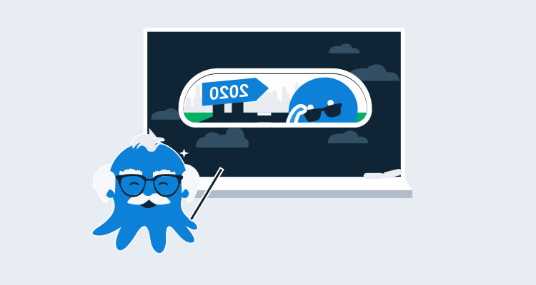

Webinars are a way for us to share and deep dive into a specific topic for our customers and the broader DevOps community. In this post, I'll be looking at how we run our webinars, how we improved them in 2021, and our top recommendations if you're working through the holiday period and looking for some company.

You can find all 55 of our webinars on the YouTube [Webinar playlist](https://www.youtube.com/watch?v=AjQhW5lC4Qs&list=PLAGskdGvlaw2ph_YPvMquJlzgYd7bEDba).

## Top webinars of 2021

In this section, I'll list some of my personal favorites and others that Octopods have voted on as their favorites of 2021.

### Technical deep dive into Config as Code

Configuration as Code has been an Octopus concept for a while, allowing you to store your scripts in source control and run them on your deployment targets or Workers. 

In 2021, we've launched Config as Code as an early access preview, giving you native support for Config as Code with Git. In this webinar we start a project from scratch using Config as Code, and talk you through using this new feature.

In this webinar you learn: 

- What is Config as Code and how to use it
- How to set up your first project in Octopus using Config as Code
- How Config as Code helps your team work where they’re most effective, whether that’s in the Octopus UI or the project’s GitHub repo

<iframe width="560" height="315" src="https://www.youtube.com/embed/oZfxlbpSP14" frameborder="0" allowfullscreen></iframe>

### Continuous Delivery with Dave Farley

Continuous Delivery is well established in modern development teams, however, no two teams do it the same way. One of the key benefits of shipping software regularly is the feedback loop that leads to high-quality releases. Most teams are doing this to some extent, but how can you maximize this?

Join Bob Walker, the VP of Customer Solutions at Octopus, and Dave Farley, consultant and co-author of Continuous Delivery, for a discussion about how to get the most out of your CI/CD pipelines and optimize for fast feedback that results in high-quality releases.

What you’ll learn:

- Fundamentals of Continuous Delivery
- Common problems that can impact the feedback cycle
- Tips to optimize your CI/CD pipelines for fast feedback
- Concrete examples of companies actively applying this

<iframe width="560" height="315" src="https://www.youtube.com/embed/IhUyUIiMrNs" frameborder="0" allowfullscreen></iframe>

### Getting started with Database DevOps

Very few people enjoy doing manual deployments, especially database deployments.  However, a shocking number of people still do their database deployments manually.  Most people agree this is a problem, but how can it be solved?  Is DevOps the answer?

In this webinar you will learn how to get started with Database DevOps to save time and frustration.  

What you’ll learn:   

- What is DevOps and how can it be applied to the database
- How to get started with Database DevOps 
- Common goals to accomplish Common roadblocks and how to overcome them

<iframe width="560" height="315" src="https://www.youtube.com/embed/Ho3p7gP4zW4" frameborder="0" allowfullscreen></iframe>

### CI/CD in the cloud with Octopus and TeamCity

We launched Octopus Cloud in 2018, and have iterated on it for the past three years. Our favorite build server, TeamCity (which we use internally at Octopus) now has a cloud product, eliminating the need for local virtual machines on-premises. You can now use both Octopus and TeamCity on a fully-managed cloud offering.

In this webinar you will learn:

- How to use TeamCity Cloud.
- How to use Octopus Cloud.
- How you can integrate both for a fully-managed CI/CD in the cloud.

<iframe width="560" height="315" src="https://www.youtube.com/embed/5o3uBES2-i8" frameborder="0" allowfullscreen></iframe>

### Using the Octopus API to save time by automating repetitive tasks

Octopus Deploy is designed as an API-first application meaning anything you can do in the Octopus Web Portal, you can do with the REST API.   

Join Lianne and Mark from our Solutions team to learn more about the Octopus REST API and how it can save you time by automating custom or repetitive tasks. 

What you’ll learn:  

- An overview of the Octopus API and why it’s useful 
- How to manage access with API keys  
- Different ways to make API calls (Octopus.Client, CLI, Custom scripts in the language of your choice) 
- How to save time by automating custom or repetitive tasks

<iframe width="560" height="315" src="https://www.youtube.com/embed/ACb2sHWoZto" frameborder="0" allowfullscreen></iframe>

## Summary

We've run some world-class webinars in 2021, and I'm excited about what we're going to do in 2022 with some great new features landing as well some really interesting things we are aiming to do in the Community.

Our pipeline for the first quarter of 2021 is already looking full, and if you have an idea for a webinar that you'd like to see or even an improvement we can make on webinars, please email us at <webinars@Octopus.com>.
