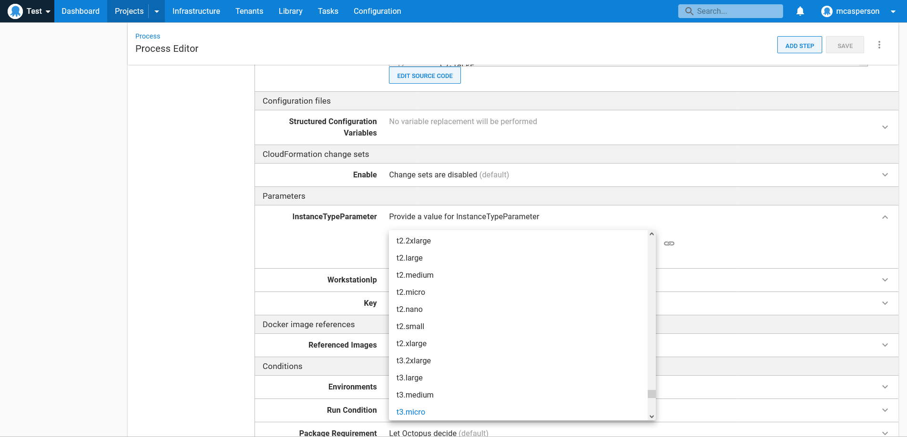

The [instance type](https://docs.aws.amazon.com/AWSCloudFormation/latest/UserGuide/aws-properties-ec2-instance.html#cfn-ec2-instance-instancetype) is a required parameter when building EC2 instances. While the AWS documentation provides a list of allowed values, it is not presented in a format that can be easily consumed by your own CloudFormation templates.

In this post you'll learn how to build a parameter with a complete list of instance types as allowed values to copy and paste into your own templates.

## Prerequisites

The script requires `jq`. The `jq` [download page](https://stedolan.github.io/jq/download/) includes instructions for installing the tool for major Linux distributions.

## The lookup script

The script below returns a YAML bloc defining a CloudFormation parameter with a sorted list of all available instance types:

```bash
echo "Parameters:"
echo "  InstanceTypeParameter:"
echo "    Type: String"
echo "    Default: t3.micro"
echo "    AllowedValues:"
instances=$(aws ec2 describe-instance-types | jq -r '.InstanceTypes |= sort_by(.InstanceType) | .InstanceTypes[].InstanceType')
for row in $instances; do
  echo "    - $row"
done
```

Save the script to a file called `instancetypes.sh` and make it executable with the command:

```bash
chmod +x instancetypes.sh
```

Run the script with the command:

```bash
./instancetypes.sh
```

The output looks something like this:

```yaml
Parameters:
  InstanceTypeParameter:
    Type: String
    Default: t3.micro
    AllowedValues:
    - c1.medium
    - c1.xlarge
    - c3.2xlarge
    - c3.4xlarge
    - c3.8xlarge
    - c3.large
    - c3.xlarge
    - c4.2xlarge
    - c4.4xlarge
    - c4.8xlarge
    - c4.large
    - c4.xlarge
    - c5.12xlarge
    - c5.18xlarge
    - c5.24xlarge
    - c5.2xlarge
    - c5.4xlarge
    - c5.9xlarge
    - c5.large
    - c5.metal
    - c5.xlarge
    - c5a.12xlarge
    - c5a.16xlarge
    - c5a.24xlarge
    - c5a.2xlarge
    - c5a.4xlarge
    - c5a.8xlarge
    - c5a.large
    - c5a.xlarge
    - c5d.12xlarge
    - c5d.18xlarge
    - c5d.24xlarge
    - c5d.2xlarge
    - c5d.4xlarge
    - c5d.9xlarge
    - c5d.large
    - c5d.metal
    - c5d.xlarge
    - c5n.18xlarge
    - c5n.2xlarge
    - c5n.4xlarge
    - c5n.9xlarge
    - c5n.large
    - c5n.metal
    - c5n.xlarge
    - c6g.12xlarge
    - c6g.16xlarge
    - c6g.2xlarge
    - c6g.4xlarge
    - c6g.8xlarge
    - c6g.large
    - c6g.medium
    - c6g.metal
    - c6g.xlarge
    - c6gd.12xlarge
    - c6gd.16xlarge
    - c6gd.2xlarge
    - c6gd.4xlarge
    - c6gd.8xlarge
    - c6gd.large
    - c6gd.medium
    - c6gd.metal
    - c6gd.xlarge
    - d2.2xlarge
    - d2.4xlarge
    - d2.8xlarge
    - d2.xlarge
    - g2.2xlarge
    - g2.8xlarge
    - g3.16xlarge
    - g3.4xlarge
    - g3.8xlarge
    - g4dn.12xlarge
    - g4dn.16xlarge
    - g4dn.2xlarge
    - g4dn.4xlarge
    - g4dn.8xlarge
    - g4dn.metal
    - g4dn.xlarge
    - i2.2xlarge
    - i2.4xlarge
    - i2.8xlarge
    - i2.xlarge
    - i3.16xlarge
    - i3.2xlarge
    - i3.4xlarge
    - i3.8xlarge
    - i3.large
    - i3.metal
    - i3.xlarge
    - i3en.12xlarge
    - i3en.24xlarge
    - i3en.2xlarge
    - i3en.3xlarge
    - i3en.6xlarge
    - i3en.large
    - i3en.metal
    - i3en.xlarge
    - inf1.24xlarge
    - inf1.2xlarge
    - inf1.6xlarge
    - inf1.xlarge
    - m1.large
    - m1.medium
    - m1.small
    - m1.xlarge
    - m2.2xlarge
    - m2.4xlarge
    - m2.xlarge
    - m3.2xlarge
    - m3.large
    - m3.medium
    - m3.xlarge
    - m4.10xlarge
    - m4.16xlarge
    - m4.2xlarge
    - m4.4xlarge
    - m4.large
    - m4.xlarge
    - m5.12xlarge
    - m5.16xlarge
    - m5.24xlarge
    - m5.2xlarge
    - m5.4xlarge
    - m5.8xlarge
    - m5.large
    - m5.metal
    - m5.xlarge
    - m5a.12xlarge
    - m5a.16xlarge
    - m5a.24xlarge
    - m5a.2xlarge
    - m5a.4xlarge
    - m5a.8xlarge
    - m5a.large
    - m5a.xlarge
    - m5ad.12xlarge
    - m5ad.16xlarge
    - m5ad.24xlarge
    - m5ad.2xlarge
    - m5ad.4xlarge
    - m5ad.8xlarge
    - m5ad.large
    - m5ad.xlarge
    - m5d.12xlarge
    - m5d.16xlarge
    - m5d.24xlarge
    - m5d.2xlarge
    - m5d.4xlarge
    - m5d.8xlarge
    - m5d.large
    - m5d.metal
    - m5d.xlarge
    - m5zn.12xlarge
    - m5zn.2xlarge
    - m5zn.3xlarge
    - m5zn.6xlarge
    - m5zn.large
    - m5zn.metal
    - m5zn.xlarge
    - m6g.12xlarge
    - m6g.16xlarge
    - m6g.2xlarge
    - m6g.4xlarge
    - m6g.8xlarge
    - m6g.large
    - m6g.medium
    - m6g.metal
    - m6g.xlarge
    - m6gd.12xlarge
    - m6gd.16xlarge
    - m6gd.2xlarge
    - m6gd.4xlarge
    - m6gd.8xlarge
    - m6gd.large
    - m6gd.medium
    - m6gd.metal
    - m6gd.xlarge
    - m6i.12xlarge
    - m6i.16xlarge
    - m6i.24xlarge
    - m6i.2xlarge
    - m6i.32xlarge
    - m6i.4xlarge
    - m6i.8xlarge
    - m6i.large
    - m6i.metal
    - m6i.xlarge
    - r3.2xlarge
    - r3.4xlarge
    - r3.8xlarge
    - r3.large
    - r3.xlarge
    - r4.16xlarge
    - r4.2xlarge
    - r4.4xlarge
    - r4.8xlarge
    - r4.large
    - r4.xlarge
    - r5.12xlarge
    - r5.16xlarge
    - r5.24xlarge
    - r5.2xlarge
    - r5.4xlarge
    - r5.8xlarge
    - r5.large
    - r5.metal
    - r5.xlarge
    - r5a.12xlarge
    - r5a.16xlarge
    - r5a.24xlarge
    - r5a.2xlarge
    - r5a.4xlarge
    - r5a.8xlarge
    - r5a.large
    - r5a.xlarge
    - r5ad.12xlarge
    - r5ad.16xlarge
    - r5ad.24xlarge
    - r5ad.2xlarge
    - r5ad.4xlarge
    - r5ad.8xlarge
    - r5ad.large
    - r5ad.xlarge
    - r5d.12xlarge
    - r5d.16xlarge
    - r5d.24xlarge
    - r5d.2xlarge
    - r5d.4xlarge
    - r5d.8xlarge
    - r5d.large
    - r5d.metal
    - r5d.xlarge
    - r5n.12xlarge
    - r5n.16xlarge
    - r5n.24xlarge
    - r5n.2xlarge
    - r5n.4xlarge
    - r5n.8xlarge
    - r5n.large
    - r5n.metal
    - r5n.xlarge
    - r6g.12xlarge
    - r6g.16xlarge
    - r6g.2xlarge
    - r6g.4xlarge
    - r6g.8xlarge
    - r6g.large
    - r6g.medium
    - r6g.metal
    - r6g.xlarge
    - r6gd.12xlarge
    - r6gd.16xlarge
    - r6gd.2xlarge
    - r6gd.4xlarge
    - r6gd.8xlarge
    - r6gd.large
    - r6gd.medium
    - r6gd.metal
    - r6gd.xlarge
    - t1.micro
    - t2.2xlarge
    - t2.large
    - t2.medium
    - t2.micro
    - t2.nano
    - t2.small
    - t2.xlarge
    - t3.2xlarge
    - t3.large
    - t3.medium
    - t3.micro
    - t3.nano
    - t3.small
    - t3.xlarge
    - t3a.2xlarge
    - t3a.large
    - t3a.medium
    - t3a.micro
    - t3a.nano
    - t3a.small
    - t3a.xlarge
    - t4g.2xlarge
    - t4g.large
    - t4g.medium
    - t4g.micro
    - t4g.nano
    - t4g.small
    - t4g.xlarge
    - z1d.12xlarge
    - z1d.2xlarge
    - z1d.3xlarge
    - z1d.6xlarge
    - z1d.large
    - z1d.metal
    - z1d.xlarge
```

When this parameter is included in a template deployed by Octopus, the list of available options is displayed in a drop down list:



## Conclusion

EC2s have dozens of instance types these days, and providing a list of options to those deploying a CloudFormation template removes the need to refer to external documentation. In this post you learned how to build a CloudFormation parameter in YAML with a complete list of instance types, ready to be copied into your CloudFormation templates.