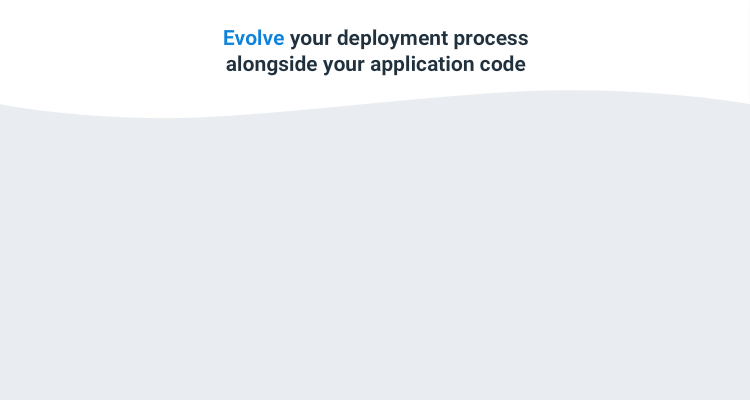
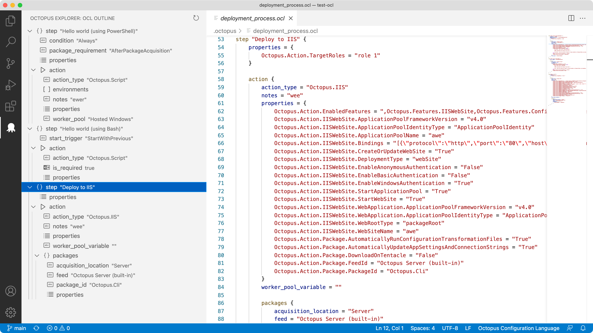
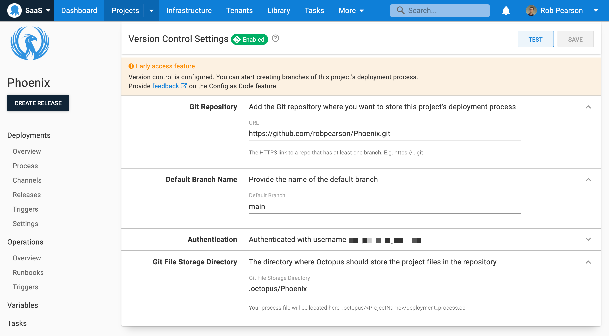
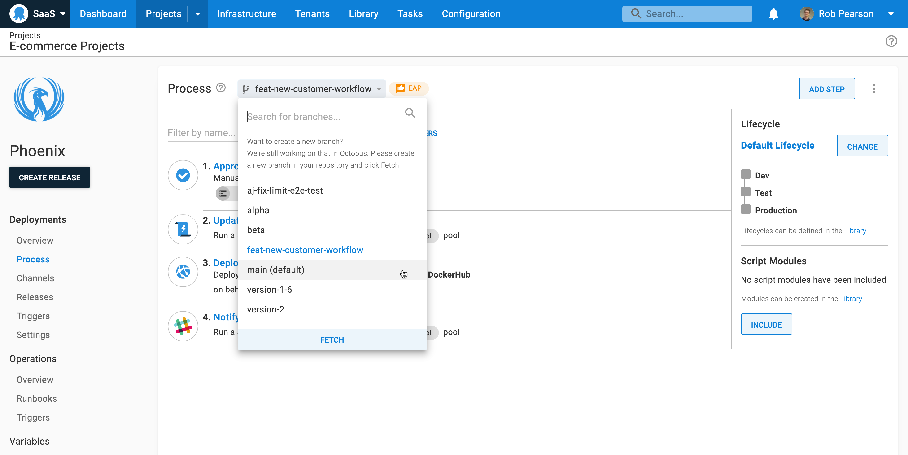
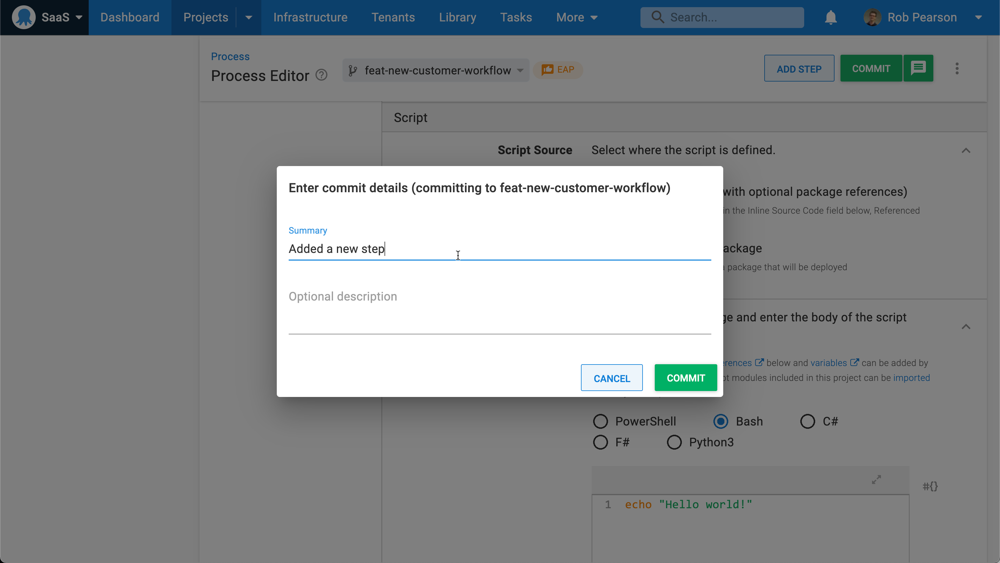
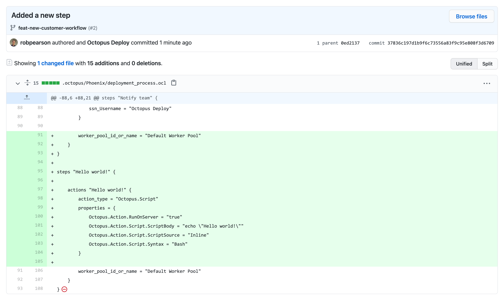
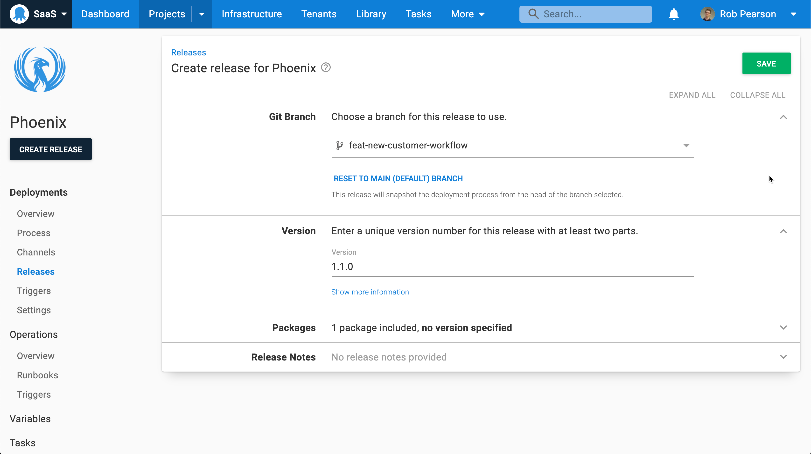

Our Configuration as Code early access preview (EAP) is now available.

Configuration as Code (Config as Code) in Octopus delivers the full power of Git with the usability of Octopus. We built a robust Git-persistent layer alongside the existing database implementation. This means you can see your deployment process in your Git repo next to your application code and evolve them together.

Our Config as Code solution allows you to:

- Support multiple versions of your deployment process with branches
- Merge changes to your deployment process with pull requests 
- See a history of changes to your deployment process, including who performed changes and when
- Revert back to a previous version of your deployment process

Importantly, the Octopus UI still works, so you don’t need to learn a whole new language to edit your process. However, you can still edit your configuration with your favorite text editor if you prefer.

In this post, I introduce our Config as Code solution and explain how to get started.

:::hint
Config as Code in Octopus is an early access preview so there might be some rough edges. We recommend creating new projects or cloning existing ones to try it out, rather than testing in production.

As we're still developing this feature, we appreciate [any feedback](https://octopusdeploy.typeform.com/to/qeW9JGyo) you'd like to share. We also recommend joining the discussion in our [Community Slack](https://octopus.com/slack) in the `#config-as-code` channel.
:::

## Why Configuration as Code? 

Many modern IT and DevOps systems offer an "as code" implementation. Common examples are Infrastructure as Code (IaC) solutions like HashiCorp's [Terraform](https://terraform.io) and [Pulumi](https://pulumi.com) through to CI servers like [Jenkins](https://www.jenkins.io/) and [TeamCity](https://www.jetbrains.com/teamcity/), that allow you to specify your build configuration as code. 

These solutions store plain text code/configuration details in a source code repository. This allows you to evolve your system configuration and enjoy the benefits of Git, including branching and history.

Config As Code has been one of the top requests from our customers on the Octopus UserVoice site, and at conferences and events. 

We used your feedback to guide the build of our Config as Code solution.

## Octopus Config as Code - the best of both worlds

When Config as Code is enabled for a project, you can continue to use the Octopus UI as you always have, or you can edit the text files in your favorite editor. You can work wherever you're the most productive.

Our configuration file format is Octopus Configuration Language (OCL), based on [HashiCorp's HCL](https://github.com/hashicorp/hcl). We wanted our configuration files to be human readable and to support complex documents like deployment and runbook processes. We like HCL and feel it's the right tool for the job, but we've written our own [parser/serializer](https://github.com/OctopusDeploy/Ocl). This means we're not obligated to follow any direction HashiCorp takes HCL, and there's nothing preventing us from making changes. 

See Michael Richardson's post about [shaping Config as Code](https://octopus.com/blog/shaping-config-as-code) to learn more about the factors that shaped our Config as Code solution.

### All the power of Git

Branches are Git's superpower, and we wanted to expose that power. You can switch branches (and soon create them) in the Octopus UI, allowing you to make changes to your deployment process on a branch.  This effectively allows for a draft mode, as you can then create a release from your branch and test your changes.  When combined with features from your Git provider, like pull requests, protected branches, and code-owners, this enables a whole new set of workflows. 

Commit messages can be added when saving changes to your deployment processes. You can also commit changes without a message (this is the default), which is convenient when iterating to get a tricky deployment process working.

### The Octopus UI still works

We want you to have a great Config as Code experience using the Octopus Web Portal. You can configure your Git repository, select your branch, commit changes, and more, all from the Octopus user interface. 

If you prefer full control, you can edit the underlying configuration files but this isn't required. The rich two-way sync means you can mix and match your use of the web UI and direct editing.

### Edit your configuration with Visual Studio Code

Some people prefer a web interface while others prefer editing a text file in their favorite text editor. To make working with OCL easier, we built an [Octopus Deploy extension for Visual Studio Code](https://marketplace.visualstudio.com/items?itemName=octopusdeploy.vscode-octopusdeploy) to complement the Octopus UI. 

The OCL editing experience includes:

- Syntax highlighting
- Code snippets for steps and actions
- An integrated tree view to navigate nodes in the file

Our VS Code extension is also an early access preview but we're iterating quickly. We recommend installing it and trying it out.

### Convert your existing projects

Config as Code can be enabled on existing projects. This means you don't need to create a new project and start over. Most Octopus features are fully compatible with Config as Code (see our [documentation](https://octopus.com/docs/projects/version-control) for the exceptions). 

:::warning
Note: This is a one-way process and you cannot revert a project back to being stored in the database. Given this is an early access preview, we suggest you clone existing projects or export them when testing this feature.
:::

## What processes are version-controlled?

For this first release, it's the deployment process only that is version-controlled (and a few settings that are closely related to the deployment process). 

We intend for runbooks and variables to be implemented as following pieces of work.

## Getting started with Config as Code

To get started with the Config as Code EAP in Octopus, you need to enable the feature flag. 

Navigate to **Configuration** then **Features** and toggle the feature on.

:::warning
As this is an early access preview, remember to create new projects or clone existing ones to test it.
:::

Alternatively, you can see Config as Code in action in our webinar, [Technical deep dive into Config as Code](https://octopus.com/events/technical-deep-dive-with-config-as-code). 

<iframe width="560" height="315" src="https://www.youtube.com/embed/oZfxlbpSP14" frameborder="0" allowfullscreen></iframe>

### Configuring your Git repository

Navigate to **Settings** then **Version Control** to specify your Git repository details. 

In the example above, I selected a public repository and entered my GitHub username and a personal access token.

### Selecting a branch and committing changes

The most visible change to the deployment process editor is our new branch selector. 

To get started:

1. Push a new branch to your repo
1. Make a change to your deployment process (for example, add a new **Hello world!** script step)
1. Commit the change with a description
1. Navigate to your Git repo and inspect the change 

 

### Creating a release

When creating a release, choose the branch containing your deployment process. Octopus automatically selects the head of the chosen branch. Your deployments execute in the same repeatable and reliable way as always.

## Conclusion

Our Config as Code early access preview is now available. It offers the power of Git and a human-readable text format, balanced with the usability of Octopus. 

This is only the first cut of this functionality. We have a roadmap of features to come, and we're looking for you to help guide us.  

We’d love for you to try Config as Code with your workflow and [let us know how we can improve it](https://octopusdeploy.typeform.com/to/qeW9JGyo).

!include <cac-webinar-may-2022>

Happy (version-controlled) deployments!
