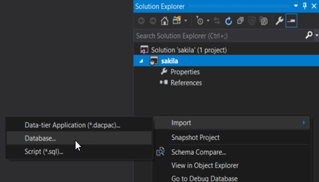
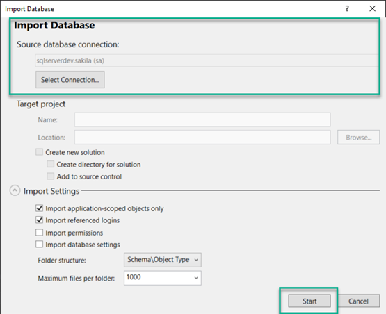
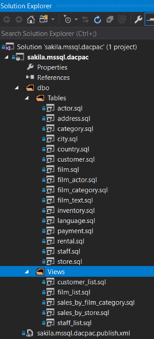
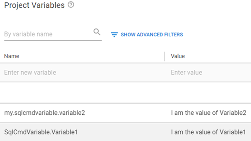
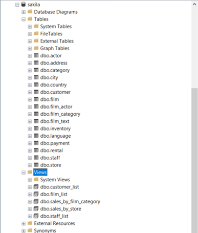

Database Administrators (DBAs) will sometimes cringe at the mere mention of automating a database deployment.  Their job is to make sure that the server and databases remain available and healthy, so any process outside of their control sometimes makes them nervous.  Introducing something that can make wholesale changes to the database structure or data automatically seems like a stark contrast to their duties.  However, using DACPAC with Octopus Deploy to automate deployment to SQL Server can assist you in your DevOps journey.  This post demonstrates automating database updates to Microsoft SQL Server using DACPAC and Octopus Deploy from project creation to deployment.

## Sakila
This post will deploy the [sakila](https://bitbucket.org/octopussamples/sakila/src/master/src/dacpac/mssql/) database to a Microsoft SQL Server.  This project contains tables, constraints, stored procedures, views, and user defined functions as to demonstrate the full capabilities of the Microsoft DACPAC technology.

::info
The sakila git repo contains source code for deploying the sakila database to multiple database technologies using different deployment methods.  This post will focus specifically on the Microsoft DACPAC version.
::

## Creating the database project
Out of the box, Visual Studio does not come with the SQL Server Database Project type.  In order to create them, you must first install the [SQL Server Data Tools](https://docs.microsoft.com/en-us/sql/ssdt/download-sql-server-data-tools-ssdt) (SSDT) extension.  SSDT contains project types for Database Projects, SQL Server Reporting Services (SSRS) projects, and SQL Server Integration Services (SSIS) projects.

Once the extension has been installed, create a new project and choose the SQL Server category, SQL Server Database Project type


Right-click the Solution space, choose Import -> Database to connect to an existing database



Configure a connection then click **Start**



After the process is complete, your project should look something like this



## Creating the build
Before diving into creating the build, you will first want to make sure your build agents are configured to be able to build SQL Server Database projects.  With the exception of SSRS projects, MSBuild is unable to build SSDT projects.  At a minimum, you're build agent will need the following and are required

- [Visual Studio Build Tools](https://visualstudio.microsoft.com/downloads/?q=build+tools#build-tools-for-visual-studio-2019)
- Data storage and processing build tools workload installed for the Visual Studio Build Tools


The remainder of this section will use Microsoft Azure DevOps to configure a build.  If you're using a different build server, as long as the build agents have the above tools installed, you should be able to do the equivalent.

The build will consist of the following steps:
- Build the DACPAC solution
- Package files
- Push build information
- Push package to package feed

### Build the DACPAC solution
Add a `Visual Studio Build` step to your build pipeline.  Setting clean to `true` will ensure that you don't have any lefotover artifacts in the folder when doing subsequent builds.

```yaml
- task: VSBuild@1
  inputs:
    solution: 'dacpac\mssql\sakila.mssql.dacpac.sln'
    msbuildArgs: '/p:OutDir=$(build.stagingdirectory)'
    clean: true
```

### Package files
Add a `Package application for Octopus` step to the pipeline.  This will package zip the `.dacpac` file so Octopus Deploy can deploy it.  Include the .dacpac file and the publish profile xml file.

```yaml
- task: OctopusPack@4
  inputs:
    PackageId: 'sakila.dacpac'
    PackageFormat: 'Zip'
    PackageVersion: '$(Build.BuildNumber)'
    SourcePath: '$(build.stagingdirectory)'
    OutputPath: '$(Build.ArtifactStagingDirectory)'
    Include: |
      sakila.mssql.dacpac.dacpac
      sakila.mssql.dacpac.publish.xml
```

### Push build information
It is useful to see the commits and the associated work items associated with this build.  Add a `Push package build information to Octopus Deploy`

```yaml
- task: OctopusMetadata@4
  inputs:
    OctoConnectedServiceName: 'Local Octopus Deploy'
    Space: 'Spaces-1'
    PackageId: 'sakila.dacpac'
    PackageVersion: '$(Build.BuildNumber)'
    Replace: 'false'
```
:::info
Using the Azure DevOps assistant, you can first configure the `OctoConnectedServiceName` used in this step
:::

### Push package to package feed
The final step to the build process is to push the package to a repository.  This post is going to use the built-in repository of Octopus Deploy, however, other external feed types are also supported such as Azure DevOps, Artifactory, Nexus, etc...

```yaml
- task: OctopusPush@4
  inputs:
    OctoConnectedServiceName: 'Local Octopus Deploy'
    Space: 'Spaces-1'
    Package: '$(Build.ArtifactStagingDirectory)\*.zip'
    Replace: 'false'
```

The complete YAML pipeline should look similar to this:

```yaml
trigger:
- master

pool: Default

steps:
- task: VSBuild@1
  inputs:
    solution: 'dacpac\mssql\sakila.mssql.dacpac.sln'
    msbuildArgs: '/p:OutDir=$(build.stagingdirectory)'
    clean: true

- task: OctopusMetadata@4
  inputs:
    OctoConnectedServiceName: 'Local Octopus Deploy'
    Space: 'Spaces-1'
    PackageId: 'sakila.dacpac'
    PackageVersion: '$(Build.BuildNumber)'
    Replace: 'false'
- task: OctopusPack@4
  inputs:
    PackageId: 'sakila.dacpac'
    PackageFormat: 'Zip'
    PackageVersion: '$(Build.BuildNumber)'
    SourcePath: '$(build.stagingdirectory)'
    OutputPath: '$(Build.ArtifactStagingDirectory)'
    Include: |
      sakila.mssql.dacpac.dacpac
      sakila.mssql.dacpac.publish.xml
- task: OctopusPush@4
  inputs:
    OctoConnectedServiceName: 'Local Octopus Deploy'
    Space: 'Spaces-1'
    Package: '$(Build.ArtifactStagingDirectory)\*.zip'
    Replace: 'false'
```

## Create deployment process
This post assumes you are familiar with how to create an Octopus project and won't cover that subject.

The DACPAC deployment process will consist of the following steps:
- (Optional) Create database if not exists: Some people prefer to place this activity within a runbook as opposed to being part of the deployment process
- Deploy the DACPAC to SQL Server

### (Optional) Create database if not exists
This step will connect to a SQL server and create a database if it doesn't currently exist.  Click **ADD STEP** and choose `SQL - Create Database If Not exists`.  This step can be run on a worker machine.


Fill in the template fields:
- SQL Server: The server name
- SQL Login: SQL Authentication username, leave blank if using Active Directory authetication
- SQL Password: Password for the SQL Authentication account, leave blank if using Active Directory authentication
- Database to create: Name of the database to create
- Command timeout: Number of seconds to wait for the create database command to complete
- Azure database edition: If using Azure SQL, choose the edition to create.  If left blank (and using Auzre SQL), Azure will default to Standard.

### Deploy the DACPAC to SQL Server
There are several Community Step Template DACPAC templates to choose from:
- SQL - Deploy DACPAC: This version of the template was created before the workers feature of Octopus Deploy.  The template must execute on a target and requires a `Deploy a Package` step that deploys the DACPAC to the target first.
- SQL - Deploy DACPAC from Package Parameter: This template is worker compatible and utilizes the built-in package selector.  In addition, this template can dynamically download the SQL PowerShell module (if chosen) and does not require any additional software installed on the worker machine.
- SQL - Deploy DACPAC from Referenced Package: This template uses two packages, one contains the binaries necessary to perform an DACPAC deployment and the other is the DACPAC itself.
- SQL - Deploy DACPAC with AAD Auth support: This is the newest of the available templates and contains the ability to use Azure Active Directory authentication to the database server (see [this](https://octopus.com/blog/classes-in-custom-step-templates) blog post for an example of how to configure this).

All four templates contain the same base functionality in how they deploy the DACPAC.  The biggest reason that there are four is that each would have introduced breaking changes for those who were currently using the template so new ones were created to maintain backwards compatibility.  This post will use the most recent template, `SQL Deploy DACPAC with AAD support`.

:::info
All four of these templates support the use of SQL CMD Variables.  Because there can be an N number of SQL CMD Variables, there isn't an input field within the template to define them.  Instead, the code of the templates query the Octopus Variables collection for variables named in a specific convention:

- SqlCmdVariable.Variable1
- my.sqlcmdvariable.variable2



During deployment, you'll see something like the following when being added


:::


Fill in the template fields:
- DACPACPackageName: Name of the `.dacpac` file within the package.  For this post it is `sakila.mssql.dacpac.dacpac`.
- (Optional) Publish profile name: Name of the Publish Profile xml file.  For this post, it is `sakila.mssql.dacpac.publish.xml`
- Report: Tick this box to generate an HTML report of the changes that will be made.
- Script: Tick this box to generate a `.sql` file containing the SQL that will be executed.
- Deploy: This this box to perform the deployment.
- Extract target database to dacpac: Tick this box to extract the target database into a DACPAC and add it as an artifact.
- Target Servername: The name of the database server
- Target Database: Name of the database to deploy to
- Target Database DAC version: This list is where to look for the .dll files used for DACPAC deployments, choose SQL Server PowerShell Module to dynamically load the module.
- Authentication type: List of authentication options, this post is using SQL Authentication
- Username: SQL Authentication username
- Password: Password for the SQL Authentication user
- Enable multi subnet failover: Whether or not use use multi subnet failover.
- Additional deployment contributors: Options that you would add if you were using `SqlPackage.exe /p:AdditionalDeploymentContributors=[what you would put here]` command line.
- Additional deployment contributor arguments: Options that you would add if you were using `SqlPackage.exe /p:AdditionalDeploymentContributorArguments=[what you would put here]` command line.
- DACPAC Package: The package to deploy.
- Command Timeout: Timeout in seconds, used mostly if there are long running scripts.


Your deployment should look something like this


Using a tool like SQL Server Management Studio (SSMS) you can see the database has been updated



## Conclusion
This post walked you through how to deploy a DACPAC from project creation to deployment.  Be sure to check out an [example](https://samples.octopus.app/app#/Spaces-106/projects/dacpac-azure-sql/deployments/process) of this on our [Samples](https://samples.octopus.app) instance.  The example deploys to an Azure SQL Database server.  Happy deployments!