Database Administrators (DBAs) often cringe at the mere mention of automating a database deployment.  Their job is to make sure the server and databases remain available and healthy, and processes outside of their control make them nervous.  Introducing a process that automatically makes wholesale changes to the database structure or data seems like a stark contrast to their duties.  However, using DACPAC with Octopus Deploy to automate deployments to SQL Server can assist you in your DevOps journey.  

This post shows you how to automate database updates to Microsoft SQL Server using DACPAC and Octopus Deploy, from project creation to deployment.

## Sample project: Sakila

This post will deploy the [Sakila](https://bitbucket.org/octopussamples/sakila/src/master/src/dacpac/mssql/) database to a Microsoft SQL Server.  

The Sakila project contains tables, constraints, stored procedures, views, and user defined functions to demonstrate the full capabilities of the Microsoft DACPAC technology.

:::info
The Sakila Git repo contains source code for deploying the Sakila database to multiple database technologies using different deployment methods. This post focuses specifically on the Microsoft DACPAC version.
:::

## Creating the database project
Out-of-the-box, Visual Studio does not come with the SQL Server Database Project type.  To create it, you must install the [SQL Server Data Tools](https://docs.microsoft.com/en-us/sql/ssdt/download-sql-server-data-tools-ssdt) (SSDT) extension.  SSDT contains project types for database projects, SQL Server Reporting Services (SSRS) projects, and SQL Server Integration Services (SSIS) projects.

After the extension has been installed, create a new project, and choose the SQL Server category, SQL Server Database Project type.

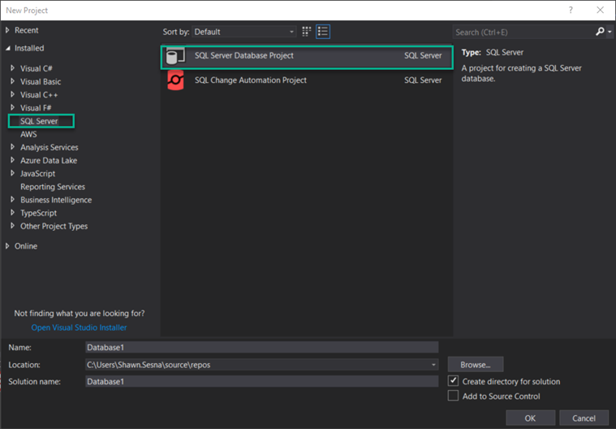

Right click the **Solution** space, choose **Import**, then **Database...** to connect to an existing database:

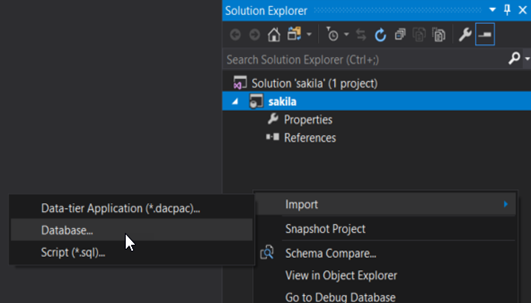

Configure a connection, then click **Start**.

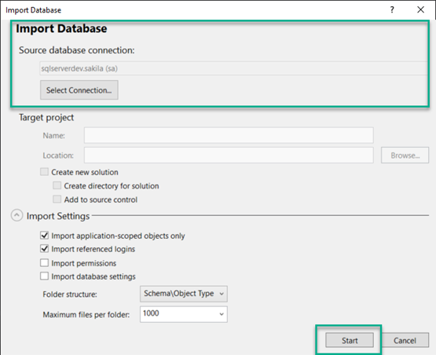

After the process is complete, your project should look something like this:

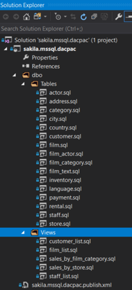

## Creating the build

Before creating the build, first make sure your build agents are configured to build SQL Server Database projects.  With the exception of SSRS projects, MSBuild is unable to build SSDT projects.  At a minimum, your build agent requires the following:

- [Visual Studio Build Tools](https://visualstudio.microsoft.com/downloads/?q=build+tools#build-tools-for-visual-studio-2019)
- Data storage and processing build tools workload installed for the Visual Studio Build Tools

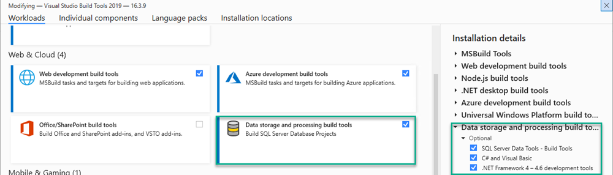

The remainder of this section uses Microsoft Azure DevOps to configure a build. If you're using a different build server, as long as the build agents have the above tools installed, you should be able to do the equivalent.

The build will consist of the following steps:

- Build the DACPAC solution
- Package the files
- Push the build information
- Push the package to the package feed

### Building the DACPAC solution
Add a **Visual Studio Build** step to your build pipeline.  Setting clean to `true` will ensure you don't have any leftover artifacts in the folder when doing subsequent builds.

```yaml
- task: VSBuild@1
  inputs:
    solution: 'dacpac\mssql\sakila.mssql.dacpac.sln'
    msbuildArgs: '/p:OutDir=$(build.stagingdirectory)'
    clean: true
```

### Packaging files

Add a **Package application for Octopus** step to the pipeline.  This will zip the `.dacpac` file so Octopus Deploy can deploy it.  Include the .dacpac file and the publish profile XML file.

```yaml
- task: OctopusPack@4
  inputs:
    PackageId: 'sakila.dacpac'
    PackageFormat: 'Zip'
    PackageVersion: '$(Build.BuildNumber)'
    SourcePath: '$(build.stagingdirectory)'
    OutputPath: '$(Build.ArtifactStagingDirectory)'
    Include: |
      sakila.mssql.dacpac.dacpac
      sakila.mssql.dacpac.publish.xml
```

### Pushing build information
It's useful to see the commits and the work items associated with this build.  Add **Push package build information to Octopus Deploy**.

```yaml
- task: OctopusMetadata@4
  inputs:
    OctoConnectedServiceName: 'Local Octopus Deploy'
    Space: 'Spaces-1'
    PackageId: 'sakila.dacpac'
    PackageVersion: '$(Build.BuildNumber)'
    Replace: 'false'
```

:::info
Using the Azure DevOps assistant, you can configure the `OctoConnectedServiceName` used in this step.
:::

### Pushing the package to the package feed

The final step in the build process is to push the package to a repository.  This post is going to use the built-in repository of Octopus Deploy, however, other external feed types are also supported, including Azure DevOps, Artifactory, Nexus, and more.

```yaml
- task: OctopusPush@4
  inputs:
    OctoConnectedServiceName: 'Local Octopus Deploy'
    Space: 'Spaces-1'
    Package: '$(Build.ArtifactStagingDirectory)\*.zip'
    Replace: 'false'
```

The complete YAML pipeline will look similar to this:

```yaml
trigger:
- master

pool: Default

steps:
- task: VSBuild@1
  inputs:
    solution: 'dacpac\mssql\sakila.mssql.dacpac.sln'
    msbuildArgs: '/p:OutDir=$(build.stagingdirectory)'
    clean: true

- task: OctopusMetadata@4
  inputs:
    OctoConnectedServiceName: 'Local Octopus Deploy'
    Space: 'Spaces-1'
    PackageId: 'sakila.dacpac'
    PackageVersion: '$(Build.BuildNumber)'
    Replace: 'false'
- task: OctopusPack@4
  inputs:
    PackageId: 'sakila.dacpac'
    PackageFormat: 'Zip'
    PackageVersion: '$(Build.BuildNumber)'
    SourcePath: '$(build.stagingdirectory)'
    OutputPath: '$(Build.ArtifactStagingDirectory)'
    Include: |
      sakila.mssql.dacpac.dacpac
      sakila.mssql.dacpac.publish.xml
- task: OctopusPush@4
  inputs:
    OctoConnectedServiceName: 'Local Octopus Deploy'
    Space: 'Spaces-1'
    Package: '$(Build.ArtifactStagingDirectory)\*.zip'
    Replace: 'false'
```

## Creating the deployment process

This post assumes you know how to create an Octopus project and doesn't cover that subject.

The DACPAC deployment process consists of the following steps:

- **(Optional) Create database if not exists**: Some people prefer to place this activity in a runbook instead of as part of the deployment process.
- Deploy the DACPAC to SQL Server.

### (Optional) Create the database if it doesn't exist
This step connects to a SQL server and creates a database if it doesn't exist.  Click **ADD STEP** and choose **SQL - Create Database If Not exists**.  This step can be run on a Worker Machine.

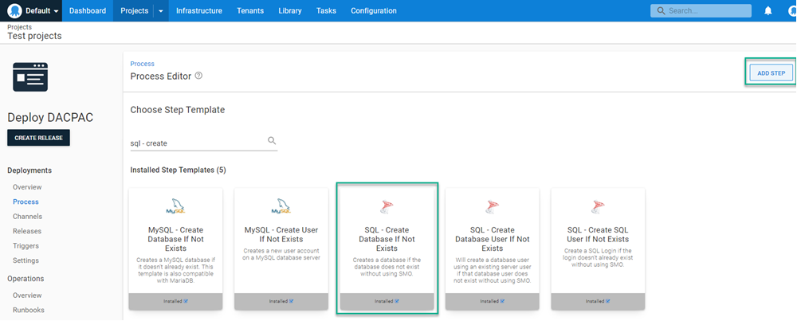

Fill in the template fields:

- **SQL Server**: The server name.
- **SQL Login**: SQL Authentication username, leave blank if using Active Directory authentication.
- **SQL Password**: Password for the SQL Authentication account, leave blank if using Active Directory authentication.
- **Database to create**: Name of the database to create.
- **Command timeout**: Number of seconds to wait for the create database command to complete.
- **Azure database edition**: If you're using Azure SQL, choose the edition to create.  If left blank (and using Azure SQL), Azure will default to Standard.

### Deploying the DACPAC to SQL Server

There are several DACPAC community step templates to choose from:

- **SQL - Deploy DACPAC**: This version of the template was created before the Workers feature of Octopus Deploy was available. The template must execute on a target and requires a **Deploy a Package** step that deploys the DACPAC to the target first.
- **SQL - Deploy DACPAC from Package Parameter**: This template is Worker compatible and uses the built-in package selector.  In addition, this template can dynamically download the SQL PowerShell module (if chosen) and does not require any additional software installed on the Worker Machine.
- **SQL - Deploy DACPAC from Referenced Package**: This template uses two packages, one contains the binaries necessary to perform a DACPAC deployment and the other is the DACPAC itself.
- **SQL - Deploy DACPAC with AAD Auth support**: This is the newest of the available templates and contains the ability to use Azure Active Directory authentication to the database server (this blog post demonstrates [how to configure the step template](https://octopus.com/blog/classes-in-custom-step-templates)).

All four templates contain the same base functionality in how they deploy the DACPAC, however, they were developed separately to avoid introducing breaking changes for people using the template.  This post uses the most recent template, **SQL Deploy DACPAC with AAD support**.

:::info
All four templates support the use of SQL CMD Variables.  Because there can be N number of SQL CMD Variables, there isn't an input field in the template to define them.  Instead, the code of the templates query the Octopus variables collection for variables named in a specific convention:

- `SqlCmdVariable.Variable1`
- `my.sqlcmdvariable.variable2`

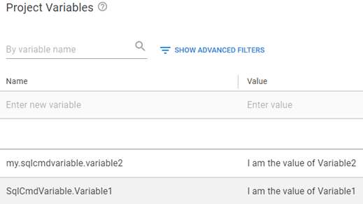

During deployment, you'll see something like the following when being added:

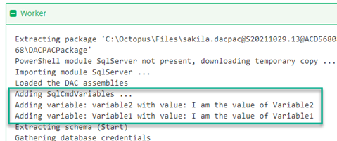
:::

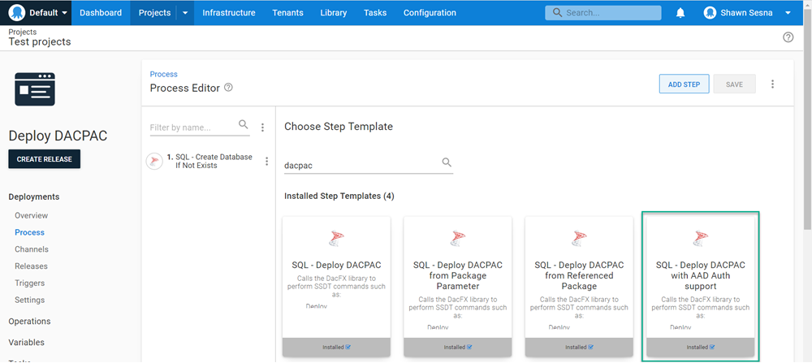

Fill in the template fields:

- **DACPACPackageName**: Name of the `.dacpac` file in the package.  For this post, it's `sakila.mssql.dacpac.dacpac`.
- **(Optional) Publish profile name**: Name of the Publish Profile XML file.  For this post, it's `sakila.mssql.dacpac.publish.xml`.
- **Report**: Tick this box to generate an HTML report of the changes that will be made.
- **Script**: Tick this box to generate a `.sql` file containing the SQL that will be executed.
- **Deploy**: Tick this box to perform the deployment.
- **Extract target database to dacpac**: Tick this box to extract the target database into a DACPAC and add it as an artifact.
- **Target Servername**: The name of the database server.
- **Target Database**: Name of the database to deploy to.
- **Target Database DAC version**: This list is where to look for the .dll files used for DACPAC deployments, choose SQL Server PowerShell Module to dynamically load the module.
- **Authentication type**: List of authentication options, this post is using SQL Authentication.
- **Username**: SQL Authentication username.
- **Password**: Password for the SQL Authentication user.
- **Enable multi subnet failover**: Whether or not you use multi subnet failover.
- **Additional deployment contributors**: Options that you would add if you were using `SqlPackage.exe /p:AdditionalDeploymentContributors=[what you would put here]` command line.
- **Additional deployment contributor arguments**: Options that you would add if you were using `SqlPackage.exe /p:AdditionalDeploymentContributorArguments=[what you would put here]` command line.
- **DACPAC Package**: The package to deploy.
- **Command Timeout**: Timeout in seconds, used mostly if there are long running scripts.

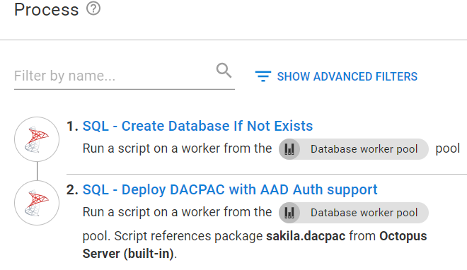

Your deployment will look something like this:

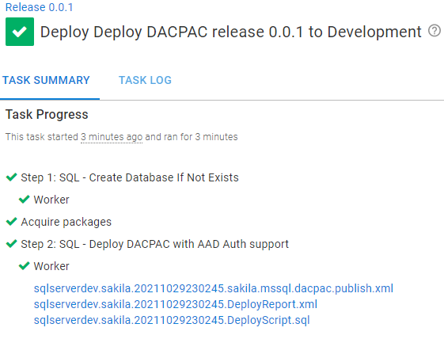

Using a tool like SQL Server Management Studio (SSMS) you can see the database has been updated:

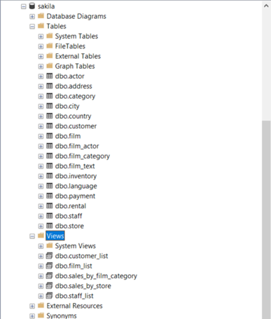

## Conclusion

This post walked you through how to deploy a DACPAC from project creation to deployment.  Be sure to check out an example in our [sample instance](https://samples.octopus.app/app#/Spaces-106/projects/dacpac-azure-sql/deployments/process).  The example deploys to an Azure SQL Database server.  

Happy deployments!
