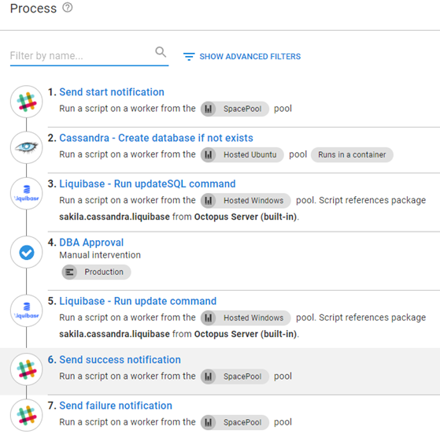
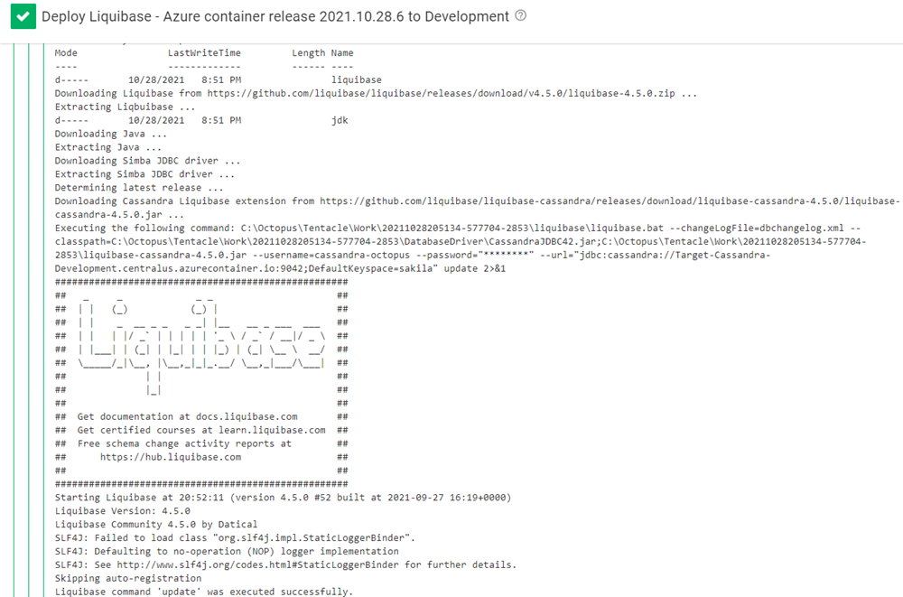
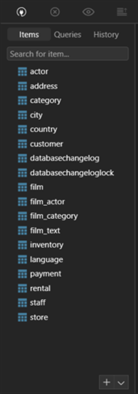

NoSQL continues to be a disruptor in the database world.  Names like MongoDB, Couchbase, Azure Cosmos DB, and Amazon DynamoDB are some of the most recognizable names of NoSQL implementations.  Increasingly, however, we are hearing customers talk about Cassandra.

This post shows you how to deploy database changes to a Cassandra server using Octopus Deploy and [Liquibase](https://liquibase.org).

## Sample project: Sakila
This post uses the [Sakila](https://bitbucket.org/octopussamples/sakila/src/master/) sample project.  The Sakila project contains examples of deploying the Sakila database to different database servers using different database deployment technologies.  

The [Cassandra](https://bitbucket.org/octopussamples/sakila/src/master/src/liquibase/cassandra/) folder contains an XML file that has been built for use with Liquibase products to create the tables in the keyspace.

<details>
<summary>dbchangelog.xml</summary>
<p>

```xml
<?xml version="1.1" encoding="UTF-8" standalone="no"?>
<databaseChangeLog xmlns="http://www.liquibase.org/xml/ns/dbchangelog" xmlns:ext="http://www.liquibase.org/xml/ns/dbchangelog-ext" xmlns:pro="http://www.liquibase.org/xml/ns/pro" xmlns:xsi="http://www.w3.org/2001/XMLSchema-instance" xsi:schemaLocation="http://www.liquibase.org/xml/ns/dbchangelog-ext http://www.liquibase.org/xml/ns/dbchangelog/dbchangelog-ext.xsd http://www.liquibase.org/xml/ns/pro http://www.liquibase.org/xml/ns/pro/liquibase-pro-3.9.xsd http://www.liquibase.org/xml/ns/dbchangelog http://www.liquibase.org/xml/ns/dbchangelog/dbchangelog-3.9.xsd">
    <changeSet author="Shawn.Sesna (generated)" id="1603898648791-1">
        <createTable tableName="category">
            <column name="category_id" type="int">
                <constraints nullable="false" primaryKey="true" primaryKeyName="PK_category_category_id"/>
            </column>
            <column name="name" type="varchar">
                <constraints nullable="false"/>
            </column>
            <column name="last_update" type="date">
                <constraints nullable="false"/>
            </column>
        </createTable>
    </changeSet>
    <changeSet author="Shawn.Sesna (generated)" id="1603898648791-2">
        <createTable tableName="language">
            <column  name="language_id" type="int">
                <constraints nullable="false" primaryKey="true" primaryKeyName="PK_language_language_id"/>
            </column>
            <column name="name" type="varchar">
                <constraints nullable="false"/>
            </column>
            <column name="last_update" type="date">
                <constraints nullable="false"/>
            </column>
        </createTable>
    </changeSet>
    <changeSet author="Shawn.Sesna (generated)" id="1603898648791-3">
        <createTable tableName="address">
            <column  name="address_id" type="int">
                <constraints nullable="false" primaryKey="true" primaryKeyName="PK_address_address_id"/>
            </column>
            <column name="address" type="varchar">
                <constraints nullable="false"/>
            </column>
            <column name="address2" type="varchar"/>
            <column name="district" type="varchar">
                <constraints nullable="false"/>
            </column>
            <column name="city_id" type="int">
                <constraints nullable="false"/>
            </column>
            <column name="postal_code" type="varchar"/>
            <column name="phone" type="varchar">
                <constraints nullable="false"/>
            </column>
            <column name="last_update" type="date">
                <constraints nullable="false"/>
            </column>
        </createTable>
    </changeSet>
    <changeSet author="Shawn.Sesna (generated)" id="1603898648791-4">
        <createTable tableName="film">
            <column  name="film_id" type="int">
                <constraints nullable="false" primaryKey="true" primaryKeyName="PK_film_film_id"/>
            </column>
            <column name="title" type="varchar">
                <constraints nullable="false"/>
            </column>
            <column name="description" type="varchar"/>
            <column name="release_year" type="int"/>
            <column name="language_id" type="int">
                <constraints nullable="false"/>
            </column>
            <column name="original_language_id" type="int"/>
            <column name="rental_duration" type="int">
                <constraints nullable="false"/>
            </column>
            <column name="rental_rate" type="decimal">
                <constraints nullable="false"/>
            </column>
            <column name="length" type="int"/>
            <column name="replacement_cost" type="decimal">
                <constraints nullable="false"/>
            </column>
            <column name="rating" type="varchar"/>
            <column name="special_features" type="varchar"/>
            <column name="last_update" type="date">
                <constraints nullable="false"/>
            </column>
        </createTable>
    </changeSet>
    <changeSet author="Shawn.Sesna (generated)" id="1603898648791-5">
        <createTable tableName="staff">
            <column  name="staff_id" type="int">
                <constraints nullable="false" primaryKey="true" primaryKeyName="PK_staff_staff_id"/>
            </column>
            <column name="first_name" type="varchar">
                <constraints nullable="false"/>
            </column>
            <column name="last_name" type="varchar">
                <constraints nullable="false"/>
            </column>
            <column name="address_id" type="int">
                <constraints nullable="false"/>
            </column>
            <column name="picture" type="blob"/>
            <column name="email" type="varchar"/>
            <column name="store_id" type="int">
                <constraints nullable="false"/>
            </column>
            <column name="active" type="boolean">
                <constraints nullable="false"/>
            </column>
            <column name="username" type="varchar">
                <constraints nullable="false"/>
            </column>
            <column name="password" type="varchar"/>
            <column name="last_update" type="date">
                <constraints nullable="false"/>
            </column>
        </createTable>
    </changeSet>
    <changeSet author="Shawn.Sesna (generated)" id="1603898648791-6">
        <createTable tableName="store">
            <column  name="store_id" type="int">
                <constraints nullable="false" primaryKey="true" primaryKeyName="PK_store_store_id"/>
            </column>
            <column name="manager_staff_id" type="int">
                <constraints nullable="false"/>
            </column>
            <column name="address_id" type="int">
                <constraints nullable="false"/>
            </column>
            <column name="last_update" type="date">
                <constraints nullable="false"/>
            </column>
        </createTable>
    </changeSet>
    <changeSet author="Shawn.Sesna (generated)" id="1603898648791-7">
        <createTable tableName="rental">
            <column  name="rental_id" type="int">
                <constraints nullable="false" primaryKey="true" primaryKeyName="PK_rental_rental_id"/>
            </column>
            <column name="rental_date" type="date">
                <constraints nullable="false"/>
            </column>
            <column name="inventory_id" type="int">
                <constraints nullable="false"/>
            </column>
            <column name="customer_id" type="int">
                <constraints nullable="false"/>
            </column>
            <column name="return_date" type="date"/>
            <column name="staff_id" type="int">
                <constraints nullable="false"/>
            </column>
            <column name="last_update" type="date">
                <constraints nullable="false"/>
            </column>
        </createTable>
    </changeSet>
    <changeSet author="Shawn.Sesna (generated)" id="1603898648791-8">
        <createTable tableName="city">
            <column  name="city_id" type="int">
                <constraints nullable="false" primaryKey="true" primaryKeyName="PK_city_city_id"/>
            </column>
            <column name="city" type="varchar">
                <constraints nullable="false"/>
            </column>
            <column name="country_id" type="int">
                <constraints nullable="false"/>
            </column>
            <column name="last_update" type="date">
                <constraints nullable="false"/>
            </column>
        </createTable>
    </changeSet>
    <changeSet author="Shawn.Sesna (generated)" id="1603898648791-9">
        <createTable tableName="film_actor">
            <column name="actor_id" type="int">
                <constraints nullable="false" primaryKey="true" primaryKeyName="PK_film_actor_actor_id"/>
            </column>
            <column name="film_id" type="int">
                <constraints nullable="false" primaryKey="true" primaryKeyName="PK_film_actor_actor_id"/>
            </column>
            <column name="last_update" type="date">
                <constraints nullable="false"/>
            </column>
        </createTable>
    </changeSet>
    <changeSet author="Shawn.Sesna (generated)" id="1603898648791-10">
        <createTable tableName="film_category">
            <column name="film_id" type="int">
                <constraints nullable="false" primaryKey="true" primaryKeyName="PK_film_category_film_id"/>
            </column>
            <column name="category_id" type="int">
                <constraints nullable="false" primaryKey="true" primaryKeyName="PK_film_category_film_id"/>
            </column>
            <column name="last_update" type="date">
                <constraints nullable="false"/>
            </column>
        </createTable>
    </changeSet>
    <changeSet author="Shawn.Sesna (generated)" id="1603898648791-11">
        <createTable tableName="film_text">
            <column name="film_id" type="int">
                <constraints nullable="false" primaryKey="true" primaryKeyName="PK_film_text_film_id"/>
            </column>
            <column name="title" type="varchar">
                <constraints nullable="false"/>
            </column>
            <column name="description" type="varchar"/>
        </createTable>
    </changeSet>
    <changeSet author="Shawn.Sesna (generated)" id="1603898648791-12">
        <createTable tableName="actor">
            <column  name="actor_id" type="int">
                <constraints nullable="false" primaryKey="true" primaryKeyName="PK_actor_actor_id"/>
            </column>
            <column name="first_name" type="varchar">
                <constraints nullable="false"/>
            </column>
            <column name="last_name" type="varchar">
                <constraints nullable="false"/>
            </column>
            <column name="last_update" type="date">
                <constraints nullable="false"/>
            </column>
        </createTable>
    </changeSet>
    <changeSet author="Shawn.Sesna (generated)" id="1603898648791-13">
        <createTable tableName="inventory">
            <column  name="inventory_id" type="int">
                <constraints nullable="false" primaryKey="true" primaryKeyName="PK_inventory_inventory_id"/>
            </column>
            <column name="film_id" type="int">
                <constraints nullable="false"/>
            </column>
            <column name="store_id" type="int">
                <constraints nullable="false"/>
            </column>
            <column name="last_update" type="date">
                <constraints nullable="false"/>
            </column>
        </createTable>
    </changeSet>
    <changeSet author="Shawn.Sesna (generated)" id="1603898648791-14">
        <createTable tableName="customer">
            <column  name="customer_id" type="int">
                <constraints nullable="false" primaryKey="true" primaryKeyName="PK_customer_customer_id"/>
            </column>
            <column name="store_id" type="int">
                <constraints nullable="false"/>
            </column>
            <column name="first_name" type="varchar">
                <constraints nullable="false"/>
            </column>
            <column name="last_name" type="varchar">
                <constraints nullable="false"/>
            </column>
            <column name="email" type="varchar"/>
            <column name="address_id" type="int">
                <constraints nullable="false"/>
            </column>
            <column name="active" type="boolean">
                <constraints nullable="false"/>
            </column>
            <column name="create_date" type="date">
                <constraints nullable="false"/>
            </column>
            <column name="last_update" type="date"/>
        </createTable>
    </changeSet>
    <changeSet author="Shawn.Sesna (generated)" id="1603898648791-15">
        <createTable tableName="country">
            <column  name="country_id" type="int">
                <constraints nullable="false" primaryKey="true" primaryKeyName="PK_country_country_id"/>
            </column>
            <column name="country" type="varchar">
                <constraints nullable="false"/>
            </column>
            <column name="last_update" type="date">
                <constraints nullable="false"/>
            </column>
        </createTable>
    </changeSet>
    <changeSet author="Shawn.Sesna (generated)" id="1603898648791-16">
        <createTable tableName="payment">
            <column  name="payment_id" type="int">
                <constraints nullable="false" primaryKey="true" primaryKeyName="PK_payment_payment_id"/>
            </column>
            <column name="customer_id" type="int">
                <constraints nullable="false"/>
            </column>
            <column name="staff_id" type="int">
                <constraints nullable="false"/>
            </column>
            <column name="rental_id" type="int"/>
            <column name="amount" type="decimal">
                <constraints nullable="false"/>
            </column>
            <column name="payment_date" type="date">
                <constraints nullable="false"/>
            </column>
            <column name="last_update" type="date"/>
        </createTable>
    </changeSet>
 </databaseChangeLog>

```
In this post, you use a build server or the [Octopus command line interface (CLI)](https://octopus.com/docs/octopus-rest-api/octopus-cli) to package the dbchangelog.xml file into a .zip package for deployment.

</p>
</details>

## Cassandra deployment process
This post assumes you know how to create Octopus projects and add steps to the deployment process.  If you're new to Octopus, consider reading our [getting started documentation](https://octopus.com/docs/getting-started) to familiarize yourself with these concepts.

In previous posts, the [Liquibase - Apply changeset](https://library.octopus.com/step-templates/6a276a58-d082-425f-a77a-ff7b3979ce2e/actiontemplate-liquibase-apply-changeset) template was used to perform updates to databases.  However, this template only contained a fraction of what the Liquibase product is capable of and has been replaced with [Liquibase - Run Command](https://library.octopus.com/step-templates/36df3e84-8501-4f2a-85cc-bd9eb22030d1/actiontemplate-liquibase-run-command).  

**Liquibase - Run Command** is more flexible and has implemented many of the commands available for the Liquibase product.  This template also has more **Database Type** options, including **Snowflake** and **Cassandra**.

The deployment process for Cassandra looks something like this:

- **Send start notification**
- **Cassandra - Create database if not exists**
- **Liquibase - Run updateSQL command**
- **DBA Approval**
- **Liquibase - Run update command**
- **Send success notification**
- **Send failure notification**



### Send start notification
The **Send start notification** step sends a message in Slack to let the channel know a deployment has started using the [Slack - Send Simple Notification](https://library.octopus.com/step-templates/99e6f203-3061-4018-9e34-4a3a9c3c3179/actiontemplate-slack-send-simple-notification) community step template.

- **Hook URL**: The webhook link for your Slack account
- **Channel handle**: The channel to post in
- **Icon URL**: URL to the icon, to use when posting
- **Username**: Name of the user the post will be from
- **Title**: Title of the post
- **Message**: Detailed message of the post
- **Color**: Color to attribute to the post

### Cassandra - Create database if not exists
A database in Cassandra is referred to as a **keyspace**.  The [Cassandra - Create database if not exists](https://library.octopus.com/step-templates/8ab26143-22d7-4e2f-83a8-f0e2d74a4de2/actiontemplate-cassandra-create-database-if-not-exists) template automates the creation of a **keyspace** on a Cassandra server.

- **Server Name**: Name or IP address of the Cassandra server
- **Port**: The port Cassandra is listening on
- **(Optional) Username**: Username with sufficient permissions to create a keyspace
- **(Optional) Password**: Password for the user with sufficient permissions to create a keyspace
- **Server mode**: Network topology or simple
- **Keyspace**: Name of the keyspace to create
- **Number of replicas**: Number of replicas to create

### Liquibase - Run updateSQL command
The `updateSQL` command in Liquibase analyzes the change log and produces a file containing the SQL it will execute when running the `update` command.  The file is then uploaded to the Octopus server as an artifact.

- **Pro license key**: Some Liquibase commands require a pro license key.
- **Database type**: The type of database server* you're deploying to.

:::info
*The list of database technologies is not a full list of what Liquibase can deploy to, only what has been tested with Octopus Deploy.  Overriding the dropdown will result in failure as the template won't know how to construct the JDBC connection string.
:::

- **Command**: Dropdown list of commands* .  If the command is not present, the dropdown can be overridden by clicking on the chain () icon and entering the desired command.

:::info
*This isn't a complete list of available commands to Liquibase, only those tested with Octopus Deploy.
:::

- **Additional switches**: Liquibase has additional switches that can be provided such as setting the loglevel (for example, `--logLevel=debug`).
- **Change Log file name**: This is the file that contains Liquibase change log.
- **Changeset package**: The package that contains the change log.
- **Server name**: Name or IP address of the server to connect to.
- **Server Port**: Port the server is listening on.
- **Database name**: Database name (keyspace in the case of Cassandra) to update.
- **Username**: Optional username to use for updating.  The identity of the worker/tentacle will be used if username and password are omitted.
- **Password**: Password for the optional username.
- **Connection query string parameters**: Some database servers require additional parameters to be set for connecting.  In the case of Cassandra, you would enter [;AuthMech=1](https://downloads.datastax.com/jdbc/cql/2.0.4.1004/Simba%20Cassandra%20JDBC%20Install%20and%20Configuration%20Guide.pdf#page=31) if you wanted to use username/password.
- **Database driver path**: The folder where the database driver exists.  Use a `;` as a delimiter in cases where an extension driver is required (Cassandra requires one).  Leave blank if you're using the **Download Liquibase** option.
- **Executable file path**: Location of where liquibase.bat.
- **Download Liquibase**: If you don't include the Liquibase product in your package, use this option to dynamically download Liquibase, the driver and extensions for the selected `Database type`, and Java to run Liquibase.
- **Liquibase version**: By default, **Download Liquibase** downloads the latest version.  Use this option to download a specific version of Liquibase.

### DBA Approval
This step is optional, depending on the confidence your DBA has in the automated deployment process. It pauses your deployment and allows a DBA to review the SQL file produced by the **Liquibase - Run updateSQL command** step and approves or denies the deployment.

### Liquibase - Run update command
This step uses the same template as **Liquibase - Run updateSQL command**, but uses the `update` command instead of `updateSQL`.

### Send success notification
This step uses the same template as **Send start notification** and executes when a deployment has been successfully executed.

### Send failure notification
This step uses the same template as **Send start notification** to send a message to Slack only if the deployment fails.

## Deployment results
After the deployment is complete, you'll see something like this:



Using a tool like [TablePlus](https://tableplus.com/), you can connect to your Cassandra server and see your keyspace populated with the tables from your dbchangelog.xml file.



## Conclusion
This post demonstrates how to automate your deployments to a Cassandra database server using Octopus Deploy and Liquibase.  

Happy deployments!
