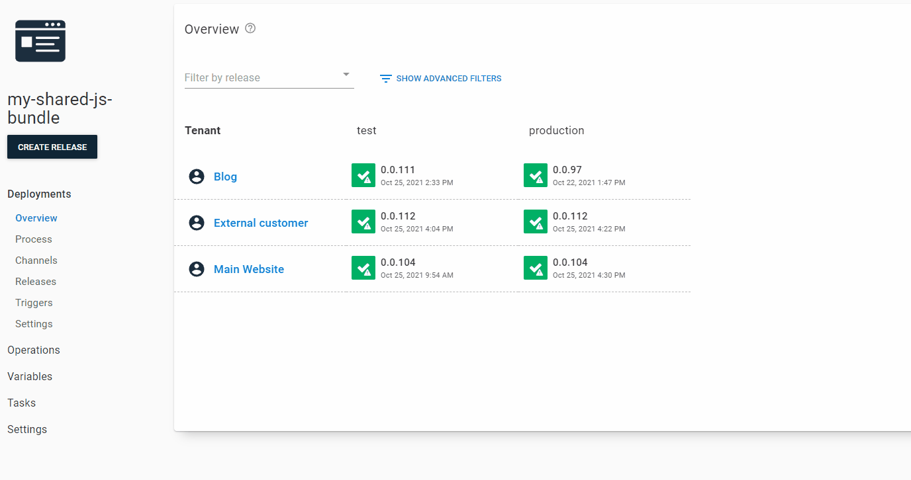
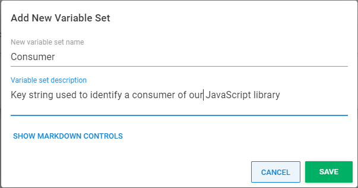
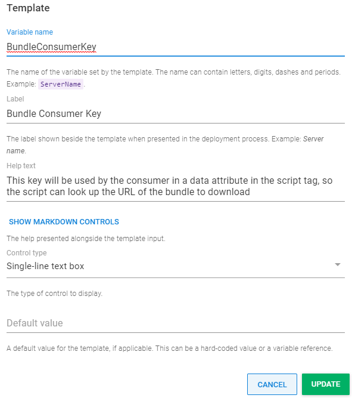
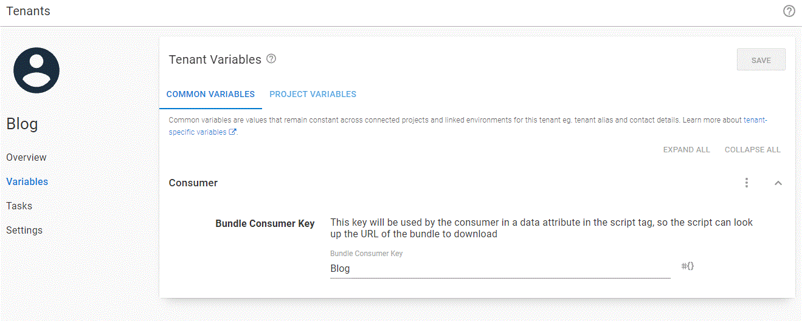
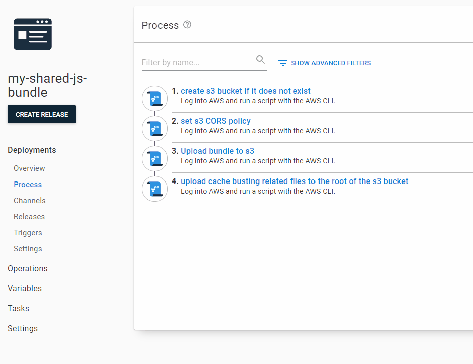
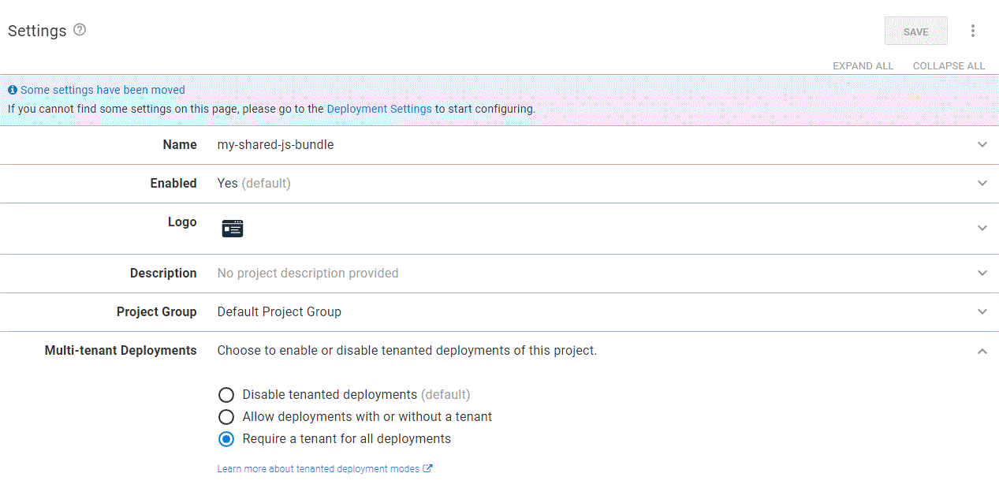
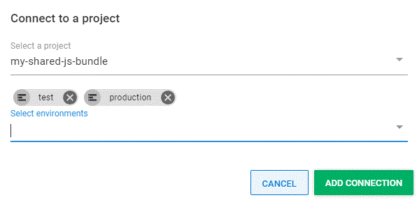
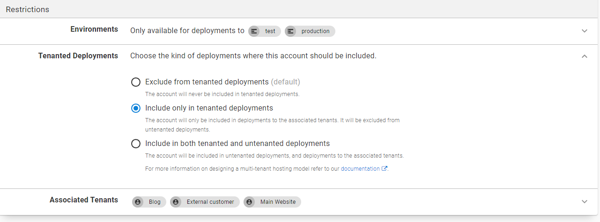

In my [previous post](https://octopus.com/blog/deploying-javascript-library-project-with-octopus), you learned how to use Octopus to deploy a hash-named JavaScript library bundle to cloud storage. In cloud storage, it was referenced by other projects via an automatically updated variable in a [library variable set](https://octopus.com/docs/projects/variables/library-variable-sets). 

That's a good start for managing reusable front-end code in Octopus. It keeps every consumer of your bundle on the latest version of your library as releases happen. Being on the latest version might be the exact behavior you need, especially if you only have a few internal projects that reference a small to medium-sized JavaScript library. However, if you continue this pattern as your organization scales up, some scenarios can create dilemmas.

## Motivating examples

### A back-end release needs the old JS library

This might happen when a hotfix is needed. As your front-end library grows, you won't want to rush upgrading for the sake of an unrelated fix. You could override the library variable at the project level. That would be a reasonable solution if the situation occurs occasionally, but if it's normal development flow, and multiple teams reference your script and want to upgrade when convenient, clear visibility of who is on which version of your library is helpful. You'd also like to be able to roll back a change that broke one consumer, or upgrade a different website that's failing due to a known bug in an old version of your library. In these cases, you want to release your JavaScript not only to a specific environment but also to specific consumers.  

### The consumer isn't internal

Maybe you created a widget that users add to their website by copy-pasting a code snippet from your website. Or a library started life as an internal project but turned out to be general-purpose enough for your company to make it available to the world via a CDN. 

In these cases, it becomes impossible for you to modify the HTML references to your script. You have to separate the concept of releasing your JavaScript from releasing the code that uses it, and you have to solve cache-busting in a new way.

## Tenants to the rescue

[Tenants](https://octopus.com/docs/tenants) are a good conceptual fit for representing consumers of your JavaScript library. Tenants are often used to represent customers of your application. Your customers in this case might be internal, but here at Octopus, scaling up our engineering team has shown it's helpful to think of other teams as internal customers. 

You're updating script dependencies on different websites instead of deploying software to different customers' infrastructure, but all the requirements for how you manage that in Octopus are the same as if you were deploying appropriate versions of a server-side app for different customers. 

Here's an example of the dashboard you end up with after following the instructions in this post. In this example, imagine you're deploying your shared script to a company WordPress blog, an external customer, and your company's main website.



Each of these is represented as a tenant, to which you will assign a unique identifier using a [common variable](https://octopus.com/docs/tenants/tenant-variables#common-variables), since those are not scoped per environment.

## Setup your consumer key variable

In the Octopus Web Portal, navigate to the **Library** tab and then the **Variable Sets** section. Then click **ADD NEW VARIABLE SET** and fill out the dialog as follows:

- **New variable set name** - `Consumer`
- **Variable set description** - `Key string used to identify a consumer of our JavaScript library`

Click **Save**.



Select your newly created variable set, then click **VARIABLE TEMPLATES**, then the **ADD TEMPLATE** button. Fill out the details as follows:

- **Variable name** - `BundleConsumerKey`
- **Label** - `Bundle Consumer Key`
- **Help text** - `This key will be used by the consumer in a data attribute in the script tag, so the script can look up the URL of the bundle to download`
- **Control type** - `Single-line text box`
- **The type of control to display** - `Default value`



## Create a consumer for each tenant

Navigate to the **Tenants** tab, click the **ADD TENANT** button, and create a tenant named `Blog`. 

Click on your newly created tenant, navigate to its **Variables** section, then click on  **COMMON VARIABLES**. 

Set the variable for `Bundle Consumer Key` to the value `Blog`.



Repeat this process to create the `External customer` tenant with `Bundle Consumer Key` value of `Customer`, and the `Main Website` tenant with `Bundle Consumer Key` of `Mainsite`.

Now you need a project to interact with these tenants.

## Setup your project

You can deploy to your tenants using the following process.



You use essentially the same process used in the [previous post](https://octopus.com/blog/deploying-javascript-library-project-with-octopus). But you'll stop before you update the bundle URL in a variable set because the final step of this tenanted deployment process is different. 

From the previous post, create a process in Octopus Deploy that includes the following steps:

1. [Create an S3 bucket if it doesn't exist](https://octopus.com/blog/deploying-javascript-library-project-with-octopus#creating-an-s3-bucket-if-it-doesnt-exist)
2. [Set the S3 CORS policy](https://octopus.com/blog/deploying-javascript-library-project-with-octopus#setting-s3-cors-policy)
3. [Upload the bundle to S3](https://octopus.com/blog/deploying-javascript-library-project-with-octopus#uploading-bundle-to-s3)

Now that you have the basis for a project that uploads a JavaScript bundle, you need to make modifications to enable tenanted deployments.

### Require tenants for all deployments of your project

Navigate to the **Settings** of your project and select the option to require a tenant for all deployments.



### Connect all consumer tenants to your project

For each of your tenants, click the **CONNECT PROJECT** button and connect your JavaScript project to the tenant for the `test` and `production` environments.



### Allow all tenants to use your Amazon S3 account

If you're using an account variable, you'll find there is an extra step to allow using it to release to any of your tenants. The ability to restrict accounts to tenants can be important to help prevent using the wrong account for the wrong customer, but for simplicity, assume you're releasing to one S3 bucket referenced by all consumers.



### A new deployment step to update bundle URLs

To take control of the bundle URL each tenant references, your new process uploads a small JSON file for each combination of tenant and environment to the root of your S3 bucket. The name of that file is in the form `consumerkey.enivornment.json`. Here is an example for `Customer.production.json`:

```json
{
  "url": "https://bundle-s3.s3.ap-southeast-2.amazonaws.com/release_0.0.112/js/app.69e902e8.js"
}
```

To generate these JSON files in the final step of your deployment process, add a **Run an AWS CLI Script** step that references your package, and is configured to use your S3 account. 

Now add the following PowerShell script:

```ps
$bundle = Get-ChildItem -Path MyBundle/js/*.js | Select-Object -First 1
$releaseId = $OctopusParameters["Octopus.Release.Number"]
$bundleUrl = $bucketUrl + 'release_' + $releaseId + '/js/' + $bundle.Name
$env = $OctopusParameters["Octopus.Environment.Name"];
echo "{""url"":""$bundleUrl""}" | aws s3 cp - "s3://#{s3-bucket-name}/#{BundleConsumerKey}.$env.json" --acl public-read
aws s3 cp MyBundle/bundle-loader.js s3://#{s3-bucket-name}/bundle-loader.js --acl public-read
```

This won't run successfully yet, because you have to add `bundle-loader.js` to the code in your package.

### Dynamic cache busting

You want `bundle-loader.js` to sit at the root of your package. To achieve that in Vue JS, create the file at the root of the `public` folder in your Vue project.

Here is the source for `bundle-loader.js`:

```js
(async () => {
       const { consumerKey, environment } = document.currentScript.dataset;
      const redirectFileUrl = `${document.currentScript.src.substring(0, document.currentScript.src.lastIndexOf('/'))}/${consumerKey}.${environment}.json`;
      const response = await fetch(redirectFileUrl, { cache: "no-store" });
      const bundleInfo = await response.json();
      var script = document.createElement('script');
      script.src = bundleInfo.url
      document.head.appendChild(script);
   }
)();
```

Consumers now reference `bundle-loader.js` instead of directly referencing the bundle. It will fetch the small JSON file without caching, then dynamically add a new `script` tag to reference the correct version of the bundle for the tenant and environment. These are specified in data attributes on the `script` tag that references `bundle-loader.js`. 

Here is an example of a consumer page implemented in ASP.NET Core MVC:

```razor
@page

@inject BundleSettings bundleSettings

<script src="@bundleSettings.BaseUrl/bundle-loader.js" data-consumer-key="@bundleSettings.ConsumerKey" data-environment="@bundleSettings.EnvironmentName"></script>
<div id="app"></div>
```

Now there is no need to make any modifications to consumers to update their JavaScript references when you release new versions of your library.

## Conclusion

Tenants are a powerful and versatile feature of Octopus. In this post, I demonstrated that they are well-suited to modeling consumers that share a JavaScript library. 

The flexibility of tenant variables opens the door to advanced scenarios, such as publishing an NPM package or releasing custom builds of your JavaScript library for different consumers. The approach does bring a small increase in complexity, and if you only want all your consumers to use the latest version of a JavaScript dependency that doesn't change often, multi-tenanted deployments might be overkill. 

I've proven it's not difficult to adapt a simpler deployment process to be multi-tenanted when you need it. It's fine to start with a simpler deployment process for your JavaScript library, but tenants have you covered if you need complete control over who uses which version of your library.

Happy deployments!
