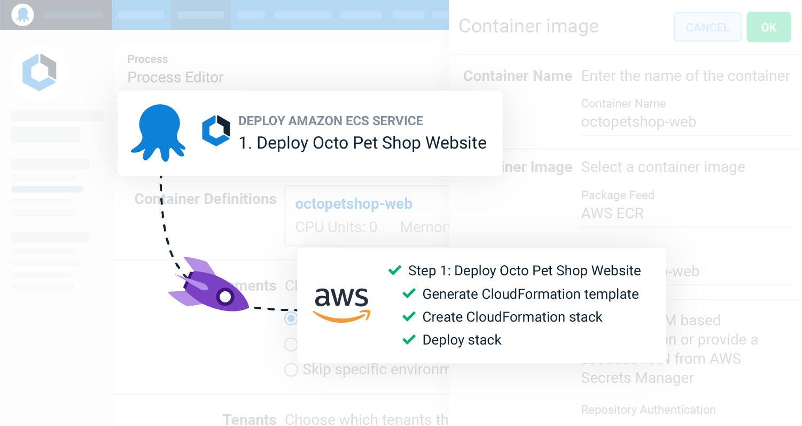
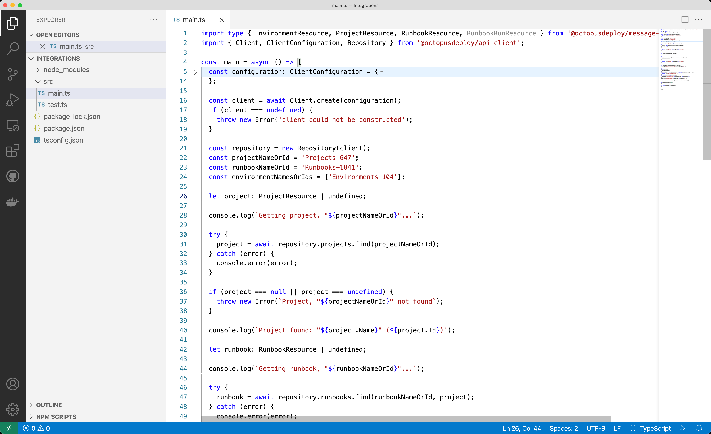
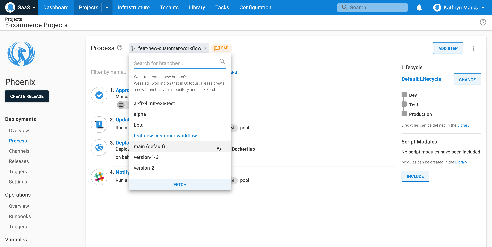
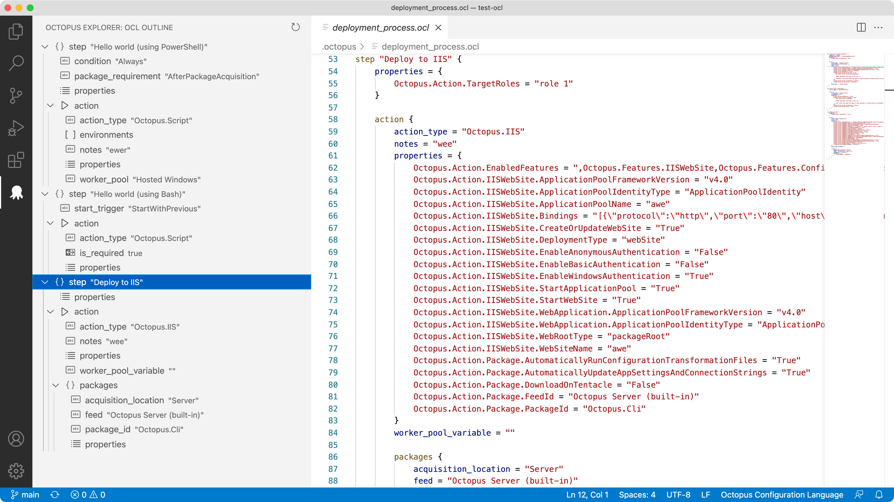

The Octopus 2021 Q4 release is now available.

Built-in support for Amazon's Elastic Container Service (ECS) will make your ECS deployments easier. Our opinionated UI step guides you through the setup and builds the CloudFormation template, so you don't have to write configuration files or custom scripts.

This release includes some other noteworthy updates:

- We delivered a new TypeScript API client for Octopus Deploy.
- The Config as Code early access preview (EAP) is available to all customers.
- Try our new Visual Studio Code extension that supports the Octopus Configuration Language (OCL) for Config as Code.
- The Terraform Provider for Octopus Deploy supports script modules, tenant variables, and Worker Pools.
- We improved our Go API client and TeamCity plugin for Octopus Deploy.
- Octopus Cloud supports Azure AD, Google, and Okta as authentication providers, alongside Octopus ID.

## Included in the Q4 release

- Octopus Server 2021.3 ([release notes](https://octopus.com/downloads/whatsnew/2021.3))
- TypeScript API client for Octopus Deploy 1.1.5
- Octopus Deploy for Visual Studio Code 0.0.17
- TeamCity plugin for Octopus Deploy 6.1.5
- Go API client for Octopus Deploy 1.7.52
- Tentacle 6.1.1147
- Terraform Provider for Octopus Deploy 0.7.63

## Long term support

The following table shows the Octopus Server releases with long term support. 

| Release               | Long term support              |
| --------------------- | ---------------------------    |
| Octopus 2021.3        | Yes                            |
| Octopus 2021.2        | Yes                            |
| Octopus 2021.1        | Yes (until 31 January 2022)    |
| Octopus 2020.6        | Expired                        |

## Release Tour

<iframe width="560" height="315" src="https://www.youtube.com/embed/NqcfVLP_WrE" frameborder="0" allowfullscreen></iframe>

## New Amazon ECS integration with Octopus {#ecs-integration}

Our new Amazon Web Services (AWS) ECS integrations make it easier to get started with ECS or deploy a new service through Octopus.

This release delivers the [first integration milestone](https://octopus.com/blog/rfc-ecs-integration-with-octopus) plus an update to the existing **Deploy an AWS CloudFormation Template** step:

1. A new [target](https://octopus.com/docs/deployments/aws/ecs#step-2-create-a-deployment-target-for-your-ecs-cluster) to represent an ECS cluster so you can model environments and tenanted deployments
2. An opinionated, UI-driven [ECS step](https://octopus.com/docs/deployments/aws/ecs) that creates and manages the service and task definitions for you via CloudFormation
3. The ability to export the underlying CloudFormation template
4. A simplified deployment workflow across environments
5. Add Docker images to the [Deploy an AWS CloudFormation Template](https://octopus.com/docs/deployments/aws/cloudformation) step and reference them in your CloudFormation templates

The new ECS step guides you through the configuration and produces the CloudFormation YAML based on your inputs.

When you outgrow the guided UI step or need more flexibility, you can expose the underlying YAML and paste it into the [Deploy an AWS CloudFormation Template](https://octopus.com/docs/deployments/aws/cloudformation) step.

Our goal is to help you achieve repeatable, recoverable, and auditable ECS deployments. Learn how these features can save you time and minimize manual configuration by reading our [AWS documentation](https://octopus.com/docs/deployments/aws).

We're developing more features for [milestone two](https://octopus.com/blog/rfc-second-ecs-integration-with-octopus) and expect to release them next year. Watch [our blog](https://octopus.com/blog) for updates.

## TypeScript API client for Octopus Deploy {#typescript-api-client}

The new [TypeScript API client](https://github.com/OctopusDeploy/api-client.ts) provides cross-platform integration with Octopus using the Node.js and npm ecosystem.

Now you can script tasks with Octopus Deploy using an accessible, familiar programming language regardless of the systems you use with Octopus.

Our API supports all of the actions you can perform with the Octopus web portal and Command Line Interface (CLI).

Here are some ideas to get you started:

- Automate production deployment approvals
- Trigger deployments and runbooks from build servers and other systems

Learn more about the TypeScript API client in our [getting started guide](https://github.com/OctopusDeploy/api-client.ts/blob/main/getting-started.md), [reference documentation](https://octopusdeploy.github.io/api-client.ts), and documented [API examples](https://octopus.com/docs/octopus-rest-api/examples). You can download the client [through npm](https://www.npmjs.com/package/@octopusdeploy/api-client).

## Early access to Config as Code and Octopus Deploy for Visual Studio Code {#config-as-code-early-access}

The Configuration as Code early access preview (EAP) is available to all customers. We combined the usability of Octopus with the power of Git so you can evolve your deployment process alongside your application code.

[Octopus Deploy for Visual Studio Code](https://marketplace.visualstudio.com/items?itemName=octopusdeploy.vscode-octopusdeploy) is a free extension that makes working with Octopus Configuration Language (OCL) files easier. Features include:

- Syntax highlighting
- Code snippets for steps and actions
- An integrated tree view to navigate nodes in the file

This quarter, Octopus Deploy became a verified publisher in the Visual Studio Code Extension Marketplace.

Learn more in our post [Octopus Deploy Config as Code: early access preview](https://octopus.com/blog/config-as-code-eap).

## Other integration updates

This quarter we delivered improvements to existing integrations:

- The [Terraform Provider](https://github.com/OctopusDeployLabs/terraform-provider-octopusdeploy) for Octopus Deploy supports script modules, tenant variables, and Worker Pools. We surpassed 325,000 installs of the Provider from the [Terraform Registry](https://registry.terraform.io/providers/OctopusDeployLabs/octopusdeploy/latest).  
- We improved our [Go API client](https://github.com/OctopusDeploy/go-octopusdeploy) for Octopus, including bug fixes and updated support for Worker Pools.
- The [TeamCity plugin](https://plugins.jetbrains.com/plugin/9038-octopus-deploy-integration) for Octopus Deploy passes Git details for version-controlled projects to support Configuration as Code.
- Octopus Cloud supports a range of authentication providers, including Azure AD, Google, and Okta. Learn about [authentication providers](https://octopus.com/docs/security/authentication) in our documentation.

## Breaking changes

This release includes three breaking changes.

### New default behavior for `GET machines/{id}/tasks` {#get-machines-id-tasks}

We added runbook run activity to the deployment target screen. In support of this change, `GET machines/{id}/tasks` now returns both deployments and runbook runs. You can specify a `type` parameter to filter the results: `Deployment` or `RunbookRun`. 

Learn more about this change [in the GitHub issue](https://github.com/OctopusDeploy/Issues/issues/6982).

### Recommended version of Mono to run Calamari {#version-mono-for-calamari}

Calamari can execute on the Mono framework. We recommend 5.14.0 as the minimum version of Mono for running Calamari. 

Learn more about this change in our [SSH target requirements](https://octopus.com/docs/infrastructure/deployment-targets/linux/ssh-requirements#mono-calamari) documentation.

### Recommended version of the Octopus .NET API client {#version-octopus-dotnet-api-client}

We recommend 11.3.3453 as the minimum version of the Octopus .NET API client for interacting with Octopus Server 2021.3.

Customers who use the Octopus .NET API client to work with teams, roles, and permissions must use version 11.3.3453 of the client (or newer) to ensure compatibility with Octopus Server 2021.3.7491 and newer.

Learn more about this change [in the GitHub issue](https://github.com/OctopusDeploy/Issues/issues/7190).

## Upgrade or get started

Octopus Cloud users are already running this release. Self-hosted Octopus customers can download the latest version from our website.

<a class="btn btn-success" href="https://octopus.com/downloads/2021.3.0">Download Octopus 2021.3</a>

We encourage you to review the [steps for upgrading Octopus Server](https://octopus.com/docs/administration/upgrading). Please see the [release notes](https://octopus.com/downloads/whatsnew/2021.3) for further information.

If you've never used Octopus before, [sign up](https://octopus.com/start) for a free trial or [email our customer success team](mailto:customersuccess@octopus.com) to see a demo and learn more.

## What's coming in future releases? {#future-releases}

Check out our [public roadmap](https://octopus.com/roadmap) to stay informed and register for updates.

## Conclusion

Octopus 2021 Q4 delivers the first milestone of our centralized support for Amazon ECS.

This release also includes the TypeScript API client for Octopus and a collection of new and improved integrations with other platforms.

We look forward to shipping more great features in the next release.

We'd love to hear from you with any questions or comments. You can leave a comment below or join the conversation in our [Octopus Community Slack](https://octopus.com/slack).

Happy deployments!
