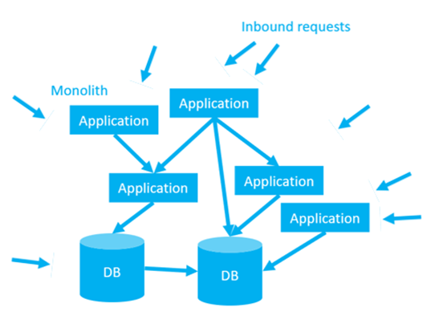
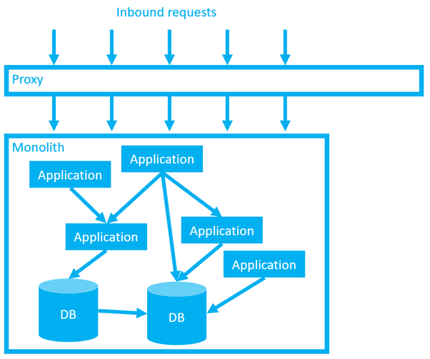
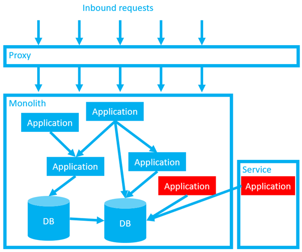
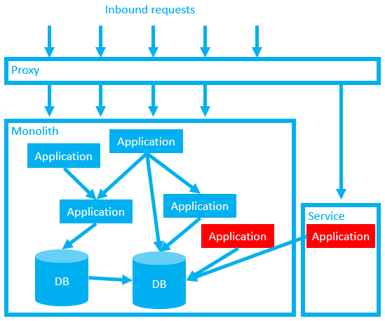
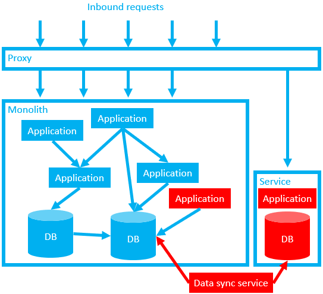
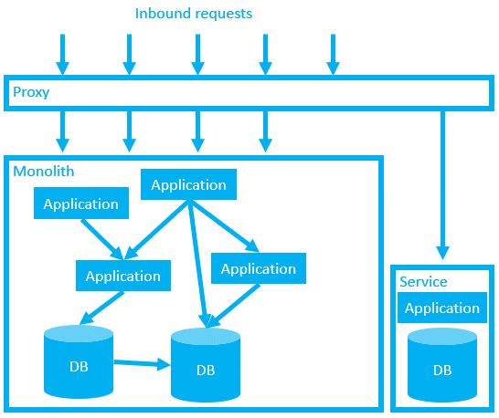
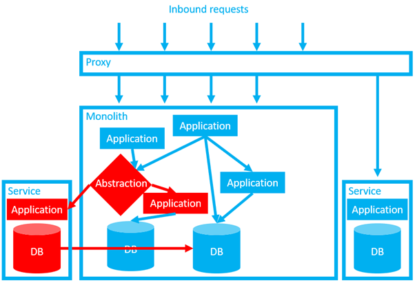
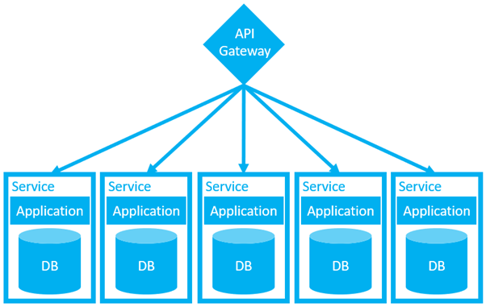

This blog post is part 8, and the final post, of my safe schema updates series.

!include <safe-schema-updates-posts>

So far in this series we’ve talked at length about the benefits of embracing a more loosely coupled architecture, where sub-systems manage their own data. By hiding the database internals for each sub-system, and forcing all communication to go through some messaging bus or API gateway, we avoid the dependency nightmares discussed in database delivery hell. We also allow sub-systems to be managed and updated independently, reducing governance overhead, and simplifying both provisioning and delivery challenges.

In the last post [we discussed patterns for safe, near-zero downtime releases](https://octopus.com/blog/safe-schema-updates-1-delivery-hell), with fast and reliable rollback options. You’re armed with the motivation and tooling, but we’ve not discussed any guiding strategy for planning the refactor from tight coupling to loose coupling.

This post aims to provide a broad overview about how to manage the whole process. As the title suggests, we’ll discuss [the strangler pattern](https://martinfowler.com/bliki/StranglerFigApplication.html), but we’ll also touch on other patterns including: 

- [Domain driven design](https://octopus.com/blog/devops-reading-list#ddd)
- [Branching by abstraction](https://martinfowler.com/bliki/BranchByAbstraction.html)
- [Dark launching](https://martinfowler.com/bliki/DarkLaunching.html)

Before we go any further, let’s set some expectations: This isn’t easy, and it’s not a silver bullet. This is going to require plenty of time/investment, it’s something you’ll probably pick away at in phases, and there are trade-offs that need to be considered.

There’s no such thing as a free lunch.

## The strangler pattern

Let’s imagine a typical dependency nightmare.

 
This architecture was the result of many years of accumulated tight deadlines, short-term planning, [technical debt](https://martinfowler.com/bliki/TechnicalDebt.html), knowledge hoarding, and staff turnover. Information sharing is hard at the best of times, but the existing team is looking at this without the benefits of perfect knowledge, reliable docs, or a mature test suite.

This system is valuable. Somewhere in that tangled web is the company’s “cash cow” product and a bunch of critical internal systems, but there’s also a long tail of forgotten, half-baked “side-projects”, abandoned business projects, and retired functionality. It’s hard to see the wood for the trees.

We need to wrap this monolith in a strangler application. Like the Australian fig tree that inspired this architecture, our strangler application is a parasite that will smother its host, eventually killing it in the process.

We’ll start with a simple proxy. 

 
At first this proxy does nothing more than capture all inbound calls and redirect them back to the intended destination. Functionally, we’ve not made any changes, but we are increasing the load on your network. Given that loosely coupled architectures put more stress on your network, it’s a good idea to discover and resolve any network challenges early, before we start doing anything more exciting.

Next, we decide on a slice of functionality we want to spin out into a separate service. Ideally, we’ve used domain driven design to inform our choice (see [post 4](https://octopus.com/blog/safe-schema-updates-4-loose-coupling-mitigates-tech-problems) and [post 5](https://octopus.com/blog/safe-schema-updates-5-loose-coupling-mitigates-human-problems) in this series for a recap on “DDD”). Perhaps the functionality we are building broadly (or completely) replaces functionality in one or more of the old components of the monolith. In either case, this is brand new code, with the internal code implementation hidden from other systems.

 
Note, at this point we have “deployed” the service in production, but it has not yet been “released”. (I’m using the definition of “deployment” and “release” from [part 7](https://octopus.com/blog/safe-schema-updates-7-near-zero-downtime-deployments), where deployments are associated with copying files, but releases are about making changes available to end users.) This allows us to test our new code in production, without exposing it to our users, while the production traffic is still handled safely by the old code.

When we’ve tested the new code, we can “release” our new service with a config change in the proxy. If we detect any issues, we can roll our change back instantly by reverting our proxy config.
 

Also note that for now, we are still using the original database. Our service will not truly be decoupled until we’ve broken that dependency. We now need to break up the database, using [the expand contract pattern discussed in part 7](https://octopus.com/blog/safe-schema-updates-7-near-zero-downtime-deployments).

As a temporary measure we may need to set both the old and new versions of the application to update both the old database and the new database. Alternatively, we might need to create an additional data sync service to ensure that both databases are kept in sync.

When we’re confident that we won’t need to perform a fast rollback using the proxy trick, we can start to carefully clean up after ourselves. If we can easily determine which parts of the monolith are now obsolete, we can try to remove them. 

We only need to keep the data for our newly decoupled service in the old database (and any data sync applications) until we are confident that the new service is healthy and fully uncoupled. For example, we could monitor for reads/writes in the old database. Assuming all is quiet, we then rename our columns or tables and wait for the phone to ring. If no-one calls for a week or two, it’s probably reasonably safe to backup and drop the old columns as well as any data sync services. 

Now, our new service can be managed independently. It’s easier to work on because developers are free from the constant fear of breaking dependencies and the cognitive overhead associated with the rest of the system. They can run the service wherever they like and plan their deployment schedule independently, free from any bureaucracy associated with the broader monolith.

Similarly, the monolith itself just became a little bit simpler.

So far so good, but what if the application I want to extract is buried deep in the monolith? For example, what if it needs to serve internal requests from within the monolith?

## Branch by abstraction

In our first example, we used a proxy to strangle the whole monolith, but for some internal component we could use some other application, module, or class as an abstraction point to capture all the internal requests. Then, as with our original proxy, we can use our abstraction application it to determine where to divert the traffic to.

In this example, even after we clean up the old application and database, we still have a challenge. Our databases are still dependent upon each other. Hopefully we can refactor the system such that these dependencies are handled through the communication tier and the data crunching is done by the application itself. This would be advantageous for all the reasons discussed in this series. However, it’s not without trade-offs.

## Data consistency vs availability

By fully decoupling these databases, in many ways our system will become safer and easier to manage. Smaller databases, with more firebreaks, that can be updated independently. We are climbing out of [Dante’s Database Hell](https://octopus.com/blog/safe-schema-updates-1-delivery-hell).

However, aside from the development costs associated with the refactor, there is a not insignificant set of drawbacks with this architecture.

First, performance. Love or hate relational databases, it’s hard to deny that they are exceptionally well optimized for data processing. Well-written stored procedures can crunch numbers at ludicrous speed. Compared to the latency and network load associated with firing off a network request, pulling back a bunch of data, and processing it in the application tier there is no contest. Your tangled-web of database dependencies, for all it’s flaws, is likely to be very well optimized for this. You may have invested decades refining that optimization.

We can mitigate some of the performance problems by throwing some (probably much needed) investment at our network and developing sophisticated caching systems, but we need to be honest that even with a tonne of investment, it’s unlikely we’ll match the same sort of raw performance.

Our next problem is consistency. Foreign keys are lovely things. When all our data exists in a single relational database, we can use foreign keys to perform fast joins and enforce referential integrity. After our data is split across multiple, decoupled services, we (necessarily) sacrifice our ability to use traditional foreign keys across those services.

We can write our own foreign keys to allow us to perform joins across different services, but there’s still nothing to reliably enforce referential integrity. Love or hate relational databases, they are great at referential integrity. After several decades of the RDBMS being the dominant technology in the database space, it’s hard for a lot of us to imagine a world without it.

(And, for some use cases, we recommend holding on to it.)

Our existing monolith might be built based on the assumption of referential integrity. (Because why not in the era of RDBMS market dominance?) But it was probably also possible to build a more resilient system, rather than one that prioritizes robustness. ([See part 2 for more detail on resilience vs robustness](https://octopus.com/blog/safe-schema-updates-2-resilience-vs-robustness).) 

If our system was built to handle broken dependencies gracefully, could we accept the occasional broken record, in exchange for broader benefits associated with loose coupling? How could we handle those broken records? Perhaps there are some things we could do to find, monitor, fix, or remove them?

Before we go too far down that road, let’s take a moment to consider how we might end up in an inconsistent state in the first place. Well, one of the big new problems we face with a more distributed system is partitioning.

## Partitioning

Let’s imagine an e-commerce system with separate services for the shopping cart, stock inventory, and payment gateway. Let’s imagine a customer has added [a cuddly Octopus toy](https://www.amazon.co.uk/Octopus-Reversible-Plushie-Double-Sided-Expressing/dp/B08XK1WZHK/) to their cart. The shopping cart service is running and the payment service is running so we can transact the order. However, the stock inventory service is down. We don’t know if we have it in stock.

This is a partition. This could not have occurred in a monolith. This is a problem unique to loosely coupled systems that hide their data.

*(Attribution: This example, along with much of the inspiration for this post, comes from a talk by Sam Newman, the author of [Building Microservices](https://www.goodreads.com/en/book/show/22512931-building-microservices), at GoTo 2019.)*

<iframe width="560" height="315" src="https://www.youtube.com/embed/9I9GdSQ1bbM?start=2401" title="YouTube video player" frameborder="0" allow="accelerometer; autoplay; clipboard-write; encrypted-media; gyroscope; picture-in-picture" allowfullscreen></iframe>

Do you sell the toy? On the one hand, you lose sales if you don’t process the order. On the other, you might upset your customer if you later need to go back and refund/apologize. You need to trade off consistency versus availability. 

For many, the performance and consistency problems will be a painful pill to swallow. Honestly, this architecture may not suit all systems. These can be nasty problems to work through.

However, before giving up on the idea of loose coupling, consider the benefits. Remember the horrors of [Dante’s Database Hell](https://octopus.com/blog/safe-schema-updates-1-delivery-hell)? Remind yourself of the original diagram of our monolith from this post. Imagine how much easier it would be if we only managed to extract half of the functionality of your monolith into something that looked more like this.

## Series summary

Thanks for sticking with me.

This series started as (what I thought was) a simple idea for a short post about zero downtime deployments. But it kept growing, and growing, and growing. I kept getting side-tracked down rabbit holes, adding another two-thousand words here or there. The first draft was ridiculously long and complicated. Apparently, my brain has become its own tangled web of dependencies.

It helped me to break my ideas down into manageable chunks.

Monoliths certainly have their benefits. (Perhaps I should write a book?) Microservices should not be seen as some perfect solution. They are not a golden bullet. As we discussed, they present a very real set of challenges, especially regarding data. The journey from monolith to microservices can be long and expensive. If you give up halfway you might be left in some horrible hybrid with all the challenges and few of the benefits.

However, the benefits are also enormous. Thinking back to [Database Delivery Hell, way back in part one](https://octopus.com/blog/safe-schema-updates-1-delivery-hell), the status quo probably isn’t sustainable either. We need to use our own judgement to decide how far we want to go down this path.

Regardless of the architecture we strive toward, the technical practices discussed in this series will help. Self-service provisioning and near-zero downtime deployment patterns bring significant benefits with respect to service resilience, both in tightly coupled and loosely coupled systems. (But like most things, they are especially beneficial and practical in smaller and more loosely coupled systems.) 

Good luck, whatever course you decide to take.

## Further reading

If you would like to learn more about the topics in this post, I recommend watching Sam Newman’s talk (above).

If you’d like to go deeper into the concepts discussed during this series, the following books are a great place to start:

- **The business case for making these changes:**
[Accelerate](https://octopus.com/blog/devops-reading-list#accelerate)

- **Managing data in the era of resilience over robustness:** 
[Database Reliability Engineering](https://octopus.com/blog/devops-reading-list#dre)

- **For more information about CI/CD:** 
[Continuous Delivery](https://octopus.com/blog/devops-reading-list#cd)

- **Putting domain-driven design into practice, to enable loose coupling:**
[Domain Driven Design Distilled](https://octopus.com/blog/devops-reading-list#ddd)

- **Beyond expand/contract: database refactoring patterns:** 
[Refactoring Databases: Evolutionary Database Design](https://www.goodreads.com/book/show/161302.Refactoring_Databases)

- **For more information about microservices:**
[Building Microservices: Designing Fine-Grained Systems](https://www.goodreads.com/en/book/show/22512931-building-microservices)

Links to the other posts in this series are available below:

!include <safe-schema-updates-posts>

## Watch the webinars 

Our first webinar, Imagining better systems, discussed how loosely coupled architectures lead to maintainability, innovation, and safety. 

Part two, Building better systems, discussed how to transition a mature system from one architecture to another. 

### Database DevOps: Imagining better systems

<iframe width="560" height="315" src="https://www.youtube.com/embed/oJAbUMZ6bQY" title="YouTube video player" frameborder="0" allow="accelerometer; autoplay; clipboard-write; encrypted-media; gyroscope; picture-in-picture" allowfullscreen></iframe>

### Database DevOps: Building better systems

<iframe width="560" height="315" src="https://www.youtube.com/embed/joogIAcqMYo" title="YouTube video player" frameborder="0" allow="accelerometer; autoplay; clipboard-write; encrypted-media; gyroscope; picture-in-picture" allowfullscreen></iframe>

Happy deployments!
