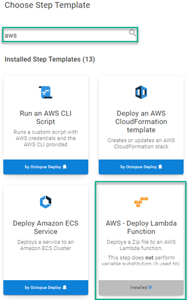
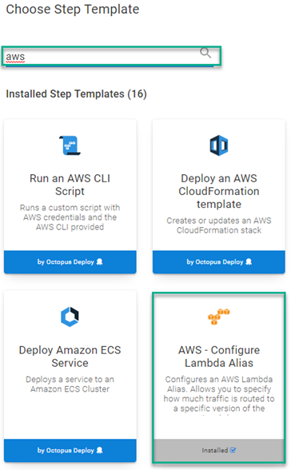

[Manual intervention](https://octopus.com/docs/projects/built-in-step-templates/manual-intervention-and-approvals) and [guided failure](https://octopus.com/docs/releases/guided-failures) are powerful features of the Octopus Deploy product.  Both features pause a deployment or runbook and wait for a user to choose an option. The downside is that someone needs to be present to provide a response.  With Octopus Deploy written API-first, however, it's possible to automate these responses. 

This post demonstrates how to automate the response to a guided failure event using the [Subscriptions](https://octopus.com/docs/administration/managing-infrastructure/subscriptions) feature to call an AWS Lambda function.  

## Example use cases
With guided failure designed to pause an action and wait for guidance, automating the response seems counterintuitive.  Here are a couple of use cases where it makes sense to automate the response.

### Exclude machine from deployment
Consider if you're deploying to thousands of machines.  At this scale, it's not uncommon for deployment to fail for a small portion of machines (usually not Octopus-related).  Guided failure gives you the option to exclude a machine from the deployment, which allows the deployment to continue to the remaining targets.  Rather than babysitting the process, you can automate the `Exclude machine from deployment` response and deal with the failed machines later.

### Automatically retry
Our team experienced another scenario; when the [Samples](https://samples.octopus.app) instance was tearing down resources at night, and so many requests were being made to AWS at the same time that it experienced request rate throttling and failed.  In this case, retrying the runbook is all that's needed.  Implementing an automated `Retry` response to guided failure ensures all the resources are deprovisioned.

## Solution
This post shows you how to automate a response to a guided failure event by using the **Subscriptions** feature of Octopus to call an AWS Lambda function.  

To get started, you need to provision some AWS resources. 

The [OctoSubscriber](https://github.com/OctopusSamples/OctoSubscriber) repo contains the source code for the solution described in this post.

### Scaffolding AWS resources
The solution in this post makes use of the following AWS resources:

- [Simple Queue Service (SQS)](https://aws.amazon.com/sqs/)
- [API Gateway](https://aws.amazon.com/api-gateway/)
- [S3 Bucket](https://aws.amazon.com/s3/) 
- [IAM Role](https://console.aws.amazon.com/iamv2/home#/roles) with the following policies:
  - AmazonSQSFullAccess
  - AWSLambdaBasicExecutionRole
  - AWSLambda_FullAccess

It may be possible for the IAM Role to have lesser permissions but this is what the solution was tested with.

:::warning
Working with AWS resources may incur costs to you or your organization.
:::

Using a [runbook](https://samples.octopus.app/app#/Spaces-1/projects/aws-octosubscriber/operations/runbooks/Runbooks-1805/process/RunbookProcess-Runbooks-1805), you can provision the following resources using Terraform and the AWS CLI:

- S3 bucket
- SQS Queue
- API Gateway


#### Create S3 bucket if not exists
The Terraform, that creates the other AWS resources, needs a place to store State.  This step uses the AWS CLI to create the back-end storage location for the Terraform step:

```powershell
# Get variables
$bucketName = $OctopusParameters["Project.AWS.Backend.Bucket"]
$bucketRegion = $OctopusParameters["Project.AWS.Backend.Region"]

# Get bucket list
$awsS3BucketList = aws s3api list-buckets --query "Buckets[].Name" --output json

# Convert returned json into an object
$awsS3BucketList = ($awsS3BucketList | ConvertFrom-JSON)

# Check to see if bucket exists
if ($null -eq ($awsS3BucketList | Where-Object {$_ -eq $bucketName}))
{
	# Create the bucket
    Write-Highlight "Bucket $bucketName doesn't exist, creating ..."
    
    aws s3api create-bucket --bucket $bucketName --region $bucketRegion --create-bucket-configuration LocationConstraint=$bucketRegion
}
else
{
	Write-Highlight "Bucket $bucketName already exists, moving on ..."
}
```

#### Plan to apply a Terraform template
To help you start quickly, the [OctoSubscriber](https://github.com/OctopusSamples/OctoSubscriber) repo contains Terraform scripts to automate the creation of the SQS and API Gateway resources.  This step outputs what the Terraform will do as plan.

main.tf
```terraform
terraform {
  required_providers {
    aws = {
      source  = "hashicorp/aws"
      version = "~> 3.0"
    }
  }

  backend "s3" {
    bucket = "#{Project.AWS.Backend.Bucket}"
    key = "#{Project.AWS.Backend.Key}"
    region = "#{Project.AWS.Backend.Region}"
  }
}

provider "aws" {
    region  = var.region
}

resource "aws_sqs_queue" "subscriber_queue" {
  name                              = var.queue_name
  kms_master_key_id                 = "alias/aws/sqs"
  kms_data_key_reuse_period_seconds = 300
}

resource "aws_apigatewayv2_api" "subscriber_gateway" {
  name                              = var.api_gateway_name
  protocol_type                     = "HTTP"
}
```
variables.tf
```terraform
variable "region" {
    type = string
}

variable "queue_name" {
    type = string
}

variable "api_gateway_name" {
    type = string
}
```
terraform.tfvars

```terraform
region = "#{Project.AWS.Region}"
queue_name = "#{Project.AWS.Queue.Name}"
api_gateway_name = "#{Project.AWS.API.Gateway.Name}"
```
#### Applying a Terraform template
Using the Terraform above, create the resources on AWS.

After the resources are created, you can focus on the Lambdas.

### AWS Lambda functions
This solution consists of two different Lambda functions:

- `accept-message`: This function places the included payload onto the SQS queue.
- `process-message`: This function processes the messages that appear on the SQS queue and submits the requested responses to the Octopus server.

#### accept-message
This function is written in NodeJS and accepts the following querystring parameters:

  - Type: The type of interruption that has occurred.
    - Guidance: Provide this value for **Guided failure**.
    - Result: Provide this value for **Manual Intervention**.
  - Action: This is the actual response to the interruption.  This value is dependent on Type:
    - Abort (Result)
    - Proceed (Result)
    - Fail (Guidance)
    - Exclude (Guidance)
    - Ignore (Guidance)
    - Retry (Guidance)
  - MaximumRetry (used with Retry Action): This specifies the maximum number of retries to perform before giving up.  The default value is 1, the **Guided failure** feature has a maximum of 10 retries so anything larger than 10 is ignored.

```javascript
var AWS = require('aws-sdk');

exports.handler = function(event, context) {
  let QUEUE_URL = process.env.sqsqueue;
  let sqs = new AWS.SQS({region : process.env.sqsregion});
  let maximumretry = "1";

  if (event.queryStringParameters.maximumretry) {
    maximumretry = event.queryStringParameters.maximumretry
  }
  
  var params = {
    MessageBody: event.body,
    QueueUrl: QUEUE_URL,
    MessageAttributes: {
      "Type": {
        DataType: "String",
        StringValue: event.queryStringParameters.type
      },
      "Action": {
        DataType: "String",
        StringValue: event.queryStringParameters.action
      },
      "MaximumRetry": {
        DataType: "String",
        StringValue: maximumretry
      }
    }
  };
  
  sqs.sendMessage(params, function(err,data){
    if(err) {
      console.log('error:',"Fail Send Message" + err);
      context.done('error', "ERROR Put SQS");  // ERROR with message
    }else{
      console.log('data:',data.MessageId);
      context.done(null,'');  // SUCCESS 
    }
  });
}
```
The querystring parameters are attached to the message as MessageAttributes.

#### process-message
This function reads messages off the SQS queue and uses the [Octopus.Client Nuget Package reference](https://octopus.com/docs/octopus-rest-api/octopus.client) to automate the response to the interruption.  The full solution can be found in the [OctoSubscriber](https://github.com/OctopusSamples/OctoSubscriber) repo.

```csharp
using System;
using System.Collections.Generic;
using System.Linq;
using System.Threading.Tasks;
using Amazon.Lambda.Core;
using Amazon.Lambda.SQSEvents;
using Newtonsoft.Json;
using Octopus.Client;

// Assembly attribute to enable the Lambda function's JSON input to be converted into a .NET class.
[assembly: LambdaSerializer(typeof(Amazon.Lambda.Serialization.SystemTextJson.DefaultLambdaJsonSerializer))]

namespace process_message
{
    public class Function
    {
        public Function()
        {

        }


        /// <summary>
        /// This method is called for every Lambda invocation. This method takes in an SQS event object and can be used 
        /// to respond to SQS messages.
        /// </summary>
        /// <param name="evnt"></param>
        /// <param name="context"></param>
        /// <returns></returns>
        public async Task FunctionHandler(SQSEvent evnt, ILambdaContext context)
        {
            foreach(var message in evnt.Records)
            {
                await ProcessMessageAsync(message, context);
            }
        }

        private async Task ProcessMessageAsync(SQSEvent.SQSMessage message, ILambdaContext context)
        {
            // Log
            LambdaLogger.Log("Begin message processing...");
            
            // Get environment variables
            string octopusServerUrl = Environment.GetEnvironmentVariable("OCTOPUS_SERVER_URL");
            string octopusApiKey = Environment.GetEnvironmentVariable("OCTOPUS_API_KEY");

            // Check to see if there are message attributes
            if (message.MessageAttributes.Count == 0)
            {
                // Fail
                throw new Exception("MessageAttributes collection is empty, was the queue called with querystring paramters?");
            }
            
            // Log
            LambdaLogger.Log(string.Format("Retrieved environment variables, Octopus Server Url: {0}...", octopusServerUrl));

            // Deserialize message JSON
            LambdaLogger.Log(string.Format("Parsing message..."));
            dynamic subscriptionEvent = JsonConvert.DeserializeObject(message.Body);
            LambdaLogger.Log("Successfully parsed message JSON...");

            // Create Octopus client object
            LambdaLogger.Log("Creating server endpoint object ...");
            var endpoint = new OctopusServerEndpoint(octopusServerUrl, octopusApiKey);
            LambdaLogger.Log("Creating repository object...");
            var repository = new OctopusRepository(endpoint);
            LambdaLogger.Log("Creating client object ...");
            var client = new OctopusClient(endpoint);

            // Create repository for space
            string spaceId = subscriptionEvent.Payload.Event.SpaceId;
            LambdaLogger.Log(string.Format("Creating repository object for space: {0}...", spaceId));
            var space = repository.Spaces.Get(spaceId);
            Octopus.Client.IOctopusSpaceRepository repositoryForSpace = client.ForSpace(space);

            // Retrieve interruption; first related document is the DeploymentId
            string documentId = subscriptionEvent.Payload.Event.RelatedDocumentIds[0];

            // Check to see if guided failure has already been invoked once, defaults to once if nothing provided
            int maximumRetry = 1;
            if (!string.IsNullOrWhiteSpace(message.MessageAttributes["MaximumRetry"].StringValue))
            {
                // Set to value
                maximumRetry = int.Parse(message.MessageAttributes["MaximumRetry"].StringValue);
            }

            var eventList = repositoryForSpace.Events.List(regarding: documentId);
         
            if (eventList.Items.Count(x => x.Category == "GuidedFailureInterruptionRaised") > maximumRetry && message.MessageAttributes["Action"].StringValue == "Retry")
            {
                LambdaLogger.Log(string.Format("{0} has raised Guided Failure more than {1} time(s), updating Action to Fail to break the infinite loop.", documentId, maximumRetry));
                message.MessageAttributes["Action"].StringValue = "Fail";
            }

            LambdaLogger.Log(string.Format("Processing event for document: {0}...", documentId));
            var interruptionCollection = repositoryForSpace.Interruptions.List(regardingDocumentId: documentId, pendingOnly: true).Items;

            if (interruptionCollection.Count > 0)
            {
                foreach (var interruption in interruptionCollection)
                {
                    // Check to see if responsibility needs to be taken
                    if (interruption.IsPending)
                    {
                        // Take responsibility
                        LambdaLogger.Log(string.Format("Taking responsibility for interruption: {0}...", interruption.Id));
                        repositoryForSpace.Interruptions.TakeResponsibility(interruption);

                        // The message attributes contain the type [Manual Intervention | GuidedFailure] and the desired Action to take for it
                        interruption.Form.Values[message.MessageAttributes["Type"].StringValue] = message.MessageAttributes["Action"].StringValue;

                        // Update Octopus
                        LambdaLogger.Log(string.Format("Submitting {0}:{1} for: {2}...", message.MessageAttributes["Type"].StringValue, message.MessageAttributes["Action"].StringValue, interruption.Id));
                        repositoryForSpace.Interruptions.Submit(interruption);
                    }
                }
            }
            await Task.CompletedTask;
        }
    }
}
```

## Building and packaging the Lambdas
Only the `process-message` Lambda needs to be built, however, they both need to be packaged for deployment.  The OctoSubscriber project uses GitHub Actions for these operations.

```yaml
# This is a basic workflow to help you get started with Actions

name: AWS Lambda

on:
  push:
    paths:
      - 'aws/accept-message/**'

  # Allows you to run this workflow manually from the Actions tab
  workflow_dispatch:

jobs:
  build:
    runs-on: ubuntu-latest
    strategy:
      matrix:
        dotnet-version: ['3.1.x']

    steps:
      - uses: actions/checkout@v2
      - name: Setup .NET Core SDK ${{ matrix.dotnet-version }}
        uses: actions/setup-dotnet@v1.7.2
        with:
          dotnet-version: ${{ matrix.dotnet-version }}

      - name: Create artifacts folder
        run: |
          mkdir "$GITHUB_WORKSPACE/artifacts"
          mkdir "$GITHUB_WORKSPACE/artifacts/process-message"
      - name: Restore dependencies for process-message
        working-directory: aws/process-message/process-message
        run: dotnet restore

      - name: Build process-message
        working-directory: aws/process-message/process-message
        run: dotnet build --configuration Release --no-restore --output "$GITHUB_WORKSPACE/artifacts/process-message"
              
      - name: Install Octopus CLI
        uses: OctopusDeploy/install-octopus-cli-action@v1.1.1
        with:
          version: latest
          
      - name: Pack and Push
        env:
          OCTOPUS_URL: ${{ secrets.OCTOPUS_SERVER }}
          OCTOPUS_API_KEY: ${{ secrets.OCTOPUS_API_KEY }}  
        run: |
          octo pack --id=OctoSubscriber-AcceptMessage-Lambda --format=Zip --version=2021.1.1.$GITHUB_RUN_NUMBER --basePath="aws/accept-message/"
          octo pack --id=OctoSubscriber-ProcessMessage-Lambda --format=Zip --version=2021.1.1.$GITHUB_RUN_NUMBER --basePath="$GITHUB_WORKSPACE/artifacts/process-message"
          octo push --package=OctoSubscriber-AcceptMessage-Lambda.2021.1.1.$GITHUB_RUN_NUMBER.zip --server=$OCTOPUS_URL --apiKey=$OCTOPUS_API_KEY --space="Target - Serverless"
          octo push --package=OctoSubscriber-ProcessMessage-Lambda.2021.1.1.$GITHUB_RUN_NUMBER.zip --server=$OCTOPUS_URL --apiKey=$OCTOPUS_API_KEY --space="Target - Serverless"
```

In this case, the GitHub action is pushing the Lambda packages directly to the built-in Octopus Deploy package repository.

## Deploying the Lambdas
This post assumes you're familiar with how to create an Octopus Deploy project and will not cover this topic.

The deployment process for the Lambdas will consist of the following steps:

- **AWS - Deploy Accept Message Lamdba Function**
- **AWS - Deploy Process Message Lamdbda Function**
- **AWS - Configure Accept Message Lambda Alias**
- **AWS - Configure Process Message Lambda Alias**
- **AWS - Configure Lambda API Gateway Integration**


### AWS - Deploy Accept Message Lambda Function
Add an **AWS - Deploy Lambda Function** step to your deployment process.  Click **ADD STEP**, then search by `aws`.



Fill in the step form fields:

- **Function Name**: Name of the function to deploy
- **AWS Account**: AWS Account variable to use for deployment
- **Region**: The region to deploy the Lambda to
- **Package**: The package containing the Lambda
- **Function Role**: ARN of the role you created for the Lambdas
- **Runtime**: The runtime of the code, `nodejs14.x` for Accept Message
- **Handler**: The name of the method that Lambda calls to execute your function (*note: This will differ based on the runtime selected*) - for **Accept Message**, it's `index.handler`
- **Memory size**: The amount of memory your function has access to, must be a multiple of 64MB, `128` for **Accept Message**
- **Environment Variables**: sqsqueue=[Name of queue],sqsregion=[Region of sqs queue]


### AWS - Deploy Process Message Lambda Function
This uses the same step template as above, so I'll only list the fields that are different:

- **Function Name**: Name of the function to deploy
- **Package**: The package containing the Lambda
- **Runtime**: `dotnetcore 3.1`
- **Handler**: `process_message::process_message.Function::FunctionHandler`
- **Environment Variables**: OCTOPUS_SERVER_URL=[Octopus server URL],OCTOPUS_API_KEY=[API Key]
- **Timeout**: `30` (default timeout is 3 seconds which isn't enough time for the Lambda to process completely)

### AWS - Configure Access Message Lambda Alias
AWS supports having multiple versions of a Lambda deployed at the same time.  AWS also supports a canary-style process where you can assign a percentage of traffic to different versions of a Lambda.  This is done by configuring an alias to a version and telling Lambda how much traffic to route to it.  

Add an **AWS Configure Lambda Alias** step to your process.



Fill in the step form fields:

- **Function Name**: The deploy step above will output the ARN for the deployed function, use the output variable here - #{Octopus.Action[AWS - Deploy Accept Message Lambda Function].Output.LambdaArn}
- **AWS Account**: AWS Account variable to use for deployment
- **Region**: The region the Lambda is in
- **Alias Name**: Name of the Alias to use, this post uses `Live`
- **Alias Version Percent**: Percentage of traffic this version receives, this post is using 100
- **Function Version**: The version of the function for the alias, use the output variable from the deploy step - `#{Octopus.Action[AWS - Deploy Accept Message Lambda Function].Output.PublishedVersion}`

### AWS - Configure Process Message Lambda Alias
This step is exactly like the previous step, but configured for the Process Message Lambda.  

Replace **AWS - Deploy Accept Message Lambda Function** with **AWS - Deploy Process Message Lambda Function** in the output variables, using `#{Octopus.Action[AWS - Deploy Process Message Lambda Function].Output.LambdaArn}`.

### AWS - Configure Lambda API Gateway Integration
This step configures an API v2 Gateway to connect to and invoke a Lambda Function.  

Add an **AWS - Configure Lambda API Gateway Integration** step to your process:


Fill in the step form fields:

- **API Gateway Name**: Name of the gateway to configure/create
- **AWS Account**: AWS Account variable to use for deployment
- **AWS Region**: The region the Lambda is in
- **Route Key**: Route to use/create, this post uses `/octopus/webhook`
- **HTTP Method**: The HTTP method of the route and integration you're creating
- **Lambda ARN**: ARN of the Lambda, this post uses the output variable from the create step `#{Octopus.Action[AWS - Deploy Accept Message Lambda Function].Output.LambdaArn}`
- **Lambda Alias:** Name of the alias, `Live` in this case
- **Payload Format Version**: The payload format the API Gateway sends to the Lambda

### Deployment
You may receive warnings in your deployment the first time you deploy if either the Lambdas, Aliases, or API Gateways did not previously exist.  This is normal.


## Configuring remaining resources
Most of what needs to be done has been done automatically through the provisioning process using Terraform and the deployment process using the AWS step templates.  However, there are two remaining steps before the solution is ready to be called:

- Create API Gateway stage
- Connect Process Message Lambda to SQS queue

### Creating API Gateway stage
Creating the stage will create the URL endpoint for the Accept Message Lambda to be called.  In AWS, navigate to the **Networking & Content Delivery** section, then select **API Gateways**.


Click on the **API Gateway** that you want to configure.  After it has loaded, click **Create stage**.


Give the stage a **Name**, toggle on the **Enable automatic deployment** option, then click **Create**.


After the stage has been created, it will display the **Invoke URL** which is needed to configure the Octopus Deploy Subscription webhook.


### Connect Process Message Lambda to SQS queue
Now you need to configure the Process Message Lambda to be triggered from an SQS queue.  

Navigate to **Lambda** in the AWS Console located under the **Compute** section.


Select the **Process Message Lambda**, then click **Configuration**, then **Triggers**, then click **Add Trigger**. 


Select **SQS** from the dropdown.  Clicking into the **SQS queue** box will bring up a list of queues. You can select from this list or enter the ARN of the queue.  After that has been completed, click **Add**.


## Configuring the Octopus Deploy subscription
You're now ready to configure Octopus Deploy to call your Lambda when a guided failure event occurs.  

Navigate to the **Configuration** tab of Octopus Deploy, click **Subscriptions**, then **ADD SUBSCRIPTION**.


Enter the following for the Subscription:

- **Name**: Give the subscription a name
- **Event Categories**: Guided failure interruption raised
- **Payload URL**: `[API Gateway Invoke URL]/octopus/webhook?type=Guidance&action=Fail`

When done, it will look something like this:


## Testing the solution
To test this solution we need to do two things:

- Enable guided failure
- Configure the deployment to fail

### Enabling guided failure
Guided failure can be enabled for either the deployment process or runbooks.  

To enable for a deployment process, select **Settings** then choose **Use guided failure mode**.


### Configuring deployment to fail
An easy way to do this is to create a deployment process with a **Run a Script** step.  Enter the following for the script:

```powershell
Fail-Step "Fail on purpose"
```

### Running the deployment
The deployment will enter guided failure immediately and wait for guidance.


After a few seconds Octopus Deploy will process the subscription event and will fail the deployment.


In the AWS Console, you can view the CloudWatch logs to see that the Lambda processed the message, then submitted to the Octopus Server.


## Conclusion
This posts walks you through using an Octopus Deploy **Subscription** to call an AWS Lambda to automatically respond to a guided failure incident.  Although the demonstration targeted guided failure, the same Lambda can be used to automate responses to **Manual intervention** as well.

:::hint
An alternative approach to the Lambda method is to use the [Automate Manual Intervention Response](https://library.octopus.com/step-templates/54f95528-aa1e-4c97-8c16-b2e0d737c43e/actiontemplate-automate-manual-intervention-response) community step template in a runbook that has a trigger to run periodically.
:::

Happy deployments!
