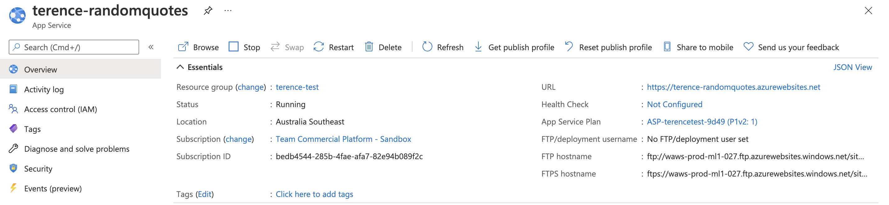
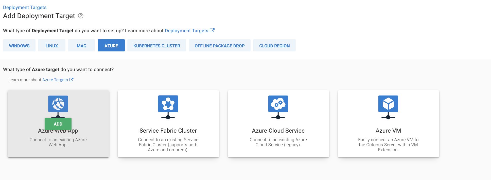
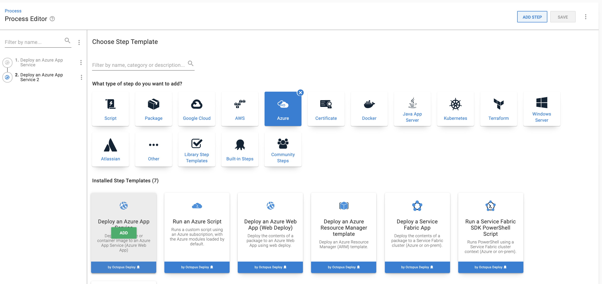
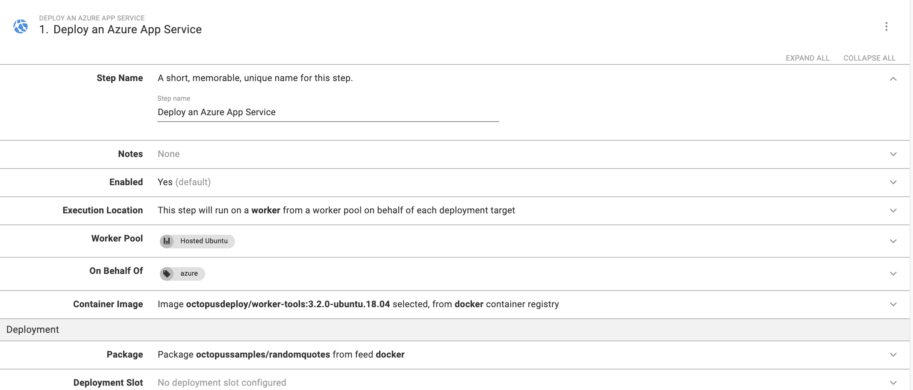
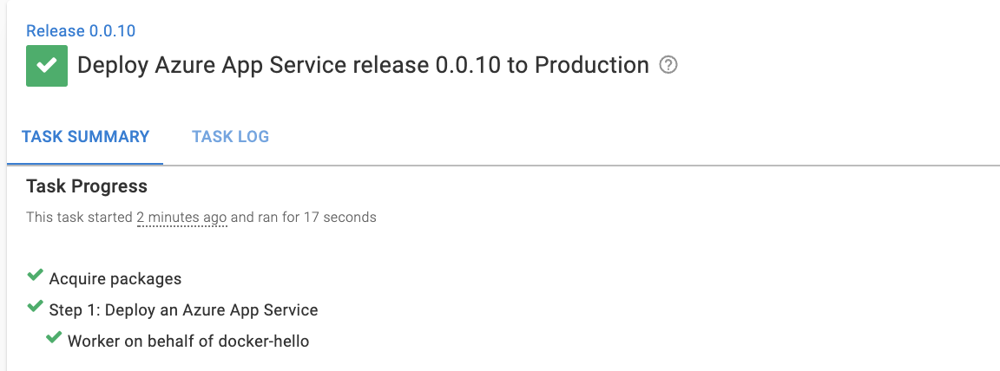
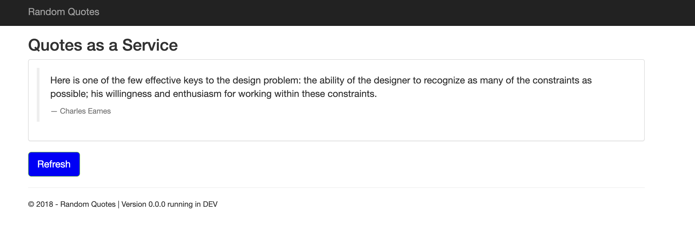

Octopus Deploy provides process steps to deploy to Microsoft Azure. A new step, **Deploy an Azure App Service**, is available to deploy containers to an Azure App service.

To do this, you'll need:

- An Octopus Deploy instance with a project and environment
- An Azure account
- To link the [Azure account to the Octopus Deploy instance](https://octopus.com/docs/infrastructure/accounts/azure#azure-service-principal)

## Setting up Azure Web App

To set up the Azure Web App that you'll deploy:

1. Navigate to your Resource Group, then click **Create**, then **Web App**. 
1. Give the web app a name and check 'Docker Container' for the **Publish** setting. 
1. Select the appropriate location and create the web app. 
1. You'll see an option to go to the Resource. The URL will be the address of the hosted Web App.

## Configuring Octopus Deploy

In your Octopus Deploy instance, navigate to **Infrastructure**, then **Deployment Targets**, then **Add Deployment Target**. Select the **Azure** tab, then **Azure Web App**. 

Populate the following fields:

- **Environments** - The environment you wish to deploy to
- **Target Roles** - The role that will identify the deployment target, you may need to create one if it doesn't exist
- **Account** - The linked Azure account in Octopus Deploy
- **Azure Web App** - The Web App that you created earlier

Go to **Library**, then **External Feed**, then **Add Feed**. 

Populate the following fields:

- **Feed Type** - `Docker Container Registry`
- **Name** - Give the feed a name

This step activates the public Docker registry feed that you'll use later. Click **Save**.

Add the **Deploy an Azure App Service** step to your project process.

Populate the fields with the following values:

- **Worker Pool** - Runs on a Worker from a specific Worker Pool: `Hosted Ubuntu`
- **On Behalf Of** - The role you created in the deployment target step (mine is `azure`)
- **Container Image** - Runs inside a container on a Worker: Container Registry: Docker Image: `octopusdeploy/worker-tools:3.2.0-ubuntu.18.04`
- **Package** - Deploy from a container image Package feed: docker Package ID: `octopussamples/randomquotes`

In this example, we deploy a sample Docker image hosted on Docker Hub. The image below shows the result of my configuration. Click Save.

Click **Create Release** then click through to the **Deploy** button to deploy the Web App to Azure.

## Viewing your Web App

Navigate to the URL of your Web App - [your-url].azurewebsites.net

## Conclusion

In this post, you set up an Octopus Deploy project to deploy a Web App using the new **Deploy an Azure App Service** step.

Happy deployments!