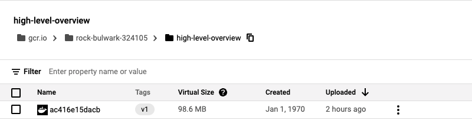
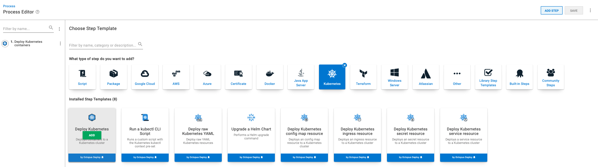
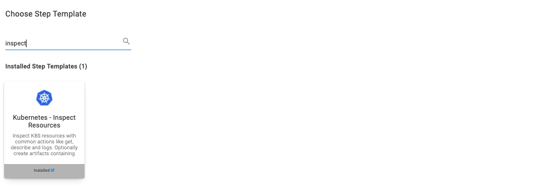
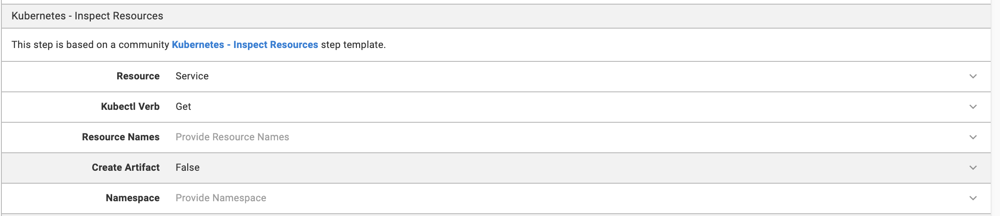

The Continuous Integration (CI) process usually involves building and pushing an image to a container registry. A Continuous Delivery (CD) tool takes over deploys to an endpoint, like a web application. In our [CI series](https://octopus.com/blog/tag/CI%20Series), we explore various ways to achieve this. 

To demonstrate one of these processes, I built a Maven Java project and hosted the image on the Google Container Registry (GCR). 

You can access the GCR through Octopus, and deploy the Java application to Azure Kubernetes Service (AKS). 

## Prerequisites

To follow along with this post, you need:

- A [Google Cloud Platform](https://cloud.google.com/free) (GCP) account
- A [Microsoft Azure](https://azure.microsoft.com/en-us/free/) account
- An [Octopus Deploy](https://octopus.com/start) instance - to link the [Azure Account to the Octopus Deploy instance](https://octopus.com/docs/infrastructure/accounts/azure#azure-service-principal)
- Access to a terminal, locally or in the cloud, with gcloud and the Azure command-line interface installed

## The Octopus Deploy underwater app

The Octopus Deploy underwater app is a landing page for users creating their first deployment. It includes links to posts that help you continue your journey with Octopus Deploy.

You can find the web application repository on [GitHub](https://github.com/OctopusSamples/octopus-underwater-app). 

The repository is split into separate branches for different use cases. For this post, use the underwater-app-java branch.

## Building and pushing to a registry

You use the command-line to build the Java project and use gcloud to push the image to the GCR.

First, configure the gcloud tool to point to your PROJECT_ID:

    gcloud config set project <PROJECT_ID>

Clone the Java project repository that you'll use to build and deploy to Azure:

    git clone https://github.com/terence-octo/octopus-underwater-app
    cd octopus-underwater-app
    git checkout underwater-app-java

Test the application locally by using the `run` command and visiting `http://localhost:8080/`

    chmod +x mvnw
    ./mvnw spring-boot:run
    
When you run the package step, it builds the target JAR deployable for the app:

    ./mvnw package
    
Next, enable the container registry to store the container image:

    gcloud services enable containerregistry.googleapis.com
    export GOOGLE_CLOUD_PROJECT=`gcloud config list --format="value(core.project)"`
    
Run this command to create the config.json with the correct settings:

    gcloud auth configure-docker
    
The jib tool creates and pushes the image to the container registry:

    ./mvnw com.google.cloud.tools:jib-maven-plugin:build -Dimage=gcr.io/$GOOGLE_CLOUD_PROJECT/octopus-underwater-app:latest
    
Confirm the image is present on GCR by going to the [registry home page](https://cloud.google.com/container-registry).



## Retrieving credentials from Azure for Octopus Deploy

You need to retrieve some credentials to pass to Octopus Deploy. 

Follow the steps in our docs to [add an Azure Service Principle to Octopus Deploy](https://octopus.com/docs/infrastructure/accounts/azure).

## Creating an Azure Kubernetes cluster

Next, switch to Microsoft Azure to host your Kubernetes cluster. Octopus Deploy is cloud-agnostic, so it can work with deployments that span multiple cloud providers. 

1. Create a new Kubernetes cluster by going to your resource group and creating a Kubernetes service. 
1. Give the cluster a name and accept all default options.


## Octopus steps

### Add deployment target

1. Go to **Infrastructure**, then **Deployment Targets**, then **Add Deployment Target**, then **Kubernetes Cluster**.
1. Fill out the fields using the Azure Service Principle set up earlier. 
1. Assign a unique role for the deployment. 

### Add external feeds

For Octopus to access the image stored in GCR, you need to enable the [google feed](https://octopus.com/docs/packaging-applications/package-repositories/guides/google-container-registry).

### Set up deployment steps

In your project, add the **Deploy Kubernetes containers** step.



### YAML file

Click the **Edit YAML** box and paste the YAML file below into the box. The YAML file populates the various settings in the Octopus UI. You have to replace the PROJECT_ID with your google PROJECT_ID. Using the Google external feed credentials set up earlier, you can also use the UI to select the container image manually.

```
apiVersion: apps/v1
kind: Deployment
metadata:
  name: java-web-underwater
  labels:
    app: java-web-app
spec:
  selector:
    matchLabels:
      app: java-web-app
  replicas: 1
  strategy:
    type: RollingUpdate
  template:
    metadata:
      labels:
        app: java-web-app
    spec:
      containers:
        - name: java-web-app
          image: gcr.io/<PROJECT_ID>/octopus-underwater-app
          ports:
            - containerPort: 80
```

### Service

Paste the following YAML into the **Service** section of the step. This will create an Azure Service through the Octopus client.

```

apiVersion: v1
kind: Service
metadata:
  name: underwater-service
spec:
  type: LoadBalancer
  ports:
    - name: web
      port: 80
      targetPort: 8080
      protocol: TCP
  selector:
    app: java-web-app

```


### Deploy to Azure

1. Click **SAVE**.
1. Click **Create Release** and click through the steps to deploy the application to Azure.

### Runbooks as a Kubernetes monitoring tool 

You can set up monitoring of your Kubernetes resources through runbooks.

Go to your project dashboard then **Runbooks**, then **Add Runbook**, then **Define your Runbook Process**, then **Add Step**, then **Kubernetes - Inspect Resource**.



Assign the role you set for your deployment target. You can replicate the `kubectl get service` command by setting the **Resource** and **Kubectl Verb**. 



Click **Save**, then **Run**.

The runbooks can now be shared across teams. This means monitoring can be done at an organization level rather than individually on local machines. 

Go to the task log to see the `underwater-service` you just created. Find the IP address under **External IP**. Enter this address into a browser address bar and you'll see the Octopus underwater app. 


## Conclusion

In this post, you built the Octopus Deploy underwater app and pushed the image to GCR. You used Octopus Deploy to reference this image and deployed the image to AKS.

!include <q1-2022-newsletter-cta>

Happy deployments!