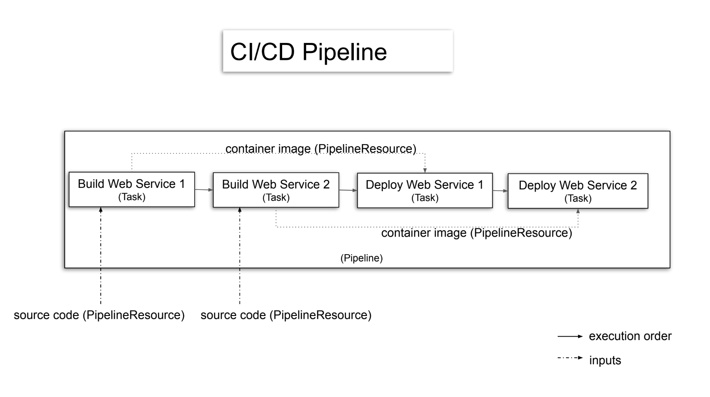
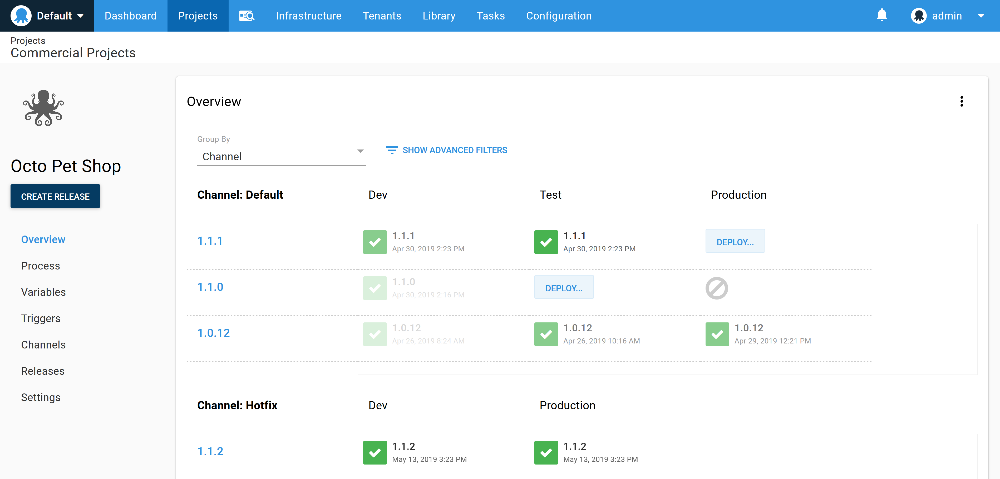

The terms *Continuous Integration* and *Continuous Deployment* tend to be combined into the acronym CI/CD, often without distinction between the two. CI and CD are distinct processes, even if combining the terms suggests that Continuous Deployment is an extension of Continuous Integration, and the execution of both processes is the responsibility of a single tool.

Assuming CI/CD is *just CI with a deployment step* ignores some fundamental differences between the two processes. In this post, we look at:

- The reasons why CI and CD are distinct processes
- The features provided by good CD tools
- Why you may consider using separate tools for your CI/CD workflow

## What is Continuous Integration?  

At a high level, CI is all about: 

- Taking the code written by developers and compiling it into an artifact
- Running automated tests
- Capturing the log files so any failed builds or tests can be resolved 

A CI server facilitates this process by running builds and tests with each commit.

The CI process can be described as the equation:

`code + dependencies + build tools + execution environment = test results + logs + compiled artifact`

The left side of the equation takes the code written by developers, any dependencies of the code, a build tool, and the environment where the build and tests are executed. When these inputs are available, a CI server completes the build to produce the elements on the right side of the equation.

When a CI server has been configured correctly, each commit to a repository results in the build being run, thus solving the equation without manual intervention from a human.

This means the CI process is machine-driven, so much so that it's common for CI servers to have read-only user interfaces, like the Jenkins Blue Ocean UI.

The other important aspect of the CI equation is that developers provide the inputs, and the outputs are created for developers or people in other technical roles. Employees outside the IT department rarely interact with the CI server.

## What is Continuous Deployment?

Taken literally, CD takes the compiled artifacts from a successful build performed by the CI server and deploys them into the production environment. In this scenario, CD is quite rightly an extension of CI, and the distinction between the two becomes arbitrary.

Such commit-to-consumer pipelines are common in simple projects. More complex projects can also have a completely automated development pipeline, if the appropriate tests and monitoring systems are in place.

But while fully automated deployments have many benefits, it's not uncommon for deployments to involve human decision-making. There are many valid reasons for not automatically deploying every commit to the main branch into production, including:

- Coordinating deployments with legacy systems
- Acquiring sign-off from product owners
- Usability testing that is impossible to automate
- Regulatory requirements
- Dog-fooding your own product
- Integrating deployments with back-end changes like databases
- Not having 100% confidence in your tests

Where CI is machine-driven for many teams, CD is human-driven. Much of the grunt work of performing a deployment is still automated, but the decision to promote a release through to production is a human one. Importantly, the decision may not be made by technical employees, but rather product owners, managers, or someone who stayed up until midnight to click the deploy button.

## Why use separate CI and CD tools?

*A typical CI/CD pipeline, with no distinction between the two.*

This slide is from a talk titled [How to build cloud-native CI/CD pipelines with Tekton on Kubernetes](https://developers.redhat.com/blog/2019/07/22/how-to-build-cloud-native-ci-cd-pipelines-with-tekton-on-kubernetes/?sc_cid=701f2000000RtqCAAS]). It's a classic example of how simple projects merge CI and CD into a single process where a production deployment starts as soon as the code has been compiled.

There's nothing wrong with this process, and it works as intended if every part of the pipeline remains fully automated. But what happens if a human needs to test and approve the application before it's released?

For this decision to be made, the deployment process must be interrupted. For example, we'd first deploy the application to a test environment, allow the appropriate parties to verify the changes, and when everyone is happy, the release is promoted to production.

This single decision point means our once machine-driven equation now:

* Requires a UI to expose the releases that have been made to the testing environments
* Introduces auditing and security concerns so we can limit and then review who promoted which releases to which environments
* Requires a UI to allow deployments to be promoted to the next environment
* Requires a system that can model environments in a first-class manner so they can be reliably secured and managed through the UI, API, and reporting interfaces

*Octopus dashboard with deploy buttons for humans.*

This focus on the human element is frequently lost when CI/CD is presented as nothing more than a deployment step, automatically performed after the code has been compiled. For instance, the [Jenkins documentation](https://jenkins.io/doc/pipeline/tour/deployment/#stages-as-deployment-environments) recommends that the test and production environments are modeled as stages in a CI pipeline.

At first glance, this example appears to provide a point in the process for a human to approve the deployment, but what happens to a build that was never intended to be pushed to production?  Such a build would be canceled before the application is exposed to customers, resulting in a failed build. These failed builds are difficult to distinguish from builds that failed to compile or failed their tests, even though not promoting to production is the expected behavior of the CD process in this instance.

In short, a good CD tool, like Octopus Deploy, facilitates the human decision-making process that is so common (if not essential) to deployments, or at the very least surfaces the current state of the deployments between environments, and automates the deployment, so promotions between environments are easy and reliable.

## Conclusion

Recognizing the different requirements between a machine-driven CI process and a human-driven CD process is essential for delivering features to your customers in a fast, reliable, and repeatable manner. This is why using dedicated tools for Continuous Integration and Continuous Deployment can make sense.

If you're looking for a CD tool, you can sign up for a [free trial of Octopus Deploy](https://octopus.com/start).

!include <q1-2022-newsletter-cta>

Happy deployments!
