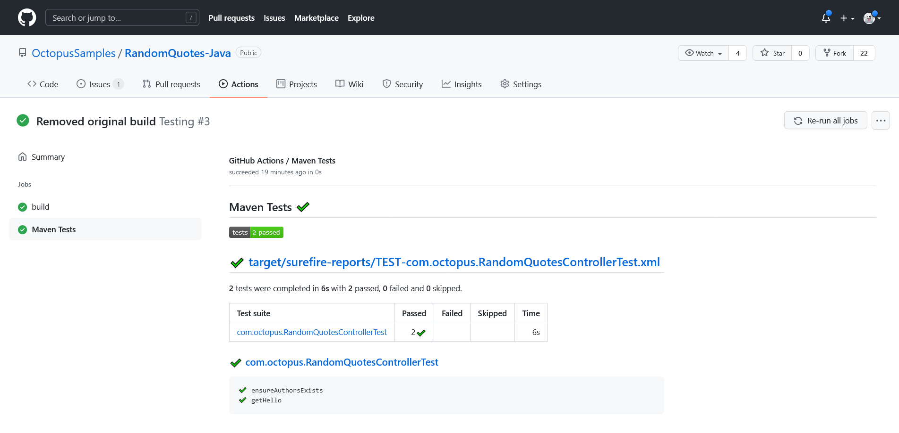

Verifying code changes with unit tests is a critical process in typical development workflows. GitHub Actions provides a number of plugins to collect and process the results of tests allowing developers to browse the results, debug failed tests, and generate reports.

In this post you'll learn how to add unit tests to a GitHub Actions workflow and configure plugins to process the results.

## Prerequisites

GitHub Actions are a hosted service, so the only prerequisite is a GitHub account. All other dependencies like Software Development Kits (SDKs) are installed during the execution of the GitHub Actions workflow.

## Selecting an action

GitHub Actions relies heavily on third party actions contributed by the community. A quick Google search shows at least half a dozen actions for processing unit test results.

To narrow down the selection, you need to consider the following functionality:

* Does the action support your testing framework? For example, some actions only process JUnit test results, while others include other formats like TRX.
* Does the action allow you to fail the workflow based on the presence of failed tests?
* Does the action annotate the source code with details of test results?
* Does the action generate a useful report?

After some trail and error, I settled on the [test-reporter](https://github.com/marketplace/actions/test-reporter) action, which is demonstrated in this post.

## Unit testing in Java

The workflow file shown below runs tests with Maven and processes the results with the test-reporter action:

```yaml
name: Java

on:
  push:
  workflow_dispatch:

jobs:
  build:

    runs-on: ubuntu-latest

    steps:
      - name: Checkout
        uses: actions/checkout@v1

      - name: Set up JDK 1.11
        uses: actions/setup-java@v2
        with:
          java-version: '11'
          distribution: 'adopt'

      - name: Build
        run: mvn --batch-mode -DskipTests package

      - name: Test
        run: mvn --batch-mode -Dmaven.test.failure.ignore=true test

      - name: Report
        uses: dorny/test-reporter@v1
        if: ${{ always() }}
        with:
          name: Maven Tests
          path: target/surefire-reports/*.xml
          reporter: java-junit
          fail-on-error: true
```

The `Build`, `Test`, and `Report` steps are important for the testing process.

You start by building the application, but skipping the tests.

```yaml
      - name: Build
        run: mvn --batch-mode -DskipTests package
```

Next you run the tests, allowing the command to pass even if there are failing tests. This allows you to defer the response to failed tests to the test processing action:

```yaml
      - name: Test
        run: mvn --batch-mode -Dmaven.test.failure.ignore=true test
```

In the final step you generate a report from the JUnit XML file. 

The `if` property is set to always run this step, allowing you to generate the report even if the `Test` step above was set to fail in the event of a failed tests.

The `fail-on-error` property is set to `true` to fail this workflow if there were failed tests. This is an example of deferring the response to failed tests to the test processing action:

```yaml
      - name: Report
        uses: dorny/test-reporter@v1
        if: ${{ always() }}
        with:
          name: Maven Tests
          path: target/surefire-reports/*.xml
          reporter: java-junit
          fail-on-error: true
```

The test results are displayed as a link under the original workflow results:



## Unit testing in DotNET

```yaml
name: .NET Core

on:
  push:
  workflow_dispatch:

jobs:
  build:

    runs-on: ubuntu-latest

    steps:
    - name: Checkout  
      uses: actions/checkout@v1
      
    - name: Setup .NET Core
      uses: actions/setup-dotnet@v1
      with:
        dotnet-version: 3.1.402
        
    - name: Build
      run: dotnet build --configuration Release
      
    - name: Test
      run: dotnet test --logger "trx;LogFileName=test-results.trx" || true
      
    - name: Test Report
      uses: dorny/test-reporter@v1
      if: always()
      with:
        name: DotNET Tests
        path: "**/test-results.trx"                            
        reporter: dotnet-trx
        fail-on-error: true
```