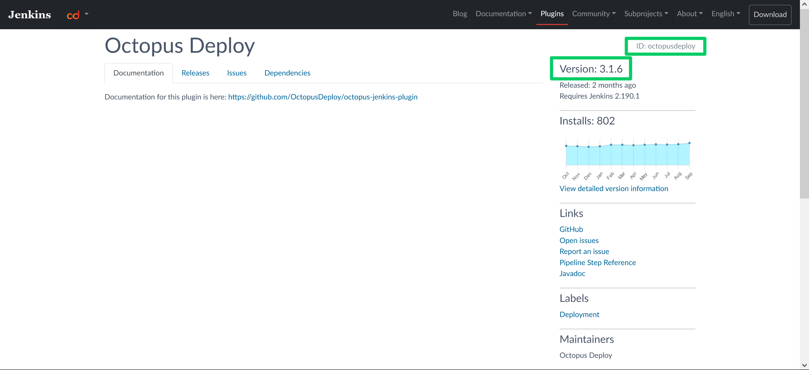

Docker has emerged victorious in the battle for universal application packages. Every major operating system supports Docker images, every cloud provider supports deploying Docker images, and every major platform offers an official Docker image. Jenkins is no exception, providing the image [jenkins/jenkins](https://hub.docker.com/r/jenkins/jenkins).

In this post you'll learn how to run Jenkins from a Docker image, configure it, customize it, and use the image as a replacement for the traditional package based installation.

## Prerequisites

To run a Docker image, you must have Docker installed. [Docker provides details instructions](https://docs.docker.com/get-docker/) for installation on Linux, macOS, and Windows.

Note that while recent versions of Windows have gained [native support for running Docker images](https://www.docker.com/products/windows-containers), Jenkins only provides Linux based Docker images. Windows and macOS can run Linux Docker images through virtualization, so most of the commands shown here apply equally to all operating systems, but this post will focus on Linux.

## Getting started with the Jenkins Docker image

Once you have Docker installed, Jenkins can be run with the command:

```bash
docker run -p 8080:8080 -p 50000:50000 -v jenkins_home:/var/jenkins_home jenkins/jenkins:lts-jdk11
```

Let's break this command down to understand what it is doing.

`docker run` is used to run a Docker image as a container.

You can think of an image as a read only artifact containing the files necessary to run a particular application. Unlike most application artifacts, a Docker image contains a complete operating system and all associated system tools required to support the core application being run. In the case of Jenkins, this means the Docker image contains a the files required to support a minimal Linux operating system, along with the version of Java required to run Jenkins.

A container is an isolated environment within the OS where the Docker image is executed. Although Docker doesn't typically provide the same kind of isolation guarantees that virtual machines do, containers do provide a way to easily run trusted code side by side.

The `-p` arguments map a local port to a port exposed by the Docker container. The first argument is the local port, followed by a colon, and then the container port. So the argument `-p 8080:8080` maps local port 8080 to the container port 8080 (which is the [web port](https://www.jenkins.io/doc/book/security/services/#web-ui)), and `-p 50000:50000` maps local port 50000 to the container port 50000 (which is the [agent port](https://www.jenkins.io/doc/book/security/services/#tcp-agent-listener-port)). This means we can open http://localhost:8080 on our local machine, and Docker directs the traffic into the webserver hosted by the container.

The argument `-v jenkins_home:/var/jenkins_home` create a volume called `jenkins_home` if it does not already exists and mounts it under the path `/var/jenkins_home` inside the container. 

While Docker images are read only, Docker containers expose a read/write filesystem that allows any running application to persist changes. The changes are local to the container though, and if the container is destroyed, the changes are lost. Or, if you want to use a different container, like you must in order to upgrade to a newer version of Jenkins, the changes to your old container are also lost.

Docker volumes allow containers to persist data outside of the container's lifecycle and share data with different containers. You can think of volumes as being like network drives you would typically see mounted into your session when logging into an enterprise network. By saving mutable data to a volume, you are able to destroy and recreate your Jenkins container or create a new container based on a newer Docker image while retaining any changes you have made to the Jenkins configuration. 

The final argument `jenkins/jenkins:lts-jdk11` is the name of the Docker image. [This particular image can be found on Dockerhub](https://hub.docker.com/r/jenkins/jenkins), which is one of many Docker registries available to host Docker images. 

The first segment of the image name, `jenkins`, is the [name of the Docker repository](https://hub.docker.com/u/jenkins). The second segment of the image name, also `jenkins`, is the [name of the image](https://hub.docker.com/r/jenkins/jenkins). The third segment, `lts-jdk11`, is the [tag (or version) of the image](https://hub.docker.com/r/jenkins/jenkins/tags). A registry can contain multiple repositories, and a repository can have many tags.

Note that the image associated with a Docker tag can change over time. Many registries use a "floating" tag to represent the latest version of image. In the case of the Jenkins image, the image with the tag `lts-jdk11` is updated with each LTS release. To ensure your local machine has the latest image, you must manually run `docker pull jenkins/jenkins:lts-jdk11`. Be aware though that any existing containers will continue to use the old image, and you must create a new container to reference any updated images. More specific tags, like `2.303.2-lts-jdk11`, are generally not overwritten, and so there is no reason to run `docker pull` on these images.

To view the container this command created, run:

```bash
docker container ls
```

You will see the basic details of the container, along with a (often humorous) name like `nostalgic_tharp`:

```
CONTAINER ID   IMAGE                       COMMAND                  CREATED              STATUS              PORTS                                                                                      NAMES
801f4e834173   jenkins/jenkins:lts-jdk11   "/sbin/tini -- /usr/…"   About a minute ago   Up About a minute   0.0.0.0:8080->8080/tcp, :::8080->8080/tcp, 0.0.0.0:50000->50000/tcp, :::50000->50000/tcp   nostalgic_tharp
```

The first time you boot Jenkins, the Docker logs will contain a message like this:

```bash
Jenkins initial setup is required. An admin user has been created and a password generated.
Please use the following password to proceed to installation:

1883c809f01b4ed585fb5c3e0156543a

This may also be found at: /var/jenkins_home/secrets/initialAdminPassword
```

That random string of numbers and letters is the initial administrator password, which is required to complete the Jenkins configuration.

Open [http://localhost:8080](http://localhost:8080) when you see the following message in the logs:

```bash
Jenkins is fully up and running
```

You are now given the opportunity to complete the initial configuration of the Jenkins instance. Take a look at the [previous post](blog/2022-01/jenkins-install-guide/index.md) for more details on completing this initial configuration.

## Adding additional software

Because Jenkins is written in Java, the default server created by running the Jenkins Docker image has most of the software required to compile and test Java applications.

To build applications written in other languages, you connect external Jenkins agents with the required software and run jobs on those. Using agents is a scalable solution, and one that you should consider if using Jenkins in a production environment.

For local testing though a more convenient solution is to build a custom Docker image with the required tools baked in. To do this, you need to create a file called `Dockerfile` with contents similar to the following:

```dockerfile
FROM jenkins/jenkins:lts-jdk11
USER root
RUN apt update && \
    apt install -y --no-install-recommends gnupg curl ca-certificates apt-transport-https && \
    curl -sSfL https://apt.octopus.com/public.key | apt-key add - && \
    sh -c "echo deb https://apt.octopus.com/ stable main > /etc/apt/sources.list.d/octopus.com.list" && \
    apt update && apt install -y octopuscli
USER jenkins
```

`Dockerfile` files are used to build new Docker images. You can find a complete reference of the commands available in a `Dockerfile` from the [Docker documentation](https://docs.docker.com/engine/reference/builder/). The example above uses a small subset of the commands, but demonstrate a typical custom image based on the image provided by Jenkins.

The file starts with the `FROM` command, which instructs Docker to build the new image from the supplied image. This means your new image will have Jenkins and any supporting tooling already installed and configured:

```dockerfile
FROM jenkins/jenkins:lts-jdk11
```

In order to install new software, you must switch to the `root` user. Just as with a regular Linux OS, only privileged users can install new software from a package manager:

```dockerfile
USER root
```

The next command performs the software installation. This example installs the Octopus CLI using the instructions from the [Octopus website](https://octopus.com/downloads/octopuscli#linux):

```dockerfile
RUN apt update && \
    apt install -y --no-install-recommends gnupg curl ca-certificates apt-transport-https && \
    curl -sSfL https://apt.octopus.com/public.key | apt-key add - && \
    sh -c "echo deb https://apt.octopus.com/ stable main > /etc/apt/sources.list.d/octopus.com.list" && \
    apt update && apt install -y octopuscli
```

It is considered best practice to have a regular user account run the application in the Docker container. The `jenkins` user was created in the base image, and so you switch back to that user as that final command:

```dockerfile
USER jenkins
```

To build a new Docker image with the `Dockerfile`, run:

```bash
docker build . -t myjenkins
```

This command builds a new image called `myjenkins`. To run the new image, first stop any existing container using the `jenkins_home` volume:

```bash
docker container stop nostalgic_tharp
```

And run your new image mounting the existing `jenkins_home` volume to retain all your existing Jenkins configuration:

```bash
docker run -p 8080:8080 -p 50000:50000 -v jenkins_home:/var/jenkins_home myjenkins
```

## Installing additional Jenkins plugins

The easiest way to install new plugins is to use the Jenkins web UI. Any new plugins are saved to the external volume, and so will be available even as you create, destroy, and update containers.

You can also automate the process of installing plugins by calling the `jenkins-plugin-cli` script included in the base Jenkins image as part of your custom Docker image. Here is an example `Dockerfile` that installs the [Octopus Jenkins plugin](https://plugins.jenkins.io/octopusdeploy/):

```dockerfile
FROM jenkins/jenkins:lts-jdk11
USER root
RUN apt update && \
    apt install -y --no-install-recommends gnupg curl ca-certificates apt-transport-https && \
    curl -sSfL https://apt.octopus.com/public.key | apt-key add - && \
    sh -c "echo deb https://apt.octopus.com/ stable main > /etc/apt/sources.list.d/octopus.com.list" && \
    apt update && apt install -y octopuscli
RUN jenkins-plugin-cli --plugins octopusdeploy:3.1.6
USER jenkins
```

This `Dockerfile` is similar to the previous example, but includes a new `RUN` statement to install the Octopus plugin:

```dockerfile
RUN jenkins-plugin-cli --plugins octopusdeploy:3.1.6
```

The plugin ID (`octopusdeploy`) and version (`3.1.6`) are found from the [Jenkins plugin website](https://plugins.jenkins.io/octopusdeploy/):



## Passing Java arguments

Advanced Jenkins configuration is often performed by passing Java arguments, typically in the form of system properties.

The Jenkins Docker image allows Java arguments to be defined in the `JAVA_OPTS` environment variable. This environment variable is read by the [Docker image script that launches Jenkins](https://github.com/jenkinsci/docker/blob/master/jenkins.sh) and passed as Java arguments.

To define the `JAVA_OPTS` environment variable, pass the `--env` argument to the `docker run` command:

```bash
docker run -p 8080:8080 -p 50000:50000 --env JAVA_OPTS=-Dhudson.footerURL=http://mycompany.com jenkins/jenkins:lts-jdk11
```

A list of Jenkins system properties can be found in the [Jenkins documentation](https://www.jenkins.io/doc/book/managing/system-properties/).

## Passing Jenkins arguments

In addition to system properties, Jenkins also accepts a number of application arguments.

Application arguments are defined by appending them to the end of the Docker run command. The example below passes the `--httpPort` argument configuring Jenkins to list on port 8081:

```bash
docker run -p 8080:8081 -p 50000:50000 jenkins/jenkins:lts-jdk11 --httpPort=8081
```

Application arguments may also be defined in the `JENKINS_OPTS` environment variable:

```bash
docker run -p 8080:8081 -p 50000:50000 --env JENKINS_OPTS=--httpPort=8081 jenkins/jenkins:lts-jdk11 
```

A list of application arguments can be found in the [Winstone GitHub repository](https://github.com/jenkinsci/winstone#command-line-options). Winstone is the default embedded servlet container in Jenkins.

