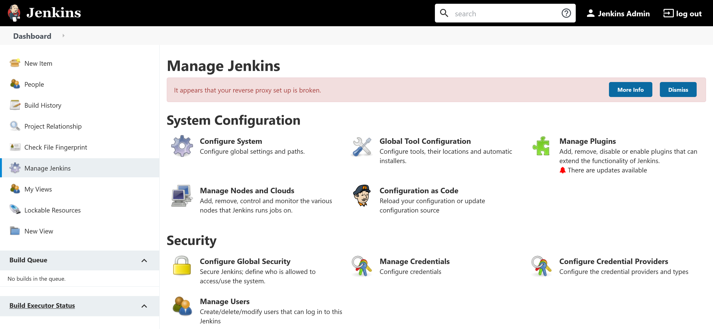
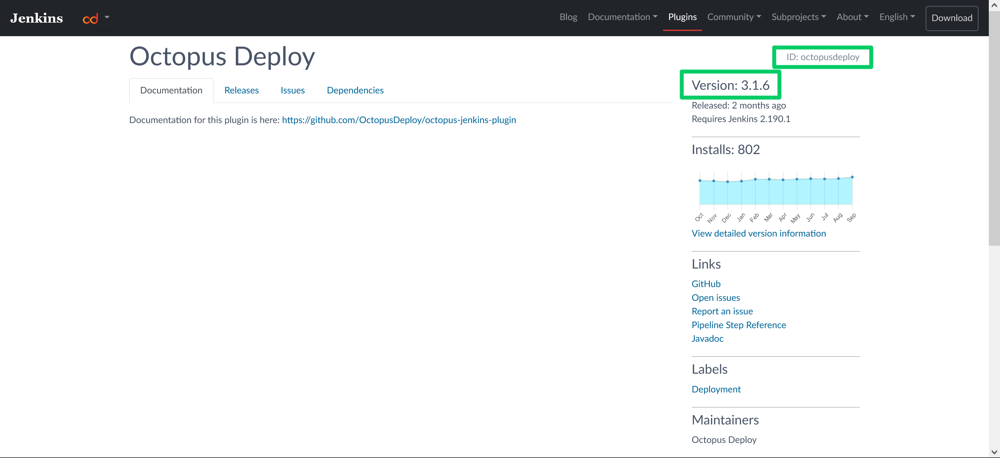
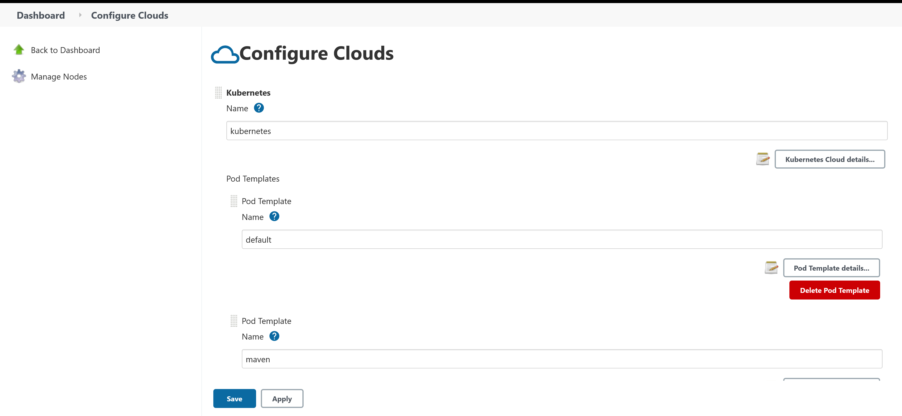

Kubernetes has grown in popularity to become one of the most widely used platforms to host Docker containers. Kubernetes offers advanced orchestration features, networking capabilities, integrated security, user management, high availability, volume management, a wide ecosystem of supporting tools, and much more.

One of those supporting tools is [Helm](https://helm.sh/), which provides package management functionality for Kubernetes. Applications deployed by Helm are defined in charts, and Jenkins [provides a Helm chart](https://github.com/jenkinsci/helm-charts/blob/main/charts/jenkins/README.md) to deploy a Jenkins instance to Kubernetes.

In this post you'll learn how to install a Jenkins instance with Helm and connect agents to perform build tasks.

## Prerequisites

To follow along with this post you need a Kubernetes cluster and the Helm client.

All the major cloud providers offer hosted Kubernetes clusters: AWS has [EKS](https://aws.amazon.com/eks/), Azure has [AKS](https://azure.microsoft.com/en-au/services/kubernetes-service/), and Google Cloud has [GKE](https://cloud.google.com/kubernetes-engine).

If you wish to run a development Kubernetes cluster on your local PC, kind provides the ability to easily create and destroy clusters for testing. The post [Creating test Kubernetes clusters with Kind](/blog/2020-09/testing-with-kind/index.md) provides instructions on creating a test Kubernetes cluster.

You must also have the helm client installed. The [helm documentation](https://helm.sh/docs/intro/install/) provides installation instructions.

## Adding the Jenkins chart repository

Jenkins helm charts are provided at [https://charts.jenkins.io](https://charts.jenkins.io). To make this chart repository available, run the following commands:

```bash
helm repo add jenkins https://charts.jenkins.io
helm repo update
```

## Deploying a simple Jenkins instance

To deploy a Jenkins instance with the default settings, run the command:

```bash
helm upgrade --install myjenkins jenkins/jenkins
```

The `helm upgrade` command is typically used to upgrade an existing release. However, the `--install` argument ensures the release is created is it does not exist. This means `helm upgrade --install` can create *and* update a release, removing the need to juggle installation and upgrade commands depending on whether or not the release exists.

The name of the release is `myjenkins`, and the final argument of `jenkins/jenkins` defines the chart to be installed.

The output looks something like this:

```bash
$ helm upgrade --install myjenkins jenkins/jenkins

Release "myjenkins" does not exist. Installing it now.
NAME: myjenkins
LAST DEPLOYED: Tue Oct 19 08:13:11 2021
NAMESPACE: default
STATUS: deployed
REVISION: 1
NOTES:
1. Get your 'admin' user password by running:
  kubectl exec --namespace default -it svc/myjenkins -c jenkins -- /bin/cat /run/secrets/chart-admin-password && echo
2. Get the Jenkins URL to visit by running these commands in the same shell:
  echo http://127.0.0.1:8080
  kubectl --namespace default port-forward svc/myjenkins 8080:8080

3. Login with the password from step 1 and the username: admin
4. Configure security realm and authorization strategy
5. Use Jenkins Configuration as Code by specifying configScripts in your values.yaml file, see documentation: http:///configuration-as-code and examples: https://github.com/jenkinsci/configuration-as-code-plugin/tree/master/demos

For more information on running Jenkins on Kubernetes, visit:
https://cloud.google.com/solutions/jenkins-on-container-engine

For more information about Jenkins Configuration as Code, visit:
https://jenkins.io/projects/jcasc/


NOTE: Consider using a custom image with pre-installed plugins
```

Steps 1 and 2 provide the information required to retrieve the initial `admin` password and tunnel traffic to the service exposing the Jenkins pod.

The first command returns the password for the `admin` user:

``` bash
$
P kubectl exec --namespace default -it svc/myjenkins -c jenkins -- /bin/cat /run/secrets/chart-admin-password && echolrLsazcErQvbPIjtxAROj
```

The second command creates a tunnel to the service in the Kubernetes cluster:

```bash
$ kubectl --namespace default port-forward svc/myjenkins 8080:8080
Forwarding from 127.0.0.1:8080 -> 8080
Forwarding from [::1]:8080 -> 8080
```

Once the tunnel is established, open [http://localhost:8080](http://localhost:8080) on your local PC, and you will be directed to the Jenkins instance in the Kubernetes cluster. Login with the username `admin` and the password returned from the first command.

You now have a functional, if basic, Jenkins instance running in Kubernetes.

## Exposing Jenkins through a public IP address

Accessing Jenkins through a tunnel is useful for debugging, but not a great experience for a production server. To access Jenkins through a publicly available IP address, you must override some of the default configuration defined in the chart. There are hundreds of values that can be defined, and the complete list is available by running the command:

```bash
helm show values jenkins/jenkins
```

The easiest way to access Jenkins publicly is to configure the service that exposes the Jenkins pod as a `LoadBalancer`.

In Kubernetes, a service is a resource that configures the cluster's network to expose one or more pods. The default service type is `ClusterIP`, which only exposes pods via a private IP address. It is this private IP address that we tunnelled into previously in order to access the Jenkins web UI.

A Kubernetes pod is a resource that hosts one or more containers. This means the Jenkins instance is running as a container inside a pod.

A service of type `LoadBalancer` exposes pods via a public IP address. Exactly how that public IP address is created is left to the cluster. For example, hosted Kubernetes platforms like EKS, AKS, and GKE will create a network load balancer to direct traffic into the Kubernetes cluster.

Note that `LoadBalancer` services require additional configuration when using a local test Kubernetes cluster, such as those clusters created by kind. Refer to the [kind documentation](https://kind.sigs.k8s.io/docs/user/loadbalancer/) for more information.

To configure the service as a `LoadBalancer`, you create a file called `values.yaml` with the following contents:

```yaml
controller:
  serviceType: LoadBalancer
```

Then you upgrade the helm release using the values defined in `values.yaml` with the command:

```bash
helm upgrade --install -f values.yaml myjenkins jenkins/jenkins
```

The output is changed subtly to include new instructions to get the service's public IP:

```bash
$ helm upgrade --install -f values.yaml myjenkins jenkins/jenkins
Release "myjenkins" has been upgraded. Happy Helming!
NAME: myjenkins
LAST DEPLOYED: Tue Oct 19 08:45:23 2021
NAMESPACE: default
STATUS: deployed
REVISION: 4
NOTES:
1. Get your 'admin' user password by running:
  kubectl exec --namespace default -it svc/myjenkins -c jenkins -- /bin/cat /run/secrets/chart-admin-password && echo
2. Get the Jenkins URL to visit by running these commands in the same shell:
  NOTE: It may take a few minutes for the LoadBalancer IP to be available.
        You can watch the status of by running 'kubectl get svc --namespace default -w myjenkins'
  export SERVICE_IP=$(kubectl get svc --namespace default myjenkins --template "{{ range (index .status.loadBalancer.ingress 0) }}{{ . }}{{ end }}")
  echo http://$SERVICE_IP:8080/login

3. Login with the password from step 1 and the username: admin
4. Configure security realm and authorization strategy
5. Use Jenkins Configuration as Code by specifying configScripts in your values.yaml file, see documentation: http:///configuration-as-code and examples: https://github.com/jenkinsci/configuration-as-code-plugin/tree/master/demos

For more information on running Jenkins on Kubernetes, visit:
https://cloud.google.com/solutions/jenkins-on-container-engine

For more information about Jenkins Configuration as Code, visit:
https://jenkins.io/projects/jcasc/


NOTE: Consider using a custom image with pre-installed plugins
```

Using the new instructions in step 2, run the following command to get the service's public IP address or hostname:

```bash
kubectl get svc --namespace default myjenkins --template "{{ range (index .status.loadBalancer.ingress 0) }}{{ . }}{{ end }}"
```

I have deployed Jenkins to an EKS cluster, and this is the result of the command for my infrastructure:

```bash
$ kubectl get svc --namespace default myjenkins --template "{{ range (index .status.loadBalancer.ingress 0) }}{{ . }}{{ end }}"
a84aa6226d6e5496882cfafdd6564a35-901117307.us-west-1.elb.amazonaws.com
```

To access Jenkins, open [http://service_ip_or_hostname:8080](http://service_ip_or_hostname:8080).

You may notice that Jenkins reports the following error when you access it via it's public IP address:

```
It appears that your reverse proxy set up is broken.
```



This can be resolved by defining the public URL in the `controller.jenkinsUrl` property:

```yaml
controller:
  jenkinsUrl: http://a84aa6226d6e5496882cfafdd6564a35-901117307.us-west-1.elb.amazonaws.com:8080/
```

## Installing additional plugins

List any additional plugins to be installed in the `controller.additionalPlugins` array:

```yaml
controller:
    additionalPlugins:
    - octopusdeploy:3.1.6
```

The plugin ID and version are found on the [Jenkins plugin website](https://plugins.jenkins.io/octopusdeploy/):



This approach is convenient, but does have the downside of requiring the Jenkins instance to contact the Jenkins update site to retrieve them. A more robust approach is to download the plugins as part of a custom image, which ensures the plugins are baked into the Docker image. It also has the advantage of allowing additional tools to be installed on the Jenkins controller. The [previous post](blog/2022-01/jenkins-docker-install-guide/index.md) has details on building and publishing custom Docker images.

Note that the custom Docker image must have the following plugins installed in addition to any custom plugins. These plugins are required for the helm chart to function properly:

* kubernetes:1.29.2
* workflow-aggregator:2.6
* git:4.7.1
* configuration-as-code:1.52

So an example `Dockerfile` may look like this:

```dockerfile
FROM jenkins/jenkins:lts-jdk11
USER root
RUN apt update && \
    apt install -y --no-install-recommends gnupg curl ca-certificates apt-transport-https && \
    curl -sSfL https://apt.octopus.com/public.key | apt-key add - && \
    sh -c "echo deb https://apt.octopus.com/ stable main > /etc/apt/sources.list.d/octopus.com.list" && \
    apt update && apt install -y octopuscli
RUN jenkins-plugin-cli --plugins octopusdeploy:3.1.6 kubernetes:1.29.2 workflow-aggregator:2.6 git:4.7.1 configuration-as-code:1.52
USER jenkins
```

To use the custom image you define it in the `values.yml` with the following properties. This example uses the custom Jenkins image [pushed to my DockerHub account](https://hub.docker.com/r/mcasperson/myjenkins):

```yaml
controller:
  image: "docker.io/mcasperson/myjenkins"
  tag: "latest"
  installPlugins: false
```

## Backup Jenkins volume

Volumes in Kubernetes are a little more complicated than regular Docker as Kubernetes volumes tend to be hosted outside of the node that runs the pod. This is because pods can be relocated between nodes, and so are required to be able to access volumes from any node.

To complicate matters, unlike Docker volumes, only specialized volumes can be shared between pods. These shared volumes are referred to as `ReadWriteMany` volumes. Typically though, a Kubernetes volume is used only by a single pod, and are known as `ReadWriteOnce` volumes.

The Jenkins helm chart configures a `ReadWriteOnce` volume to host the Jenkins home directory. Because this volume can only be accessed by the single pod it is mounted by, all backup operations must be performed by that pod.

Fortunately, the helm chart offers [comprehensive backup options](https://github.com/jenkinsci/helm-charts/blob/main/charts/jenkins/README.md#backup) with the ability to perform backup and save them to cloud storage providers.

However, you can orchestrate simple, cloud agnostic backups with two commands.

The first command executes the `tar` command inside the pod to backup the `/var/jenkins_home` directory to the `/tmp/backup.tar.gz` archive. Note that the pod name `myjenkins-0` is derived from the name of the helm release called `myjenkins`:

```bash
kubectl exec -c jenkins myjenkins-0 -- tar czf /tmp/backup.tar.gz /var/jenkins_home
```

The second command copies the backup archive from the pod to your local machine:

```bash
kubectl cp -c jenkins myjenkins-0:/tmp/backup.tar.gz ./backup.tar.gz
```

At this point `backup.tar.gz` can be copied to a more permanent location.

## Adding Jenkins agents

In addition to installing Jenkins on a Kubernetes cluster, you are also able to dynamically create Jenkins agents within the cluster. These agents are created when new tasks are created in Jenkins and are automatically cleaned up once the tasks are completed.

The default settings for agents are defined under the `agent` property in the `values.yaml` file. The example below defines an agent with the Jenkins label `default`, created in pods prefixed with the name `default`, and with CPU and memory limits:

```yaml
agent:
  podName: default
  customJenkinsLabels: default
  resources:
    limits:
      cpu: "1"
      memory: "2048Mi"
```

More specialized agents are defined under the `additionalAgents` property. The example below defines a second pod template changing the pod name and Jenkins labels to `maven` and specifying a new Docker image `jenkins/jnlp-agent-maven:latest`:

```yaml
agent:
  podName: default
  customJenkinsLabels: default
  resources:
    limits:
      cpu: "1"
      memory: "2048Mi"
additionalAgents:
  maven:
    podName: maven
    customJenkinsLabels: maven
    image: jenkins/jnlp-agent-maven
    tag: latest
```

These agent definitions are then available from {{Manage Jenkins,Manage Nodes and Clouds,Configure Clouds}}:



To use the agents when executing a pipeline, define the `agent` block like this:

```groovy
pipeline {
  agent {
      kubernetes {
          inheritFrom 'maven'
      }
  }
  // ...
}
```

For example, this is a example pipeline for a Java application that uses the `maven` agent template:

```groovy
pipeline {
  // This pipeline requires the following plugins:
  // * Pipeline Utility Steps Plugin: https://wiki.jenkins.io/display/JENKINS/Pipeline+Utility+Steps+Plugin
  // * Git: https://plugins.jenkins.io/git/
  // * Workflow Aggregator: https://plugins.jenkins.io/workflow-aggregator/
  // * Octopus Deploy: https://plugins.jenkins.io/octopusdeploy/
  // * JUnit: https://plugins.jenkins.io/junit/
  // * Maven Integration: https://plugins.jenkins.io/maven-plugin/
  parameters {
    string(defaultValue: 'Spaces-1', description: '', name: 'SpaceId', trim: true)
    string(defaultValue: 'SampleMavenProject-SpringBoot', description: '', name: 'ProjectName', trim: true)
    string(defaultValue: 'Dev', description: '', name: 'EnvironmentName', trim: true)
    string(defaultValue: 'Octopus', description: '', name: 'ServerId', trim: true)
  }
  tools {
    jdk 'Java'
  }
  agent {
      kubernetes {
          inheritFrom 'maven'
      }
  }
  stages {
    stage('Environment') {
      steps {
          echo "PATH = ${PATH}"
      }
    }
    stage('Checkout') {
      steps {
        // If this pipeline is saved as a Jenkinsfile in a git repo, the checkout stage can be deleted as
        // Jenkins will check out the code for you.
        script {
            /*
              This is from the Jenkins "Global Variable Reference" documentation:
              SCM-specific variables such as GIT_COMMIT are not automatically defined as environment variables; rather you can use the return value of the checkout step.
            */
            def checkoutVars = checkout([$class: 'GitSCM', branches: [[name: '*/master']], userRemoteConfigs: [[url: 'https://github.com/mcasperson/SampleMavenProject-SpringBoot.git']]])
            env.GIT_URL = checkoutVars.GIT_URL
            env.GIT_COMMIT = checkoutVars.GIT_COMMIT
            env.GIT_BRANCH = checkoutVars.GIT_BRANCH
        }
      }
    }
    stage('Dependencies') {
      steps {
        // Download the dependencies and plugins before we attempt to do any further actions
        sh(script: './mvnw --batch-mode dependency:resolve-plugins dependency:go-offline')
        // Save the dependencies that went into this build into an artifact. This allows you to review any builds for vulnerabilities later on.
        sh(script: './mvnw --batch-mode dependency:tree > dependencies.txt')
        archiveArtifacts(artifacts: 'dependencies.txt', fingerprint: true)
        // List any dependency updates.
        sh(script: './mvnw --batch-mode versions:display-dependency-updates > dependencieupdates.txt')
        archiveArtifacts(artifacts: 'dependencieupdates.txt', fingerprint: true)
      }
    }
    stage('Build') {
      steps {
        // Set the build number on the generated artifact.
        sh '''
          ./mvnw --batch-mode build-helper:parse-version versions:set \
          -DnewVersion=\\${parsedVersion.majorVersion}.\\${parsedVersion.minorVersion}.\\${parsedVersion.incrementalVersion}.${BUILD_NUMBER}
        '''
        sh(script: './mvnw --batch-mode clean compile', returnStdout: true)
        script {
            env.VERSION_SEMVER = sh (script: './mvnw -q -Dexec.executable=echo -Dexec.args=\'${project.version}\' --non-recursive exec:exec', returnStdout: true)
            env.VERSION_SEMVER = env.VERSION_SEMVER.trim()
        }
      }
    }
    stage('Test') {
      steps {
        sh(script: './mvnw --batch-mode -Dmaven.test.failure.ignore=true test')
        junit(testResults: 'target/surefire-reports/*.xml', allowEmptyResults : true)
      }
    }
    stage('Package') {
      steps {
        sh(script: './mvnw --batch-mode package -DskipTests')
      }
    }
    stage('Repackage') {
      steps {
        // This scans through the build tool output directory and find the largest file, which we assume is the artifact that was intended to be deployed.
        // The path to this file is saved in and environment variable called JAVA_ARTIFACT, which can be consumed by subsequent custom deployment steps.
        script {
            // Find the matching artifacts
            def extensions = ['jar', 'war']
            def files = []
            for(extension in extensions){
                findFiles(glob: 'target/**.' + extension).each{files << it}
            }
            echo 'Found ' + files.size() + ' potential artifacts'
            // Assume the largest file is the artifact we intend to deploy
            def largestFile = null
            for (i = 0; i < files.size(); ++i) {
            	if (largestFile == null || files[i].length > largestFile.length) { 
            		largestFile = files[i]
            	}
            }
            if (largestFile != null) {
            	env.ORIGINAL_ARTIFACT = largestFile.path
            	// Create a filename based on the repository name, the new version, and the original file extension. 
            	env.ARTIFACTS = "SampleMavenProject-SpringBoot." + env.VERSION_SEMVER + largestFile.path.substring(largestFile.path.lastIndexOf("."), largestFile.path.length())
            	echo 'Found artifact at ' + largestFile.path
            	echo 'This path is available from the ARTIFACTS environment variable.'
            }
        }
        // Octopus requires files to have a specific naming format. So copy the original artifact into a file with the correct name.
        sh(script: 'cp ${ORIGINAL_ARTIFACT} ${ARTIFACTS}')
      }
    }
    stage('Deployment') {
      steps {
        octopusPushPackage(additionalArgs: '', packagePaths: env.ARTIFACTS.split(":").join("\n"), overwriteMode: 'OverwriteExisting', serverId: params.ServerId, spaceId: params.SpaceId, toolId: 'Default')
        octopusPushBuildInformation(additionalArgs: '', commentParser: 'GitHub', overwriteMode: 'OverwriteExisting', packageId: env.ARTIFACTS.split(":")[0].substring(env.ARTIFACTS.split(":")[0].lastIndexOf("/") + 1, env.ARTIFACTS.split(":")[0].length()).replace("." + env.VERSION_SEMVER + ".zip", ""), packageVersion: env.VERSION_SEMVER, serverId: params.ServerId, spaceId: params.SpaceId, toolId: 'Default', verboseLogging: false, gitUrl: env.GIT_URL, gitCommit: env.GIT_COMMIT, gitBranch: env.GIT_BRANCH)
        octopusCreateRelease(additionalArgs: '', cancelOnTimeout: false, channel: '', defaultPackageVersion: '', deployThisRelease: false, deploymentTimeout: '', environment: params.EnvironmentName, jenkinsUrlLinkback: false, project: params.ProjectName, releaseNotes: false, releaseNotesFile: '', releaseVersion: env.VERSION_SEMVER, serverId: params.ServerId, spaceId: params.SpaceId, tenant: '', tenantTag: '', toolId: 'Default', verboseLogging: false, waitForDeployment: false)
        octopusDeployRelease(cancelOnTimeout: false, deploymentTimeout: '', environment: params.EnvironmentName, project: params.ProjectName, releaseVersion: env.VERSION_SEMVER, serverId: params.ServerId, spaceId: params.SpaceId, tenant: '', tenantTag: '', toolId: 'Default', variables: '', verboseLogging: false, waitForDeployment: true)
      }
    }
  }
}
```

You can confirm that the agent is created in the cluster during the task execution by running:

```bash
kubectl get pods
```

In the example below, the pod `java-9-k0hmj-vcvdz-wknh4` is in the process of being created to execute the example pipeline above:

```bash
$ kubectl get pods
NAME                                     READY   STATUS              RESTARTS   AGE
java-9-k0hmj-vcvdz-wknh4                 0/1     ContainerCreating   0          1s
myjenkins-0                              2/2     Running             0          49m
```

## Conclusion

Hosting Jenkins and its agents in a Kubernetes cluster provides allows you to create a scalable and responsive build platform that creates and destroys agents on the fly to handle elastic workloads. And thanks to the Jenkins helm chart, installing Jenkins and configuring the nodes requires only a few lines of YAML.

In this post you learn how to:
* Deploy Jenkins to Kubernetes.
* Expose Jenkins on a public IP address.
* Install additional plugins as part of the installation process.
* Backup the Jenkins home directory.
* Create Kubernetes agents that are created and destroyed as needed.