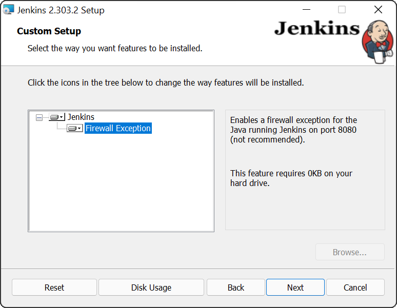
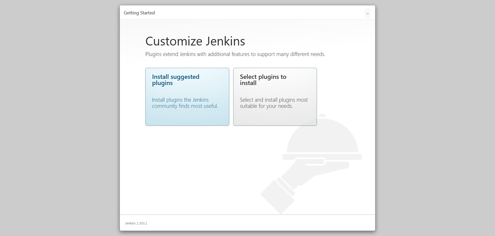

The traditional Jenkins installation method is to use the installers made available on the [Jenkins website](https://www.jenkins.io/download/), or through your local operating system's package manager.The installation process is generally simple, but there are a few tricks to be aware of. 

In this post, we run through the installation of Jenkins on Windows and Linux, and gain insights into customizing the installation.

## Choosing between Jenkins LTS and weekly releases

Jenkins offers two release channels: 

- Long Term Support (LTS)
- Weekly releases

LTS releases tend to be more stable and predictable, with fewer features in each minor release, but includes any important bug and security fixes.

The weekly releases include all the latest features, but have less "bake time" in the community to find bugs.

If you prefer stability and don't require all the latest features right away, go with an LTS release. If you want the latest features as soon as possible and don't mind encountering the occasional glitch, go with the weekly releases.

## How to install Jenkins on Windows

Jenkins provides an MSI download, allowing it to be installed as a Windows service through the traditional Windows wizard-style installation process. But before you start the installation there are a number of prerequisites you must satisfy.

### Installing OpenJDK

Jenkins requires Java to run, and the OpenJDK project provides a free, open source distribution that you can use to run Jenkins.

There are many OpenJDK distributions to choose from, including: 

- [OpenJDK](https://openjdk.java.net)
- [AdoptOpenJDK](https://adoptopenjdk.net)
- [Azul Zulu](https://www.azul.com/downloads/)
- [Red Hat OpenJDK](https://developers.redhat.com/products/openjdk/download) 

I typically use the Azul Zulu distribution but any distribution will do.

Download and install JDK 11 from your chosen OpenJDK distribution, and make a note of the directory it was installed to, as you'll need that path during the Jenkins installation.

### Adding a Jenkins Windows service account

Jenkins runs as a Windows service, and requires a Windows account to run the service under. The installer provides the option to use the existing [LocalService](https://docs.microsoft.com/en-us/windows/win32/services/localservice-account) account, but notes that this option is not recommended. The recommended solution is to create a new account specifically for running Jenkins.

To perform this task from the command line you must first install the [Carbon PowerShell module](http://get-carbon.org/). Carbon provides many useful CMDLets for managing Windows, and you'll use one of these to grant the new Jenkins user the rights to log on as a service.

Run the following PowerShell command to install Carbon from the PowerShell Gallery:

```powershell
Install-Module -Name 'Carbon' -AllowClobber
```

By default, PowerShell will prevent you from running code from an external source. To remove this warning, run the following command:

```powershell
Set-ExecutionPolicy -ExecutionPolicy RemoteSigned -Scope CurrentUser
```

You then import Carbon:

```powershell
Import-Module 'Carbon'
```

The next step is to create a user called `jenkins` to run the Jenkins Windows service:

```powershell
net user jenkins Password01! /ADD
```

Finally, you must grant the `jenkins` user permission to log on as a service:

```powershell
Grant-CPrivilege -Identity "jenkins" -Privilege SeServiceLogonRight
```

### Installing Jenkins

Download the MSI from the [Jenkins download page](https://www.jenkins.io/download/), double-click the MSI file to begin the Jenkins installation, and click the **Next** button:


The default installation directory is fine, so click the **Next** button:


You're now prompted to supply the details of the user that runs the Windows service. Enter the credentials for the user you created earlier and click the **Test Credentials** button. Once the test passes, click the **Next** button:


The default port of **8080** is fine. Click the **Test Port** button to ensure the port is available, and then click the **Next** button:


You are now prompted to enter the path to the Java distribution you installed earlier. The default path for the Zulu 11 distribution is `C:\Program Files\Zulu\zulu-11`. Enter the appropriate path for your chosen distribution, and click the **Next** button:


You will likely want to expose Jenkins through the Windows firewall to allow external clients to access it. Change the **Firewall Exception** feature to be installed, and click the **Next** button:



All the installation values are now configured, so click the **Install** button:


After the installation is complete, click the **Finish** button:


## A note on Chocolatey

Chocolatey is a Windows package manager, and it [provides an option to install Jenkins](https://community.chocolatey.org/packages/jenkins). However, at the time of writing, the latest version of Jenkins available on Chocolatey is 2.222.4, which is well over a year old. In fact, the version is so old that most of the recommended plugins presented during the initial Jenkins configuration failed to install!

Jenkins may be updated on Chocolatey by the time you read this post, but I warn against using Chocolatey to install Jenkins as it does have a history of being unmaintained.

## Windows service configuration

Windows services have a [unique entry point](https://docs.microsoft.com/en-au/windows/win32/api/winsvc/nc-winsvc-lpservice_main_functiona?redirectedfrom=MSDN) to respond to Service Control Manager (SCM) commands. Java applications, like Jenkins, do not expose this interface. This means that Java applications must be run inside a wrapper to be managed as a Windows service.

This wrapper is found at `C:\Program Files\Jenkins\jenkins.exe` by default, and is configured by the `C:\Program Files\Jenkins\jenkins.xml` file:


This XML file contains the `service/arguments` element, which defines the command line arguments passed to Jenkins when it's executed. It also includes `service/env` elements to define the environment variables made available to Jenkins.

Advanced Jenkins configuration options often require passing arguments or defining environment variables. As an example, [disabling Cross-Site Request Forgery (CSRF) protection](https://www.jenkins.io/doc/book/security/csrf-protection/) in Jenkins requires passing the `-Dhudson.security.csrf.GlobalCrumbIssuerConfiguration.DISABLE_CSRF_PROTECTION=true` argument, which is configured in the `service/arguments` element:


A list of Jenkins system properties can be found in the [Jenkins documentation](https://www.jenkins.io/doc/book/managing/system-properties/).


## JENKINS_HOME directory on Windows

The `JENKINS_HOME` directory includes all the configuration, plugins, and working directory for any builds executed on the Jenkins server. On Windows, this directory is located at `%LocalAppData%\Jenkins\.jenkins` by default, which will resolve to `C:\Users\jenkins\AppData\Local\Jenkins\.jenkins` when using the `jenkins` user created above to run the Jenkins service.

## How to install Jenkins on Ubuntu and Debian

Jenkins provides a [package repository for installing the software on Debian and Ubuntu](https://pkg.jenkins.io/debian-stable/).

First, install the repository key:

```bash
wget -q -O - https://pkg.jenkins.io/debian-stable/jenkins.io.key | sudo apt-key add -
```

Then add a Jenkins apt repository entry:

```bash
sudo sh -c 'echo deb https://pkg.jenkins.io/debian-stable binary/ > /etc/apt/sources.list.d/jenkins.list'
```

Update your local package index, then finally install Jenkins:

```bash
sudo apt-get update
sudo apt-get install openjdk-11-jdk
sudo apt-get install jenkins
```

## How to install Jenkins on RHEL and Fedora

Jenkins provides a [package repository for installing the software on Red Hat Enterprise Linux (RHEL) and Fedora](https://pkg.jenkins.io/redhat-stable/).

First, install the repository key:

```bash
sudo wget -O /etc/yum.repos.d/jenkins.repo https://pkg.jenkins.io/redhat-stable/jenkins.repo
sudo rpm --import https://pkg.jenkins.io/redhat-stable/jenkins.io.key
```

Then install OpenJDK and Jenkins:

```bash
sudo yum install epel-release
sudo yum install java-11-openjdk-devel
sudo yum install jenkins
```

## Linux service configuration

While all modern versions of Ubuntu, Debian, RHEL, and Fedora use [systemd](https://systemd.io/), the Jenkins service is still provided as an old init script under `/etc/init.d/jenkins`. So, to start the service, we run the `service` command:

```bash
sudo service jenkins start
```

The init script `/etc/init.d/jenkins` contains quite a bit of Bash scripting, but from an administrator's point of view this is the most interesting line:

```bash
eval "daemonize -u \"$JENKINS_USER\" -p \"$JENKINS_PID_FILE\" \"$JENKINS_JAVA_CMD\" $JENKINS_JAVA_OPTIONS \"-DJENKINS_HOME=$JENKINS_HOME\" -jar \"$JENKINS_WAR\" $PARAMS"
```

You can determine from the code above that Java options to be passed to Jenkins are contained in the `JENKINS_JAVA_OPTIONS` variable. To populate this variable, add a line of code like the following after `### END INIT INFO`. This example [disables CSRF protection](https://www.jenkins.io/doc/book/security/csrf-protection/):

```bash
###############################################################################
#
# chkconfig: 35 99 01
# description: Jenkins Automation Server
#
###############################################################################
### BEGIN INIT INFO
# Provides:          jenkins
# Required-Start:    $local_fs $remote_fs $network $time $named
# Should-Start: $time sendmail
# Required-Stop:     $local_fs $remote_fs $network $time $named
# Should-Stop: $time sendmail
# Default-Start:     3 5
# Default-Stop:      0 1 2 6
# Short-Description: Jenkins Automation Server
# Description:       Jenkins Automation Server
### END INIT INFO

[ -n "$JENKINS_JAVA_OPTIONS" ] && JENKINS_JAVA_OPTIONS="-Dhudson.security.csrf.GlobalCrumbIssuerConfiguration.DISABLE_CSRF_PROTECTION=true"

# Rest of the init script
```

A list of Jenkins system properties can be found in the [Jenkins documentation](https://www.jenkins.io/doc/book/managing/system-properties/).

## How to install Jenkins on other Linux distributions and macOS

The [Jenkins website](https://www.jenkins.io/download/) includes instructions for other Linux distributions and macOS.

## Completing the Jenkins installation

After Jenkins is installed, you need to configure it for the first time.

Open [http://localhost:8080](http://localhost:8080) to view the Jenkins web console. You're prompted to enter a randomly generated password saved in a file on the local machine. 

Open this file, copy the password, paste it into the **Administrator password** text box, and click the **Continue** button:


Most Jenkins functionality is provided by [plugins](https://plugins.jenkins.io/). As part of the initial configuration, you're prompted with the option to install a curated list of common plugins. These plugins are generally useful, so click the **Install suggested plugins** button:



The plugins take a few minutes to install:


You are prompted to supply the details of the Jenkins administrator. Populate the fields, and click the **Save and Continue** button:


The default URL is fine, so click the **Save and Finish** button:


Jenkins is now configured and ready to use. Click the **Start using Jenkins** button:


## Conclusion

This post examined the installation process for Jenkins in Windows and major Linux distributions, and provided tips for administering the Jenkins service.

Traditional installations are just one method for getting a Jenkins server up and running though. In the next post, you learn how to install Jenkins with Docker.

!include <q1-2022-newsletter-cta>

Happy deployments!