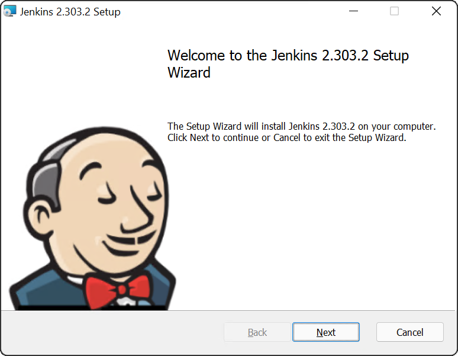
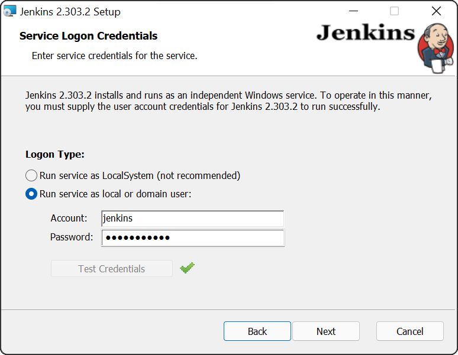
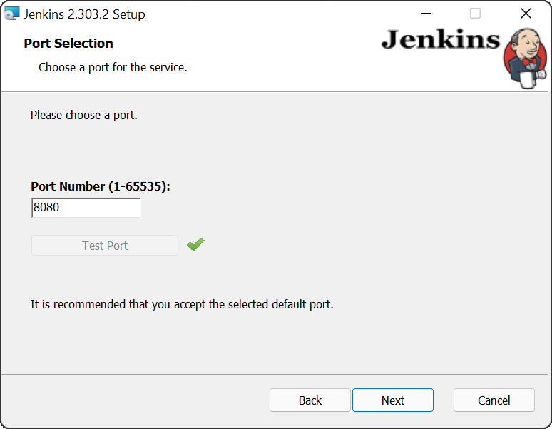
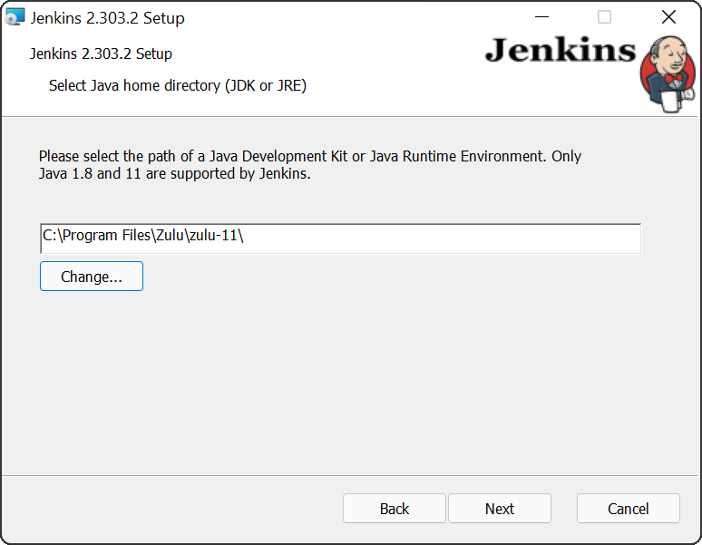
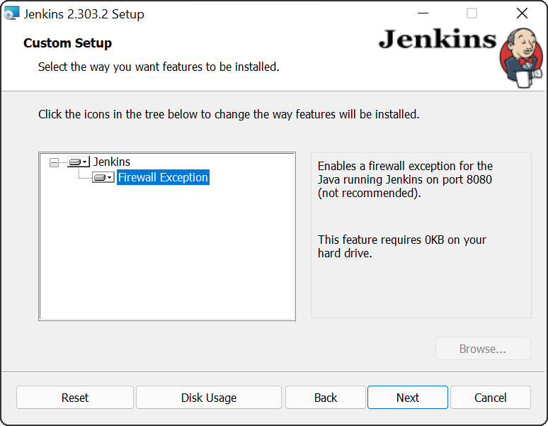
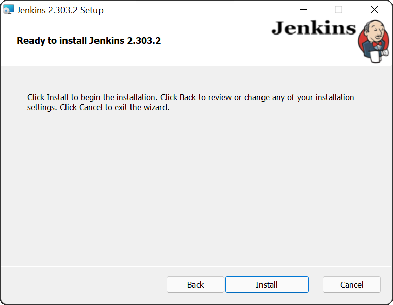
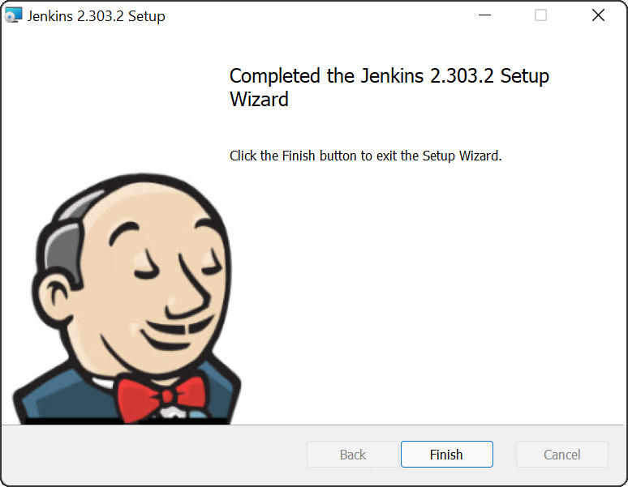

The traditional method of installing Jenkins is via the installers made available on the [Jenkins website](https://www.jenkins.io/download/) or using your local operating system's package manager.

The installation process is generally simple, but there are a few tricks to be aware of. In this post we'll run through the installation of Jenkins on Windows and Linux, and provide some insights into customizing the installation.

## Choosing between LTS and weekly releases

Jenkins offers two channels: Long Term Support (LTS) and weekly releases.

LTS releases tend to be more stable and predictable, with less features in each release, but including any important bug and security fixes.

The weekly releases include all the latest features, but will have less "bake time" in the community to find bugs.

If you prefer stability and don't require all the latest features right away, go with the LTS releases. If you want the latest features as soon as possible and don't mind encountering the occasional glitch, go with the weekly releases.

## Installing Jenkins on Windows

Jenkins provides an MSI download that allows it to be installed as a Windows service through the traditional Windows wizard style installation process. But before we start the installation there are a number of prerequisites we must address.

### Installing OpenJDK

Jenkins requires Java to to run. In recent years Oracle changed the licensing terms of their Java Runtime Environment (JRE) and Java Development Kit (JDK) to restrict commercial usage to paying customers. Fortunately, the OpenJDK project provides a free and open source alternative that you can use to run Jenkins.

There are many OpenJDK distributions to choose from including [OpenJDK](https://openjdk.java.net), [AdoptOpenJDK](https://adoptopenjdk.net), [Azul Zulu](https://www.azul.com/downloads/), [Red Hat OpenJDK](https://developers.redhat.com/products/openjdk/download), and more. I typically use the Azul Zulu distribution, although any distribution would do.

Download and install JDK 11 from your chosen OpenJDK distribution, and make a note of the directory it was installed to as you'll need that during the Jenkins installation.

### Adding a Jenkins Windows service account

Jenkins runs as a Windows service, and to do so requires a Windows account to run the service under. The installer provides the option to use the existing [LocalService](https://docs.microsoft.com/en-us/windows/win32/services/localservice-account) account, but notes that this option is not recommended. So it is recommended that you create a new account specifically for running Jenkins.

To do this task from the command line you must first install the Carbon PowerShell module. Carbon provides many useful CMDLets for managing Windows, and you'll use one of these to grant the new Jenkins user the rights to log on as a service.

Run the following PowerShell command to install Carbon from the PowerShell Gallery:

```powershell
Install-Module -Name 'Carbon' -AllowClobber
```

By default PowerShell will prevent you from running code from an external source. To remove this warning, run the following command:

```powershell
Set-ExecutionPolicy -ExecutionPolicy RemoteSigned -Scope CurrentUser
```

You then import Carbon:

```powershell
Import-Module 'Carbon'
```

The next step is to create a user called `jenkins` to run the Jenkins Windows service:

```powershell
net user jenkins Password01! /ADD
```

Finally, you must grant the `jenkins` user the permission to log on as a service:

```powershell
Grant-CPrivilege -Identity "jenkins" -Privilege SeServiceLogonRight
```

Start by downloading the MSI from the [Jenkins download page](https://www.jenkins.io/download/)

### Installing Jenkins

Double-click the MSI file to begin the Jenkins installation. Click the **Next** button:



The default installation directory is fine, so click the **Next** button:


You are now prompted to select the user that runs the Windows service. Enter the credentials for the user you created earlier and click the **Test Credentials** button. Once the test passes, click the **Next** button:



The default port of **8080** is fine. Click the **Test Port** button to ensure the port is available, and then click the **Next** button:



You are now prompted to enter the path to the Java distribution you installer earlier. The default path for the Zulu 11 distribution is `C:\Program Files\Zulu\zulu-11`. Enter the appropriate path for you chosen distribution, and click the **Next** button:



You will likely want to expose Jenkins through the Windows firewall to allow external clients to access it. Change the **Firewall Exception** feature to be installed, and click the **Next** button:



All the installation values are now configured, so click the **Install** button:



Once the installation is complete, click the **Finish** button:



### A note on Chocolaty

Chocolatey is a Windows package manager, and it [provides an option to install Jenkins](https://community.chocolatey.org/packages/jenkins). However, at the time of writing the latest version of Jenkins available on Chocolatey is 2.222.4, which was well over a year old. In fact, the version was so old that most of the recommended plugins presented during the initial Jenkins configuration failed to install!

Jenkins may be updated on Chocolatey by the time you read this post, but I would warn against using Chocolatey to install Jenkins as it does have a history of being unmaintained.

## Installing Jenkins on Ubuntu and Debian

Jenkins provides a [package repository for installing the software on Debian and Ubuntu](https://pkg.jenkins.io/debian-stable/).

First, install the repository key:

```bash
wget -q -O - https://pkg.jenkins.io/debian-stable/jenkins.io.key | sudo apt-key add -
```

Then add a Jenkins apt repository entry:

```bash
sudo sh -c 'echo deb https://pkg.jenkins.io/debian-stable binary/ > /etc/apt/sources.list.d/jenkins.list'
```

Update your local package index, then finally install Jenkins:

```bash
sudo apt-get update
sudo apt-get install jenkins
```

## Installing Jenkins on RHEL and Fedora

Jenkins provides a [package repository for installing the software on RHEL and Fedora](https://pkg.jenkins.io/redhat-stable/).

First, install the repository key:

```bash
sudo wget -O /etc/yum.repos.d/jenkins.repo https://pkg.jenkins.io/redhat-stable/jenkins.repo
sudo rpm --import https://pkg.jenkins.io/redhat-stable/jenkins.io.key
```

Then install OpenJDK and Jenkins:

```
sudo yum install epel-release
sudo yum install java-11-openjdk-devel
sudo yum install jenkins
```

## Install Jenkins on other Linux distributions and macOS

The [Jenkins website](https://www.jenkins.io/download/) includes instructions for other Linux distributions and macOS.