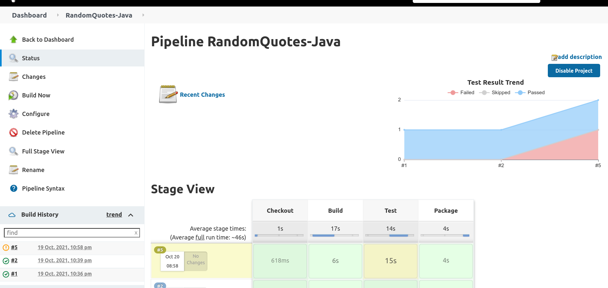

Verifying code changes with unit tests is a critical process in the development workflow. Jenkins provides a number of plugins to collect and process the results of tests allowing developers to browse the results, debug failed tests, ignore flakey or faulty tests, and generate reports on the history of tests over time.

In this post you'll learn how to add unit tests to a Jenkins project and configure plugins to process the results.

## Prerequisites

To follow along with this post you'll need Jenkins instance. The [Traditional Jenkins Installation](/blog/2022-01/jenkins-install-guide/index.md), [Docker Jenkins Installation](/blog/2022-01/jenkins-docker-install-guide/index.md), or [Helm Jenkins Installation](/blog/2022-01/jenkins-helm-install-guide/index.md) guides provide instructions on installing Jenkins in your chosen environment.

The sample applications you'll build are written in Java and DotNET Core, so the Java Development Kit (JDK) and DotNET Core SDK must be installed on the Jenkins controller or agents that perform the builds.

You can find instructions on installing the DotNET Core SDK from the [Microsoft website](https://dotnet.microsoft.com/download/dotnet/3.1). The sample project is written against DotNET Core 3.1.

The OpenJDK project provides a free and open source distributions that you can use to compile Java applications. There are many OpenJDK distributions to choose from including [OpenJDK](https://openjdk.java.net), [AdoptOpenJDK](https://adoptopenjdk.net), [Azul Zulu](https://www.azul.com/downloads/), [Red Hat OpenJDK](https://developers.redhat.com/products/openjdk/download), and more. I typically use the Azul Zulu distribution, although any distribution will do.

## Unit testing in Java

There are many unit testing frameworks available for Java, but the [most popular](https://www.overops.com/blog/the-top-100-java-libraries-in-2016-after-analyzing-47251-dependencies/) is [JUnit](https://junit.org). You'll use the [RandomQuotes](https://github.com/OctopusSamples/RandomQuotes-Java) sample application to demonstrate JUnit tests running in a Jenkins project.

### Installing the Jenkins plugins

Install the [JUnit](https://plugins.jenkins.io/junit/) plugin to process the result of JUnit tests. To install the plugin, click {{Manage Jenkins,Manage Plugins,Available}}, enter `junit` in the search box, select the **JUnit** option, and click **Install without restart**:


### Creating the project

To create a new pipeline project, click **New Item**, enter **RandomQuotes-Java** for the item name, select the **Pipeline** option, and click the **OK** button:


Paste the following pipeline script into the **Pipeline** section, and click the **Save** button:

```groovy
pipeline {
  // This pipeline requires the following plugins:
  // * Git: https://plugins.jenkins.io/git/
  // * Workflow Aggregator: https://plugins.jenkins.io/workflow-aggregator/
  // * JUnit: https://plugins.jenkins.io/junit/
  agent 'any'
  stages {
    stage('Checkout') {
      steps {
        script {
            checkout([$class: 'GitSCM', branches: [[name: '*/master']], userRemoteConfigs: [[url: 'https://github.com/OctopusSamples/RandomQuotes-Java.git']]])
        }
      }
    }
    stage('Test') {
      steps {
        sh(script: './mvnw --batch-mode -Dmaven.test.failure.ignore=true test')
        junit(testResults: 'target/surefire-reports/*.xml', allowEmptyResults : true)
      }
    }
    stage('Package') {
      steps {
        sh(script: './mvnw --batch-mode package -DskipTests')
      }
    }
  }
}
```


The important part of this pipeline, as it relates to testing, is the `Test` stage.

The first step runs the maven `test` goal passing `--batch-mode` to avoid some unnecessary logging that shows each dependency being downloaded and `-Dmaven.test.failure.ignore=true` to allow the step to pass successfully even if there were failing tests.

```groovy
sh(script: './mvnw --batch-mode -Dmaven.test.failure.ignore=true test')
```

The next step processes the test results with the JUnit plugin:

```groovy
junit(testResults: 'target/surefire-reports/*.xml', allowEmptyResults : true)
```

The `Package` stage has been configured to package the application while skipping any tests with the `-DskipTests` argument. Testing is handled in a subsequent stage:

```groovy
sh(script: './mvnw --batch-mode -Dmaven.test.skip=true clean package', returnStdout: true)
```

The **Test Result Trend** graph tracks the passed, failed, and skipped tests across the project's history:


To this point you have only run builds with successful tests. To simulate a failing test, change the `Checkout` stage to checkout the `failing-test` branch:

```groovy
    stage('Checkout') {
      steps {
        script {
            checkout([$class: 'GitSCM', branches: [[name: '*/failing-test']], userRemoteConfigs: [[url: 'https://github.com/OctopusSamples/RandomQuotes-Java.git']]])
        }
      }
    }
```

The build is marked as unstable, and the **Test Result Trend** graph shows a new failing test:



To view the details of the tests, click into the build task and click the **Test Result** link. Here you can drill into each test, view the test result, and view the logs:


## Unit testing in DotNET Core

There are a number of popular unit testing frameworks for DotNET Core including MSTest, NUnit, and xUnit. You'll use the [RandomQuotes](https://github.com/OctopusSamples/RandomQuotes) sample application to demonstrate runing NUnit tests from a Jenkins pipeline.

### Installing the Jenkins plugins

You'll use the [MSTest](https://plugins.jenkins.io/mstest/) plugin to process the test results.

Install the [MSTest](https://plugins.jenkins.io/mstest/) plugin to process the result of NUnit tests. To install the plugin, click {{Manage Jenkins,Manage Plugins,Available}}, enter `mstest` in the search box, select the **MSTest** option, and click **Install without restart**:


### Creating the project

To create a new pipeline project, click **New Item**, enter **RandomQuotes-DotNET** for the item name, select the **Pipeline** option, and click the **OK** button:


Paste the following pipeline script into the **Pipeline** section, and click the **Save** button:

```groovy
pipeline {
  // This pipeline requires the following plugins:
  // * Git: https://plugins.jenkins.io/git/
  // * Workflow Aggregator: https://plugins.jenkins.io/workflow-aggregator/
  // * MSTest: https://plugins.jenkins.io/mstest/
  agent 'any'
  stages {
    stage('Environment') {
      steps {
          echo "PATH = ${PATH}"
      }
    }
    stage('Checkout') {
      steps {

        script {
            checkout([$class: 'GitSCM', branches: [[name: '*/master']], userRemoteConfigs: [[url: 'https://github.com/OctopusSamples/RandomQuotes.git']]])
        }
      }
    }
    stage('Dependencies') {
      steps {
        sh(script: 'dotnet restore')
      }
    }
    stage('Build') {
      steps {
        sh(script: 'dotnet build --configuration Release', returnStdout: true)
      }
    }
    stage('Test') {
      steps {
        sh(script: 'dotnet test -l:trx')
        mstest(testResultsFile: '**/*.trx', failOnError: false, keepLongStdio: true)
      }
    }
  }
}
```