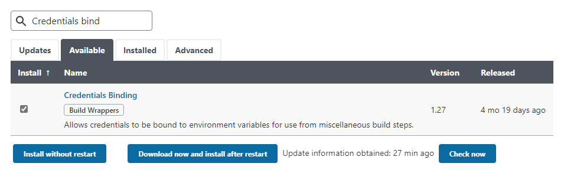
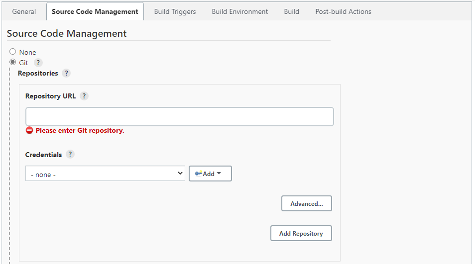
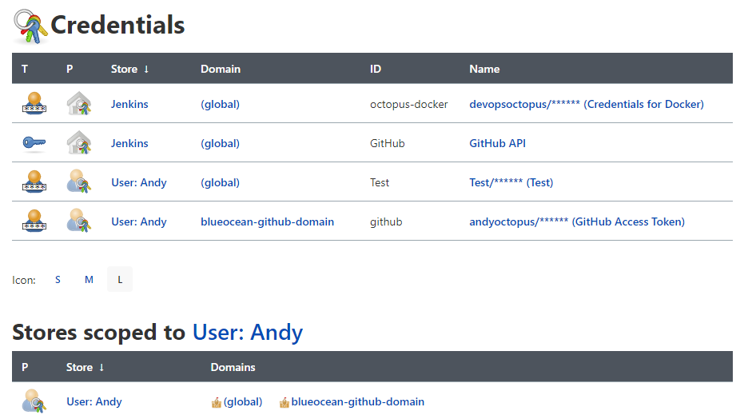

Like Octopus, Jenkins is just one step in your pipeline, complementing other systems and services.

You can connect Jenkins to most industry tools, securely storing their credentials, secrets, and API keys. By storing these login methods, Jenkins can seamlessly connect to those other services during its automation processes.

Jenkins’ documentation recommends using the [Credentials Binding plugin](https://plugins.jenkins.io/credentials-binding/). It’s one of the installer-suggested plugins during the Jenkins setup, so it’s possible you already installed it (and used it) without realizing.

In this post, I walk you through how to install the plugin and the different ways the plugin is used.

## How to install the Credentials Binding plugin

If you don’t have the Credentials Binding plugin installed, it’s easy to add:

1. Click **Manage Jenkins** from the menu.
1. Click **Manage Plugins**.
1. Click the **Available** tab and start typing ‘Credentials Binding’ into the **Filter** field. The plugin should appear in the predicted search results.
1. Check the tick box to the left of the plugin then click **Install without restart**.

Jenkins will install the plugin and all dependencies, including other plugins and extensions.

The Credentials Binding plugin stores your authentication methods in 2 different ways: 

- [Global](#global-credentials)
- [User tied](#user-tied-Credentials)

Let’s look at the difference.

## Global credentials

Global credentials are manually entered login methods stored in Jenkins. Anyone with access can use the credentials to connect to other services. This can include:

-	Code repos, like GitHub or BitBucket
-	Packaging services, like a Docker registry or TeamCity feed
-	Deployment tools, like Octopus

### Adding credentials in Jenkins

To add credentials in Jenkins:

1. Click **Manage Jenkins** from the menu.
1. Scroll down to the **Security** heading and click **Manage Credentials**.
1. Click **Jenkins** under the **Stores scoped to Jenkins** heading.
1. Click **Global credentials (unrestricted)** under the System heading.
1. If no credentials exist, you can click the **How about adding some credentials?** link, otherwise click **Add Credentials** from the left.
1. Select the type of credentials you want to store from the **Kind** field’s dropdown box, complete the fields and click **OK**. You can add the following types of credentials:
   - Username and passwords
   - SSH usernames and private keys
   - Secret files
   - Secret text
   - Certificates

Regardless of the option you select, you should always enter a meaningful **ID** and **Description**.

### Using global credentials in Jenkins

After you've added the credentials, you can call on them to connect to other tools in your pipeline, whether that’s through the UI, a plugin, or a Jenkinsfile.

A good example of where you can select global credentials is when creating a pipeline:

1. Click **New Item** in the left menu.
1. Enter an item name, select **Freestyle project**, and click **OK**.
1. Check the Git radio button under the **Source Code Management** heading. Paste your repo address into the **Repository URL** field and select your credentials from the **Credentials** dropdown box.
1. Finish setting up your item and click **Save**.

:::hint
Jenkinsfiles are text files in your code repo that define what your pipeline does and what it connects to. Jenkinsfiles are part of the ‘Jenkins Pipeline’ - a collection of Jenkins-recommended plugins for Continuous Integration and Continuous Delivery (CI/CD).

This means you can connect to services via your Jenkinsfile from credentials stored in Jenkins.

If you’re using the Blue Ocean plugin, which creates a Jenkinsfile for you when you set up a pipeline, it’s likely you won’t need to engage with Jenkinsfiles at all.

See the [Using a Jenkinsfile page](https://www.jenkins.io/doc/book/pipeline/jenkinsfile/) on the Jenkins website for more information.
:::

## User-tied credentials in Jenkins

Depending on what you're connecting Jenkins to, or the plugin you're using, Jenkins ties some credentials to the logged-in user. Jenkins only stores these credentials when you first connect it with another service. You can't use these credentials outside of their initial setup and no other user account can access them.

For example, when creating your first pipeline in [Blue Ocean](https://plugins.jenkins.io/blueocean/) (a plugin that simplifies the Jenkins user interface), Jenkins must connect to your code repository. If connecting to GitHub, you use a GitHub personal access token (created in your GitHub account’s developer settings) to allow Jenkins to connect to the repo. Jenkins only stores this token for the logged-in user in their own credentials ‘domain’.

In Jenkins, you’ll find these credentials in a different location to global credentials, though the screen for them works in a similar way. 

To see your user-tied credentials, click the arrow next to your username in the top-menu and click **Credentials**.

The top section shows all credentials you have access to, including user and global. If you scroll down, you’ll see headings for all credential stores. In my example here, **Stores scoped to User: Andy** are credentials that only I can use.

## What next?

See [Jenkins’ credentials documentation](https://www.jenkins.io/doc/book/using/using-credentials/) for more information.

Check out the other posts about Jenkins in our build server series:

- I don't have the links for these yet

Happy deployments!