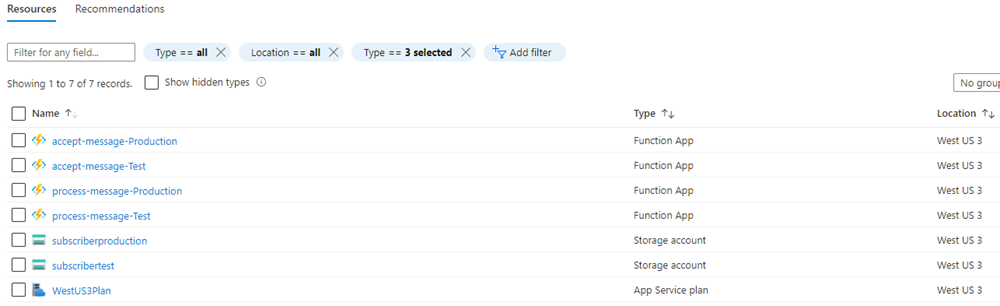
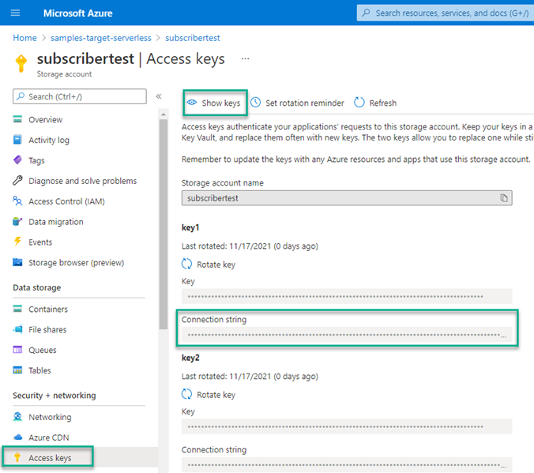
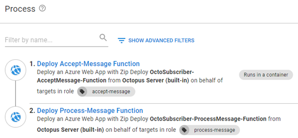
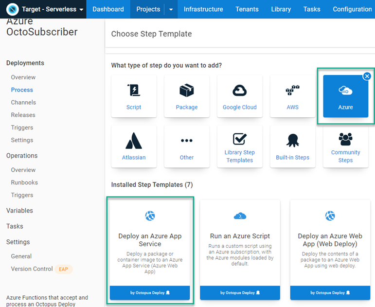
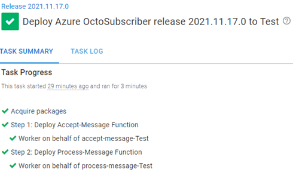
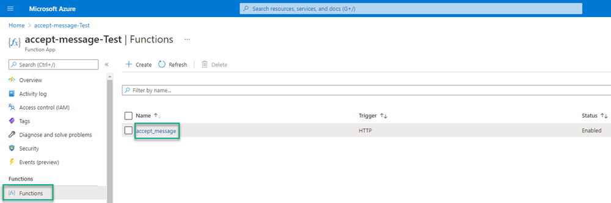
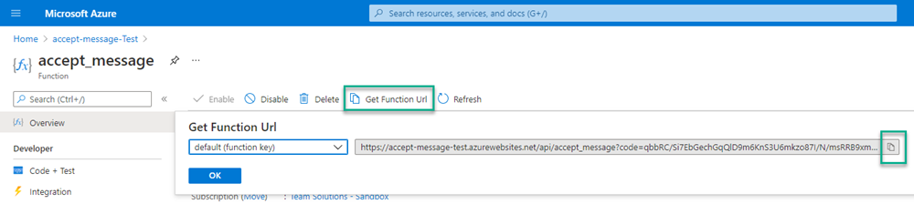
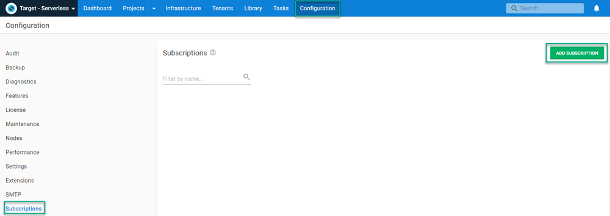
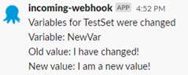

Communication is paramount to a successful team.  Daily stand-ups, message programs, and email keep everyone up-to-date with how things are progressing. Information can get lost in the shuffle, though, such as when a variable value gets updated.  

The [subscriptions](https://octopus.com/docs/administration/managing-infrastructure/subscriptions) feature of Octopus Deploy can be configured to notify users when a variable has been updated automatically by an email or webhook.  

In this post, you learn how to use the subscriptions feature to post a message to Slack via Azure Functions.

## Creating Azure resources

Before creating the functions, you first need to create some Azure resources to prepare for deployment.  

The solution presented in this post uses the following Azure resources:

- Resource Group
- Storage Account
- Storage Account message Queue
- Two Azure Functions:
  - Accept-Message
  - Process-Message

The source code for this solution can be found in the **azure** folder of the [OctoSubscriber](https://github.com/OctopusSamples/OctoSubscriber) repo on GitHub.

### Resource group

Start by creating a resource group to house all of the other resources you'll create.  This comes with the added benefit of being easy to clean up, because deleting the resource group will delete all resources in it.  

You can create a resource group through the Azure Portal, or by adding an Azure CLI script to a runbook such as this:

```powershell
$resourceGroupName = "MyResourceGroup"
$resourceGroupLocation = "westus3"

if ((az group exists --name $resourceGroupName) -eq $false)
{
	Write-Output "Creating resource group $resourceGroupName in $resourceGroupLocation"
    az group create --location $resourceGroupLocation --name $resourceGroupName 
}
```

### Storage account

To use the queue feature of Azure, first create a storage account.  

Here is an Azure CLI command to create a storage account:

```powershell
# Get variables
$storageAccountName = "MyStorageAccount"
$resourceGroupName = "MyResourceGroup"

# Create Azure storage account
Write-Host "Creating storage account ..."
az storage account create --name $storageAccountName --resource-group $resourceGroupName
```

### Storage account message queue

Message queues exist in storage accounts.  After the account has been created, create queue using the following:

```powershell
# Get variables
$storageAccountName = "MyStorageAccount"
$queueName = "MyMessageQueue"
$resourceGroupName = "MyResourceGroup"

# Get account keys
$accountKeys = (az storage account keys list --account-name $storageAccountName --resource-group $resourceGroupName) | ConvertFrom-JSON

# Create Azure storage queue
Write-Host "Creating queue ..."
az storage queue create --name $queueName --account-name $storageAccountName --account-key $accountKeys[0].Value

```

### Azure Function Apps

The solution in this post uses two different Azure Functions: 

- Accept-Message
- Process-Message

Both functions need to be registered as targets in Octopus Deploy.

:::info
The most common plan to use with Azure Functions is the Consumption Plan (sku Y1), however, I was unable to use the [az functionapp plan create](https://docs.microsoft.com/en-us/cli/azure/functionapp/plan?view=azure-cli-latest#az_functionapp_plan_create) CLI command, as `Y1` is not a supported SKU.
:::

#### Accept-Message
The Azure CLI can also be used to create the functions as well.  The Accept-Message function is written in nodeJS, so be sure to specify `node` for the runtime.

```powershell
# Get variables
$resourceGroupName = "MyResourceGroup"
$appServiceName = "Accept-Message"
$appServiceRuntime = "node"
$storageAccountName = "MyStorageAccount"
$osType = "Windows"
$functionsVersion = 3
$azureLocation = "westus3"

# Create App Service
Write-Host "Creating Accept function app service ..."
az functionapp create --name $appServiceName --consumption-plan-location $azureLocation --resource-group $resourceGroupName --runtime $appServiceRuntime --storage-account $storageAccountName --os-type $osType --functions-version $functionsVersion
```

#### Process-Message

Provisioning Process-Message is similar to Accept-Message, except that it's written in C#, and you need to specify `dotnet` as the runtime version.

```powershell
# Get variables
$resourceGroupName = "MyResourceGroup"
$appServiceName = "Process-Message"
$appServiceRuntime = "dotnet"
$storageAccountName = "MyStorageAccount"
$osType = "Windows"
$functionsVersion = 3
$azureLocation = "westus3"

# Create App Service
Write-Host "Creating Process function app service ..."
az functionapp create --name $appServiceName --consumption-plan-location $azureLocation --resource-group $resourceGroupName --runtime "$appServiceRuntime" --storage-account $storageAccountName --os-type $osType --functions-version $functionsVersion
```

:::info
For both functions, I received a message that I didn't configure Application Insights.  The CLI gives you parameters to configure it, but there doesn't appear to be a way to tell it you don't want Insights.
:::

After you provision all of your resources, the contents of the resource group should look similar to this:

*Resources are provisioned for both Test and Production environments*

## Azure Functions

The Accept-Message function takes the submitted body and places it on the message queue.  After a message has been placed on the queue, Process-Message will trigger, parsing the message and posting to Slack.

### Accept-Message

The Accept-Message function is written in nodeJS and is fairly basic.  If you've never created an Azure Function using nodeJS, use [this tutorial from Microsoft](https://docs.microsoft.com/en-us/azure/azure-functions/create-first-function-vs-code-node) to get started.  

Add the following to `index.js`:

```javascript
const { QueueClient, QueueServiceClient } = require("@azure/storage-queue");
const connectionString = process.env.AZURE_STORAGE_CONNECTION_STRING;
const queueName = process.env.QUEUE_NAME;
const queueServiceClient = QueueServiceClient.fromConnectionString(connectionString);
const queueClient = queueServiceClient.getQueueClient(queueName);

module.exports = async function (context, req) {
    if (req.body) {
        // Base64 encode message
        let message = req.rawBody;
        let messageBuffer = new Buffer.from(message, 'utf-8');
        let encodedMessage = messageBuffer.toString('base64');
        
        //await queueClient.sendMessage(req.body.body);
        await queueClient.sendMessage(encodedMessage);
        context.res = {
            body: "Message added!",
            status: 200
        }
    } else {
        context.res = {
            status: 400,
            body: "Request contains no body!"
        };
    }
};
```

Environment variables `AZURE_STORAGE_CONNECTION_STRING` and `QUEUE_NAME` are provided when you deploy the Function to Azure.

:::warning
The tutorial will download all of the `node_modules` necessary to create an Azure Function, however, it won't add them to the `package.json` file.  You need to add the references to make your function work.
:::

### Process-Message

The Process-Message function is triggered by messages being placed on the queue.  The message deserializes from JSON, parses, then posts to Slack.  Process-Message is written in C# and uses the following NuGet package references:

- Microsoft.Azure.WebJobs.Extensions.Storage
- Microsoft.NET.Sdk.Functions
- Newtonsoft.Json
- Slack.Webhooks

Similar to Accept-Message, there isn't much complexity to Process-Message:
  
```csharp
using System;
using Microsoft.Azure.WebJobs;
using Microsoft.Azure.WebJobs.Host;
using Microsoft.Extensions.Logging;
using Newtonsoft.Json;
using Slack;

namespace process_message
{
    public static class process_message
    {
        [FunctionName("process_message")]
        [StorageAccount("AzureWebJobsStorage")]
        public static void Run([QueueTrigger("octopusdeploy", Connection = "")]string myQueueItem, ILogger log)
        {
            // Deserialize message into JSON object
            dynamic subscriptionEvent = JsonConvert.DeserializeObject(myQueueItem);
            string slackUrl = Environment.GetEnvironmentVariable("SlackUrl");
            string slackChannel = Environment.GetEnvironmentVariable("SlackChannel");

            // Create slack objects
            Slack.Webhooks.SlackClient slackClient = new Slack.Webhooks.SlackClient(slackUrl);
            Slack.Webhooks.SlackMessage slackMessage = new Slack.Webhooks.SlackMessage();

            // Get Octopus Event information
            string librarySetName = subscriptionEvent.Payload.Event.ChangeDetails.DocumentContext.Name;
            System.Text.StringBuilder messageText = new System.Text.StringBuilder();

            // Get message from event
            messageText.AppendLine(subscriptionEvent.Payload.Event.Message.ToString());

            if (subscriptionEvent.Payload.Event.ChangeDetails.Differences.Count > 0)
            {
                // Loop through variables collection
                foreach (var difference in subscriptionEvent.Payload.Event.ChangeDetails.Differences)
                {
                    // Split the path
                    string[] parsedDifference = difference.path.ToString().Split("/", StringSplitOptions.RemoveEmptyEntries);

                    if (parsedDifference[0] == "Variables")
                    {
                        // Get the variable index value
                        int variableIndex = int.Parse(parsedDifference[1]);

                        // Add to message
                        messageText.AppendLine(string.Format("Variable: {0}", subscriptionEvent.Payload.Event.ChangeDetails.DocumentContext.Variables[variableIndex].Name));
                        messageText.AppendLine(string.Format("Old value: {0} \r\n New value: {1}", subscriptionEvent.Payload.Event.ChangeDetails.DocumentContext.Variables[variableIndex].Value, difference.value));
                    }
                }
            }

            log.LogInformation($"Posting to Slack: {messageText.ToString()}");

            // Post message to channel
            slackMessage.Channel = slackChannel;
            slackMessage.Text = messageText.ToString();
            slackClient.Post(slackMessage);
        }
    }
}

```

The environment variables of `SlackUrl` and `SlackChannel` are provided during the deployment process.

## Building and packaging the functions

Process-Message is the only one of the two functions that requires compilation, however, they both need to be packaged.  

The GitHub repo contains a GitHub Actions build definition as an example:

```yaml
# This is a basic workflow to help you get started with Actions

name: Azure Function

on:
  push:
    paths:
      - 'azure/**'

  # Allows you to run this workflow manually from the Actions tab
  workflow_dispatch:

jobs:
  build:
    runs-on: ubuntu-latest
    strategy:
      matrix:
        dotnet-version: ['3.1.x']

    steps:
      - uses: actions/checkout@v2
      - name: Setup .NET Core SDK ${{ matrix.dotnet-version }}
        uses: actions/setup-dotnet@v1.7.2
        with:
          dotnet-version: ${{ matrix.dotnet-version }}

      - name: Create artifacts folder
        run: |
          mkdir "$GITHUB_WORKSPACE/artifacts"
          mkdir "$GITHUB_WORKSPACE/artifacts/process-message"
          mkdir "$GITHUB_WORKSPACE/azure/accept_message/node_modules"


      - name: Restore dependencies for process-message
        working-directory: azure/process_message/process_message
        run: dotnet restore

      - name: Build process-message
        working-directory: azure/process_message/process_message
        run: dotnet build --configuration Release --no-restore --output "$GITHUB_WORKSPACE/artifacts/process-message"

      - name: Install Octopus CLI
        uses: OctopusDeploy/install-octopus-cli-action@v1.1.1
        with:
          version: latest
          
      - name: Pack and Push
        working-directory: azure/accept_message
        env:
          OCTOPUS_URL: ${{ secrets.OCTOPUS_SERVER }}
          OCTOPUS_API_KEY: ${{ secrets.OCTOPUS_API_KEY }}  
        run: |
          npm ci --production
          octo pack --id=OctoSubscriber-AcceptMessage-Function --format=Zip --version=2021.1.1.$GITHUB_RUN_NUMBER --basePath="$GITHUB_WORKSPACE/azure/accept_message"
          octo pack --id=OctoSubscriber-ProcessMessage-Function --format=Zip --version=2021.1.1.$GITHUB_RUN_NUMBER --basePath="$GITHUB_WORKSPACE/artifacts/process-message"
          octo push --package=OctoSubscriber-AcceptMessage-Function.2021.1.1.$GITHUB_RUN_NUMBER.zip --server=$OCTOPUS_URL --apiKey=$OCTOPUS_API_KEY --space="Target - Serverless"
          octo push --package=OctoSubscriber-ProcessMessage-Function.2021.1.1.$GITHUB_RUN_NUMBER.zip --server=$OCTOPUS_URL --apiKey=$OCTOPUS_API_KEY --space="Target - Serverless"
```

## Deploying the functions

This post assumes you know how to create a project in Octopus Deploy and will not cover that topic. If you're not familiar, check out our [Getting started](https://octopus.com/docs/getting-started) guide.

### Variables

Both functions have some variables to be defined before defining our deployment process:

- Project.Azure.Storage.ConnectionString
- Project.Azure.Storage.Queue.Name
- Project.Slack.Url
- Project.Slack.Channel.Name

#### Project.Azure.Storage.ConnectionString

The functions need the connection string to the Azure storage account to be able to access the queue.  This value can be found by navigating to the **Azure storage account**, then **Access keys**.  By default, Azure creates two keys, and either one will work.  Click on **Show keys** to copy the value of the **Connection string** property.



#### Project.Azure.Storage.Queue.Name

The name of the message queue that you created earlier.

#### Project.Slack.Url

This is the integration webhook URL for Slack. It's recommended you make this variable a sensitive value.

#### Project.Slack.Channel.Name

This is the name of the Slack channel you want the Function to post to.

### Deployment process

These are the steps for the deployment process:

- Deploy Accept-Message Function
- Deploy Process-Message Function



#### Deploy Accept-Message Function

Add a **Deploy an Azure App Service** step.



Fill in the form fields for the step:

- **On Behalf Of:** The role that your Azure Web App target has been assigned
- **Package**: Package that contains the Accept-Message Function
- **Application Settings**: Use the following:

```json
[
   {
      "name": "AZURE_STORAGE_CONNECTION_STRING",
      "value": "#{Project.Azure.Queue.ConnectionString}",
      "slotSetting": false
   },
   {
      "name": "QUEUE_NAME",
      "value": "#{Project.Azure.Storage.Queue.Name}",
      "slotSetting": false
   }
]
```

#### Deploy Process-Message Function

This uses the same step template as **Deploy Accept-Message Function**.
Fill in the form fields for the step:

- **On Behalf Of**: The role that your Azure Web App target has been assigned
- **Package**: Package that contains the Accept-Message Function
- **Application Settings**: Use the following:

```json
[
   {
      "name": "SlackUrl",
      "value": "#{Project.Slack.Url}",
      "slotSetting": false
   },
   {
      "name": "SlackChannel",
      "value": "#{Project.Slack.Channel}",
      "slotSetting": false
   },
   {
      "name": "AzureWebJobsStorage",
      "value": "#{Project.Azure.Queue.ConnectionString}",
      "slotSetting": false
   }
]
```

## Deployment

Deploying the functions looks something like this:



To call this Function, you need to get the Function URL from Azure.  

Open the Azure Portal and navigate to your **Function**.Click **Functions** then the link to your Function.



Click **Get Function Url**, then the copy icon. Save this for later.



## Testing notifications

After you have the functions deployed, you can configure a subscription in Octopus deploy to notify you when a variable has changed.

To configure a subscription click on **Configuration**, then **Subscriptions**, then **ADD SUBSCRIPTION**.



Fill in the following fields

- **Name**: Give the subscription a name
- **Event Filters**: From the **Document Type** dropdown list, choose **Variable Set** 
- **PayloadURL**: Paste in Function URL from Azure

Click **SAVE**.

You're now ready to receive Slack notifications when a variable has been changed.  To test this, update a variable.  After a few seconds, Octopus will process the subscription, calling the Azure Function to place the Octopus payload on the queue.  The Process-Message function will fire and post to Slack.



## Conclusion
This post demonstrates how to use an Octopus Deploy subscription to call an Azure Function to post a message to Slack whenever a variable has changed.  

Happy deployments!