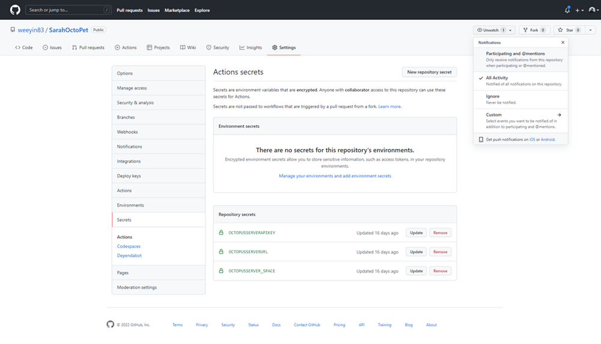

Earlier I wrote an [article](https://www.octopus.com/blog/azure-bicep-octopus-deploy) about using Azure Bicep files to deploy your Azure infrastructure and doing that using Octopus Runbooks.  In this article, I want to cover off how you can use GitHub to source control your Azure Bicep files and then deploy them using Octopus Deploy. 

# Why Source Control?

Source Control is important for having that single source of truth, whether it be of your application code or your Infrastructure as Code (IaC).  

There are many more benefits to using source control.  Such as it allows for collaborations to happen with multiple people working on the same code base and then merging their changes.  Also it can help keep track of every change that is made, so if a mistake has been made, you can effectively turn back the clock to a working version.  Or see when something changed. 

# Get your Bicep files from GitHub to Octopus Deploy

With your Bicep files all stored within GitHub, how do you get them over to your Octopus Deploy instance to automate the deployment of the Azure resources?  

We can use GitHub Actions!

GitHub Actions were launched in 2019 and have fast become a popular tool for DevOps Professionals as well as Open Source contributors. 

We will create a GitHub Actions workflow to pack our Bicep files into a ZIP file and then push them over to our Octopus Deploy instance ready for deployment. 

## Octopus Connection

One of the first things we need to do is set up some GitHub Secrets that will hold the connection information to our Octopus Deploy instance.   You need the URL for your Octopus Deploy instance, an API Key, and the name of the Space that your files should be pushed to. 

We’ve created three secrets under Settings > Secrets: 

* OCTOPUSSERVERAPIKEY
* OCTOPUSSERVERURL
* OCTOPUSSERVER_SPACE



## Create GitHub Actions workflow

Now we need to start to create the GitHub Actions workflow.  Any GitHub Actions workflow that you want to create needs to reside under a folder called **.github** within your repository and use YAML. 

I always start off my workflow files with a description of what they do for my reference or others to understand.  And then I define a name for the workflow and when I want it to run:

```yml

# This workflow takes the Bicep files within the Bicep folder and zips them together.  Then pushes/uploads them to the Octopus Instance specified. 
# Within the repo's secrets are the information relating to the Octopus Instance URL, API key and Space. 
name: OctoPetShopBicepBuild
on:
  push:
    branches:
    - main
```
My workflow will run every time there is a push done to the Main branch. 

Now we have that setup, I want to define the steps that the workflow will work through: 

```yml
# A workflow run is made up of one or more jobs that can run sequentially or in parallel
jobs:
  # This workflow contains a single job called "Bicep Build"
  BicepBuild:
    # The type of runner that the job will run on
    runs-on: windows-latest
    steps:
    # This first step takes the code within the Repo and pulls it into the workspace
    - uses: actions/checkout@v2
```

I start off by defining what kind of worker or runner the job should run on, in this instance, I’ve said the latest Windows runner. 

The first step for my workflow is to take the files within my repository and bring them into the working area.  I’ve done this by using a Marketplace action called checkout. 

```yml
 # We install the latest version of Octopus CLI
    - uses: OctopusDeploy/install-octopus-cli-action@v1.1.8
```

Next, I want to install the Octopus CLI onto my runner as I want to use the commands from that CLI and the runner doesn’t have that installed by default. 

```yml
 # We take the files inside the Bicep folder and zip them together
    - name: Zip Bicep files
      run: octo pack --id="OctoBicepFiles" --format="zip" --version=${{ github.run_number }} --basePath=${{ github.workspace }}\Bicep\ --outFolder=${{ github.workspace }}\output
```

This next step takes the files into the Bicep folder within my repository and puts them inside a ZIP file. 

```yml
# We take the zip file we created and push them to the Octopus Deploy server instance
    - name: Push Bicep files
      run: octo push --package="${{ github.workspace }}\output\OctoBicepFiles.${{ github.run_number }}.zip" --server="${{ secrets.OCTOPUSSERVERURL }}" --apiKey="${{ secrets.OCTOPUSSERVERAPIKEY }}" --space="${{ secrets.OCTOPUSSERVER_SPACE }}"
```

The final step we need in this workflow is a push step.  This step takes the ZIP file that has been created and pushes it to our Octopus Deploy instance.  We are using the secrets that we created earlier to make the connection to our Octopus Deploy instance. 

You can get a copy of the complete workflow [here](https://gist.github.com/weeyin83/fa134eec3cb7bd8c52fa25f2f323189c). 

# Conclusion

We now have a place to store our Bicep modules and infrastructure deployment code, and an automated process in place that pushes those files to our Octopus Deploy instance ready for deployment. 

Please do reach out if you have any questions or feedback on this process, we'd love to hear from you!