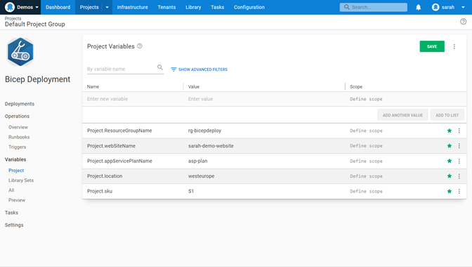
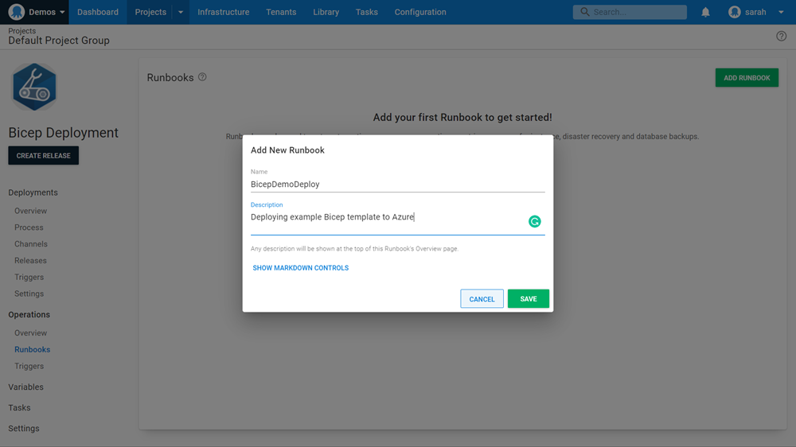
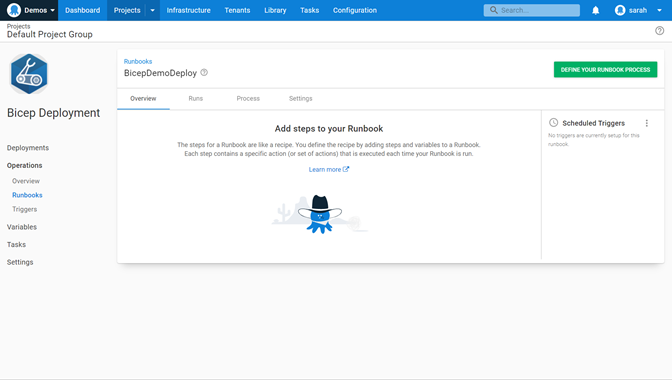
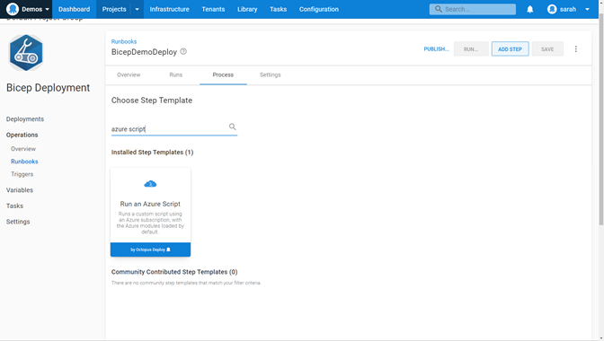
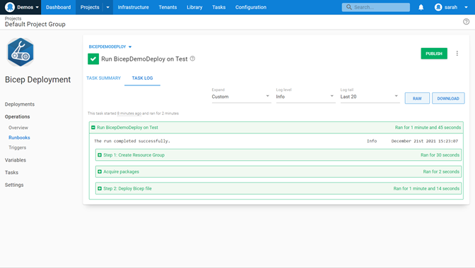

In late 2020 Microsoft announced their new project, [Bicep](https://docs.microsoft.com/azure/azure-resource-manager/bicep/overview). A Domain-Specific Language (DSL) for deploying Azure resources. The aim of Bicep is to simplify the authoring experience with it being straightforward to learn. A well as being modular and re-usable. 

Fast forward to 2022 and the use of Bicep and love for it within the IT community is profound. We see blog posts, tweets, conference sessions, and lots of interaction on the official [Bicep GitHub space](https://github.com/Azure/bicep). Since v0.3 Bicep has been fully supported by Microsoft Support plans and considered ready for production. 

In this blog post, I introduce how to use Bicep templates and automate their deployment using [Octopus Deploy Runbooks](https://octopus.com/docs/runbooks).

## Getting started with Bicep and Octopus Deploy

### Prerequisites

The following tooling is required to get started with Bicep: 

* [Visual Studio Code](https://code.visualstudio.com/)
* [Bicep Extension for Visual Studio Code](https://marketplace.visualstudio.com/items?itemName=ms-azuretools.vscode-bicep)
* [Azure PowerShell](https://docs.microsoft.com/powershell/azure/install-az-ps?view=azps-7.0.0)
* [Azure CLI](https://docs.microsoft.com/cli/azure/install-azure-cli)
* [Octopus CLI](https://octopus.com/docs/octopus-rest-api/octopus-cli)

### Creating your first Bicep Template

Microsoft has created some great resources, especially the [Bicep Microsoft Learning Path](https://docs.microsoft.com/en-gb/learn/paths/fundamentals-bicep/) to truly get your learning journey started. I’m going to take you through a basic template creation assuming you have some experience with ARM templates or similar and not starting from scratch. 

I’ll be walking you through the creation of an Azure App Service Plan and Azure Linux Web App. 

The first thing we need to do within the template is declare the parameters and variables we will be using: 

​```json
// Declare parameters
param sku string
param linuxFxVersion string = 'node|14-lts' // The runtime stack of web app
param location string
param resourceTags object = {
  Environment: 'Tutorial'
  Owner: 'Me'
} // Tags for all resources
param appServicePlanName string
param webSiteName string
​```

We can declare static entries for these parameters or we can leave them blank and then input values during deployment. We've declared some as static but left others so we can pass in the information later during deployment.  

The next step is to define how we want to deploy our Azure App Service Plan. 

```json
// Deploying the Azure App Service Plan
resource appServicePlan 'Microsoft.Web/serverfarms@2021-02-01' = {
  name: appServicePlanName
  location: location
  tags: resourceTags
  properties: {
    reserved: true
  }
  sku: {
    name: sku
  }
  kind: 'linux'
}
```

Let’s break some of that down for you: 

* The resource identifier (resource _appServicePlan_) – Tells Bicep to create a new resource named _appServicePlan_. This name identifies the particular resource within the Bicep template.  But it is NOT the name of the resource that will be created within Azure. 
* _Microsoft.Web/serverfarms@2021-02-01 _- Defines the resource provider _Microsoft.Web_.  Then the resource type _serverfarms_. And lastly the API version -_ 2021-02-01_ to use.  It’s always worth checking the official Microsoft documentation to see if there is a newer API out or not. 
* Name - This will be the actual name of the Azure Resource.
* Location - This will be the Azure region it will be deployed in.
* Tags - Tagging our resources so we can logically organize them.
* Properties - this is the section where we can start to configure the App Service Plan to our needs in this case we’re defining the SKU and the kind (Linux or Windows). 

Then we want to deploy the Azure Web App.

```json
// Deploying the Azure Web App
resource appService 'Microsoft.Web/sites@2021-02-01' = {
  name: webSiteName
  location: location
  tags: resourceTags
  properties: {
    serverFarmId: appServicePlan.id
    siteConfig: {
      linuxFxVersion: linuxFxVersion
    }
  }
}
```

Once again let’s break this down for you: 

* The resource identifier (resource _appService_) – Tells Bicep to create a new resource named _appService_. This name identifies the particular resource within the Bicep template.  But it is NOT the name of the resource that will be created within Azure. 
* _Microsoft.Web/sites@2021-02-01_ - Defines the resource provider _Microsoft.Web_.  Then the resource type _sites_. And lastly the API version -_ 2021-02-01_ to use.  It’s always worth checking the official Microsoft documentation to see if there is a newer API out or not. 
* Name - This will be the actual name of the Azure Resource.
* Location - This will be the Azure region it will be deployed in.
* Tags - Tagging our resources so we can logically organize them.
* Properties - this is the section where we can start to configure the App Service.  We’ve defined which App Service Plan we are doing to use with this web app and the Linux version we want.  There are a lot more settings you could configure but we’ll keep it simple in this example. 

The template is complete. If you wish to grab a copy you can [here](https://gist.github.com/weeyin83/7a9a20a5fc7e10e65561b4d5e6ed4019). 

### Get your Bicep Template ready for use in Octopus Deploy

To be able to run your Bicep template file inside an Octopus Runbook we first need to pack the file inside a ZIP file. To do this we can use the Octopus CLI. 

```bash
octo pack --id="BicepTemplate" --format="zip" --version="1.0.0.0" --basePath="c:\Bicep\" --outFolder="c:\Bicep"
```

We can either take this ZIP file and upload it into our Octopus Library through the portal or we can use the Octopus CLI again. 

```bash
octo push --package="c:\bicep\BicepTemplate.1.0.0.0.zip" --server="https://MyOctopusServer" --apiKey="API-MyApiKey"
```

### Run the Bicep template from an Octopus Runbook

Now that you have your Bicep ZIP file stored within Octopus it’s time to automate the deployment of it. 

:::hint
It is assumed you already have an Octopus environment set up and have connected your [Azure account](https://octopus.com/docs/infrastructure/accounts/azure). 
:::

Within a new project, or existing one, click on Variables down the left hand side menu. We are going to define the variables that we need for deployment.  We need to input variables for:

* Resource Group
* Web Site Name
* App Service Plan Name
* Location 
* App Service plan SKU



Once the variables have been entered, click on Runbooks under Operations. 

You now want to click on Add Runbook to create a new runbook that will deploy your Bicep template. 



Within this runbook, you want to "Define your Runbook Process". 



The first step you need to add is “Run an Azure Script”.  This step will be used to create the Azure Resource Group that will hold your resources.  



We give the step a name for reference. Then enter the details of our Azure account. 

Next we want to enter the script that will create our Resource Group.  In this case we will be using a Azure CLI command.

```bash
az group create -l $OctopusParameters["Project.location"] -n $OctopusParameters["Project.ResourceGroupName"]
```

As you can see we are using some of the variables we declared in an earlier step. 


We need to add another step, another “Run an Azure Script” step.  This step will be used to deploy our Bicep template, so give it an appropriate name.  Then scroll to the Azure section and once again add in your Azure account details.

Next scroll down to the Script section. We input the following script:

```powershell
# Tell the deployment to use the package we’ve associated and the file path
$filePath = $OctopusParameters["Octopus.Action.Package[BicepTemplate].ExtractedPath"]

# Change Directory to extracted package
cd $filePath

# Get current date and set the deployment name
$today=Get-Date -Format "dd-MM-yyyy"
$deploymentName="BicepDeploy"+"$today"

# Deploy Bicep template and pull in the variable information
New-AzResourceGroupDeployment -Name $deploymentName -ResourceGroupName $OctopusParameters["Project.ResourceGroupName"] -TemplateFile webapp.bicep  -sku $OctopusParameters["Project.sku"] -location $OctopusParameters["Project.location"] -appServicePlanName $OctopusParameters["Project.appServicePlanName"] -webSiteName $OctopusParameters["Project.webSiteName"]
```

:::success
If you are using your own [workers](https://octopus.com/docs/infrastructure/workers) please ensure that you have Azure CLI, Azure PowerShell and Bicep installed. 
:::

The above script will use the Bicep Zip file. Create a deployment name so we can trace the history of the deployment.  Then it will use the PowerShell command to deploy the template file and pull in the variables we need and have declared inside Octopus. 

If you look just below the script box, there is a section about “Referenced Packages”, click on Add.  Select the ZIP file that you added that contains your Bicep file. 

You can now save this deployment process and run the deployment. 



## Conclusion
You can now build on this basic Bicep deployment by creating [Bicep modules](https://docs.microsoft.com/azure/azure-resource-manager/bicep/modules) and carrying out more complex deployments. Please do reach out and let us know in the comments section or within our [Slack community](https://octopus.com/slack) if you are using Bicep to deploy resources to your environments or if you have any questions. 
