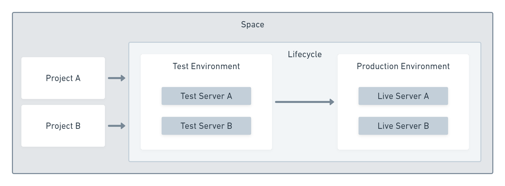

The Octopus Spaces feature helps you organize and secure your projects, environments, and infrastructure and control which team members can access them.

In this post, you'll learn how to use spaces effectively to organize your deployments.

## An overview of spaces

Spaces are partitions that create hard walls in your Octopus Server. Deployment resources assigned to a space cannot be seen or used from another space. An Octopus Administrator can give full responsibility for managing each space to a Space Manager, which can reduce the workload for the administrator.

The following items are scoped to a space:

- Environments
- Lifecycles
- Projects
- Variable sets
- Deployment targets
- Tenants

These space-scoped items cannot be accessed from other spaces.

Teams are a special case. When you create a team, you can choose whether to scope them to a single space or have the team span all spaces.

The [administration guide for Spaces](https://octopus.com/docs/administration/spaces) has instructions for managing spaces.

## The benefits of spaces

There are two primary use cases for spaces:

- Organising deployment resources
- Controlling access to these resources

You might choose to use spaces for either or both of these reasons.

### Organising deployment resources

Your Octopus Deploy Dashboard displays a row for each project and a column for each phase in your lifecycles. The dashboard gets taller when you add more projects and wider as you create more phases. If you find your dashboard overwhelming, moving projects into spaces will clean it up and reduce how much you have to scroll.

You will get the same benefits across all screens in the space and when choosing resources from a list, such as editing a process step, as only items from the current space are shown.

Spaces allow you to limit the growth in each area by grouping related resources together.

### Controlling access to deployment resources

Before we introduced spaces, you could control the visibility of projects using teams with scoped roles. However, this could become difficult to manage. It was hard to stop items like deployment targets from being re-used by new projects.

Spaces give you a convenient way to control access to a group of related resources without complicated permissions. You can grant a team member full or read-only access to the spaces they need, and they can then switch between them quickly using the space switcher.

## How to design your spaces

A space represents a logical group of applications. If you have several closely related applications, they are likely to share some variables in a variable set or be deployed to the same infrastructure. These factors will naturally guide whether they should be grouped into a space or kept in separate spaces to prevent them from becoming related in undesirable ways.

It may seem like a good idea to create a space for each team in your organization, but this is not always the best design to follow.

Instead, use one of the following dimensions to design your spaces:

- Application suites
- Application audiences
- Company divisions

More information on each of these options is below.

### Application suites

Application suites are ideal for organizing spaces because your application design has similar design considerations. For example, you might group the components of a content management system (CMS) within one space and the components of a billing system into a second space.

:::hint
[Conway's law](https://en.wikipedia.org/wiki/Conway%27s_law) states that "Any organization that designs a system (defined broadly) will produce a design whose structure is a copy of the organization's communication structure." If you have designed your applications and teams to take advantage of this law, you may find that application suites and teams have a similar definition.
:::

If you have more than one team contributing to an application suite, you should maintain a space that aligns with the software, not the teams. You can give both teams access to the space, and both can see a whole-system view of deployments.

### Application audiences

A less granular approach is to have separate spaces that match intended audiences, for example, internal and public-facing applications. This approach prioritizes cleaning up the public-facing space by removing less critical resources into a different space.

This design can quickly improve the information for your public-facing space and may serve as a first step toward splitting resources into spaces for each application suite.

### Company divisions

If your company is organized into divisions that develop independent applications, this is likely to provide a natural design for spaces. For example, if the company has divisions that offer software to different industries, each division could have a separate space with a dedicated space manager.

This would allow each division to be self-sufficient in managing its space, without cluttering Octopus Deploy for other divisions.

## Useful design indicators

The ideal scenario is that applications within a space are independent, deployed to dedicated targets, and have an autonomous team responsible for them. While you might not find yourself in this perfect situation, it provides a helpful guide when deciding how to design your spaces.

If you deploy multiple applications to the same deployment targets, you should keep the deployments within the same space. It is possible to set up the same deployment target in more than one space using a listening tentacle. However, this complicates the permissions, and team members won't see all the deployments targeting the shared infrastructure.

If there are strong reasons to split the deployments into multiple spaces, those same reasons are likely to mean you should have different deployment targets, too.

## What to avoid

You should avoid using spaces for each environment, as you will need to duplicate the process in each space. It would not be easy to keep the process consistent in each space when you make changes.

You should also avoid using spaces where it is more appropriate to use [tenants](https://octopus.com/docs/tenants).

Where an application contains several components, it is better to keep them within a single space; otherwise, it becomes difficult to track the currently deployed state of the application as a whole.

## Conclusion

Spaces are a valuable tool for organizing and securing the deployment-related resources you manage with Octopus Deploy. They provide smaller views over deployments and resources, but you should give due consideration to the design of your spaces.
