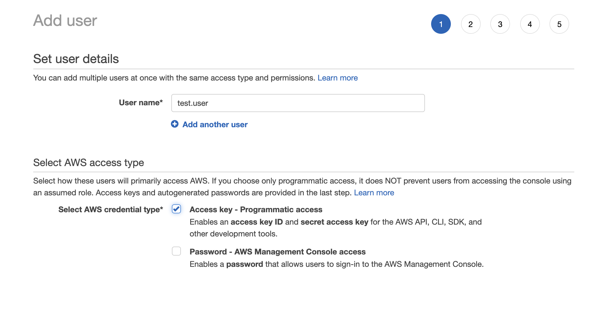
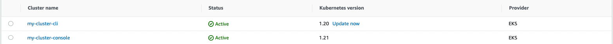
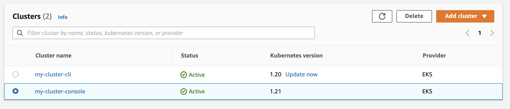

In this post, you learn how to set up an Elastic Kubernetes Service (EKS) cluster in Amazon Web Services (AWS). 

EKS is a managed container service to run and scale Kubernetes in the cloud or on-premises. Kubernetes provides a scalable, distributed way to manage workloads. It does this by containerizing applications. Containers ensure replicability across different environments and cloud infrastructures. 

The clusters you create in this post will be used in later posts in our [Continuous Integration series](https://octopus.com/blog/tag/CI%20Series), to set up web applications and as part of workflows. 

## Prerequisites

To follow along with this post, you need:

- An AWS account
- A terminal with [kubectl](https://docs.aws.amazon.com/eks/latest/userguide/install-kubectl.html), [eksctl](https://docs.aws.amazon.com/eks/latest/userguide/eksctl.html), and [aws-iam-authenticator](https://docs.aws.amazon.com/eks/latest/userguide/install-aws-iam-authenticator.html) installed
- IAM permissions

There are two ways to set up a cluster in EKS: 

- The command-line interface (CLI)
- The console

Before this though, you need to set up some access keys and user accounts.

## Preliminary setup

In AWS, you need to configure access policies. These policies determine what kind of user can access the cluster. 

Typically, it's useful to follow the principle of least privilege. This means you give users the minimum set of privileges required to carry out their role. This supports the security of the cloud infrastructure by not granting users more permissions than they need. 

Follow these steps to set up your access keys and user accounts:

- Go to **AWS Console**, then **IAM**, then **Users**, and **Add Users**
- Give the user a name, and tick **Access Key - Programmatic access**
- Click **Next**



- Select **Attach existing policies directly**, then **Create policy**

The IAM policy allows you to create an EKS cluster from the command-line. [The actions in this policy are the minimum policies required by eksctl](https://eksctl.io/usage/minimum-iam-policies/).

- Click **Next** and give the policy a name
- Click **Add Policy**

Amazon then shows you the **Access Key ID** and **Secret Access Key**. Download this file for reference later.

## Command-line interface

Log in to the AWS command-line using `aws login`.

Run `aws configure`.

Enter your Access Key ID and Secret Access Key earlier. Set the zone to `us-east-2` and accept the defaults.

Now you can create your cluster.

```
eksctl create cluster \
--name my-cluster \
--region us-east-2 \
--fargate
```

AWS Fargate lets you run containers without managing servers or clusters of Amazon EC2 instances. The profile provides a simple way to spin up a test cluster. Test the cluster configuration:

    kubectl get svc
    
**Output**

```    
NAME         TYPE        CLUSTER-IP   EXTERNAL-IP   PORT(S)   AGE
kubernetes   ClusterIP   10.100.0.1   <none>        443/TCP   25h
```

Run the following command to view your cluster nodes:

    kubectl get nodes -o wide
    
**Output** 

```
NAME                                                    STATUS   ROLES    AGE   VERSION              INTERNAL-IP       EXTERNAL-IP   OS-IMAGE         KERNEL-VERSION                  CONTAINER-RUNTIME
fargate-ip-192-168-129-76.us-east-2.compute.internal    Ready    <none>   25h   v1.20.7-eks-135321   192.168.129.76    <none>        Amazon Linux 2   4.14.243-185.433.amzn2.x86_64   containerd://1.4.6
fargate-ip-192-168-165-146.us-east-2.compute.internal   Ready    <none>   25h   v1.20.7-eks-135321   192.168.165.146   <none>        Amazon Linux 2   4.14.243-185.433.amzn2.x86_64   containerd://1.4.6
```
View the workloads that are running on your cluster:

    kubectl get pods --all-namespaces -o wide

**Output** 
```
NAMESPACE     NAME                       READY   STATUS    RESTARTS   AGE   IP                NODE                                                    NOMINATED NODE   READINESS GATES
kube-system   coredns-85f9f6cd8b-2n8wr   1/1     Running   0          25h   192.168.129.76    fargate-ip-192-168-129-76.us-east-2.compute.internal    <none>           <none>
kube-system   coredns-85f9f6cd8b-c4jfk   1/1     Running   0          25h   192.168.165.146   fargate-ip-192-168-165-146.us-east-2.compute.internal   <none>           <none>
```


    
## Console interface

You can also create a cluster from the AWS console. 

Go to **EKS**, then **Add Cluster**, then **Create**.


- **Name**: give your cluster a name
- **Kubernetes Version**: select the latest Kubernetes version
- **Cluster Service Role**: re-use the service role created from the CLI cluster

Accept all other defaults to create your cluster.

## Checking clusters

Check the state of your two clusters by going to **EKS**, then **Clusters**.



Now that your clusters are live, you can perform operations on them, such as deploying an application or configuring resources. For this example, we'll delete them.

## Deleting the clusters

You can delete a cluster using the CLI by running this command. Replace the cluster name and region with your values. 

`eksctl delete cluster --name my-cluster --region us-east-2`

You can delete a cluster using the console by selecting the cluster, clicking **Delete**, and typing the name of the cluster to delete. 

You can only delete a resource the same way you created it. This means clusters created through the CLI can only be deleted through the CLI. Clusters created through the console can only be deleted through the console.




## Conclusion

In this post, you set up IAM permissions in AWS. You used the CLI and console to create, inspect, and delete an EKS cluster. 

EKS on AWS allows you to provision Kubernetes services in the cloud to deploy and scale workloads.

!include <q1-2022-newsletter-cta>

Happy deployments!
