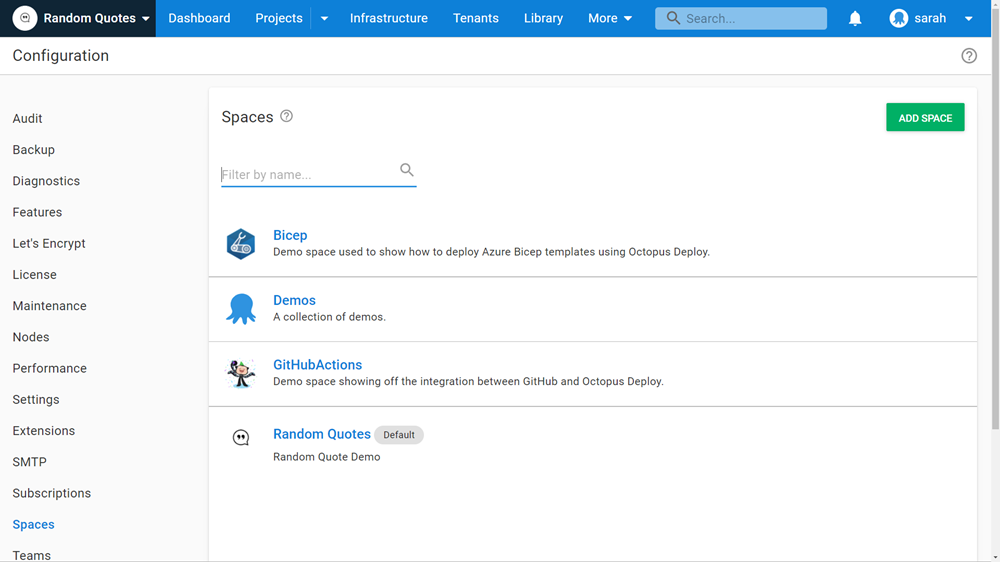

Hey folks!  Great to be back with you for part three of my “From Zero to Octopus Hero” blog series. I joined Octopus Deploy in October 2021 and am on a learning journey with the product and want to share that journey with you all!  In part one I covered what Octopus Deploy is and in part 2 I looked at DevOps and how Octopus Deploy can help you. 

In this post, I want to look further into integrating Octopus Deploy with existing tools organizations might. As well as diving into some more of Octopus’ features. 

## Config As Code

Version Control is core component to the DevOps methodology. Being able to version control your Octopus configuration is something that can now be done with Config as Code which is currently in Early Access Preview (EaP). 

With Config as Code you can view who did what and when to your Octopus configuration with that information being stored somewhere like GitHub. And if you are storing your application in GitHub as well, that gives you a single source of truth.  Application code, build scripts and deployment configuration all in the one place. 

It's been interesting to see how this works and how it can help organizations implement that version control over their Octopus configuration.  If you are looking to explore this feature be sure to install the ["Octopus Deploy for Visual Studio Code" plugin](https://marketplace.visualstudio.com/items?itemName=octopusdeploy.vscode-octopusdeploy) as it will really help with syntax highlighting when exploring the .OCL files that are creating within your Git repository by Octopus. 

Another great resource to check out if you want to learn more about Config as Code is the deep dive that Director of Product, Michael Richardson did last year. 

<iframe width="560" height="315" src="https://www.youtube.com/embed/oZfxlbpSP14" title="YouTube video player" frameborder="0" allow="accelerometer; autoplay; clipboard-write; encrypted-media; gyroscope; picture-in-picture" allowfullscreen></iframe>

## Exporting and Importing Projects

One of the things that I’ve found inside Octopus which is a handy feature is the exporting and importing of projects feature.  This means you can take settings and configurations from a project in one Space over to another Space. 

I spent a lot of time setting up my first Space and project, getting everything just right. And wanted to try something new and different. But wanted to take some of that work with me to another Space, and using the export/import feature meant I was able to do that. 

I can import into my new Space: 

* The project (name, settings)
* The deployment process and runbooks
* Project variables
* Channels and all lifecycles referenced
* Environments (see [below](https://octopus.com/docs/projects/export-import#environments) for details)
* [Tenants](https://octopus.com/docs/projects/export-import#tenants) connected to the project
* [Accounts](https://octopus.com/docs/projects/export-import#accounts) and [certificates](https://octopus.com/docs/projects/export-import#certificates) used by the project
* [Library variable sets](https://octopus.com/docs/projects/export-import#library-variable-sets) included in the project
* [Step templates](https://octopus.com/docs/projects/export-import#step-templates) used in the deployment process or runbooks
* Other projects referenced by [Deploy Release steps](https://octopus.com/docs/projects/coordinating-multiple-projects/deploy-release-step)

This is a great feature within Octopus to help move projects between Octopus instances or even split projects into multiple spaces for easier visibility.  Although it isn’t perfect as it won’t export and import: 

* [Packages](https://octopus.com/docs/projects/export-import#packages)
* [Deployment targets](https://octopus.com/docs/projects/export-import#deployment-targets)
* [Audit logs](https://octopus.com/docs/projects/export-import#audit-logs)
* [Workers](https://octopus.com/docs/projects/export-import#workers)
* [Project logos](https://octopus.com/docs/projects/export-import#project-logos)
* [Triggers](https://octopus.com/docs/projects/export-import#triggers)

## Authentication integration

Most organizations, if not all will have some existing authentication system already set up. Active Directory is probably the most widely used one.  Octopus Deploy can integrate with Active Directory plus others such as Azure Active Directory, GoogleApps, Okta, GitHub and LDAP.  Be sure to check out the[ authentication provider compatibility documentation](https://octopus.com/docs/security/authentication/auth-provider-compatibility) for more info. 

Authentication is one of the things you will most likely want to set up and have as a consistent experience for all your users.  If you are introducing Octopus Deploy into your environment the last thing you want to do is give your users another username/password combo to have to manage and deal with. 

## Personalize your space

Before I wrap up this blog post I want to share one small thing I’ve done that’s been fun to do and **useful**. Customizing the Spaces I have set up with descriptions and logos!

Under Configuration > Spaces and then in each Space you can add a description and a logo, which is helpful to quickly see what your Spaces are. And also easy for others working with you to see what each Space does. 

## Next Steps

I'm really starting to feel comfortable with Octopus Deploy. I still don't know everything about the product but the jigsaw pieces are starting to come together and I'm enjoying this learning journey!

Is there anything you'd like to see me cover or answer about Octopus Deploy? If so please let me know and I can cover them in part 4 of this blog post!

