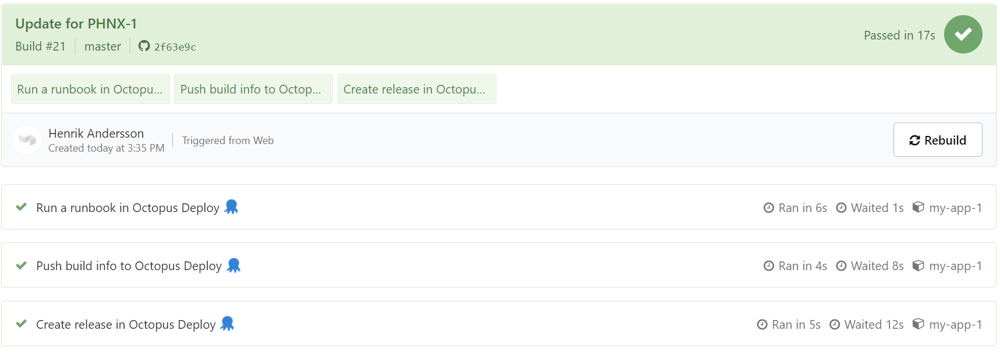
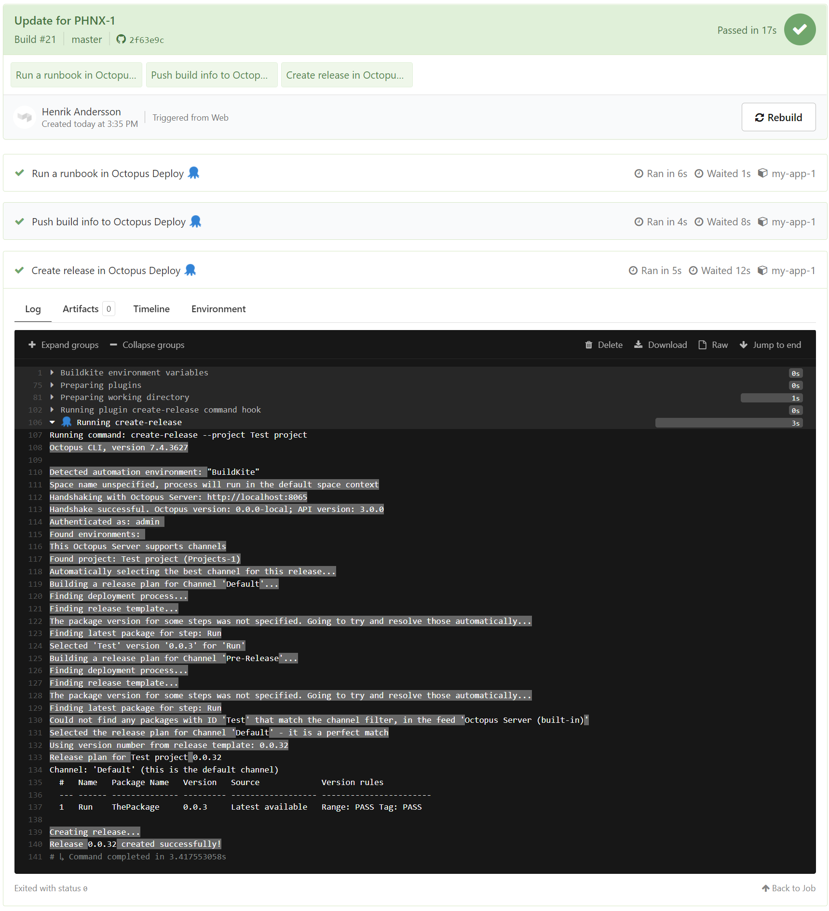

Octopus Deploy now integrates with [Buildkite](https://buildkite.com/). Our new Buildkite plugins will allow your build agents to create and deploy releases, push build information, and run runbooks as part of a pipeline.  

This post shows you how to use the Buildkite plugins to perform various operations with Octopus Deploy as part of a pipeline in Buildkite.

## What is Buildkite?

Buildkite is a platform for running Continuous Integration (CI) pipelines on your infrastructure. This makes it fast, secure, and scalable.

Builds are conducted through agents. These are small, reliable, and cross-platform build runners controlled through workflows defined in YAML. 

Agents are also extensible through plugins. These provide additional functionality to the workflows. They do things like execute steps in Docker containers, read values from a credential store, and add test summary annotations to builds.

## Buildkite integration with Octopus Deploy

Buildkite integration with Octopus Deploy is supported through the following plugins:

- [create-release-buildkite-plugin](https://github.com/OctopusDeploy/create-release-buildkite-plugin)
- [push-build-information-buildkite-plugin](https://github.com/OctopusDeploy/push-build-information-buildkite-plugin)
- [run-runbook-buildkite-plugin](https://github.com/OctopusDeploy/run-runbook-buildkite-plugin)

These plugins require the [Octopus CLI](https://octopus.com/downloads/octopuscli) to be installed on the Buildkite agent.



## Creating a release

In Octopus Deploy, a release is a snapshot of your deployment process and the associated assets (packages, scripts, variables) as they existed when your release was created. The release is given a version number, and you can deploy that release as many times as you need to, even if parts of the deployment process have changed since the release was created (those changes will be included in future releases but not in the current version).

When you deploy the release, you're executing the deployment process with all the associated details, as they existed when the release was created.

Creating a release in Octopus Deploy through Buildkite incorporates the [create-release-buildkite-plugin](https://github.com/OctopusDeploy/create-release-buildkite-plugin) into your pipeline:

```yaml
steps:
  - label: Create a release in Octopus Deploy 🐙
  - plugins: 
    - OctopusDeploy/create-release#v0.0.1:
        api_key: "${MY_OCTOPUS_API_KEY}"
        project: "HelloWorld"
        server: "${MY_OCTOPUS_SERVER}"
```

:::hint
We strongly recommended you use environment variables for sensitive values such as the API key or server address.
:::



## Pushing build information

When deploying a release, it's useful to know which build produced the artifact, what commits it contained, and which work items it's associated with. The build information feature allows you to upload information from your build server, manually or with a plugin, to Octopus Deploy.

Build information is associated with a package and includes:

- Build URL: a link to the build which produced the package
- Commits: details of the source commits related to the build
- Issues: issue references parsed from the commit messages

Pushing build information to Octopus Deploy from Buildkite can be done through the [push-build-information-buildkite-plugin](https://github.com/OctopusDeploy/push-build-information-buildkite-plugin):

```yaml
steps:
  - label: Push build info to Octopus Deploy 🐙
    plugins: 
      - OctopusDeploy/push-build-information#v0.0.1:
          api_key: "${MY_OCTOPUS_API_KEY}"
          packages: "HelloWorld"
          package_version: "1.0.0"
          server: "${MY_OCTOPUS_SERVER}"
```

## Running a runbook

Runbooks automate routine maintenance and emergency operations tasks, such as infrastructure provisioning, database management, and website failover and restoration. Runbooks include all the necessary permissions for the infrastructure they run on, so anybody on the team can execute the runbook, and because they're managed in Octopus there's a complete audit trail. Runbooks can use prompted variables so that human interaction is required.

A runbook can be run in Octopus Deploy through Buildkite using the [run-runbook-buildkite-plugin](https://github.com/OctopusDeploy/run-runbook-buildkite-plugin):

```yaml
steps:
  - label: Run runbook in Octopus Deploy 🐙
    plugins: 
      - OctopusDeploy/run-runbook#v0.0.1:
          api_key: "${MY_OCTOPUS_API_KEY}"
          environments: "Test"
          project: "Hello World"
          runbook: "Greeting"
          server: "${MY_OCTOPUS_SERVER}"
```

## Conclusion

The integration provided through our new Buildkite plugins represents our initial design and release. We plan to build additional plugins and eliminate the dependency on the Octopus CLI by providing integration through Bash scripts.

If you're an existing Octopus Deploy customer, check out [Buildkite](https://buildkite.com/) as part of your build pipeline. If you're an existing Buildkite customer, check out [Octopus Deploy](https://octopus.com/start) for deployments. And if you haven't tried either product, consider them both as part of your CI/CD pipeline.

Happy deployments!
