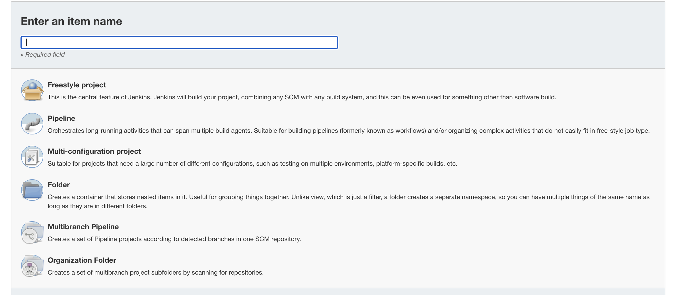

In this post, you learn how to build and push the Octopus Deploy underwater app to Amazon Elastic Container Registry (ECR) using Jenkins. 
 
## Prerequisites
 
To follow along, you need:

- An Amazon Web Services Account (AWS)
- A Jenkins instance
- A GitHub account

For instructions on installing Jenkins in your chosen environment, you can refer to our guides:

- [How to install Jenkins on Windows and Linux](https://octopus.com/blog/jenkins-install-guide-windows-linux)
- [How to install Jenkins on Docker](https://octopus.com/blog/jenkins-docker-install-guide)
- [How to install a Jenkins instance with Heml](https://octopus.com/blog/jenkins-helm-install-guide)

This post uses the [Octopus underwater app repository](https://github.com/OctopusSamples/octopus-underwater-app). You can fork the repository and follow along. 

Alternatively, the jenkins-ecr branch contains the template files to complete the steps in this post. You'll need to replace some values with your own. I've included my values in this post as a reference.

## Amazon Web Services setup

To set up AWS for Jenkins, you need to create an access key and an ECR repository to store the image.

To create an access key, go to **Amazon Console &rarr; IAM &rarr; Users &rarr; [your user] &rarr; Security credentials &rarr; Create Access Key**

Your browser will download a file containing the Access Key ID and the Secret Access Key. These values will be used in Jenkins to authenticate to Amazon.

To create a repository, go to the **Amazon Console &rarr; ECR &rarr; Create Repository**

The ECR requires an image repository set up for each image you publish. Name the repository the name you want the image to have. 

You will see your repository under **Amazon ECR &rarr; Repositories**. Make a note of the zone it is in, in the URI field.


## Jenkins setup

First, you need to install some plugins to interact with Docker and Amazon. Go to the **Dashboard**, then **Manage Jenkins**, then **Manage Plugins**. 

You need the following plugins:

- [CloudBees AWS Credentials](https://plugins.jenkins.io/aws-credentials/)
- [Amazon ECR](https://plugins.jenkins.io/amazon-ecr/)
- [Docker Pipeline](https://plugins.jenkins.io/docker-workflow/)

You can search for these plugins in the available tab. After they're installed, they appear in the installed tab.

You use a Jenkinsfile to compile, build, test, and push the image to Amazon ECR. A Jenkins file is a configuration file that defines a Jenkins Pipeline. A Jenkins Pipeline is a series of steps that Jenkins performs on an artifact to achieve the desired result. In this case, it's the clone, build, test, and push of an image to Amazon ECR. The power of using a Jenkinsfile is to check it into source control to manage different versions of the file.

In your Jenkins instance, go to **Manage Jenkins**, then **Manage Credentials**, then **Jenkins Store**, then **Global Credentials (unrestricted)**, and finally **Add Credentials**.


Fill in the following fields, leaving everything else as default:

- **Kind** - AWS credentials
- **ID** - aws-credentials
- **Access Key ID** - Access Key ID from earlier
- **Secret Access Key** - Secret Access Key from earlier 

Click **OK** to save.


Go to the **Jenkins Dashboard**, then **New Item**.

Give your pipeline a name and select the pipeline item, then **OK**.



Fill out the following fields for the pipeline, leaving everything else as default:

- **GitHub hook trigger for GITScm polling** - check the box
- **Definition** - pipeline script from SCM
- **SCM** - Git
- **Repository URL** - the URL of your forked repo and the jenkins-ecr branch
- **Credentials** - zone of the repository
- **Branch Specifier** - `*/jenkins-ecr`

Click **SAVE**.

## GitHub setup

For this example, you use a sample web application that displays an animated underwater scene with helpful links.

You need to set up a webhook so that Jenkins knows when the repository is updated. To do this, go to **Settings**, then **Webhooks**.


Fill out the following fields, leaving everything else as default.

- **Payload URL** - http://[jenkins-url]/github-webhook/
- **Content Type** - application/json
- **Which events would you like to trigger this webhook?**- Just the push event

Click **Add webhook** to save.

Add a Jenkins file to the root level of the repository. You will need to reference your Amazon ECR repository. Note the following changes required below:

```

pipeline {
    agent any
    options {
        skipStagesAfterUnstable()
    }
    stages {
         stage('Clone repository') { 
            steps { 
                script{
                checkout scm
                }
            }
        }
        
        stage('Build') { 
            steps { 
                script{
                 app = docker.build("underwater")
                }
            }
        }
        stage('Test'){
            steps {
                 echo 'Empty'
            }
        }
        stage('Deploy') {
            steps {
                script{
                        docker.withRegistry('https://720766170633.dkr.ecr.us-east-2.amazonaws.com', 'ecr:us-east-2:aws-credentials') {
                    app.push("${env.BUILD_NUMBER}")
                    app.push("latest")
                    }
                }
            }
        }
    }
}
```

The Jenkinsfile consists of different stages. Jenkins will run each of these stages in order, and if the build fails, you'll see which stage failed. 

Commit your code to GitHub. The commit will trigger a build job in Jenkins. Go to your Jenkins instance URL to see the build.

I had to trigger a Jenkins job via the **Build now** button manually. After this, the webhook triggers started working on every push.


After the build finishes, go to the Amazon ECR to see a new image built and pushed to the repository. It tags the latest push with the Jenkins build number and `latest`.


## Conclusion

In this post, you set up a Jenkins Pipeline to build a GitHub repository and push it to Amazon ECR. The Jenkinsfile can push to other repositories such as Google or Microsoft. It can also include additional stages depending on the build requirements. After the image is pushed, you can use a tool like Octopus Deploy to deploy the image to a target environment.

Happy deployments!