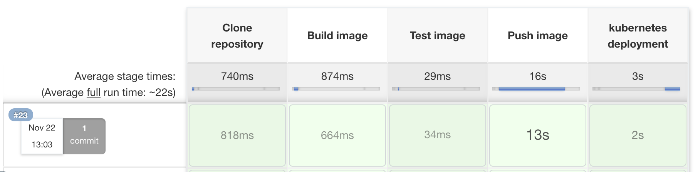

In this post, I show you how to build a Docker image with a Jenkinsfile workflow and publish the image to Amazon Elastic Container Registry (ECR). Jenkins will trigger a deployment to Amazon Elastic Kubernetes Service (EKS). 

Jenkins is a build server that automatically builds your code repository. Jenkins does this through a Jenkinsfile, a configuration file that specifies the steps in building, pushing, and deploying your application. 

Amazon EKS is a managed cloud service that provides Kubernetes clusters which handle workload applications. The Kubernetes clusters also take in a configuration file, specified by the YAML syntax. 

The power of this workflow is that configuration files can be specified for all stages of the process and be reused with slight modifications for a different environment.

## Prerequisites

To follow along, you need:

- An Amazon Web Services (AWS) account 
- A GitHub account
- A [Jenkins instance set up with a Pipeline](https://octopus.com/blog/jenkins-docker-ecr)

You need to extend the repository to include a deployment YAML file for this example. Jenkins will use this deployment file to deploy to EKS. Add this file to the root level of your repository.

This post uses the [Octopus underwater app repository](https://github.com/OctopusSamples/octopus-underwater-app). You can fork the repository and use the main branch to follow along. 

The jenkins-deploy branch contains the template files you need to complete the steps in this post. You have to replace some values with your own, but I've included my values in this post as a reference.

Because you're working with Kubernetes, the agent needs to be configured with a config file. [Amazon's documentation](https://awscli.amazonaws.com/v2/documentation/api/latest/reference/eks/update-kubeconfig.html) shows you how to configure your agent. 

AWS also requires the [aws-iam-authenticator binary](https://docs.aws.amazon.com/eks/latest/userguide/install-aws-iam-authenticator.html).

## Amazon Web Services setup

To set up AWS for Jenkins, you need to create an access key and an ECR repository to store the image.

To create an access key, go to **Amazon Console**, then **IAM**, then **Users**, `[your user]`, then **Security credentials**, and then **Create Access Key**.

Your browser downloads a file containing the Access Key ID and the Secret Access Key. These values are used in Jenkins to authenticate to Amazon.

To create a repository, go to the **Amazon Console**, then **ECR**, and then **Create Repository**.

You need to set up an image repository for each image that you publish. Give the repository the same name you want the image to have.

You'll see your repository under **Amazon ECR**, then **Repositories**. Make a note of the zone it's in, in the URI field.


### AWS cluster setup

Set up the cluster in AWS using the guide in our previous post, [Creating an ESK cluster in AWS](https://octopus.com/blog/eks-cluster-aws).

Create a file named `deployment.yml` in the root level of the repository.

```
apiVersion: apps/v1
kind: Deployment
metadata:
  name: underwater-app-jenkins 
  labels:
    app: octopus-underwater-app
spec:
  selector:
    matchLabels:
        app: octopus-underwater-app
  replicas: 3
  strategy:
    type: RollingUpdate
  template:
    metadata:
      labels:
        app: octopus-underwater-app
    spec:
      containers:
        - name: octopus-underwater-app
          image: 720766170633.dkr.ecr.us-east-2.amazonaws.com/octopus-underwater-app:latest
          ports:
            - containerPort: 80
              protocol: TCP
          imagePullPolicy: Always

```

Create a file named `Jenkinsfile` in the root level of your repository.

```


pipeline {
    agent any
    options {
        skipStagesAfterUnstable()
    }
    stages {
         stage('Clone repository') { 
            steps { 
                script{
                checkout scm
                }
            }
        }
        
        stage('Build') { 
            steps { 
                script{
                 app = docker.build("octopus-underwater-app")
                }
            }
        }
        stage('Test'){
            steps {
                 echo 'Empty'
            }
        }
        stage('Push') {
            steps {
                script{
                        docker.withRegistry('https://720766170633.dkr.ecr.us-east-2.amazonaws.com', 'ecr:us-east-2:aws-credentials') {
                    app.push("${env.BUILD_NUMBER}")
                    app.push("latest")
                    }
                }
            }
        }
        stage('Deploy'){
            steps {
                 sh 'kubectl apply -f deployment.yml'
            }
        }
        
    }
}

```
Jenkins will clone, build, test, push, and deploy the image to an EKS cluster. Jenkins does this through the deployment file you created earlier.

## Can Jenkins be used as a CD tool?

Jenkins is a continuous integration (CI) tool that focuses on building and pushing images to a remote repository. Using it as a continuous deployment (CD) tool is possible, however, it can't track a release through various deployment stages. 

A  continuous deployment tool like Octopus Deploy can help you manage releases when your deployments are complex. Octopus enables the benefits of a dedicated continuous deployment tool. If you're not already using Octopus Deploy, you can [sign up for a free trial](https://octopus.com/start).



## Viewing the web application

You need to port forward locally to inspect the service. Use this command to inspect the web application. The port 28015 is chosen based on the example in the Kubernetes documentation:

    kubectl port-forward deployment/underwater-app-jenkins  28015:80
    
Go to the IP address `http://127.0.0.1:28015/` in your browser to view your web application.


## Conclusion

In this post, you deployed a web application to EKS with Jenkins. This example demonstrated how Jenkins is able to configure the steps you need to deploy your code repository. Amazon EKS provided the Kubernetes infrastructure to handle the web application load. All steps in this process were carried out by specifying configuration files. These configuration files provide reusability across different environments.

!include <q1-2022-newsletter-cta>

Happy deployments!
