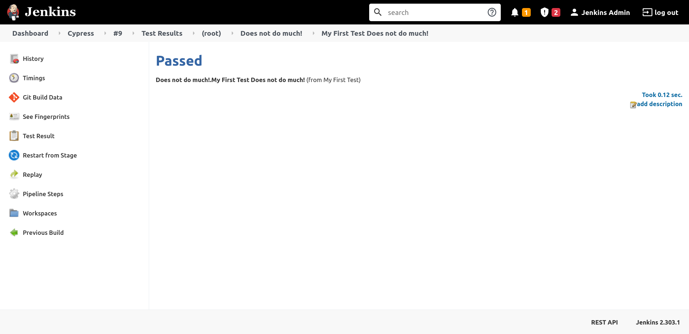
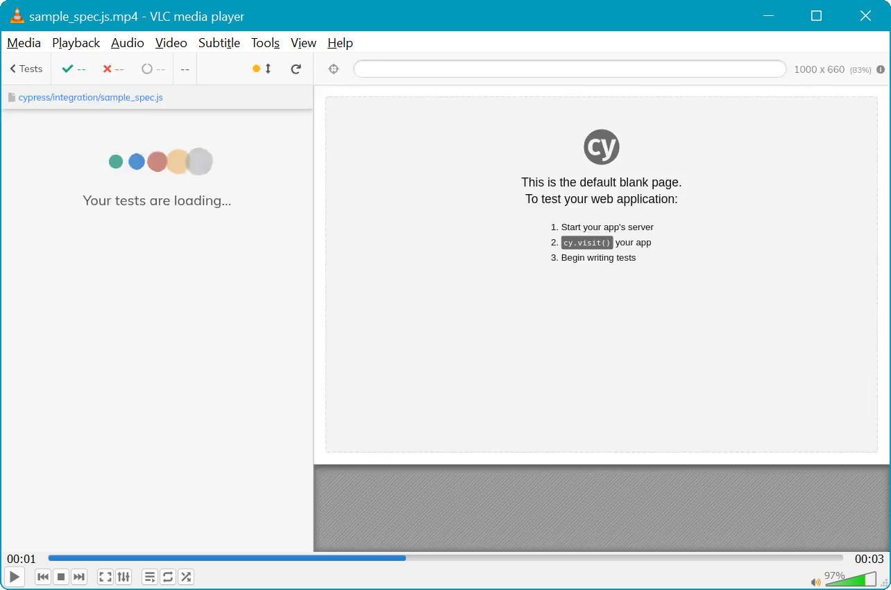
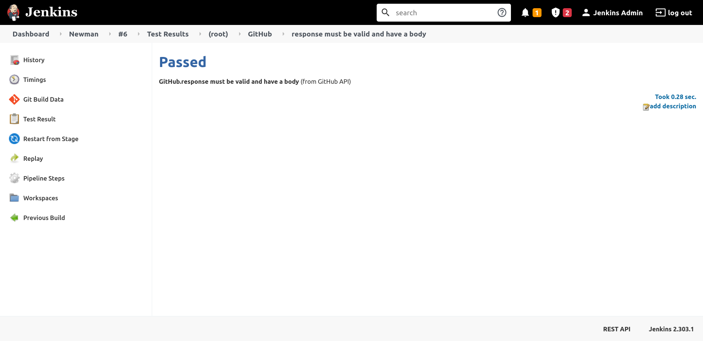

End-to-end (E2E) tests represent the final stages of automated testing. E2E are long running, certainly with respect to unit tests that can complete thousands of tests in seconds. They are typically executed by external tools which interact with the application under test, through public interfaces like web pages or HTTP APIs.

In this post, you'll learn how to run E2E tests with Cypress to validate interactions with web pages and with Newman, the command line test runner for Postman, to validate HTTP APIs.

## Prerequisites

To follow along with this post you need a Jenkins instance. 

For instructions on installing Jenkins in your chosen environment, you can refer to our guides:

- [How to install Jenkins on Windows and Linux](https://octopus.com/blog/jenkins-install-guide-windows-linux)
- [How to install Jenkins on Docker](https://octopus.com/blog/jenkins-docker-install-guide)
- [How to install a Jenkins instance with Helm](https://octopus.com/blog/jenkins-helm-install-guide)

Both [Cypress](https://www.cypress.io) and [Newman](https://learning.postman.com/docs/running-collections/using-newman-cli/command-line-integration-with-newman) (the Postman command line test runner) require you to install Node.js. The [Node.js website](https://nodejs.org/en/download/) provides downloads, or offers [installation instructions for package managers](https://nodejs.org/en/download/package-manager/).

## How to run browser tests with Cypress

Cypress is a browser automation tool that allows you to interact with web pages in much the same way an end user would, for example by clicking on buttons and links, filling in forms, and scrolling the page. You can also verify the content of a page to ensure the correct results have been displayed.

The [Cypress documentation provides an example first test](https://docs.cypress.io/guides/getting-started/writing-your-first-test) which has been saved to the [junit-cypress-test GitHub repo](https://github.com/OctopusSamples/junit-cypress-test). The test is shown below:

```javascript
describe('My First Test', () => {
  it('Does not do much!', () => {
    expect(true).to.equal(true)
  })
})
```

This test is configured to generate a JUnit report file in the `cypress.json` file:

```json
{
  "reporter": "junit",
   "reporterOptions": {
      "mochaFile": "cypress/results/results.xml",
      "toConsole": true
   }
}
```

Cypress is included as a development dependency in the `package.json` file:

```json
{
  "name": "cypress-test",
  "version": "0.0.1",
  "description": "A simple cypress test",
  "devDependencies": {
    "cypress": "8.6.0"
  }
}
```

You can run the Cypress test with the pipeline below:

```groovy
pipeline {
  // This pipeline requires the following plugins:
  // * Git: https://plugins.jenkins.io/git/
  // * Workflow Aggregator: https://plugins.jenkins.io/workflow-aggregator/
  // * JUnit: https://plugins.jenkins.io/junit/
  agent 'any'
  stages {
    stage('Checkout') {
      steps {
        script {
            checkout([$class: 'GitSCM', branches: [[name: '*/master']], userRemoteConfigs: [[url: 'https://github.com/OctopusSamples/junit-cypress-test.git']]])
        }
      }
    }
    stage('Dependencies') {
      steps {
        sh(script: 'npm install')        
      }
    }
    stage('Test') {
      steps {
        sh(script: 'NO_COLOR=1 node_modules/.bin/cypress run || true')          
      }
    }
  }
  post {
    always {
      junit(testResults: 'cypress/results/results.xml', allowEmptyResults : true)
      archiveArtifacts(artifacts: 'cypress/videos/sample_spec.js.mp4', fingerprint: true) 
    }
  }
}
```

The `Dependencies` stage downloads Cypress to the project directory:

```groovy
    stage('Dependencies') {
      steps {
        sh(script: 'npm install')        
      }
    }
```

The `Test` stage sets the `NO_COLOR` environment variable to `1` to strip an ANSI color code from the output, and then runs Cypress. Cypress returns a non-zero exit code if any tests fail, but we defer the decision to pass or fail the build to the test processor by ensuring this command always returns true by appending `|| true`.

You can learn more about processing failed tests in [Running unit tests in Jenkins](https://octopus.com/blog/jenkins-running-unit-tests):

```groovy
    stage('Test') {
      steps {
        sh(script: 'NO_COLOR=1 node_modules/.bin/cypress run || true')          
      }
    }
```

The `post` stage processes the JUnit report file and saves the generated video of the test as an artifact:

```groovy
  post {
    always {
      junit(testResults: 'cypress/results/results.xml', allowEmptyResults : true)
      archiveArtifacts(artifacts: 'cypress/videos/sample_spec.js.mp4', fingerprint: true) 
    }
  }
```

You can then drill into the test results using the same interface that exposes unit tests:



The video artifact captures the test output:



## How to run API tests with Newman

Newman is the command line test runner for Postman. The test scripts are exported from Postman as JSON files. An example that queries the GitHub API has been saved in the [junit-newman-test GitHub Repo](https://github.com/OctopusSamples/junit-newman-test):

```json
{
  "info": {
    "_postman_id": "f9b1443b-c23d-4738-901d-092cba2fc3d6",
    "name": "GitHub",
    "schema": "https://schema.getpostman.com/json/collection/v2.1.0/collection.json"
  },
  "item": [
    {
      "name": "GitHub API",
      "event": [
        {
          "listen": "test",
          "script": {
            "exec": [
              "pm.test(\"response must be valid and have a body\", ",
              "function () {\n",
              " pm.response.to.be.ok;\n",
              " pm.response.to.be.withBody;\n",
              " pm.response.to.be.json;\n",
              "\n",
              " pm.expect(pm.response.json().quote != \"\").to.be.true;\n",
              "});"
            ],
            "type": "text/javascript"
          }
        }
      ],
      "request": {
        "method": "GET",
        "header": [],
        "url": {
          "raw": "http://api.github.com/repos/OctopusSamples/junit-newman-test/git/trees/main",
          "protocol": "http",
          "host": [
            "api",
            "github",
            "com"
          ],
          "path": [
            "repos",
            "OctopusSamples",
            "junit-newman-test",
            "git",
            "trees",
            "main"
          ]
        }
      },
      "response": []
    }
  ]
}
```

Newman is saved as a development dependency in the `package.json` file:

```json
{
  "devDependencies": {
    "newman": "^5.3.0"
  }
}
```

You can run the Newman test with the pipeline below:

```groovy
pipeline {
  // This pipeline requires the following plugins:
  // * Git: https://plugins.jenkins.io/git/
  // * Workflow Aggregator: https://plugins.jenkins.io/workflow-aggregator/
  // * JUnit: https://plugins.jenkins.io/junit/
  agent 'any'
  stages {
    stage('Checkout') {
      steps {
        script {
            checkout([$class: 'GitSCM', branches: [[name: '*/main']], userRemoteConfigs: [[url: 'https://github.com/OctopusSamples/junit-newman-test.git']]])
        }
      }
    }
    stage('Dependencies') {
      steps {
        sh(script: 'npm install')        
      }
    }
    stage('Test') {
      steps {
        sh(script: 'node_modules/.bin/newman run GitHubTree.json --reporters cli,junit --reporter-junit-export results.xml || true')          
      }
    }
  }
  post {
    always {
      junit(testResults: 'results.xml', allowEmptyResults : true)
    }
  }
}
```

The `Dependencies` stage downloads Newman to the working directory:

```groovy
    stage('Dependencies') {
      steps {
        sh(script: 'npm install')        
      }
    }
```

The `Test` stage runs Newman, enabling the JUnit reporter with the `--reporters cli,junit` argument, and saving the result as a JUnit report file with the `--reporter-junit-export results.xml` argument. 

Newman will return a non-zero exit code if any tests fail, so to defer the success or failure of the build to the test processor, you ensure the command always returns true with `|| true`.

You can learn more about processing failed test in [Running unit tests in Jenkins](/blog/2022-q1/jenkins-running-unit-tests/index.md):

```groovy
    stage('Test') {
      steps {
        sh(script: 'node_modules/.bin/newman run GitHubTree.json --reporters cli,junit --reporter-junit-export results.xml || true')          
      }
    }
```

The `post` stage processes the JUnit report file:

```groovy
  post {
    always {
      junit(testResults: 'results.xml', allowEmptyResults : true)
    }
  }
```

The test results are then made available through the Jenkins web UI:



## Conclusion

E2E tests give you the ability to validate applications through their public interfaces as the final stage of automated testing. Unlike unit tests, E2E tests are often orchestrated with external tools. For example, Cypress provides the ability to automate interactions through a web browser, and Newman provides the ability to script and verify interactions with HTTP APIs. 

In this post you learned how to:

* Run a Cypress browser-based test
* Run a Newman API test
* Collect the results as JUnit report files
* Process the test results