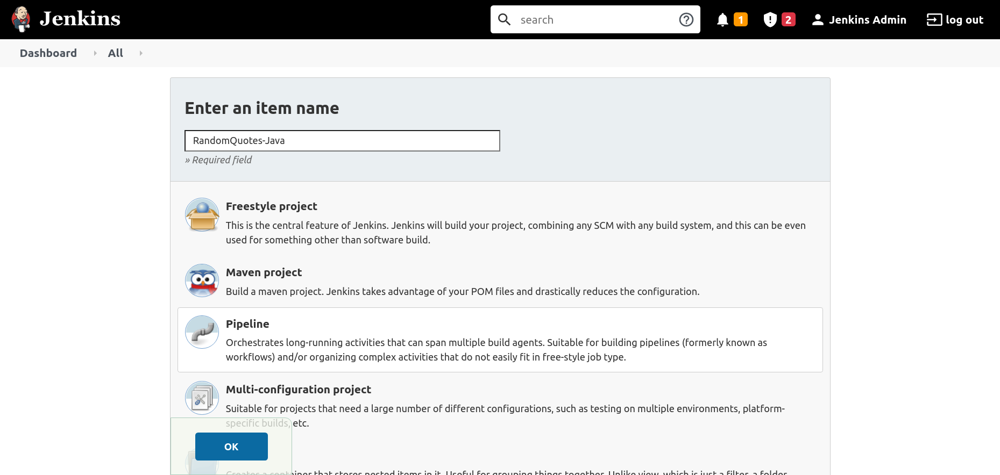
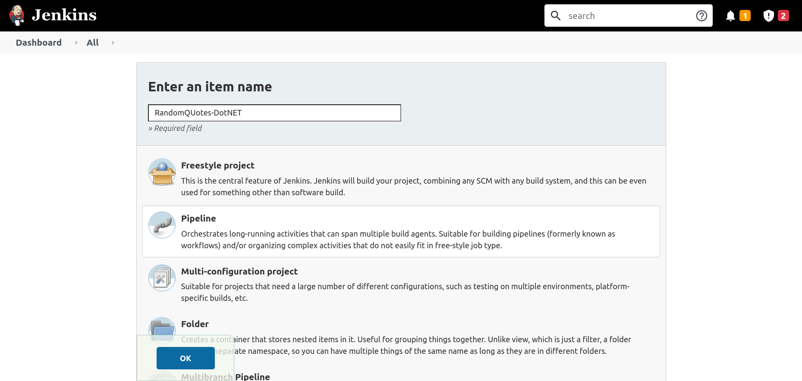

Verifying code changes with unit tests is a critical process in typical development workflows. Jenkins provides a number of plugins to collect and process the results of tests allowing developers to browse the results, debug failed tests, ignore some test failures, and generate reports on the history of tests over time.

In this post, you learn how to add unit tests to a Jenkins project and configure plugins to process the results.

## Prerequisites

To follow along with this post you need a Jenkins instance. The [Traditional Jenkins Installation](https://octopus.com/blog/jenkins-install-guide-windows-linux), [Docker Jenkins Installation](https://octopus.com/blog/jenkins-docker-install-guide), or [Helm Jenkins Installation](https://octopus.com/blog/jenkins-helm-install-guide) guides provide instructions to install Jenkins in your chosen environment.

The sample applications you'll build are written in Java and DotNET Core, so the Java Development Kit (JDK) and DotNET Core SDK must be installed on the Jenkins controller or agents that perform the builds.

You can find instructions on installing the DotNET Core SDK from the [Microsoft website](https://dotnet.microsoft.com/download/dotnet/3.1). The sample project is written against DotNET Core 3.1.

The OpenJDK project (and its downstream projects) provides free and open source distributions that you can use to compile Java applications. There are many OpenJDK distributions to choose from including:

- [OpenJDK](https://openjdk.java.net)
- [AdoptOpenJDK](https://adoptopenjdk.net)
- [Azul Zulu](https://www.azul.com/downloads/)
- [Red Hat OpenJDK](https://developers.redhat.com/products/openjdk/download)

I typically use the Azul Zulu distribution, although any distribution will do.

## Unit testing in Java

There are many unit testing frameworks available for Java, but the [most popular](https://www.overops.com/blog/the-top-100-java-libraries-in-2016-after-analyzing-47251-dependencies/) is [JUnit](https://junit.org).

You'll use the [Random Quotes](https://github.com/OctopusSamples/RandomQuotes-Java) sample application to demonstrate JUnit tests running in a Jenkins project.

### Installing the Jenkins plugin

You must install the [JUnit](https://plugins.jenkins.io/junit/) plugin to process the result of JUnit tests.

To install the plugin:

1. Click **Manage Jenkins**, then **Manage Plugins**, then **Available**.
1. Enter `junit` in the search box.
1. Select the **JUnit** option, and click **Install without restart**:


### Creating the pipeline project in Jenkins

To create a new pipeline project, click **New Item**, enter `RandomQuotes-Java` for the item name, select the **Pipeline** option, and click the **OK** button:



Paste the following pipeline script into the **Pipeline** section, and click the **Save** button:

```groovy
pipeline {
  // This pipeline requires the following plugins:
  // * Git: https://plugins.jenkins.io/git/
  // * Workflow Aggregator: https://plugins.jenkins.io/workflow-aggregator/
  // * JUnit: https://plugins.jenkins.io/junit/
  agent 'any'
  stages {
    stage('Checkout') {
      steps {
        script {
            checkout([$class: 'GitSCM', branches: [[name: '*/master']], userRemoteConfigs: [[url: 'https://github.com/OctopusSamples/RandomQuotes-Java.git']]])
        }
      }
    }
    stage('Test') {
      steps {
        sh(script: './mvnw --batch-mode -Dmaven.test.failure.ignore=true test')
        
      }
    }
    stage('Package') {
      steps {
        sh(script: './mvnw --batch-mode package -DskipTests')
      }
    }
  }
  post {
    always {
      junit(testResults: 'target/surefire-reports/*.xml', allowEmptyResults : true)
    }
  }
}
```


The `Test` stage contains a step running the maven `test` goal, passing `--batch-mode` to avoid unnecessary logging showing each dependency being downloaded and `-Dmaven.test.failure.ignore=true` to allow the step to pass successfully even if there are failing tests.

```groovy
sh(script: './mvnw --batch-mode -Dmaven.test.failure.ignore=true test')
```

The `post` section contains the `always` condition block, which processes the test results with the JUnit plugin:

```groovy
junit(testResults: 'target/surefire-reports/*.xml', allowEmptyResults : true)
```

The `Package` stage packages the application while skipping any tests with the `-DskipTests` argument, as testing was handled in the previous stage:

```groovy
sh(script: './mvnw --batch-mode -Dmaven.test.skip=true clean package', returnStdout: true)
```

The **Test Result Trend** graph tracks the passed, failed, and skipped tests across the project's history:


## Unit testing in DotNET Core

There are a number of popular unit testing frameworks for DotNET Core including MSTest, NUnit, and xUnit. You'll use the [RandomQuotes](https://github.com/OctopusSamples/RandomQuotes) sample application to demonstrate running NUnit tests from a Jenkins Pipeline.

### Installing the Jenkins plugin

Use the [MSTest](https://plugins.jenkins.io/mstest/) plugin to process DotNET Core test results.

Install the [MSTest](https://plugins.jenkins.io/mstest/) plugin to process the result of NUnit tests. To install the plugin:

1. Click **Manage Jenkins**, then **Manage Plugins** ,then **Available**.
1. Enter `mstest` in the search box.
1. Select the **MSTest** option, and click **Install without restart**:


### Creating the pipeline project in Jenkins

To create a new pipeline project, click **New Item**, enter `RandomQuotes-DotNET` for the item name, select the **Pipeline** option, and click the **OK** button:



Paste the following pipeline script into the **Pipeline** section, and click the **Save** button:

```groovy
pipeline {
  // This pipeline requires the following plugins:
  // * Git: https://plugins.jenkins.io/git/
  // * Workflow Aggregator: https://plugins.jenkins.io/workflow-aggregator/
  // * MSTest: https://plugins.jenkins.io/mstest/
  agent 'any'
  stages {
    stage('Environment') {
      steps {
          echo "PATH = ${PATH}"
      }
    }
    stage('Checkout') {
      steps {

        script {
            checkout([$class: 'GitSCM', branches: [[name: '*/master']], userRemoteConfigs: [[url: 'https://github.com/OctopusSamples/RandomQuotes.git']]])
        }
      }
    }
    stage('Dependencies') {
      steps {
        sh(script: 'dotnet restore')
      }
    }
    stage('Build') {
      steps {
        sh(script: 'dotnet build --configuration Release', returnStdout: true)
      }
    }
    stage('Test') {
      steps {
        sh(script: 'dotnet test -l:trx || true')        
      }
    }
  }
  post {
    always {
      mstest(testResultsFile: '**/*.trx', failOnError: false, keepLongStdio: true)
    }
  }
}
```

The `Test` stage calls `dotnet test` to run the unit tests, passing the argument `-l:trx` to write the test results in a Visual Studio Test Results (TRX) file.

This command will return a non-zero exit code if any tests failed. To ensure the pipeline continues to be processed in the event of a failed test, you return `true` if `dotnet test` indicates a failure:

```bash
sh(script: 'dotnet test -l:trx || true')
```

You then process the test results with the MSTest plugin in the `post` section:

```bash
mstest(testResultsFile: '**/*.trx', failOnError: false, keepLongStdio: true)
```

## How to handle failed tests

So far, you've only run builds with successful tests. To simulate a failing test, modify the `Checkout` stage to point to the `failing-test` branch of the Java Random Quotes application:

```groovy
pipeline {
  // This pipeline requires the following plugins:
  // * Git: https://plugins.jenkins.io/git/
  // * Workflow Aggregator: https://plugins.jenkins.io/workflow-aggregator/
  // * JUnit: https://plugins.jenkins.io/junit/
  agent 'any'
  stages {
    stage('Checkout') {
      steps {
        script {
            checkout([$class: 'GitSCM', branches: [[name: '*/failing-test']], userRemoteConfigs: [[url: 'https://github.com/OctopusSamples/RandomQuotes-Java.git']]])
        }
      }
    }
    stage('Test') {
      steps {
        sh(script: './mvnw --batch-mode -Dmaven.test.failure.ignore=true test')
      }
    }
    stage('Package') {
      steps {
        sh(script: './mvnw --batch-mode package -DskipTests')
      }
    }
  }
  post {
    always {
      junit(testResults: 'target/surefire-reports/*.xml', allowEmptyResults : true)
    }
  }
}
```

This branch has tests that always fail. Builds from this branch are marked as unstable, and the **Test Result Trend** graph shows a new failing test:


To view the details of the tests, click into the build task and click the **Test Result** link. Here you can drill into each test, view the test result, and view the logs:


### Claiming failed tests

The example pipelines above have gone to some lengths to allow builds to succeed when tests are failing. This ensures the test results are processed by the JUnit or MSTest plugins even when tests fail. However, it's expected that test failures are still addressed by the engineering team. The [Claim](https://plugins.jenkins.io/claim/) plugin provides the ability for Jenkins users to claim responsibility for failed tests.

The pipeline below allows failed tests to be claimed:

```groovy
pipeline {
  // This pipeline requires the following plugins:
  // * Git: https://plugins.jenkins.io/git/
  // * Workflow Aggregator: https://plugins.jenkins.io/workflow-aggregator/
  // * JUnit: https://plugins.jenkins.io/junit/
  // * Claim: https://plugins.jenkins.io/claim/
  agent 'any'
  options{
    // This option allows broken builds to be claimed
    allowBrokenBuildClaiming()
  }
  stages {
    stage('Checkout') {
      steps {
        script {
            checkout([$class: 'GitSCM', branches: [[name: '*/failing-test']], userRemoteConfigs: [[url: 'https://github.com/OctopusSamples/RandomQuotes-Java.git']]])
        }
      }
    }
    stage('Test') {
      steps {
        sh(script: './mvnw --batch-mode -Dmaven.test.failure.ignore=true test')
      }
    }
    stage('Package') {
      steps {
        sh(script: './mvnw --batch-mode package -DskipTests')
      }
    }
  }
  post {
    always {
      // The testDataPublishers argument allows failed tests to be claimed
      junit(testDataPublishers: [[$class: 'ClaimTestDataPublisher']], testResults: 'target/surefire-reports/*.xml', allowEmptyResults : true)
    }
  }
}
```

Failed tests can be claimed through the **Test Result** screen:


A global report of all claims can be found by opening the **Claim Report** link:


### Failing the build when tests fail

You may require that builds fail rather than being marked as unstable in the event of a test failure. You generally have 2 options to achieve this:

- Failing the test command
- Failing the test processing

#### Failing the test command

The first option allows the command that ran the tests to fail. Most test runners will return a non-zero exit code if tests fail, which in turn will cause the build to fail.

You can use the following Maven command execute tests and return a non-zero exit code if any fail. The absence of the `-Dmaven.test.failure.ignore=true` argument reverts the command to its default behavior:

```bash
sh(script: './mvnw --batch-mode test')
```

The following DotNET Core command also returns a non-zero exit code if any test fails. The absence of the `|| true` command chain ensures the `dotnet` exit code is returned:

```bash
sh(script: 'dotnet test -l:trx') 
```

#### Failing the test processing

The second option allows the test processor to determine if the build failed or not.

The MSTest plugin provides the `failOnError` argument to fail the step if any tests fail:

```groovy
mstest(testResultsFile: '**/*.trx', failOnError: true, keepLongStdio: true)
```

Unfortunately, [the JUnit plugin does not have the ability to fail a build based on the test results](https://issues.jenkins.io/browse/JENKINS-2734?page=com.atlassian.jira.plugin.system.issuetabpanels%3Aall-tabpanel).

An alternative is to use the [xUnit plugin](https://plugins.jenkins.io/xunit/), which supports thresholds for skipped and failed tests.

The example pipeline below replaces the JUnit plugin with xUnit:

```groovy
pipeline {
  // This pipeline requires the following plugins:
  // * Git: https://plugins.jenkins.io/git/
  // * Workflow Aggregator: https://plugins.jenkins.io/workflow-aggregator/
  // * xUnit: https://plugins.jenkins.io/xunit/
  // * Claim: https://plugins.jenkins.io/claim/
  agent 'any'
  options {
    allowBrokenBuildClaiming()
  }
  stages {
    stage('Checkout') {
      steps {
        script {
            checkout([$class: 'GitSCM', branches: [[name: '*/failing-test']], userRemoteConfigs: [[url: 'https://github.com/OctopusSamples/RandomQuotes-Java.git']]])
        }
      }
    }
    stage('Test') {
      steps {
        sh(script: './mvnw --batch-mode -Dmaven.test.failure.ignore=true test')
      }
    }
    stage('Package') {
      steps {
        sh(script: './mvnw --batch-mode package -DskipTests')
      }
    }
  }
  post {
    always {
      xunit (testDataPublishers: [[$class: 'ClaimTestDataPublisher']], thresholds: [ skipped(failureThreshold: '0'), failed(failureThreshold: '0')], tools: [[$class: 'JUnitType', pattern: '**/surefire-reports/*.xml']])
    }
  }
}
```

The example pipeline below replaces the MSTest plugin with xUnit:

```groovy
pipeline {
  // This pipeline requires the following plugins:
  // * Git: https://plugins.jenkins.io/git/
  // * Workflow Aggregator: https://plugins.jenkins.io/workflow-aggregator/
  // * xUnit: https://plugins.jenkins.io/xunit/
  // * Claim: https://plugins.jenkins.io/claim/
  agent 'any'
  options {
    allowBrokenBuildClaiming()
  }
  stages {
    stage('Environment') {
      steps {
          echo "PATH = ${PATH}"
      }
    }
    stage('Checkout') {
      steps {

        script {
            checkout([$class: 'GitSCM', branches: [[name: '*/failing-tests']], userRemoteConfigs: [[url: 'https://github.com/OctopusSamples/RandomQuotes.git']]])
        }
      }
    }
    stage('Dependencies') {
      steps {
        sh(script: 'dotnet restore')
      }
    }
    stage('Build') {
      steps {
        sh(script: 'dotnet build --configuration Release', returnStdout: true)
      }
    }
    stage('Test') {
      steps {
        sh(script: 'dotnet test -l:trx || true')
      }
    }
  }
  post {
    always {
      xunit (testDataPublishers: [[$class: 'ClaimTestDataPublisher']], thresholds: [ skipped(failureThreshold: '0'), failed(failureThreshold: '0')], tools: [[$class: 'MSTestJunitHudsonTestType', pattern: '**/*.trx']])
    }
  }
}
```

## Conclusion

Unit tests are common in most large code bases. By executing unit tests in Jenkins the development team has a central source of truth reporting the current and historical test results.

In this post, you learned:

- How to run tests in Java and DotNET Core code bases
- How to collect and process the test results with the JUnit, MSTest, and xUnit plugins
- How to allow Jenkins users to claim failed tests to indicate they'll take responsibility for them
- How to fail a build when the tests fail

!include <jenkins-webinar-jan-2022>

!include <q1-2022-newsletter-cta>

Happy deployments!