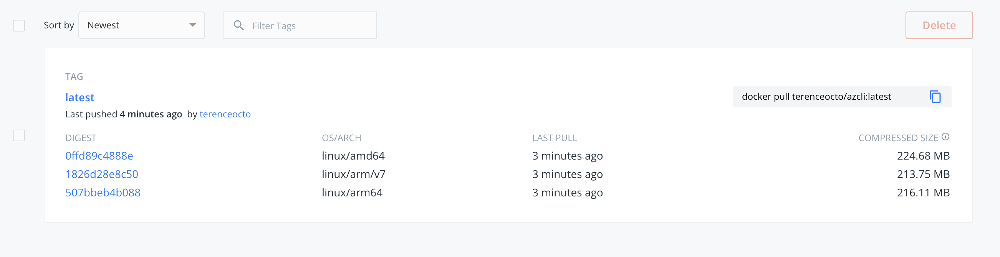
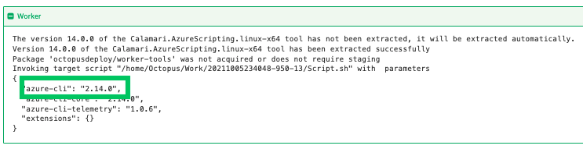
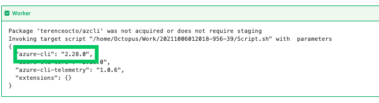

## Octopus Deploy and the Azure Command Line Interface

Octopus Deploy has supported the Azure Command Line Interface (CLI) as part of its [custom worker tools](https://github.com/OctopusDeploy/WorkerTools). Since Octopus 2021.1, Octopus no longer maintains the current Azure CLI version. Any deployments using the pre-bundled version will encounter a warning recommending them to maintain their worker image. 

Using the Azure tools bundled with Octopus Deploy is not recommended. Octopus bundles versions of the Azure Resource Manager Powershell modules (AzureRM) and Azure CLI. These were convenience mechanisms for users wanting to run scripts against Azure targets.

The Azure tools bundled with Octopus Deploy have been provided as a convenience for users who need to run scripts against Azure targets. Octopus bundles versions of the Azure Resource Manager Powershell modules (AzureRM) and Azure CLI. However, since Octopus 2021.1, we recommend maintaining your worker container with the versioning you need to run your deployments. This way, the tooling provided matches the requirements specified by the deployment.

This blog post will run through an example of creating a custom docker image with the latest Azure CLI version, hosting it on Docker Hub, and using it in an Octopus Deploy deployment.

## Install and push custom container

I create a Dockerfile that specifies the operating system, as well as the Azure CLI install commands. Here I have set the latest version of the CLI to be installed (2.28.0)

    FROM ubuntu:18.04

    ARG DEBIAN_FRONTEND=noninteractive
    ARG Azure_Cli_Version=2.28.0\*

    # Install wget, apt-utils, and software-properties-common
    RUN apt-get update && \
    apt-get install -y wget apt-utils && \
    apt-get install -y software-properties-common

    # Install the Azure CLI
    RUN wget --quiet -O - https://packages.microsoft.com/keys/microsoft.asc | gpg --dearmor | tee /etc/apt/trusted.gpg.d/microsoft.asc.gpg > /dev/null && \
    echo "deb [arch=amd64] https://packages.microsoft.com/repos/azure-cli/ bionic main" | tee /etc/apt/sources.list.d/azure-cli.list && \
    apt-get update && \
    apt-get install -y azure-cli=${Azure_Cli_Version}

    # Tidy up
    RUN apt-get clean
    
This Dockerfile can include other forms of tooling if required. Octopus is recommending all users maintain their tooling versions as this will ensure consistent deployment outcomes.

I then run a docker buildx command to build and push my image to Docker Hub. I have an M1 Mac, and using multiple platforms ensures that Octopus Deploy will pull down the appropriate version.

    docker buildx build --platform linux/amd64,linux/arm64,linux/arm/v7 -t terenceocto/azcli:latest --push .
    
Upon success, Docker Hub will host the image on Docker Hub.

## Confirm Success

I set up a deployment with the built-in Azure CLI and printed out the version to the screen.

I use the new custom image on Docker Hub and print out the version again. The Azure CLI is now up to date, and I can access it in my own Docker Hub repository.

Since Octopus 2021.1, the Azure CLI and other tooling are not current. Customers should supply their image with tooling that supports their deployments. This blog post has shown you how to set up a docker image with the latest Azure CLI and use it in an Octopus Deploy deployment.

Happy Deployments!

