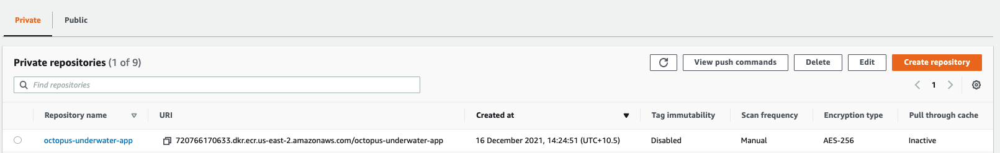
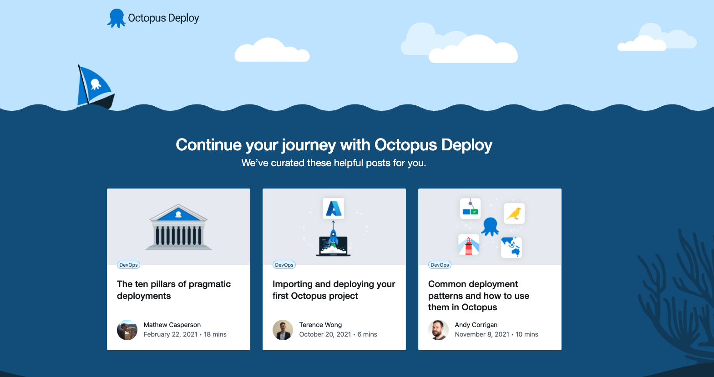

During a deployment process, an artifact is built by a build server before being deployed. Jenkins is a build server designed for multi-environment settings. Jenkins can package and push your artifact to a central repository. From here, a Continuous Delivery (CD) tool can take the artifact and deploy it. 

Octopus Deploy is a best in class CD tool that helps with this process. Octopus can interface with and deploy to major cloud providers like Azure, Google, and Amazon. 

In this post, I show you how to build and push the Octopus underwater app to Amazon Elastic Container Registry (ECR). Jenkins will trigger a deployment in Octopus Deploy. Octopus will then deploy the app to Amazon Elastic Kubernetes Service (EKS). 

## Prerequisites

To follow along, you need:

- An Amazon Web Services (AWS) account
- A GitHub account
- A [Jenkins instance set up with a pipeline](https://octopus.com/blog/jenkins-docker-ecr). If you're using the branch, specify the jenkins-octopus branch reference in Jenkins.

This post uses the [Octopus underwater app repository](https://github.com/OctopusSamples/octopus-underwater-app). You can fork the repository and use the main branch to follow along. 

The jenkins-octopus branch contains the template files needed to complete the steps in this post. You have to replace some values with your own, but I've included my values in this post as a reference.

## Amazon Web Services setup

To set up AWS for Jenkins, you need to create an access key and an ECR repository to store the image.

To create an access key, go to **Amazon Console**, then **IAM**, then **Users**, `[your user]`, then **Security credentials**, and then **Create Access Key**.

Your browser downloads a file containing the Access Key ID and the Secret Access Key. These values are used in Jenkins to authenticate to Amazon.

To create a repository, go to the **Amazon Console**, then **ECR**, and then **Create Repository**.

You need to set up an image repository for each image that you publish. Give the repository the same name you want the image to have.

You'll see your repository under **Amazon ECR**, then **Repositories**. Make a note of the zone it's in, in the URI field.



### AWS cluster setup

Set up the cluster in AWS using the guide in our previous post, [Creating an ESK cluster in AWS](https://octopus.com/blog/eks-cluster-aws).

Extend the pipeline with Octopus `release` and `deploy` commands. Create a Jenkinsfile and paste the following code:

```


pipeline {
    agent any
    options {
        skipStagesAfterUnstable()
    }
    stages {
         stage('Clone repository') { 
            steps { 
                script{
                checkout scm
                }
            }
        }
        
        stage('Build') { 
            steps { 
                script{
                 app = docker.build("octopus-underwater-app")
                }
            }
        }
        stage('Test'){
            steps {
                 echo 'Empty'
            }
        }
        stage('Push') {
            steps {
                script{
                        docker.withRegistry('https://720766170633.dkr.ecr.us-east-2.amazonaws.com', 'ecr:us-east-2:aws-credentials') {
                    app.push("${env.BUILD_NUMBER}")
                    app.push("latest")
                    }
                }
            }
        }
        stage('Deploy'){
            steps {
                script{
                    octopusCreateRelease additionalArgs: '', cancelOnTimeout: false, channel: '', defaultPackageVersion: '', deployThisRelease: false, deploymentTimeout: '', environment: "Development", jenkinsUrlLinkback: false, project: "underwater-octo", releaseNotes: false, releaseNotesFile: '', releaseVersion: "1.0.${BUILD_NUMBER}", tenant: '', tenantTag: '', toolId: 'Default', verboseLogging: false, waitForDeployment: false
                    octopusDeployRelease cancelOnTimeout: false, deploymentTimeout: '', environment: "Development", project: "underwater-octo", releaseVersion: "1.0.${BUILD_NUMBER}", tenant: '', tenantTag: '', toolId: 'Default', variables: '', verboseLogging: false, waitForDeployment: true
                }
            }
        }
        
    }
}

```

## Octopus Deploy setup

In your Octopus Deploy instance, you need to create a project called `aws-jenkins`:

 - Go to **Project**, then **Add Project**. 
 - Add the `aws-jenkins` title and click **Save**.

Next, set up Development, Test, and Production environments:

- Go to **Infrastructure**, then **Environments**, and then **Add Environment**. 
- Name it `Development` and click **Save**. 
- Do the same for a Test and Production environment.

You need to set up the Amazon account to deploy to EKS:

- Go to **Infrastructure**, then **Accounts**, then **Add Account**, and then **AWS Account**. 
- Give it a name and fill out the **Access Key ID** and **Secret Access Key** from earlier.

Now you need to set up your AWS Kubernetes cluster as a deployment target in Octopus Deploy: 

- Go to **Infrastructure**, then **Deployment Targets**, then **Add Deployment Target**, then **Kubernetes Cluster**, and then **Add**. 

Follow the [steps in our Docs](https://octopus.com/docs/infrastructure/deployment-targets#adding-deployment-targets) which indicate the fields to add to set up the deployment target. In this section you give the deployment target a target role. This will be referenced in the Octopus Deploy step later.

You need to add the Amazon feed to the Octopus instance: 

- Go to **Library**, then **External Feeds**, then **Add Feed**, and then select the **AWS Elastic Container Registry**. 
- Enter your **Access Key ID**, **Secret Access Key**, and the **Zone** of your registry. 


## Deploying to EKS step

In your `aws-jenkins` project, go to **Process**, then **Add deployment step**, then **Kubernetes**, and then **Deploy Kubernetes Containers**. Add the target role that you gave your deployment target earlier.

Add the following into the YAML section:

```

apiVersion: apps/v1
kind: Deployment
metadata:
  name: octopus-underwater-app-jenkins
  labels:
    app: octopus-underwater-app
spec:
  selector:
    matchLabels:
        app: octopus-underwater-app
  replicas: 3
  strategy:
    type: RollingUpdate
  template:
    metadata:
      labels:
        app: octopus-underwater-app
    spec:
      containers:
        - name: octopus-underwater-app
          image: 720766170633.dkr.ecr.us-east-2.amazonaws.com/octopus-underwater-app
          ports:
            - containerPort: 80
              protocol: TCP
          imagePullPolicy: Always
```

Click **SAVE**.

## Deploying in Jenkins

To connect Jenkins to Octopus, you need to install the [Octopus plugin](https://plugins.jenkins.io/octopusdeploy/). 

Go to **Dashboard**, then **Manage Plugins**. If the plugin is not installed, search for the Octopus plugin in the **Available** tab and install the plugin. Follow the [guide in our Docs that explains how to set up Jenkins and the Octopus plugin](https://octopus.com/docs/packaging-applications/build-servers/jenkins).

Once the Octopus plugin is set up, make a change to the code on GitHub, and the build will trigger in Jenkins and Octopus.


Navigate back to the Octopus instance project overview and you see the release deployed to the Development environment.


Now you can progress the release to the Test and Production environment when you're ready. Click **Deploy** to progress the release.


You need to port forward locally to inspect the service. Use this command to inspect the web application. The port 28015 is chosen based on the example in the Kubernetes documentation:

    kubectl port-forward deployment/octopus-underwater-app-jenkins  28015:80
    
Go to the IP address `http://127.0.0.1:28021/` in your browser to view your web application.



## The benefits of a dedicated CD tool

Octopus is a dedicated Continuous Delivery (CD) tool. It natively supports release management. Jenkins defines environments through the pipeline file. They are dividers to the pipeline code. 

In Octopus, environments are dedicated spaces. Octopus Deploy makes it easy to stop a deployment in a staging environment before it gets pushed to production. The dashboard below shows the capability. Different releases are present in different environments, and it's easy to see where releases are in the lifecycle.

Jenkins is a Continuous Integration (CI) tool. It can do some parts of CD, but not all. Jenkins is commonly used to build and push images to a central repository. Octopus Deploy can interface with several different repositories and manage the deployment process. This separation of concerns allows Jenkins and Octopus Deploy to focus on what they're good at, enabling happier deployments.


## Conclusion

In this post, you built a web application using Jenkins, pushed it to the ECR, and used Octopus Deploy to manage the deployment to Kubernetes. 

Octopus Deploy provides a dedicated dashboard to view deployments in their different stages. The dashboard highlights how Octopus Deploy supplements a CI tool like Jenkins. 

Octopus Deploy supports all the major cloud providers, including Azure, Google, and Amazon. If you're not already using Octopus, you can start a [free trial](https://octopus.com/).

!include <q1-2022-newsletter-cta>

Happy deployments!