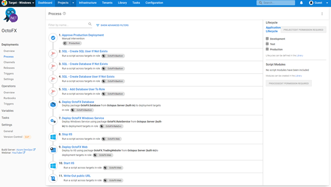
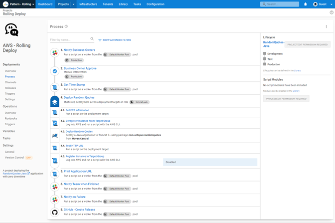

Hey folks, welcome to part 2 of my zero to hero blog series. 

I joined Octopus Deploy in October 2021 and I'm on a learning journey with the product. In [part one](https://octopus.com/blog/zero-to-octopus-hero-part-1) I covered what Octopus Deploy does and set up the infrastructure to get started.  
 
In Part 2, I look at how Octopus Deploy helps implement DevOps for your organization. 

## Introduction to DevOps

“DevOps is the union of people, process, and products to enable continuous delivery of value to our end users.” - Donovan Brown.
 
I’ve spent years in the IT industry and worked my way through many checklists for deploying a server or helping to release a new version of software to customers.
 
While checklists are helpful, the human element in that process can be flawed. Issues include:

- Assuming you completed a task
- Skipping tasks
- Using an outdated version of a checklist
 
This is where DevOps can help. If you build your checklist into an automation sequence, the automation tool won’t assume anything, and it won’t skip a task because it's tired or in a rush.
 
DevOps helps to introduce the consistency we need in our IT environment.  It also completes tasks faster than a human in many cases.
 
When we talk about DevOps you often hear the terms Continuous Integration and Continuous Deployment (CI/CD) mentioned.
 
Continuous Integration (CI) is the process of checking all your code into a version control system.  A popular tool is Git, with code repository choices including GitHub, GitLab, Azure DevOps, and BitBucket.
 
CI pulls your code into a pipeline that builds your code, or compiles your application.  It then completes automated tests. You then package your code or app into a deployable artifact, such as a Zip file, NuGet package, or Docker image. Your artifact can then be deployed using a Continuous Deployment (CD) pipeline. 

Continuous Deployment (CD) focuses on the deployment, the actual installation, and distribution of your bits, the code, or the application.  CD helps you distribute your code or application through different environments, from dev, to test, and production. 

## DevOps with Octopus Deploy

Octopus Deploy works in conjunction with [Continuous Integration (CI) servers (also known as build servers)](https://octopus.com/blog/tag/CI%20Series) like Azure DevOps, TeamCity, Bamboo, Jenkins, and GitHub Actions. 
 
Over a few weeks, I worked on building an ASP.NET application using the CI pipeline in Azure DevOps, then passing it to Octopus to deploy to my cloud platform.

### Step templates
 
The power for deployments in Octopus Deploy is impressive. You configure your CD pipeline using [step templates](https://octopus.com/docs/projects/built-in-step-templates). The step templates range from being able to run a script, to importing certificates into your Windows server.
 
These step templates speed up your process by providing the code. You don’t have to know the scripting syntax for tasks like importing a certificate into your server. Instead, you select the step template, then answer some basic questions, and Octopus Deploy takes care of the rest.

I'm not a developer, so this made it quick and easy to get started with Octopus Deploy and establish a working CD pipeline.

### Runbooks

Using Octopus Deploy’s [Runbooks](https://octopus.com/docs/runbooks) in my deployment pipeline has been game-changing. 

I built up a process that deploys all my infrastructure components, resource groups in Azure, web apps, and SQL databases as part of my CD pipeline. 

I also used a runbook process that tears down all my Azure resources, to avoid unnecessary costs when I'm not using the resources. 

## Deployment strategies

A deployment strategy or pattern is important for any software deployment or update management. A deployment strategy helps reduce downtime and creates a seamless process for rolling out new features. 

I learnt that in the development and DevOps world, deployment strategies have exciting names: 

- Rolling deployments
- Blue/green deployments
- Canary deployments
- Multi-region deployments

It’s been interesting to learn the differences between each strategy and when they're best used. The concepts aren't new to me, just the terminology and benefits when we approach software deployment or system upgrades from a DevOps perspective. 
 
We have a [helpful blog post](https://octopus.com/blog/common-deployment-patterns-and-how-to-set-them-up-in-octopus) covering these deployment patterns and how each can be used with Octopus Deploy.  

## Rolling deployments with Octopus

Taking the basic pipeline I built earlier and adapting it to a rolling deployment was a straightforward process. There's an option in the step templates to configure a rolling deployment, then Octopus Deploy sets up further steps you want as child steps, until the logic of your rolling deployment is complete. 

It makes a complex process simple. 

 
## Lessons learned

It's a testament to the team at Octopus, not my skills, that I could carry out deployments with Octopus Deploy so easily.
 
I learned that your logic can't be flawed for your deployments to be successful. Take the time to plan your deployment process. Think about the steps that need to happen and in what order. 

Consider these questions to set yourself up for success when configuring steps in Octopus:

- What variables do I need?  
- When do I need to put in manual checks and what can be fully automated?   
 
I was worried that my lack of development experience would be a hurdle when learning about DevOps, but it hasn’t been.  There's new terminology, but I was familiar with the concepts, just in a non-automation world. 
 
My advice: don't be frightened to test your knowledge and learn something new, you might surprise yourself.  
 
## Next steps

Next, I want to look at more features of Octopus Deploy, and learn how it can integrate with other tools.
 
I'm enjoying my learning journey and the way concepts are starting to click. I’m excited about expanding my knowledge and testing it.

Be sure to check back to see how I'm progressing. We'll add links to other posts in the series as they become available.

Happy deployments!