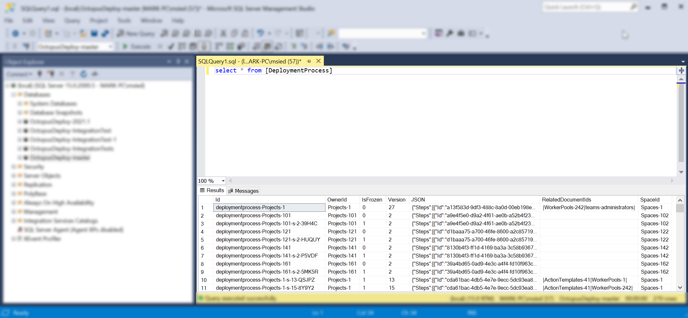
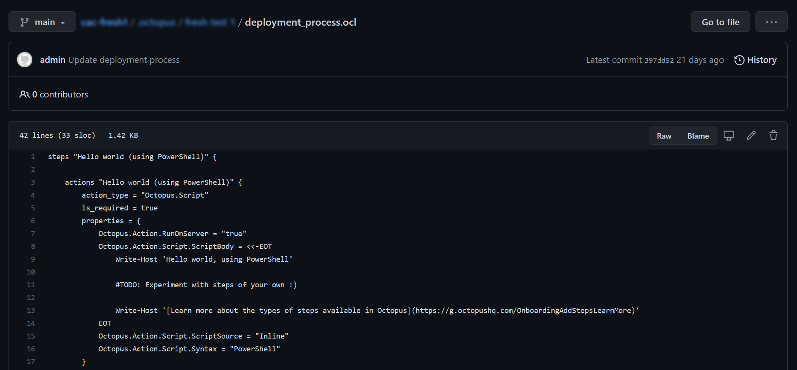

When introducing the Configuration as Code (Config as Code) feature to our codebase, we ran into some [persistence ignorance](https://deviq.com/principles/persistence-ignorance) opportunities - to have our code ignorant of any persistence/storage logic.

This post explores how our Core Platform team made decisions about persistence ignorance. We hope others can learn from our experience.

## Octopus and SQL

In 2014, in the days of Octopus 3.0, we decided to [switch to SQL](https://octopus.com/blog/3.0-switching-to-sql) as our storage/persistence layer. This meant when you saved data in Octopus, it stored/persisted into SQL database tables, as you'd expect.



In the Octopus codebase, we chose to keep things simple. We talked to those tables directly with [Nevermore](https://github.com/OctopusDeploy/Nevermore/wiki) transactions. Nevermore is a micro-ORM that treats SQL Server as a document store.

In this example, our class:

- Took a dependency on a `store`
- Began a `transaction` where necessary to query what we needed
- Completed and disposed our `transaction` with our `using` block 

Job done.

```cs C#
class Thinger : IDoThings
{
    readonly IOctopusRelationalStore store;

    public Thinger(IOctopusRelationalStore store)
    {
        this.store = store;
    }

    public DeploymentProcess GetDeploymentProcessForProject(Project project)
    {
        using (var transaction = store.BeginTransaction())
        {
            var deploymentProcess = transaction
                .LoadRequired<DeploymentProcess>(project.DeploymentProcessId);
            return deploymentProcess;
        }
    }

    ...
}
```

## Config as Code

When we began [shaping Config as Code](https://octopus.com/blog/shaping-config-as-code), we suddenly had multiple persistence layers to consider. 

For version-controlled projects, the data for your deployment process is now stored as an Octopus Configuration Language (OCL) file in your Git repository, not in SQL.



From an API consumer's perspective, not much has changed. You request a deployment process and tell us which branch you want to view. We read from that Git branch, deserialize the OCL to our data-model, and send the results back to you as JSON.

For example, imagine a regular project's deployment process could be requested as follows:
```
/api/Spaces-1/projects/Projects-1/deploymentprocesses
```

A version-controlled project would include branch information. In this case, we see a `beta` branch being requested:
```
/api/Spaces-1/projects/Projects-1/beta/deploymentprocesses
```

As an API *consumer*, you don't know (or care) where that data comes from. You just want a deployment process. The API you rely on to get that answer should be simple and intuitive.

As an API *developer*, your journey to support that user experience should also be simple and intuitive.

> I just want an X. I don't care how it's stored or where it comes from.

If our developers had to manage too much switching-logic in their minds when thinking about the data-model, **there'd be a risk that the confusion extended to the customer** in the form of bugs, inconsistent behavior, or slow churn time for features/fixes.

Consider this method again, with version-control:

```cs C#
public DeploymentProcess GetDeploymentProcessForProject(Project project)
{
    // Wait, we better check if this thing is version-controlled!
    if (project.PersistenceSettings is VersionControlSettings)
    {
        throw new NotImplementedException(); //TODO: Lookup deployment process from Git.
    }
    else
    {
        using (var transaction = store.BeginTransaction())
        {
            var deploymentProcess = transaction
                .LoadRequired<DeploymentProcess>(project.DeploymentProcessId);
            return deploymentProcess;
        }
    }
}
```

If you're prototyping to prove what's possible with Git, that's not an unreasonable place to start (and this *was* where we started when exploring possibilities).

But thinking long term, with more features *potentially* moving to Git, and more engineers needing to query/mutate data, there was an architectural and scalability opportunity.

## Introducing document stores

To address this, we introduced a document store abstraction layer (see <a href="https://deviq.com/design-patterns/repository-pattern" target="_blank">repository pattern</a>).

```cs C#
public interface IDocumentStore<TDocument> where TDocument : class, IDocument
{
    Task Add(TDocument document, ...);
    Task Update(TDocument document, ...);
    Task<TDocument> Get(string id, ...);
    Task<TDocument?> GetOrNull(string id, ...);
    Task<IReadOnlyList<TDocument>> GetMany(IReadOnlyCollection<string> ids, ...);
    Task<IReadOnlyList<TDocument>> All(...);
    IQueryable<TDocument> Query();
    ...
```

Our vision was that developers could take a dependency on an `IDocumentStore<T>` and that generic interface would allow them to query the data-model in similar ways to our existing (Nevermore) interfaces.

Our new abstraction needed two concrete implementations:

- `DatabaseDocumentStore<T>`
- `GitDocumentStore<T>`

When a developer asks for an `IDocumentStore<T>`, our base document store uses a [strategy pattern](https://deviq.com/design-patterns/strategy-pattern) to determine whether you're dealing with a version-controlled project or a regular (SQL) project. Its job is to give you the right type of document store. As a developer, you don't have to think about it.

Our code sample from earlier becomes simpler to reason about:

```cs C#
class Thinger : IDoThings
{
    readonly IDocumentStore<DeploymentProcess> deploymentProcessesStore;

    public Thinger(IDocumentStore<DeploymentProcess> deploymentProcessesStore)
    {
        this.deploymentProcessesStore = deploymentProcessesStore;
    }

    public DeploymentProcess GetDeploymentProcessForProject(Project project)
    {
        return deploymentProcessesStore.Get(project.DeploymentProcessId);
    }
    ...
}
```

## What about transactionality?

Transactionality was an interesting challenge and observation.

When we talked to a SQL database, we opened a transaction, performed actions on that transaction, then closed and disposed of it.

You may be asking what happened to the transactions in the code above?

From 2014, we chose short-lived transactions throughout the codebase (both our API and the task system).

In many ways, this was ideal. We could guarantee short-lived transactions and reason about transactional code in isolation. For example, anywhere you saw code like this, you could easily reason about the transaction lifetime:

```C#
using (var transaction = store.BeginTransaction())
{
    var foo = transaction.LoadRequired<Foo>("Foo-123");
    foo.Bar = "testing";
    transaction.Update(foo);
    transaction.Commit();
}
```

In other ways, we saw 2 downsides longer-term.

Firstly, when we considered a given request/command's lifetime, we had no guarantee about *single transactionality*. Because we were micro-managing transactions at various levels of the codebase, there were likely *several* transactions involved in a given request/command.

There was a possibility that several transactions would complete successfully and commit, but one at the end would fail. In this case, an exception would be correctly returned to the user, but the earlier transactions from the *same failed request* would not rollback, leaving you with data inconsistencies (several of these issues were found and fixed as part of this work).

To avoid this, we found many cases where we'd create a transaction early in the call-chain, then pass that transaction around as method parameters (sometimes through massive call-chains 10+ methods deep, including many static call-chains). In these cases, some middle-method might call `.Commit()` and you had to hope nothing else would also call `.Commit()` on that same transaction (as you can only call commit once).

Secondly, when we started talking about a document store abstraction, we started asking:

> Q. Why does a developer have to think about transactions at all?

Developers have to think about the thing they're asking for (the deployment process), and also how to hold transactions *around* that thing.

When we talk about single responsibility in this case, transactions are additional and unnecessary context. It's unrelated to what we're asking for, the deployment process.

To be clear, it's very powerful to have the *option* of transactional control like we'd been doing. But for the majority of cases, we shouldn't have to think about it.

We discovered, if you're tied to a single persistence layer like SQL, you can get away with using transactions directly for many years. But as soon as you have multiple persistence layers (that are **not** Nevermore/EF/SQL), you have a problem.

Also, transactions are an advanced topic. Developers in our growing team could easily hold transactions in questionable ways or forget to commit entirely. Things like this would likely be caught during testing, but this illustrates the *unnecessary churn* that starts to creep in.

Our job architecturally is to help our developers fall into the pit of success. When we observe complexities like this creeping in (especially as we start to scale), it's a great opportunity to consider a new abstraction and try to improve on the amazing foundations that got us here.

## Introducing Unit of Work

To help us manage transactions across requests/commands, we introduced a [Unit of Work](https://martinfowler.com/eaaCatalog/unitOfWork.html) so there'd be one less thing for developers to consider. Consumers just ask for a document store of a given type. The Unit of Work *surrounding* their operation would be managed for them and not their concern.

It's safe to say, consumers just want an `X`, so let them ask for *just the thing they need*.

For example, you shouldn't need to ask for the entire Bunnings store when all you want is a paintbrush. Just ask for a paintbrush! Whether the paintbrush comes from a Bunnings store at all is not your concern.

With transactionality abstracted into a Unit of Work, that lead to the question of branching.

> Q. In Git, how does a document store know what branch I'm asking about?

## Introducing project scope

Remember the strategy pattern we mentioned earlier on our document store (the one that helps us determine what *type* of document store you should receive when you ask for an `IDocumentStore<T>`)?

We knew there'd be details (such as the project and/or Git branch) that would be useful to consumers much lower in the hierarchy. We wanted to encapsulate that information into a "project scope".

We wanted to discourage passing that information around everywhere as method parameters. The risk was having the equivalent of props-explosion on our back-end (10+ levels of passing a thing around just so a consumer at the very bottom can use it).

Imagine having to pass the Git branch name and/or commit information as optional parameters to all the `IDocumentStore` methods that we might need for version-controlled documents. Our document store abstraction would suddenly be... not very abstract.

Leaning on our [Dependency Inversion](https://deviq.com/principles/dependency-inversion-principle) (DI) principle, we can take a dependency on an `IProjectScope` and tell it to encapsulate that branch or project information *once per request* at the highest level in our call-chain as possible (such as ASP.NET middleware or action filters).

Then our lowest level code in the same call-chain can also take `IProjectScope` as a dependency and query that information safely, without us having to pass everything around as method parameters.

When we used DI in this way, we quickly found all the road blocks, such as `public static` methods that can't take advantage of constructor dependencies. We rewrote these in a non-static way, stripped out the (now) unnecessary `transaction` method parameters and embraced more single-responsibility.

In the end, we found there was less to keep in our heads at once; less to reason about; less reasons to change.

## What about caching?

In many previous cases, we had to take a dependency on a caching abstraction and work with it directly, to provide performance improvements for various customers.

This did the job well over the years. But our code was getting increasingly more complex to reason about as we grew.

Consider this example, where the consumer is looking for `Foo` documents for a given project:

```C#
using (var transaction = store.BeginTransaction())
{
    var foos = cache.Get<Foo>(transaction, x => x.ProjectId == projectId).ToList();
    ...
```

It's only a couple of lines, and it's providing serious value. It provides a cached version of a `Foo` and saves us from hitting the database unnecessarily.

But there's context the consumer has to stop and think about here.

The consumer has to:

1. Spin up a `transaction`
2. Realize there's a `cache` dependency they can use
3. Figure out whether their given type (`Foo`) supports caching *(not all our types support caching)*
4. Determine how to call the caching methods directly, passing the `Get<T>` method a `transaction` and Lambda

Developers often failed to consider our cache when writing code. Because of this, we were being *reactive* to some performance problems and spot-fixing things to use cache as they arose.

But again, why should the consumer have to think about caching at all? It's not their responsibility.

However it is *someone's* responsibility. We still wanted the value it was providing. It just needed to move somewhere else.

With an `IDocumentStore<T>` abstraction in place, we could write decorators and introduce a caching layer transparently.

For example, something like this:

```C#
public class CachingDocumentStoreDecorator<TDocument> : IDocumentStore<TDocument> where TDocument : class
{
    readonly IDocumentStore<TDocument> inner;
    readonly ICache cache;

    public CachingDocumentStoreDecorator(IDocumentStore<TDocument> inner, ICache cache)
    {
        this.inner = inner;
        this.cache = cache;
    }

    public async Task<TDocument> GetAsync(string id, CancellationToken cancellationToken)
    {
        return TryGetFromCache(id).SingleOrDefault()
            ?? await inner.GetAsync(id, cancellationToken);
    }
    ...
```

When you ask for a document with a given `id`, the `TryGetFromCache` method figures out whether the type supports caching and returns the result from the cache if it's available.

The consumer knows nothing about this layer. We decorated our abstraction and put strong test coverage around *just this layer*, giving us confidence it does what we expect. Any consumers of `IDocumentStore<T>` will get these decorations out-of-the-box.

## Encouraged by convention

Our developers are now encouraged to take dependencies on `IDocumentStore<T>` and we have [convention tests](https://github.com/andrewabest/Conventional) to help them stop taking dependencies on stores/transactions directly.

Consumers of our Core Platform ask for what they need, mutate it as they see fit, knowing (or not knowing) there's an `IUnitOfWork` per request that will take care of establishing a `transaction` when it's needed, and commit that transaction when the request completes (for Git or SQL).

All the separate concerns are handled transparently, so you can focus on your job of delivering great features to customers.

## Conclusion

We hope this post provides some insights into the architectural changes that we consider when supporting a feature like Config as Code, to help build confidence and stability for the long term.

For example:

```cs C#
public class CreateChannelController : BaseApiController
{
    readonly IResourceMapper resourceMapper;
    readonly IDocumentStore<Channel> channelStore;
    readonly IDocumentStore<Project> projectStore;

    public CreateChannelController(
        IResourceMapper resourceMapper,
        IDocumentStore<Channel> channelStore,
        IDocumentStore<Project> projectStore)
    {
        this.resourceMapper = resourceMapper;
        this.channelStore = channelStore;
        this.projectStore = projectStore;
    }

    // I don't think about DB vs Git
    // I don't think about transactions
    // I don't think about caching
    // I don't think about entity tracking
    // I don't think about deletion rules
    // I don't think about veto rules
    // ...
    // I just use my document stores
    ...
```

We believe this will result in a simpler, faster, and more intuitive future for developers engaging with our Core Platform, which will result in simple, fast, and intuitive features for you, the customer.

Happy deployments!
