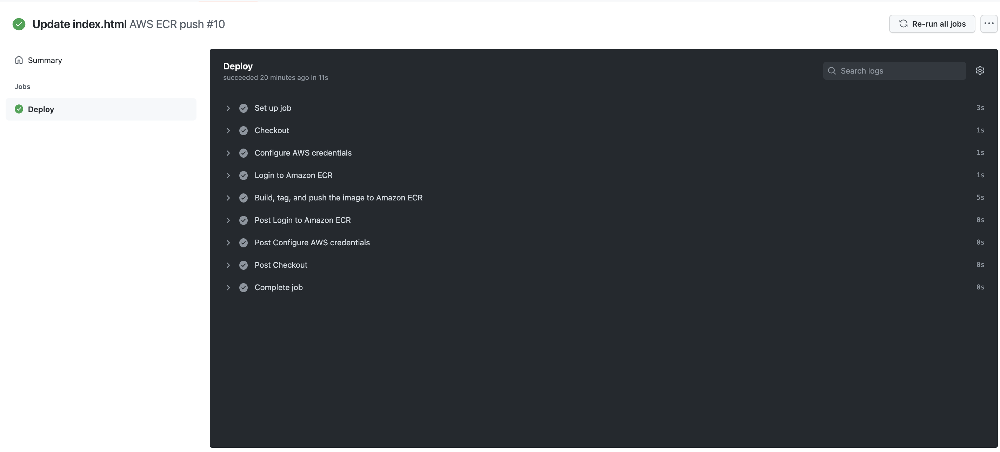
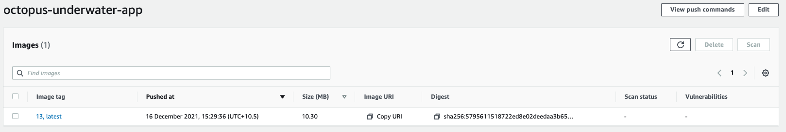

This blog will build and push the Octopus Deploy Underwater Scene to Amazon Elastic Container Registry (ECR) using GitHub Actions. To follow along, you will need:

- An Amazon Web Services Account (AWS)
- A GitHub account

This blog will use the [Octopus Underwater app repository](https://github.com/OctopusSamples/octopus-underwater-app). You can fork the repository and follow along. Alternatively, the github-ecr branch contains the template files needed to complete the steps in this blog. You will have to replace some values with your own. I have included my values as a reference.


## Amazon Web Services setup

To set up AWS for GitHub Actions, we need to create an access key and an ECR repository to store the image.

To create an access key, go to **Amazon Console &rarr; IAM &rarr; Users &rarr; [your user] &rarr; Security credentials &rarr; Create Access Key**

Your browser will download a file containing the Access Key ID and the Secret Access Key. These values will be used in GitHub to authenticate to Amazon.

To create a repository, go to the **Amazon Console &rarr; ECR &rarr; Create Repository**

The ECR requires an image repository set up for each image you publish. Name the repository the name you want the image to have. 

You will see your repository under **Amazon ECR &rarr; Repositories**. Make a note of the zone it is in, in the URI field.


## GitHub setup

This blog will build the Octopus Deploy Underwater Scene repository and push it to Amazon ECR. You will use these images in later blog posts.

Fork the repository at https://github.com/terence-octo/octopus-underwater-app-docker

Go to **Settings &rarr; Secrets &rarr; New repository secret**

- **REPO_NAME**- the name of the AWS ECR repository you created
- **AWS_ACCESS_KEY_ID**- the Access Key ID from earlier
- **AWS_SECRET_ACCESS_KEY**- the Secret Access Key from earlier

We need to create a workflow file in the repository. A Github Actions workflow contains instructions on performing operations on the code repository. These are community-maintained steps. Several pre-built step templates will allow you to do many different tasks on a code repository. In this example, we use a step template to build and push the code to an AWS ECR repository.


Create a file named main.yml in the .github/workflows directory of the root folder. Paste the following code in the main.yml file:

```
on:
  push:
    branches: [ main ]
  pull_request:
    branches: [ main ]

name: AWS ECR push

jobs:
  deploy:
    name: Deploy
    runs-on: ubuntu-latest

    steps:
    - name: Checkout
      uses: actions/checkout@v2
      
    - name: Configure AWS credentials
      uses: aws-actions/configure-aws-credentials@v1
      with:
        aws-access-key-id: ${{ secrets.AWS_ACCESS_KEY_ID }}
        aws-secret-access-key: ${{ secrets.AWS_SECRET_ACCESS_KEY }}
        aws-region: us-east-2

    - name: Login to Amazon ECR
      id: login-ecr
      uses: aws-actions/amazon-ecr-login@v1

    - name: Build, tag, and push the image to Amazon ECR
      id: build-image
      env:
        ECR_REGISTRY: ${{ steps.login-ecr.outputs.registry }}
        ECR_REPOSITORY: ${{ secrets.REPO_NAME }}
        IMAGE_TAG: latest
      run: |
        # Build a docker container and push it to ECR 
        docker build -t $ECR_REGISTRY/$ECR_REPOSITORY:$IMAGE_TAG .
        echo "Pushing image to ECR..."
        docker push $ECR_REGISTRY/$ECR_REPOSITORY:$IMAGE_TAG
        echo "::set-output name=image::$ECR_REGISTRY/$ECR_REPOSITORY:$IMAGE_TAG"
```

GitHub starts an action by a push or pull request on the main branch. The steps check out the code, authenticate and log into AWS, then build, tag, and push the image to Amazon ECR. A similar step template could push to other cloud repositories like Google or Microsoft. 

Commit your changes and go to the **Actions** tab and click the title of your commit message. You will see the various stages of the workflow as it reaches completion.



Go to your Amazon ECR repository to view the image. Octopus Deploy can now deploy this image to a deployment target.




In this blog, you have set up a GitHub Actions workflow to build and push an image to Amazon ECR. 

Happy Deployments!
