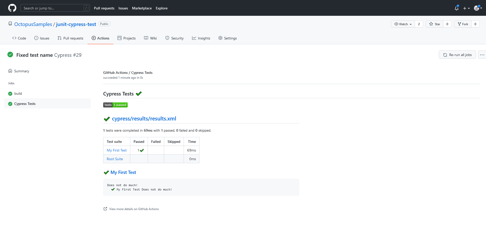
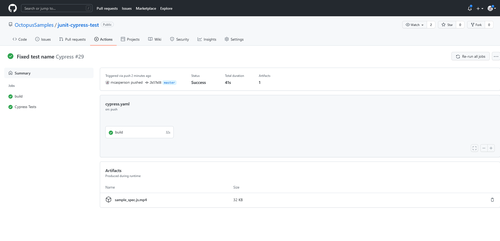
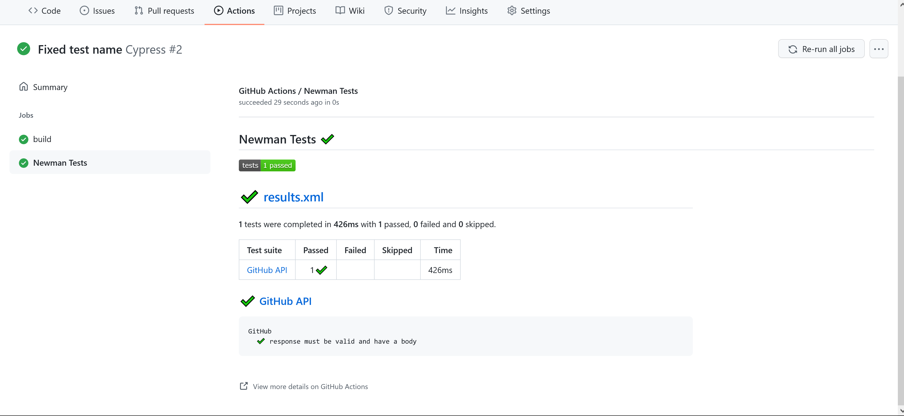

GitHub Actions has a large ecosystem of high quality third-party actions, as well as native support for executing build steps inside Docker containers. This means it's easy to run end-to-end tests as part of a workflow, often only requiring a single step to run testing tools with all the required dependencies.

In this post, I show you how to run browser tests with Cypress and API tests with Postman as part of a GitHub Actions workflow.

## Prerequisites

GitHub Actions is a hosted service, so the only prerequisite is a GitHub account. All other dependencies like, Software Development Kits (SDKs) or testing tools, are provided by the Docker images or GitHub actions published by testing platforms.

## Running browser tests with Cypress

[Cypress](https://www.cypress.io/) is a browser automation tool that lets you interact with web pages in much the same way an end user would, for example by clicking on buttons and links, filling in forms, and scrolling the page. You can also verify the content of a page to ensure the correct results are displayed.

The [Cypress documentation provides an example first test](https://docs.cypress.io/guides/getting-started/writing-your-first-test) which has been saved to the [junit-cypress-test GitHub repo](https://github.com/OctopusSamples/junit-cypress-test). The test is shown below:

```javascript
describe('My First Test', () => {
  it('Does not do much!', () => {
    expect(true).to.equal(true)
  })
})
```

This test is configured to generate a JUnit report file in the `cypress.json` file:

```json
{
  "reporter": "junit",
   "reporterOptions": {
      "mochaFile": "cypress/results/results.xml",
      "toConsole": true
   }
}
```

The workflow file below executes this test with the [Cypress GitHub Action](https://docs.cypress.io/guides/continuous-integration/github-actions#Cypress-GitHub-Action), saves the generated video file as an artifact, and processes the test results. You can find an example of this workflow in the [junit-cypress-test repository](https://github.com/OctopusSamples/junit-cypress-test/actions):

```yaml
name: Cypress

on:
  push:
  workflow_dispatch:

jobs:
  build:

    runs-on: ubuntu-latest

    steps:
      - name: Checkout
        uses: actions/checkout@v1

      - name: Cypress run
        uses: cypress-io/github-action@v2

      - name: Save video
        uses: actions/upload-artifact@v2
        with:
          name: sample_spec.js.mp4
          path: cypress/videos/sample_spec.js.mp4

      - name: Report
        uses: dorny/test-reporter@v1
        if: always()
        with:
          name: Cypress Tests
          path: cypress/results/results.xml
          reporter: java-junit
          fail-on-error: true
```

The [official Cypress GitHub action](https://github.com/cypress-io/github-action) is called to execute tests with the default options:

```yaml
      - name: Cypress run
        uses: cypress-io/github-action@v2
```

Cypress generates a video file capturing the browser as the tests are run. You save the video file as an artifact to be downloaded and viewed after the workflow completes:

```yaml
      - name: Save video
        uses: actions/upload-artifact@v2
        with:
          name: sample_spec.js.mp4
          path: cypress/videos/sample_spec.js.mp4
```

The test results are processed by the `dorny/test-reporter` action.

Note that test-reporter has the ability to process Mocha JSON files, and Cypress uses Mocha for reporting, so an arguably more idiomatic solution would be to have Cypress generate Mocha JSON reports. Unfortunately, there is a [bug in Cypress](https://github.com/cypress-io/cypress/issues/18014) that prevents the JSON reporter from saving results as a file. Generating JUnit report files is a useful workaround until this issue is resolved:

```yaml

      - name: Report
        uses: dorny/test-reporter@v1
        if: always()
        with:
          name: Cypress Tests
          path: cypress/results/results.xml
          reporter: java-junit
          fail-on-error: true
```

Here are the results of the test:



The video file artifact is listed in the **Summary** page:



Not all testing platforms provide a GitHub action, in which case you can execute steps against a standard Docker image. This is demonstrated in the next section.

## Running API tests with Newman

Unlike Cypress, [Postman](https://www.postman.com/) does not provide an official GitHub action. However, you can use the [postman/newman](https://hub.docker.com/r/postman/newman/) Docker image directly inside a workflow. You can find an example of the workflow in the [junit-newman-test repository](https://github.com/OctopusSamples/junit-newman-test/actions):

```yaml
name: Cypress

on:
  push:
  workflow_dispatch:

jobs:
  build:

    runs-on: ubuntu-latest

    steps:
      - name: Checkout
        uses: actions/checkout@v1

      - name: Run Newman	    
        uses: docker://postman/newman:latest
        with:
          args: run GitHubTree.json --reporters cli,junit --reporter-junit-export results.xml

      - name: Report
        uses: dorny/test-reporter@v1
        if: always()
        with:
          name: Cypress Tests
          path: results.xml
          reporter: java-junit
          fail-on-error: true
```

The `uses` property for a step can either be the name of a published action, or can reference a Docker image directly. In this example, you run the [postman/newman](https://hub.docker.com/r/postman/newman/) docker image, with the `with.args` parameter defining the command-line arguments:

```yaml
      - name: Run Newman	    
        uses: docker://postman/newman:latest
        with:
          args: run GitHubTree.json --reporters cli,junit --reporter-junit-export results.xml
```

The resulting JUnit report file is then processed by the `dorny/test-reporter` action:

```yaml
      - name: Report
        uses: dorny/test-reporter@v1
        if: always()
        with:
          name: Cypress Tests
          path: results.xml
          reporter: java-junit
          fail-on-error: true
```

Here are the results of the test:



Behind the scenes, GitHub Actions executes the supplied Docker image with a number of standard environment variables relating to the workflow and with volume mounts that allow the Docker container to persist changes (like the report file) on the main file system.

The following is an example of the command to execute a step in a Docker image:

```
/usr/bin/docker run --name postmannewmanlatest_fefcec --label f88420 --workdir /github/workspace --rm -e INPUT_ARGS -e HOME -e GITHUB_JOB -e GITHUB_REF -e GITHUB_SHA -e GITHUB_REPOSITORY -e GITHUB_REPOSITORY_OWNER -e GITHUB_RUN_ID -e GITHUB_RUN_NUMBER -e GITHUB_RETENTION_DAYS -e GITHUB_RUN_ATTEMPT -e GITHUB_ACTOR -e GITHUB_WORKFLOW -e GITHUB_HEAD_REF -e GITHUB_BASE_REF -e GITHUB_EVENT_NAME -e GITHUB_SERVER_URL -e GITHUB_API_URL -e GITHUB_GRAPHQL_URL -e GITHUB_WORKSPACE -e GITHUB_ACTION -e GITHUB_EVENT_PATH -e GITHUB_ACTION_REPOSITORY -e GITHUB_ACTION_REF -e GITHUB_PATH -e GITHUB_ENV -e RUNNER_OS -e RUNNER_NAME -e RUNNER_TOOL_CACHE -e RUNNER_TEMP -e RUNNER_WORKSPACE -e ACTIONS_RUNTIME_URL -e ACTIONS_RUNTIME_TOKEN -e ACTIONS_CACHE_URL -e GITHUB_ACTIONS=true -e CI=true -v "/var/run/docker.sock":"/var/run/docker.sock" -v "/home/runner/work/_temp/_github_home":"/github/home" -v "/home/runner/work/_temp/_github_workflow":"/github/workflow" -v "/home/runner/work/_temp/_runner_file_commands":"/github/file_commands" -v "/home/runner/work/junit-newman-test/junit-newman-test":"/github/workspace" postman/newman:latest run GitHubTree.json --reporters cli,junit --reporter-junit-export results.xml
```

This is a complex command, but there are a few arguments that we're interested in.

The `-e` arguments define environment variables for the container. You can see that dozens of workflow environment variables are exposed.

The `--workdir /github/workspace` argument overrides the working directory of the Docker container, while the `-v "/home/runner/work/junit-newman-test/junit-newman-test":"/github/workspace"` argument mounts the workflow workspace to the `/github/workspace` directory inside the container. This has the effect of mounting the working directory inside the Docker container, which exposes the checked out files, and allows any newly created files to persist once the container is shutdown:


Because every major testing tool provides a supported Docker image, the process you used to run Newman can be used to run most other testing platforms.

## Conclusion

GitHub Actions has enjoyed widespread adoption among developers, and many platforms provide supported actions for use in workflows. For those cases where there is no suitable action available, GitHub Actions provides an easy way to execute a standard Docker image as part of a workflow.

In this post, you learned how to run the Cypress action to execute browser based tests, and how to run the Newman Docker image to execute API tests.

Check out our other post about testing in GitHub Actions:

- [Running unit tests in GitHub Actions](https://octopus.com/blog/githubactions-running-unit-tests)

!include <q1-2022-newsletter-cta>

Happy deployments!
