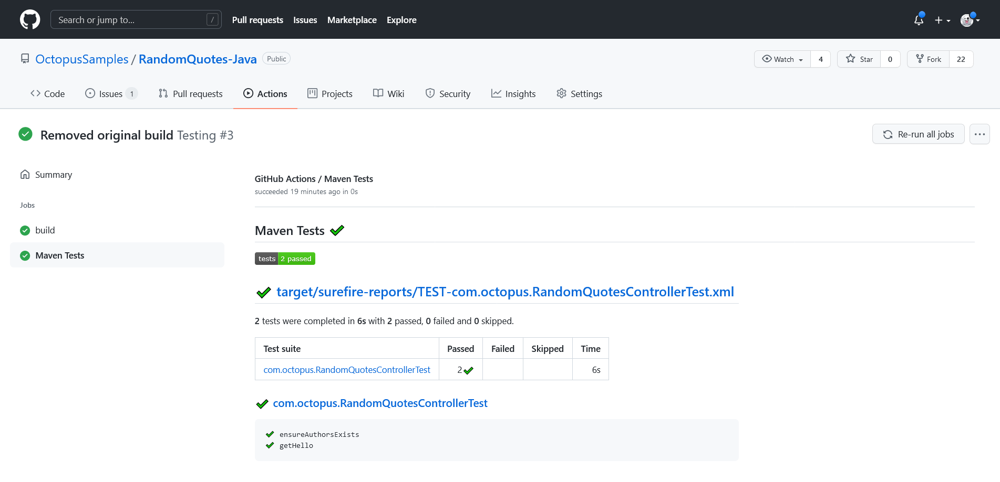
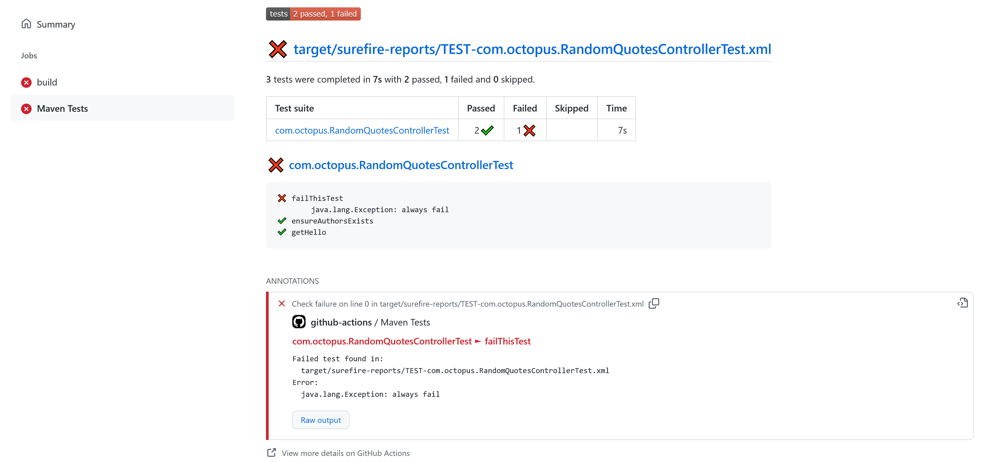
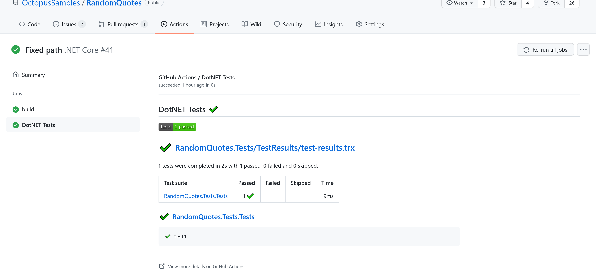

Verifying code changes with unit tests is a critical process in typical development workflows. GitHub Actions provides a number of custom actions to collect and process the results of tests allowing developers to browse the results, debug failed tests, and generate reports.

In this post, I show you how to add unit tests to a GitHub Actions workflow and configure custom actions to process the results.

## Prerequisites

GitHub Actions is a hosted service, so the only prerequisite is a GitHub account. All other dependencies like Software Development Kits (SDKs) are installed during the execution of the GitHub Actions workflow.

## Selecting an action

GitHub Actions relies heavily on third party actions contributed by the community. A quick Google search shows at least half a dozen actions for processing unit test results, including:

- [action-junit-report](https://github.com/mikepenz/action-junit-report)
- [publish-unit-test-results](https://github.com/marketplace/actions/publish-unit-test-results)
- [junit-report-action](https://github.com/marketplace/actions/junit-report-action)
- [test-reporter](https://github.com/marketplace/actions/test-reporter)
- [report-junit-annotations-as-github-actions-annotations](https://github.com/marketplace/actions/report-junit-annotations-as-github-actions-annotations)

To narrow the selection, you need to consider the following functionality:

- Does the action support your testing framework? For example, some actions only process JUnit test results, while others include additional formats like TRX.
- Does the action allow you to fail the workflow based on the presence of failed tests?
- Does the action annotate the source code with details of test results?
- Does the action generate a useful report?
- How many stars does the project have?

After some trial and error, I settled on the [test-reporter](https://github.com/marketplace/actions/test-reporter) action, which is demonstrated in this post.

## Unit testing in Java

The workflow file shown below runs tests with Maven and processes the results with the test-reporter action:

```yaml
name: Java

on:
  push:
  workflow_dispatch:

jobs:
  build:

    runs-on: ubuntu-latest

    steps:
      - name: Checkout
        uses: actions/checkout@v1

      - name: Set up JDK 1.11
        uses: actions/setup-java@v2
        with:
          java-version: '11'
          distribution: 'adopt'

      - name: Build
        run: mvn --batch-mode -DskipTests package

      - name: Test
        run: mvn --batch-mode -Dmaven.test.failure.ignore=true test

      - name: Report
        uses: dorny/test-reporter@v1
        if: always()
        with:
          name: Maven Tests
          path: target/surefire-reports/*.xml
          reporter: java-junit
          fail-on-error: true
```

The `Build`, `Test`, and `Report` steps are important to the testing process.

You start by building the application, but skipping the tests:

```yaml
      - name: Build
        run: mvn --batch-mode -DskipTests package
```

Next, you run the tests, allowing the command to pass even if there are failing tests. This allows you to defer the response to failed tests to the test processing action:

```yaml
      - name: Test
        run: mvn --batch-mode -Dmaven.test.failure.ignore=true test
```

In the final step, you generate a report from the JUnit XML file. 

The `if` property is set to always run this step, allowing you to generate the report even if the `Test` step above was set to fail in the event of failed tests.

The `fail-on-error` property is set to `true` to fail this workflow if there were failed tests. This is an example of deferring the response to failed tests to the test processing action:

```yaml
      - name: Report
        uses: dorny/test-reporter@v1
        if: always()
        with:
          name: Maven Tests
          path: target/surefire-reports/*.xml
          reporter: java-junit
          fail-on-error: true
```

The test results are displayed as a link under the original workflow results:



Failing tests show additional details such as the name of the test, the test result, and the raw test output:



## Unit testing in DotNET

The workflow file shown below runs tests with the DotNET Core CLI and processes the results with the test-reporter action:

```yaml
name: .NET Core

on:
  push:
  workflow_dispatch:

jobs:
  build:

    runs-on: ubuntu-latest

    steps:
    - name: Checkout  
      uses: actions/checkout@v1
      
    - name: Setup .NET Core
      uses: actions/setup-dotnet@v1
      with:
        dotnet-version: 3.1.402
        
    - name: Build
      run: dotnet build --configuration Release
      
    - name: Test
      run: dotnet test --logger "trx;LogFileName=test-results.trx" || true
      
    - name: Test Report
      uses: dorny/test-reporter@v1
      if: always()
      with:
        name: DotNET Tests
        path: "**/test-results.trx"                            
        reporter: dotnet-trx
        fail-on-error: true
```

The tests are executed by the DotNET Core CLI saving the results as a Visual Studio Test Results (TRX) report file.

The `test` command returns a non-zero exit code if any tests fail, but you defer responsibility for responding to failed tests to the test processor. By chaining `|| true` to the command you ensure the step always passes:

```yaml
    - name: Test
      run: dotnet test --logger "trx;LogFileName=test-results.trx" || true
```

The test-reporter action then processes the report file, and sets `fail-on-error` to `true` to fail the build if there are any failed tests:

```yaml
    - name: Test Report
      uses: dorny/test-reporter@v1
      if: always()
      with:
        name: DotNET Tests
        path: "**/test-results.trx"                            
        reporter: dotnet-trx
        fail-on-error: true
```



## Conclusion

GitHub Actions is primarily a task execution environment designed to verify and build code, and publish the resulting artifacts. There are a number of third party actions that allow you to generate test reports and respond to failed tests, but GitHub Actions has some gaps in terms of tracking test results over time. Still, the reporting functionality available today is useful, and will only improve.

In this post, you learned:

- Some of the questions to ask when evaluating third party actions to process test results.
- How to write basic workflows for testing Java and DotNET Core applications.
- How to process test results and display the generated reports.

Check out our next post about testing in GitHub Actions:

- [Running end-to-end tests in GitHub Actions](https://octopus.com/blog/githubactions-running-endtoend-tests)

Also learn why [GitHub and Octopus are better together](https://octopus.com/github) and [try our free GitHub Actions workflow tool](https://oc.to/GithubActionsWorkflowGenerator) to help you quickly generate customizable workflows for your GitHub Actions deployments.
  
!include <githubactions-webinar-feb-2022>

Happy deployments!
