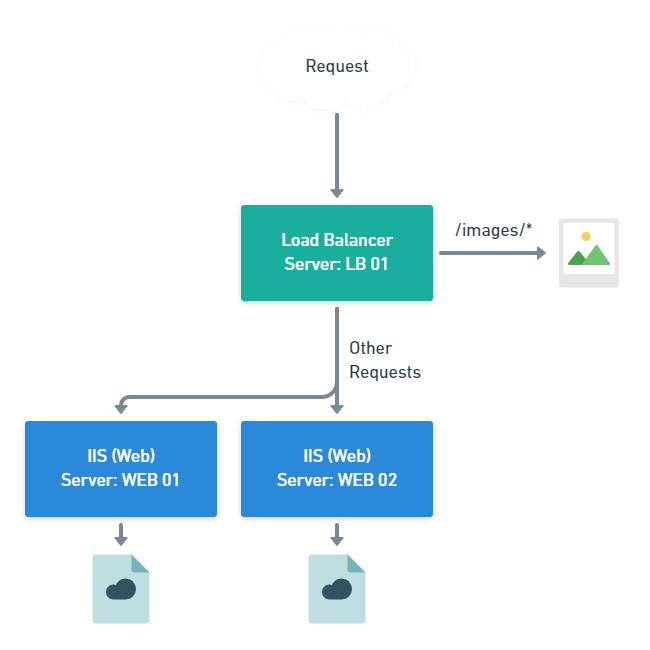

You might be new to Octopus Deploy and need a strategy for taking manual deployments and automating them.

You might be an existing Octopus Deploy customer who still has a manual deployment process for a legacy app that you want to track.

The application scenario used as an example is legacy, because it is more likely to find a tricky legacy manual deployment that needs this technique and new applications you write today are more likely to have deployability baked into their design.

NOTE: zero to checklist - reduces errors somewhat, ensures steps done and in right order
checklist to manual octo - audit and metrics
manual to auto -...

Notes from Ryan

https://github.com/OctopusDeploy/blog/blob/manual/blog/2021-09/modeling-manual-deployments/index.md

Old stuff, like VB6 DLLs - Esoteric
Manual intervention
Paste log files or output as comments to capture the action done
The approval steps become "check it worked" - and eventually as you gain confidence and remove the manual steps

At least track it - something happened.

Word doc / wiki page / etc... pages of conditional instructions - put them into Octopus and it can be the documentation with extra benefits.

If you are using manual steps it doesn't really add to you cost.

Customers not in control of target infrastructure - so the manual process lets them track the deployment being done in an ops group.

Completely manual customers - i.e. no source control, no builds, etc


## Create a checklist

To demonstrate this technique, we'll make up a legacy system. You may already have a document or checklist that describes how to deploy the website, so we'll start with that.

You run a web application on multiple IIS servers, behing a load balancer. You deploy by taking each server out of balance in turn and applying the new version of the application.



The deployment process is:

- Copy the images onto the load balancer server
- Create a folder in `c:\www\` with the version number of the image package, i.e. `c:\www\0.0.1\`
- Move the images into the new folder
- Open IIS Manager and find the site named `ImageServer`
- Update the **Physical path** to the new folder, i.e. `%SystemDrive%\www\0.0.1` and save
- For each web farm server
  - Copy the new app version onto the web server
  - Create a folder in `c:\www\` with the version number of the app package, i.e. `c:\www\0.0.1\`
  - Move the app files into the new folder
  - Copy the `app.config` file from the previous version into the new folder
  - Take the web server out of balance on the load balancer server
  - Open IIS Manager and find the site named `Website`
  - Update the **Physical path** to the new folder, i.e. `%SystemDrive%\www\0.0.1` and save
  - Browse the website to make sure the landing page loads
  - Add the server back into balance on the load balancer server


The deployment process is:

- Copy the new app version onto the web server
- Create a folder in `c:\www\` with the version number of the app package, i.e. `c:\www\0.0.1\`
- Move the app files into the new folder
- Copy the `app.config` file from the previous version into the new folder
- Open IIS Manager and find the site named `Website`
- Update the **Physical path** to the new folder, i.e. `%SystemDrive%\www\0.0.1` and save
- Browse the website to make sure the landing page loads


This checklist will be our starting point for migrating the deployment into Octopus Deploy and then automating it.

TEMP SCRIPT

```
$serverFarm = 'Sample'

Set-WebConfiguration -PSPath 'MACHINE/WEBROOT/APPHOST' `
    -Filter "webFarms/webFarm[@name='$serverFarm']" `
    -Value @(
        @{ address = '192.168.236.128'; enabled = $true },
        @{ address = '192.168.236.129'; enabled = $true }
    )
```


## Model your checklist in Octopus Deploy

You may find that your process deploys multiple components. If you can split the checklist into independent deployments, you should do so. This might not be possible if the process is highly coupled and you would need to revisit the process after you have thought about how you could isolate the deployments.

Map each checklist item as a manual intervention

## Perform a deployment

Complete your next deployment with Octopus Deploy

## Adjust

Adjust the process if it isn't right and repeat!

## Automate a small part

Pick a step to automate.

How to choose a step? You want to build confidence, so start with an easy step.

Each step that you automate will free up time that you can use to tackle more complex steps.

implement it - create an additional step (before or after?) your manual step

When you pick a step template, you might find it does more than you expected, for example a checklist that had separate steps for configuring a web server could be achieved in a single build-in step in Octopus Deploy. If this happens, disable all of the manual steps that have been achieved in the automation.

### Sources of help

- Docs
- Community Slack
- Where else?

## Be pragmatic

There might be constraints that mean automating a particular step is difficult at this current time. That's okay. Just keep a note of any manual steps and why you could automate them and revisit it later.

## Increase your deployment frequency

Once you have introduced more automation, you should review how often you deploy. If your deployment was only released once a month because it took so long to roll it out, you could look at moving to weekly releases.

Frequent deployments are correlated to high-performance, not simply because releasing often is a high-performance trait, but beause of what you learn and adjust to achieve it.

