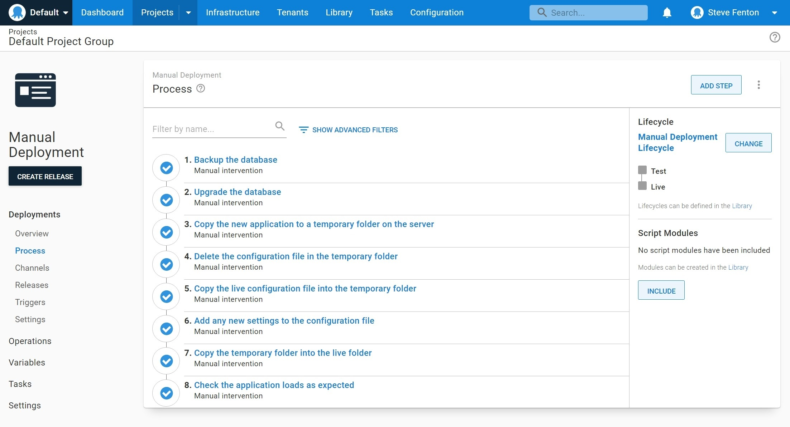
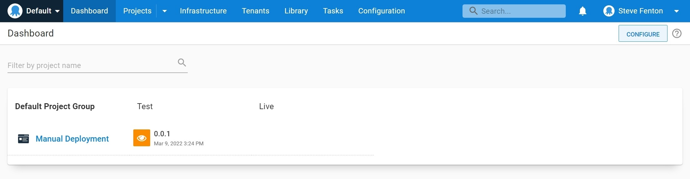

While Octopus Deploy makes complex deployment automation easy, you might have a scenario where you are still running a manual deployment. We have talked to customers with a legacy application that needs some special steps during the release process, or who have esoteric technology that makes it hard to work out where to start the automation journey.

In this post, you'll find out how you can model your manual deployments with Octopus Deploy and the benefits this will bring to your release process.

If you are new to Octopus, you might find this a useful way to advance from your current deployment process to full automation. Existing customers may find that this technique allows them to bring to their manual releases all the benefits of approvals and tracking that they get with automated deployments.

## Benefits of using Octopus for manual deployments

- You can use a lifecycle to ensure deployments are made to a test environment before they go live
- You can ensure each step is completed by an appropriate team member
- 

## Creating a checklist

When you have a manual release process, there is usually a document or checklist that explains the steps required to install the software along with who can perform each step. Before you re-create this in Octopus, it is worth spending some time refining the stages to agree who does what, in which order.

If your document is lengthy, you might find you can divide it with headings that will give you a natural task list.

You should end up with something like the following checklist:

| Step   | Title                                                        | Who  |
|--------|--------------------------------------------------------------|------|
| 1      | Backup the database                                          | DBA  |
| 2      | Upgrade the database                                         | DBA  |
| 3      | Copy the new application to a temporary folder on the server | Ops  |
| 4      | Delete the configuration file in the temporary folder        | Ops  |
| 5      | Copy the live configuration file into the temporary folder   | Ops  |
| 6      | Add any new settings to the configuration file               | Ops  |
| 7      | Copy the temporary folder into the live folder               | Ops  |
| 8      | Check the application loads as expected                      | Test |

If you didn't have a checklist before you started this exercise, you are likely to find that the checklist already increases the reliability of your deployments by ensuring the steps all occur and are done in the right order. Now we can transfer this into Octopus to get the benefits of workflow management and tracking.

## Create teams

The checklist contains three teams who are responsible for the deployment: DBAs, Ops, and Test. When you create the process in Octopus, each step will have a *responsible team*. Follow these steps to add each team to Octopus:

- Navigate to **{{ Configuration,Teams }}**
- Select **ADD TEAM**
- Enter the **New team name**, for example "DBA Team"
- Select **SAVE**
- Open the **USER ROLES** tab
- Select **INCLUDE USER ROLE**
- Choose **Project Deployer** from the list
- Select **DEFINE SCOPE**
- Under **Select project groups** choose "Default Project Group"
- Select **APPLY**
- Finally, select **SAVE**

:::hint
The **Project deployer** role grants the user all project contributor permissions, plus: deploying releases and executing runbooks.
:::

You can add team members by selecting the **ADD MEMBER** option. It is possible to assign specific users or existing roles to a team.

With the three teams set up with their respective team members, you are ready to model the checklist as a process.

## Create a lifecycle

The lifecycle for your manual deployment might not match a lifecyle you are using for automated deployments. If this is the case, you can create a new lifecyle to use with your manual release process.

 - Navigate to **{{ Infrastructure,Environments }}**
 - Select **ADD ENVIRONMENT**
 - Enter a **New environment name**, for example "Manual Test Environment"
 - Select **SAVE**

:::hint
Normally after adding an environment, you would add deployment targets. As you are modelling a manual deployment you can leave the environments empty at this stage.
:::

Once you have created your environments, you can define a lifecyle that sets the order for releases. For example, you can enforce that a release must be deployed to the test environment before it is promoted to the live environment.

- Navigate to **{{ Library,Lifecycles }}**
- Select **ADD LIFECYCLE**
- Enter the **Name** of the lifecyle, for example "Manual Deployment Lifecycle"
- Under **Phases** select **ADD PHASE** to add each environment
- Select **SAVE** when you have finished adding phases

Your completed lifecyle should contain a phase for each environment as shown below.

## Modelling the steps

To add your checklist items as steps, you will need to create a new project. You can do this by navigating to **Projects** and selecting **ADD PROJECT**.

- Add a **New project name**, such as "Manual Deployment"
- Select the **Project group** where you want to add the new project, for example "Default Project Group"
- Select the **Lifecycle**, for example the "Manual Deployment Lifecycle" you created previously
- Select **SAVE**

You will now see your project listed under the **Default Project Group**. You can also see the project listed on your dashboard.

You now have all the resources ready to add the steps, so navigate to **{{ Projects,Manual Deployment,Process }}** to begin.

You will add a step for each of the checklist items to create a process that will drive your manual deployments. So, repeat the following process for each of the items in your list.

 - Click **ADD STEP**
 - Filter the step templates using the search term "Manual Intervention"
 - Click **ADD** on the **Manual Intervention Required** step
 - Enter the title from your checklist into **Step name**, for example "Backup the database"
 - If you have documentation for this step, you can add it to the **Instructions** field, which uses markdown for formatting
 - Use the list under **Responsible teams** to select the correct team, for example "DBA Team"
 - Click **SAVE** to complete the step configuration

:::hint
You may want to adjust the default option for blocking deployments to prevent multiple concurrent releases. Under the **Block Deployments** setting, select **Prevent other deployments while awaiting intervention**.
:::

When you have added your steps navigate to **{{ Projects,Manual Deployment,Process }}** and review the process overview, which should look like the below example.

You can adjust the steps and the lifecycle at any time if you need to change them.

## Using the process to track a release

Although you don't have a package to deploy, you can still track the deployment using a release in Octopus.

- Navigate to **{{ Projects,Manual Deployment,Process }}**
- Select **CREATE RELEASE**
- Enter a **Version**, you may want to follow on from an existing version number you have published
- Select **SAVE**

You can now track the manual deployment to each environment and the release can only proceed to the *manual live environment* if it first gets deployed to the *manual test environment* as controlled by the lifecycle you configured.

- From the release screen for your new version, select **DEPLOY TO MANUAL TEST ENVIRONMENT**
- A confirmation screen will appear, review the information and select **DEPLOY**

The deployment is created for the release, and the first manual intervention step is ready to be picked up by a member of the DBA team. The release is given a manual intervention icon to show you that it is waiting for human intervention.

Only a member of the DBA Team can assign themselves the **Backup the database** task. They can do this by clickin on the release from the dashboard and selecting **ASSIGN TO ME**.

## NOTES

Notes from Ryan

https://github.com/OctopusDeploy/blog/blob/manual/blog/2021-09/modeling-manual-deployments/index.md

Old stuff, like VB6 DLLs - Esoteric
Manual intervention
Paste log files or output as comments to capture the action done
The approval steps become "check it worked" - and eventually as you gain confidence and remove the manual steps

At least track it - something happened.

Word doc / wiki page / etc... pages of conditional instructions - put them into Octopus and it can be the documentation with extra benefits.

If you are using manual steps it doesn't really add to you cost.

Customers not in control of target infrastructure - so the manual process lets them track the deployment being done in an ops group.

Completely manual customers - i.e. no source control, no builds, etc

## Create a checklist

To demonstrate this technique, we'll make up a legacy system. You may already have a document or checklist that describes how to deploy the website, so we'll start with that.

You run a web application on multiple IIS servers, behing a load balancer. You deploy by taking each server out of balance in turn and applying the new version of the application.

The deployment process is:

This checklist will be our starting point for migrating the deployment into Octopus Deploy to help run the manual deployment.

## Model your checklist in Octopus Deploy

You may find that your process deploys multiple components. If you can split the checklist into independent deployments, you should do so. This might not be possible if the process is highly coupled and you would need to revisit the process after you have thought about how you could isolate the deployments.

Map each checklist item as a manual intervention

## Perform a deployment

Complete your next deployment with Octopus Deploy

## Adjust

Adjust the process if it isn't right and repeat!

## Automate a small part

Pick a step to automate.

How to choose a step? You want to build confidence, so start with an easy step.

Each step that you automate will free up time that you can use to tackle more complex steps.

implement it - create an additional step (before or after?) your manual step

When you pick a step template, you might find it does more than you expected, for example a checklist that had separate steps for configuring a web server could be achieved in a single build-in step in Octopus Deploy. If this happens, disable all of the manual steps that have been achieved in the automation.

### Sources of help

- Docs
- Community Slack
- Where else?

## Be pragmatic

There might be constraints that mean automating a particular step is difficult at this current time. That's okay. Just keep a note of any manual steps and why you could automate them and revisit it later.

## Increase your deployment frequency

Once you have introduced more automation, you should review how often you deploy. If your deployment was only released once a month because it took so long to roll it out, you could look at moving to weekly releases.

Frequent deployments are correlated to high-performance, not simply because releasing often is a high-performance trait, but beause of what you learn and adjust to achieve it.

