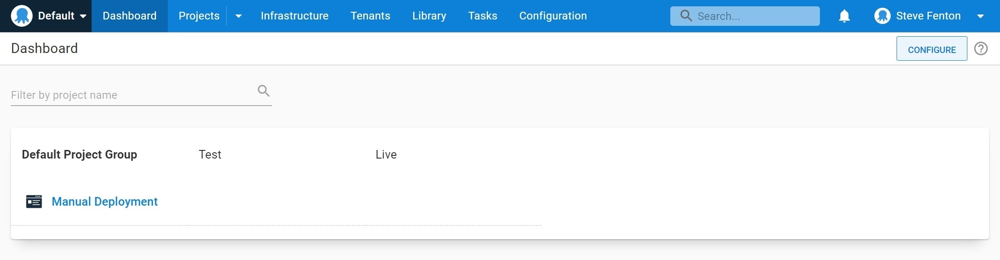

While Octopus Deploy makes complex deployment automation easy, you may have a scenario where you are still running a manual deployment. We have talked to customers with legacy applications that need special steps during the release process or with esoteric technology that makes it hard to work out where to start the automation journey.

In this post, you'll find out how you can model your manual deployments using manual intervention steps and the benefits this brings to your release process.

If you are new to Octopus, you might find this a practical way to advance from your current deployment process to full automation. Existing customers may find that this technique allows them to bring familiar benefits they already get from automated deployments to a manual release.

## Benefits of using Octopus for manual deployments

There are many benefits to be gained from using Octopus for manual deployments. These go beyond the benefits you might get from a task management application. You will be able to:

- Use lifecycles to track deployments across multiple environments
- Provide instructions for completing each step
- Ensure an authorized team member completes each step
- Improve the reliability and traceability of deployments
- Satisfy audit requirements with less effort

You might also automate some steps in an otherwise manual deployment to obtain further benefits.

## Modeling your manual deployments

You will need to complete four steps to model your manual deployments:

1. Create a checklist
1. Model your teams
1. Define a lifecycle
1. Turn your checklist into a deployment process

The first step is a paper exercise that helps design the process you will use later. The other steps are done in Octopus to model your deployment according to the steps you discover in the design stage.

### Create a checklist

When you have a manual release process, an existing document or checklist usually describes the steps required to install the software. Your current documentation might also include details of who can perform each action. Before you re-create this in Octopus, it's worth spending some time refining the stages to determine who does what, in which order.

If your document is lengthy, you might find you can divide it with headings that provide a natural task list.

You should end up with something similar to the following checklist:

| Step   | Title                                                        | Who  |
|--------|--------------------------------------------------------------|------|
| 1      | Backup the database                                          | DBA  |
| 2      | Upgrade the database                                         | DBA  |
| 3      | Copy the new application to a temporary folder on the server | Ops  |
| 4      | Delete the configuration file in the temporary folder        | Ops  |
| 5      | Copy the live configuration file into the temporary folder   | Ops  |
| 6      | Add any new settings to the configuration file               | Ops  |
| 7      | Copy the temporary folder into the live folder               | Ops  |
| 8      | Check the application loads as expected                      | Test |

If you don't have an existing checklist, you are likely to find that creating and using one increases the reliability of your deployments by ensuring the steps all occur and are done in the proper order.

Now we can transfer this into Octopus to get the benefits of workflow management and tracking.

### Model your teams

The sample checklist lists three teams in the *who* column that are responsible for the deployment: DBAs, Ops, and Test. When you create the process in Octopus, you can assign each step to a *responsible team*.

Follow these steps to create each team in Octopus:

1. Navigate to **{{ Configuration,Teams }}** and select **ADD TEAM**
1. Enter the **New team name**, for example, "DBA Team" and select **SAVE**
1. Open the **USER ROLES** tab and select **INCLUDE USER ROLE**
1. Choose **Project Deployer** from the list and select **DEFINE SCOPE**
1. Under **Select project groups** choose "Default Project Group", click **APPLY** and finally, **SAVE**

:::hint
The **Project deployer** role grants the user all project contributor permissions, plus: deploying releases and executing runbooks.
:::

You can add team members by selecting the **ADD MEMBER** option.


### Define a lifecycle

[Lifecycles](https://octopus.com/docs/releases/lifecycles) give you control over the way releases of your software are promoted between your environments. For manual deployments, you will use lifecycles to control the order of promotion, for example, to prevent a version of the software from being deployed to *production* if it hasn't first been deployed to the *test* environment.

You will need to define the environments first and then use a lifecycle to set the order in which release should flow through the environments.

You can add environments with the following steps:

1. Navigate to **{{ Infrastructure,Environments }}** and select **ADD ENVIRONMENT**
1. Enter a **New environment name**, for example `Test` and click **SAVE**

:::hint
You would usually add deployment targets to a new environment, but you can skip this step until you need to perform some form of automation.
:::

After you have added your environments have, you can create a lifecycle and add the environments as *phases*:

1. Navigate to **{{ Library,Lifecycles }}** and select **ADD LIFECYCLE**
1. Enter the **Name** of the lifecycle, for example, `Manual Deployment Lifecycle`
1. Under **Phases** select **ADD PHASE** to add each environment
1. Select **SAVE** when you have finished adding phases

Your completed lifecycle should contain a phase for each environment, as shown below.


### Turn your checklist into a deployment process

Now that your teams, environments, and lifecycles are all configured, you are ready to use them to define your manual deployment process. The process is stored in a *project* in Octopus Deploy, so the next step is to create a new project. To do this, follow these steps:

1. Navigate to **Projects** and select **ADD PROJECT**
1. Add a **New project name**, such as `Manual Deployment`
1. Select the **Project group** where you want to add the new project, for example, "Default Project Group"
1. Select the **Lifecycle**, for example, the "Manual Deployment Lifecycle" you created previously and click **SAVE**

You will now see your project listed under the **Default Project Group**. You can also see the project listed on your dashboard.



You now have all the resources ready to add the steps, so navigate to **{{ Projects,Manual Deployment,Process }}** to begin.

You will add a step for each checklist item to create a process that will drive your manual deployments. Repeat the following process for each task in your list.

 1. Click **ADD STEP** and filter the step templates using the search term `Manual Intervention`
 1. Click **ADD** on the **Manual Intervention Required** step and enter the title from your checklist into **Step name**, for example, `Backup the database`
1. If you have documentation for this step, you can add it to the **Instructions** field, which uses markdown for formatting
1. Use the list under **Responsible teams** to select the correct team, for example, "DBA Team" and click **SAVE** to complete the step configuration

:::hint
You may want to adjust the default option for blocking deployments to prevent simultaneous releases. Under the **Block Deployments** setting, select **Prevent other deployments while awaiting intervention**.
:::

After you've added your steps, navigate to **{{ Projects,Manual Deployment,Process }}** and review the process overview, which should look like this example.


## Using the process to track a release

Although you don't have a package to deploy, you can still track the deployment using a release in Octopus.

1. Navigate to **{{ Projects,Manual Deployment,Process }}** and select **CREATE RELEASE**
1. Enter a **Version**, you can enter the version or build number of the application you are deploying and click **SAVE**

You can now track the manual deployment to each environment. The release can only proceed to the *live* environment if it first gets deployed to the *test* environment as controlled by the lifecycle you configured earlier.

1. From the release screen for your new version, select **DEPLOY TO TEST**
1. A confirmation screen will appear, review the information and select **DEPLOY**

The deployment is created for the release, and the first manual intervention step, "Backup the database", is ready to be picked up by a member of the DBA team. The release has a manual intervention icon to show you that it is waiting for a team member to pick it up.


Only a member of the DBA Team can assign themselves the **Backup the database** task. They do this by clicking on the release from the dashboard and selecting **ASSIGN TO ME**.

The process for each step of the manual deployment is:

1. Select **ASSIGN TO ME** on the step
1. Use the step instructions on the task summary to complete the step
1. Enter any notes, logs, or output from the manual step into the **Notes** field
1. Select **PROCEED** to complete the step

After a team member has completed a step, the next one will become available to the relevant team members.

The task log records the date and time the step was complete, who completed it, and any notes they entered.

```no-highlight
                    |   == Success: Step 1: Backup the database ==
15:13:26   Verbose  |     Backup the database completed
13:21:28   Verbose  |     Resuming after completion
13:21:28   Info     |     Submitted by: Sarah (DBA) at 2022-03-03T13:21:24.3250260+00:00
...

...
                    |   == Success: Step 8: Check the application loads as expected ==
13:25:53   Verbose  |     Check the application loads as expected completed
13:27:33   Verbose  |     Resuming after completion
13:27:33   Info     |     Submitted by: Tina (Test) at 2022-03-03T13:27:25.7892278+00:00
13:27:33   Info     |     Notes: 42 passed
                    |     0 failed
                    |     PASS
```

After your first deployment, you may decide to adjust the process. The process is snapshotted when you create a release to ensure the process is consistent across all deployments. If you make any changes to the process, to run the new process, create a new release.

## Look for opportunities to automate

Automation may not have been your goal when you first started mapping your manual deployment process. However, you now have a starting point for automation and can review the steps to see if you can progress them through these levels of maturity:

1. Manual steps
1. A script that can be manually run
1. A scripted step that runs automatically and is checked manually
1. A scripted step that runs automatically

For example, the database backup is currently executed manually, but you could update the instructions for this step to include the script to run the backup. Although the script will still be manually run, it will be more likely that the backup will be completed the same way each time.

Once you have a script instruction that is manually executed, you could move that script into a new automated step. The existing manual intervention step could become a "check" that the automation worked as expected, and when you have confidence in the automation, you could remove the manual step entirely.

You may find existing step templates that will help you with your automation; for example, there are step templates for backing up SQL databases on AWS, Azure, and SQL Server. You can find step templates by navigating to **{{ Library,Step Templates,BROWSE LIBRARY }}**.

## Summary

You can now map a manual deployment in Octopus deploy and understand some of the benefits of doing this. You can use Octopus's process control and tracking to introduce or improve several of the [ten pillars of pragmatic deployments](https://octopus.com/blog/ten-pillars-of-pragmatic-deployments), as your deployments will be more repeatable, visible, auditable, standardized, and coordinated.
