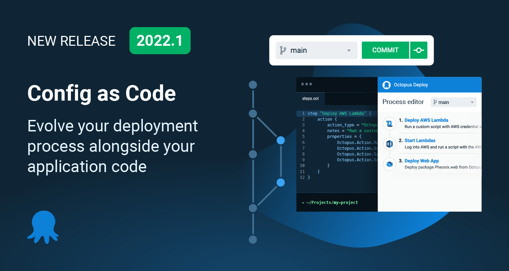

The Octopus 2022 Q1 release is now available.

I'm thrilled to share that Configuration as Code (Config as Code) for deployments is now generally available. This means you can create  version-controlled projects and see your deployment process in your Git repo next to your application code and evolve them together.

We're proud to ship our no-compromise solution, and we believe we've built one of the best "as code" implementations. Config as Code in Octopus delivers the power of Git (branches, commits and history) with the usability of Octopus UI. Config as Code is available on Octopus Cloud and ready for download by our self-hosted customers.

This release also includes other noteworthy updates:

- Visual Studio Code extension with Octopus Configuration Language (OCL) syntax highlighting, code snippets, and navigation tree
- Updated Terraform Provider with support for version-controlled projects
- New integrations:
   - [Buildkite](https://buildkite.com/) plugins (early access) allow your build agents to create and deploy releases, push build information, and run runbooks as part of a pipeline
   - [Opsera](https://www.opsera.io/) integration lets you connect Octopus to other DevOps tools with no-code automation
   - Octopus now supports connecting to multiple [Azure DevOps](https://azure.microsoft.com/en-au/services/devops/) organizations
   - Updated [TeamCity](https://www.jetbrains.com/teamcity/) plugin with the latest Log4j security patches
- Automated step updates and discovery for steps built using our next-generation step package framework
- Octopus Deploy acquired the Dist technology

## Included in the Q1 release

- Octopus Server 2022.1 ([release notes](https://octopus.com/downloads/whatsnew/2022.1))
- Octopus Deploy for Visual Studio Code 0.0.17
- Azure DevOps plugin 5.0.57
- TeamCity plugin for Octopus Deploy 6.1.12
- Tentacle 6.1.1320
- Terraform Provider for Octopus Deploy 0.7.69

## Long term support 

The following table shows the Octopus Server releases with long term support. 

| Release               | Long term support              |
| --------------------- | ---------------------------    |
| Octopus 2022.1        | Yes                            |
| Octopus 2021.3        | Yes                            |
| Octopus 2021.2        | Expired                        |

<!-- TODO: Add Killer Demo or Release tour 
## Config as Code Demo  

<iframe width="560" height="315" src="https://www.youtube.com/embed/TODO" frameborder="0" allowfullscreen></iframe>
-->

## Config as Code in Octopus

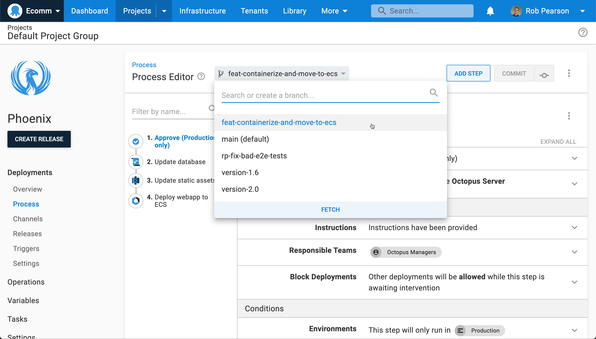

We worked hard on Config as Code to deliver a no-compromise implementation. Config as Code in Octopus delivers the full power of Git with a fully functional user interface. When you enable Config as Code for a project, you can continue to use the Octopus UI as you always have, or you can edit the text files in your favorite editor. Work wherever you're the most productive.

Config as Code has been one of the top requests from our customers. After launching an [early access preview in December 2021](https://octopus.com/blog/config-as-code-eap), your feedback has allowed us to fine-tune it further before general availability.

We designed our solution to [avoid key anti-patterns](https://octopus.com/blog/shaping-config-as-code#anti-patterns), including bad configuration file formats, Git as a simple database, and disabling the UI completely if you opt-in to Config as Code support.

## Customers using Config as Code

[Stack Overflow](https://stackoverflow.com) and [Recruit Wizard](https://recruitwizard.com.au) have been using Config as Code in early access, and shared feedback about how it's improved their development workflow.

> It has enabled us to make Config as Code the standard. The build pipeline is in the software repo. The deployment pipeline is the software repo. We can do one PR, and I can change the software, how it’s built, and how it’s deployed. 

-- Chris Hunt, Staff Site Reliability Engineer at StackOverflow

[Read more](stack-overflow.pdf) about how Stack Overflow uses Octopus Deploy and Config as Code.

> Branching in Config as Code allows us to make changes to the deployment process alongside our code changes. This is an absolute game-changer, especially as we add more and more engineers to the team.

-- Ben Macpherson, Chief Technology Officer at Recruit Wizard

[Read more](recruit-wizard.pdf) about how Recruit Wizard uses Octopus Deploy and Config as Code.

## Why use Config as Code? 

### Branch your code and deployments

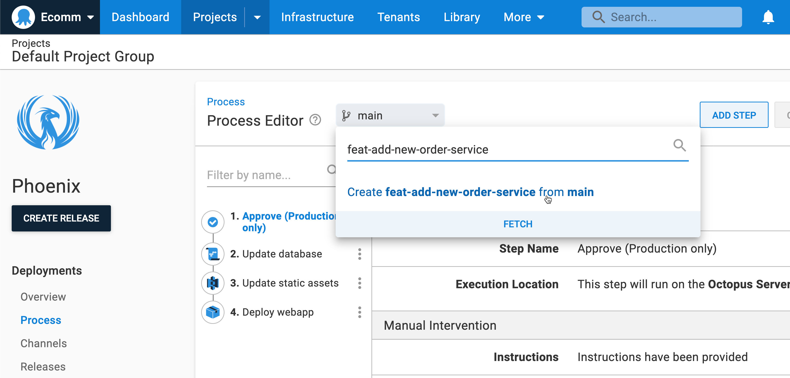

Branches are Git's superpower, and we expose that power. Using Config as Code you can: 

- Switch branches, or create new ones, in the Octopus UI or your favorite Git client
- Commit changes to your deployment process on a branch
- Add (optional) commit messages when you change your deployment process, so others understand why it changed
- Create releases from your branch, and deploy to test your changes, to support many versions of your deployment process
- Evolve your deployments safely without worrying about breaking other teams' deployments 
- Roll back to a previous version of your deployment process if things go wrong

### Review, approve, and merge

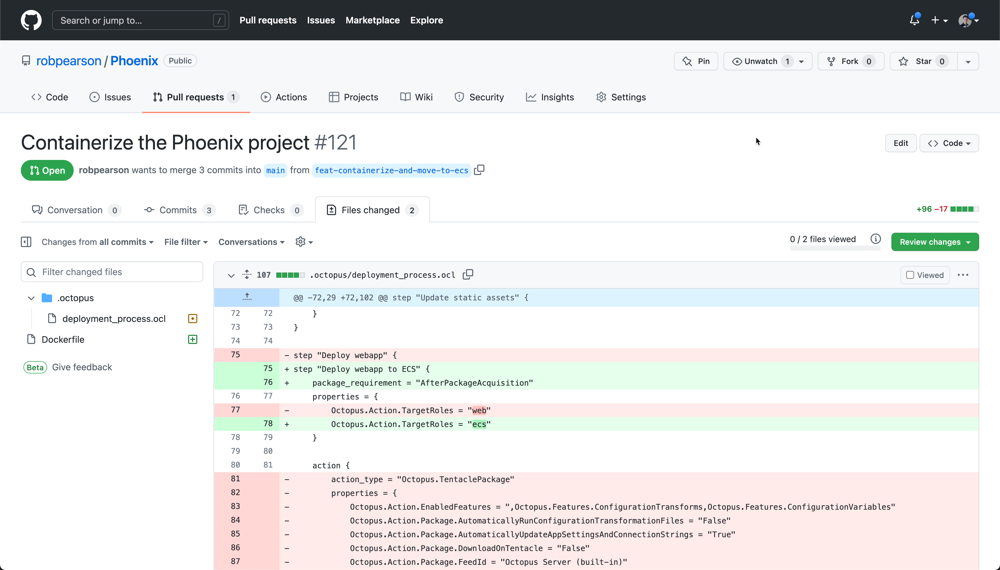

Review, approve, and merge your branches before you deploy to production. Getting more eyes across changes is always a good thing. 

Pull requests, protected branches, and code-owners enable a new set of workflows to improve the quality and safety of your releases. Reduce downtime from bad deployments and improve the quality of your releases.

### Audit and traceability

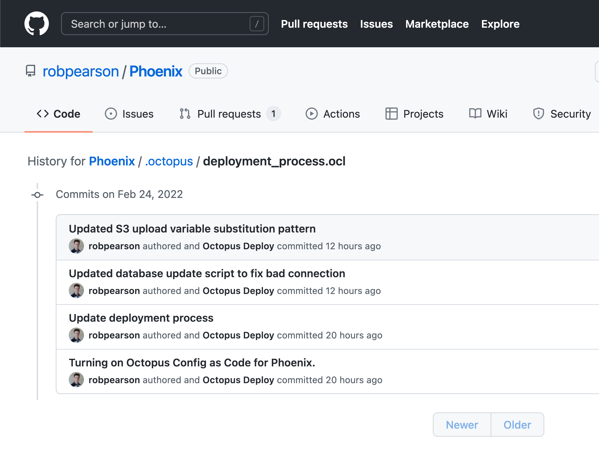

The commit history improves the traceability of changes to a deployment process. Know what changed, when, by who, and most importantly why. 

No more searching through audit logs to find out why your configuration changed. Git history and diffs provide clear traceability and tell the complete story. Octopus even records the committer details in the Git history.

### Shared Git credentials

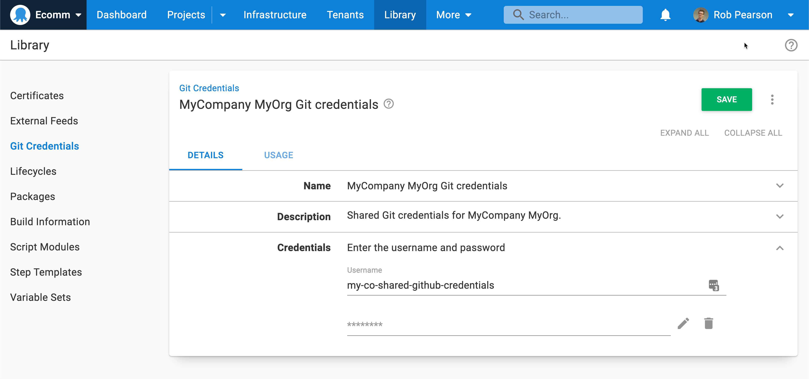

Reuse and manage your Git credentials for version-controlled projects from a single view, making it easier to update tokens and see their usage.

### Scale your deployments across teams

Create releases from branches, and deploy your changes independently of other branches. This allows you to support multiple versions of your deployment process. You can evolve your deployments safely without worrying about breaking other teams' deployments. If things go wrong, you can also roll back to a previous version of your deployment process.

---

While this first release of Config as Code only includes the deployment process, we're working to add support for version-controlled variables and runbooks next. We'd also like to update the OCL schema to make it friendlier for editing by hand.

[Read our docs](https://octopus.com/docs/projects/version-control) to learn how to create your first version-controlled project.

## Visual Studio Code plugin with OCL highlighting, code snippets, and navigation tree

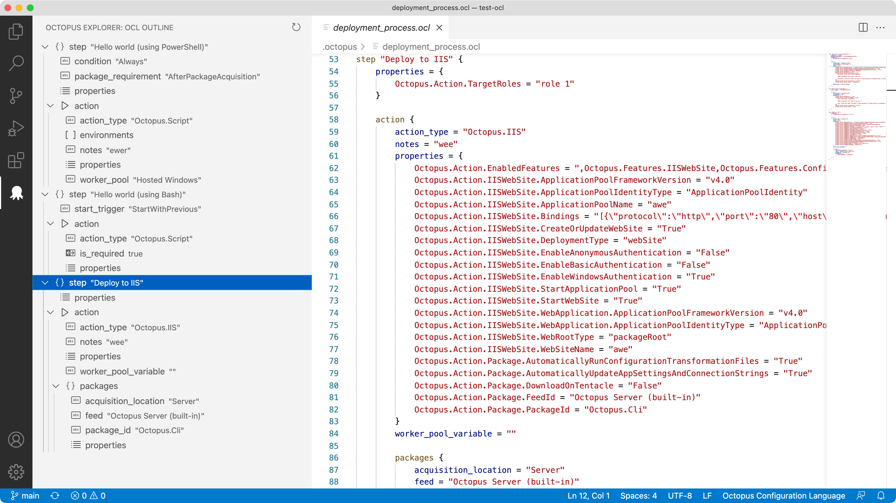

[Octopus Deploy for Visual Studio Code](https://marketplace.visualstudio.com/items?itemName=octopusdeploy.vscode-octopusdeploy) is a free extension that makes working with Octopus Configuration Language (OCL) files easier. Features include:

- Syntax highlighting
- Code snippets for steps and actions
- An integrated tree view to navigate nodes in the file

Our VS Code extension is now ready for production after updates and bug fixes.

[Install Octopus Deploy for Visual Studio Code](https://marketplace.visualstudio.com/items?itemName=octopusdeploy.vscode-octopusdeploy).

## Terraform Provider support for Config as Code

We introduced our [Terraform Provider](https://registry.terraform.io/providers/OctopusDeployLabs/octopusdeploy/) in early 2021 and it's been growing in popularity. Our provider has over 400,000 installs and contributions from the Octopus community are growing, with users reporting bugs through GitHub issues and submitting changes via pull requests. 

In this release, we added support to configure version-controlled projects in HCL. With the support for Config as Code, we added Git persistence settings that specify the default branch, URL, credentials, and more. This allows you to use Config as Code features like branching while configuring your Octopus instance.

The following example highlights the latest updates:

hcl
```
terraform {
  required_providers {
    octopusdeploy = { ... }
  }
}

resource "octopusdeploy_project_vcs" "test-project-123" {
  name                              = "test-project-name"
  lifecycle_id                      = octopusdeploy_lifecycle.test-lifecycle.id
  project_group_id                  = octopusdeploy_project_group.test-project-group.id
  space_id                          = var.space_id
  
  git_persistence_settings {
    # base_path
    # default_branch
    url = var.github_url

    credentials {
      password = var.github_pat
      username = var.github_username
    }
  }
}

resource "octopusdeploy_project" "test-project-321" {
  name                              = "test-project-name"
  lifecycle_id                      = octopusdeploy_lifecycle.test-lifecycle.id
  project_group_id                  = octopusdeploy_project_group.test-project-group.id
  space_id                          = var.space_id
}

resource "octopusdeploy_deployment_process" "test-deployment-process-main" {
  branch     = "main"
  project_id = octopusdeploy_project.test-project.id

  step {
    name         = "Hello Main Branch"
    target_roles = ["role 1"]

    run_script_action {
      script_body = "Hello from the main branch!"
      name        = "This is from the action."
    }
  }
}

resource "octopusdeploy_deployment_process" "test-deployment-process-main" {
  branch     = "secondary"
  project_id = octopusdeploy_project.test-project.id

  step {
    name         = "Hello Secondary Branch"
    target_roles = ["role 1"]

    run_script_action {
      script_body = "Hello from a different branch!"
      name        = "This is from the action."
    }
  }
}
```

[Learn more](https://registry.terraform.io/providers/OctopusDeployLabs/octopusdeploy/) about the Octopus Deploy Terraform provider.

## New integrations

### BuildKite plugins (early access) 

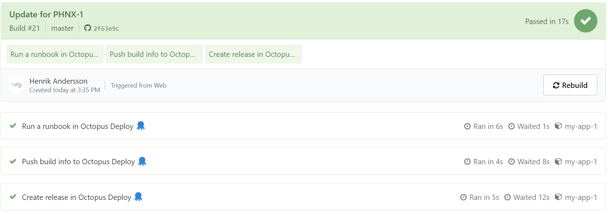

Octopus Deploy now integrates with [Buildkite](https://buildkite.com/). Our new Buildkite plugins allow your build agents to create and deploy releases, push build information, and run runbooks as part of a pipeline.

The integration provided through our new Buildkite plugins represents our initial design and release. We plan to build additional plugins and eliminate the dependency on the Octopus CLI by providing integration through Bash scripts.

[Learn more about our Buildkite plugins](https://octopus.com/blog/introducing-buildkite-integration).

### No-code DevOps integrations with Opsera

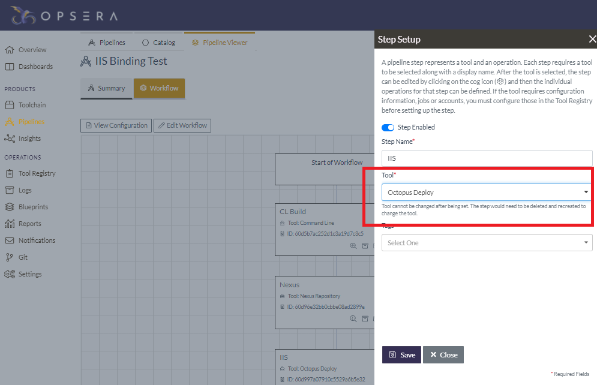

We partnered with Opsera to provide integration with Octopus Deploy. You can integrate Octopus with the 95+ platforms that Opsera supports as part of its no-code DevOps orchestration platform.

It can be challenging to automate your CI/CD pipeline, especially when using different solutions. Opsera provides a self-service platform to help you automate your CI/CD pipeline. You do this through a visual interface to create declarative pipelines with unified insights.

After it's enabled, Opsera's integration provides access through its pipeline UI to resources defined in Octopus Deploy, such as channels, environments, lifecycles, projects, spaces, and tenants.

[Learn more about Opsera integration with Octopus](https://octopus.com/blog/opsera-integration-with-octopus-deploy).

### Connect Octopus to all of your Azure DevOps organizations

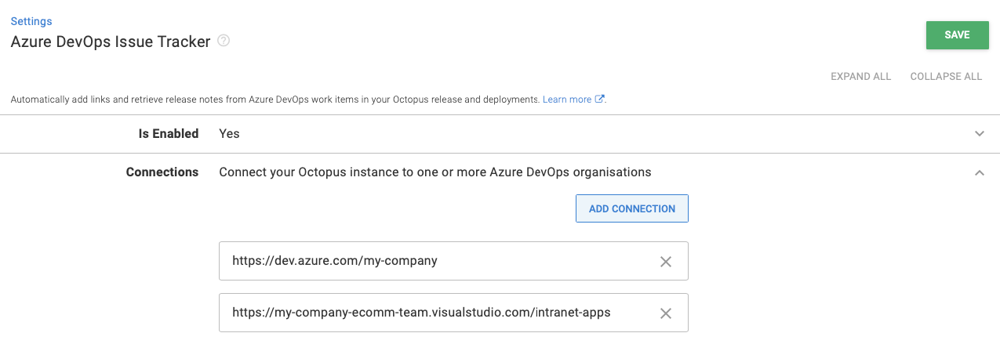 

If your company has multiple Azure DevOps organizations, you can now connect Octopus to them all. When we built the functionality to associate build information with packages, we didn't plan for customers to access more than one Azure DevOps organization. We only added support to associate a single Azure DevOps organization. We've addressed this limitation.

In this release, you have the option to configure multiple Azure DevOps organization URLs. This update means Octopus can show work items from more than one Azure DevOps organization as part of release creation or when looking at package metadata.

To configure multiple URLs in Octopus, head to **Configuration ➜ Settings ➜ Azure DevOps Issue Tracker**.

[Learn more about using Octopus extensions](https://octopus.com/docs/packaging-applications/build-servers/tfs-azure-devops/using-octopus-extension).

### TeamCity Octopus Deploy integration update

We updated our [TeamCity plugin](https://plugins.jetbrains.com/plugin/9038-octopus-deploy-integration) to use the latest version of [Log4j](https://logging.apache.org/log4j/) to resolve the latest security vulnerabilities.

## Automated step updates and discovery 

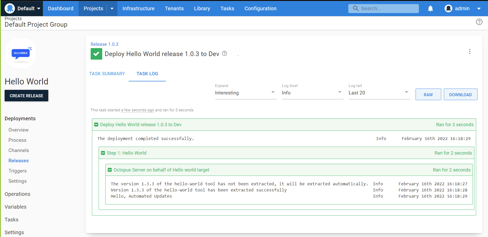

We've been quietly working on a next-generation framework for building new automation steps that we're calling the step package framework. We built our [Amazon ECS deployment support](https://octopus.com/docs/deployments/aws/ecs) with the new framework, and we're continuing to enhance it.

In this release, we introduced an update service for built-in steps using our new framework. This makes it easier to get updates and bug fixes without upgrading your Octopus Server or Octopus Cloud instance. Octopus can also discover and download new steps with this new service. Again, this lets you add new Octopus steps without an Octopus Server upgrade. 

The screenshot above shows the upgrade process for an example "Hello world" step. 

[Learn more about the update process in the Octopus architecture documentation](https://github.com/OctopusDeploy/Architecture/blob/main/Steps/Concepts/Migration.md).

## Octopus Deploy acquired Dist

Octopus acquired [Dist](https://www.dist.cloud/), a fast and reliable artifact repository for containers and Java artifacts. Octopus has a built-in package repository for various package formats, but it doesn’t support container images. We're exploring how the Dist team's technology and expertise can help us add this capability for a low latency, secure, and integrated container registry. 
 
[Learn more in Paul Stovell's blog post](https://octopus.com/blog/octopus-acquires-dist).

## Breaking changes 

This release contains one breaking change. 

**Config as Code API URLs renamed**

We have made minor changes to some Config as Code API URLs and keys in the related links collection. These changes only impact version-controlled projects and should only cause issues if you're using any URLs directly.

Learn more about this change in the [GitHub issue](https://github.com/OctopusDeploy/Issues/issues/7376).

## Upgrade or get started

Octopus Cloud users are already running this release. Self-hosted Octopus customers can download the latest version from our website.

<span><a class="btn btn-success" href="https://octopus.com/downloads/">Download Octopus 2022.1</a></span>

We encourage you to review the [steps for upgrading Octopus Server](https://octopus.com/docs/administration/upgrading). Please see the [release notes](https://octopus.com/downloads/whatsnew/2022.1) for further information.

If you've never used Octopus before, [sign up](https://octopus.com/start) for a free trial or [email our Sales team](mailto:sales@octopus.com) to see a demo and learn more.

## What's coming in future releases?

Check out our [public roadmap](https://octopus.com/roadmap) to stay informed and register for updates.

## Conclusion

Octopus 2022 Q1 delivers the first milestone for Config as Code in Octopus, and a production-ready version of our Visual Studio Code plugin with OCL highlighting, code snippets, and navigation tree. This release also includes a plethora of new and updated integrations.

We look forward to seeing our customers work with version-controlled projects. We're continuing to add more functionality to our Config as Code solution.

We'd love to hear from you with any questions or comments. You can leave a comment below or join the conversation in our [Octopus Community Slack](https://octopus.com/slack).

Happy (version-controlled) deployments!