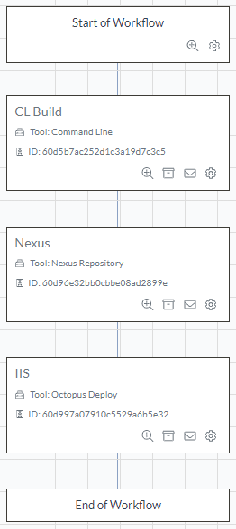
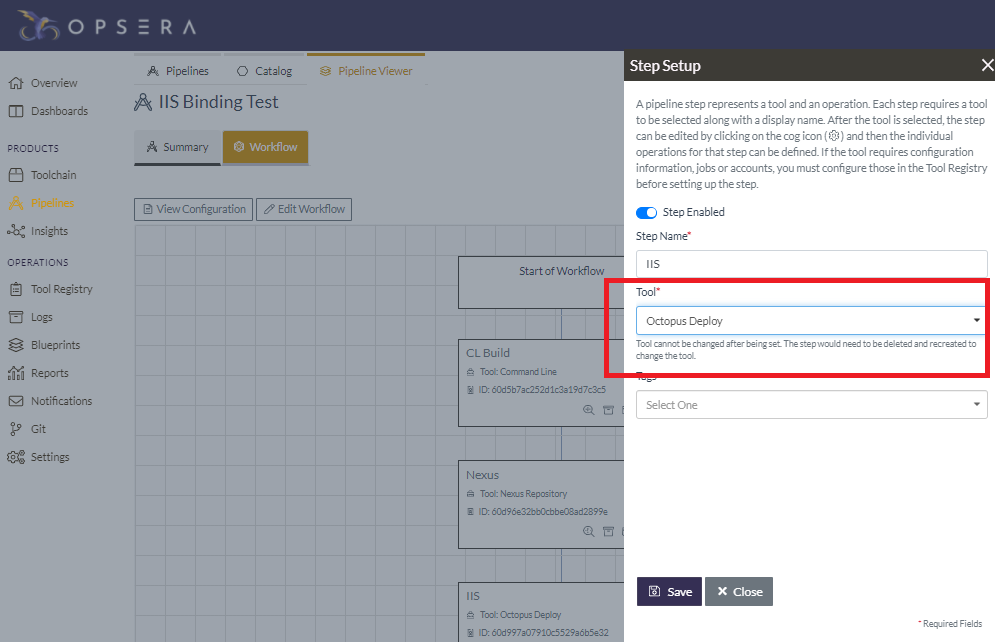
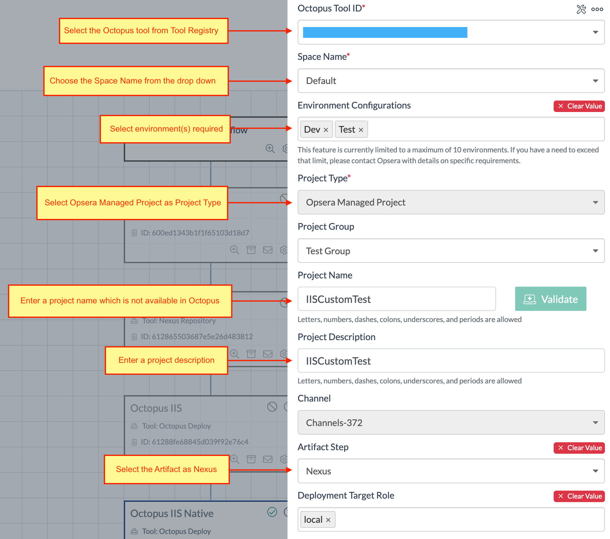
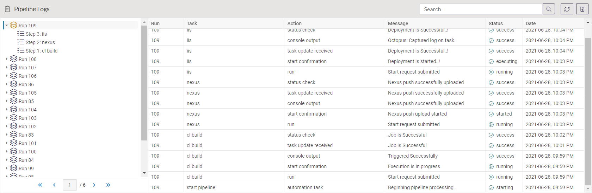

We've partnered with [Opsera](https://www.opsera.io/) to provide integration with Octopus Deploy. You can integrate Octopus with the 95+ platforms that Opsera supports as part of its no-code DevOps orchestration platform.

It can be challenging to automate your CI/CD pipeline, especially when you're using different solutions. It requires technical know-how and experience to orchestrate the various tools, pipelines, and insights required by your development teams. This is where Opsera can help. 

Opsera provides a self-service platform to help you automate your CI/CD pipeline. You do this through a visual interface, so you can create declarative pipelines with unified insights.

After it's enabled, Opsera's integration provides access through its pipeline UI to resources defined in Octopus Deploy, such as channels, environments, lifecycles, projects, spaces, and tenants.

## Getting started

Opsera and Octopus Deploy communicate through the Octopus API. So, the first step is creating an API key in Octopus.

This API key performs operations against Octopus Deploy on your behalf. See our docs to [learn how to create an API Key](https://octopus.com/docs/octopus-rest-api/how-to-create-an-api-key).

The next step is to register Octopus Deploy in Opsera through the Tool Registry. Instructions for this step are in the section [Registering the Octopus Tool in Tool Registry](https://opsera.atlassian.net/wiki/spaces/OE/pages/1367474335/Octopus+Deployment#Registering-the-Octopus-tool-in-Tool-Registry) in Opsera's documentation. 

After this step is complete, you can use the Octopus Deploy integration in the pipeline UI of Opsera.

## An overview of Opsera integration with Octopus

A powerful feature of Opsera is its ability to visualize and orchestrate pipeline workflows:

This workflow represents a Java-based project: build source code through the command-line → push artifacts to Nexus repository → deploy to IIS through Octopus Deploy. 

Opsera displays each step of a workflow; each step represents a tool and an operation to be performed.

Editing the configuration enables you to customize the properties and actions encompassed by its step:

This step represents a deployment to IIS through Octopus Deploy. The Opsera UI exposes resources like channels, projects, and roles, providing a consistent experience across the platforms it supports.

After you establish the pipeline, it can run based on a series of events or as a scheduled task:

## Conclusion

Opsera provides a self-service platform to help you automate your CI/CD through a visual interface, so you can create declarative pipelines with unified insights.

Octopus Deploy joins the 95+ platforms supported by Opsera as part of its no-code DevOps orchestration platform. The power of Opsera is its ability to easily integrate other systems with Octopus Deploy.

Happy deployments!