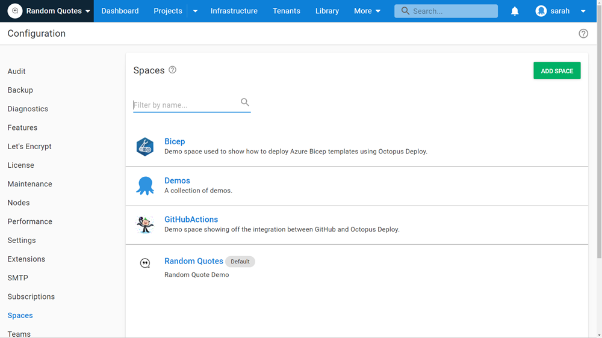

Hey folks, it's great to be back for part 3 of my zero to hero blog series. 

I joined Octopus Deploy in October 2021 and I'm on a learning journey that I want to share with you.  In [part one](https://octopus.com/blog/zero-to-octopus-hero-part-1), I covered what Octopus Deploy does. In [part 2](https://octopus.com/blog/zero-to-octopus-hero-part-2), I discovered the role Octopus plays in DevOps. 

In this post, I look at how Octopus Deploy integrates with other tools that organizations use. I also dive in to more of Octopus Deploy's features. 

## Config As Code

Version control is a core component of the DevOps methodology. Version-controlling your Octopus configuration can now be done with [Config as Code](https://octopus.com/blog/config-as-code-eap), available as an early access preview. 

With Config as Code you can see a history of changes to your deployment process, including who performed changes and when, with a version-controlled (Git) text representation of an Octopus project. If you're storing your application in GitHub as well, you have a single source of truth, with application code, build scripts, and deployment configuration in the one place. 

To explore this feature, install the [Octopus Deploy for Visual Studio Code plugin](https://marketplace.visualstudio.com/items?itemName=octopusdeploy.vscode-octopusdeploy). The plugin helps with syntax highlighting when exploring the .OCL files created in your Git repository by Octopus. 

Another great resource to learn more about Config as Code is our deep dive webinar, hosted by our Director of Product, Michael Richardson. 

<iframe width="560" height="315" src="https://www.youtube.com/embed/oZfxlbpSP14" title="YouTube video player" frameborder="0" allow="accelerometer; autoplay; clipboard-write; encrypted-media; gyroscope; picture-in-picture" allowfullscreen></iframe>

## Exporting and importing projects

There’s a handy feature in Octopus that makes it possible for projects to be exported and then imported into another space, giving you more control over how you organize your Octopus instance. You can take settings and configurations from a project in one space to another space. 

I spent time setting up my first space and project, getting everything right. I was then able to take some of that work with me to another space, using the export/import feature.

I was able to import: 

* The project (name and settings)
* The deployment process and runbooks
* Project variables
* Channels and all lifecycles referenced
* [Environments](https://octopus.com/docs/projects/export-import#environments)
* [Tenants](https://octopus.com/docs/projects/export-import#tenants) connected to the project
* [Accounts](https://octopus.com/docs/projects/export-import#accounts) and [certificates](https://octopus.com/docs/projects/export-import#certificates) used by the project
* [Library variable sets](https://octopus.com/docs/projects/export-import#library-variable-sets) included in the project
* [Step templates](https://octopus.com/docs/projects/export-import#step-templates) used in the deployment process or runbooks
* Other projects referenced by the [Deploy a Release step](https://octopus.com/docs/projects/coordinating-multiple-projects/deploy-release-step)

This is a great feature in Octopus to help move projects between instances or to split projects into multiple spaces for better visibility.  

It's worth noting that it can't export and import: 

* [Packages](https://octopus.com/docs/projects/export-import#packages)
* [Deployment targets](https://octopus.com/docs/projects/export-import#deployment-targets)
* [Audit logs](https://octopus.com/docs/projects/export-import#audit-logs)
* [Workers](https://octopus.com/docs/projects/export-import#workers)
* [Project logos](https://octopus.com/docs/projects/export-import#project-logos)
* [Triggers](https://octopus.com/docs/projects/export-import#triggers)

## Authentication system integration

Most organizations have an existing authentication system set up. Active Directory is a widely-used example.  Octopus Deploy can integrate with several authentication systems, including:

- Active Directory Authentication
- Azure Active Directory Authentication
- GoogleApps Authentication
- Okta AUthentication
- GitHub
- LDAP Authentication

Check out the[ authentication provider compatibility documentation](https://octopus.com/docs/security/authentication/auth-provider-compatibility) for more information. 

Authentication should be set up to provide a consistent experience for all your users.  If you're introducing Octopus Deploy into your environment, you want to avoid giving your users another username and password combination to manage. 

## Personalize your space

Something fun and valuable I did, that I recommend you do, too, is customizing your spaces with descriptions and logos.

Under **Configuration**, then **Spaces**, and then in each Octopus Space, you can add a description and a logo. Adding these helps you quickly identify your spaces. It also makes it easy for others working with you to distinguish each space. 

## Next steps

I'm really starting to feel comfortable with Octopus Deploy. There's always more to learn but the jigsaw pieces are coming together.

If there's anything you want me to cover or answer about Octopus Deploy, please let me know and I can address them in part 4. Reach out to [sarah.lean@octopus.com](mailto:sarah.lean@octopus.com) or leave a comment below.

We'll add links to other posts in the series as they become available.

!include <zero-to-hero>

Happy deployments!