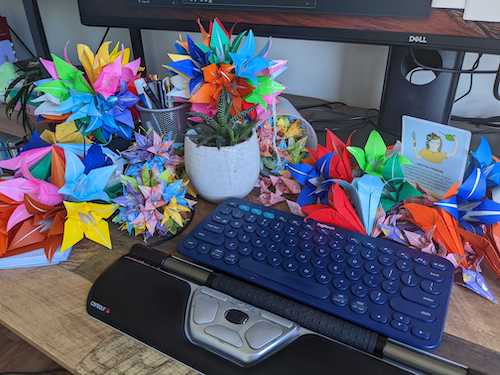

This post is the next [in our series](https://octopus.com/blog/tag/At%20The%20Helm), chatting to people at Octopus about their role, their challenges, what they're working on to improve the product for our customers, and more.

Here we talk to Trish Khoo, our Director of Engineering.

## How long have you been at Octopus and what experience did you bring?

I've been at Octopus for a bit over a year. Prior, I worked at big places like Google and Microsoft, small places like startups, and everything in between. I worked in Sydney, London, and San Francisco before settling in Brisbane. 

## What does a typical day look like as Director of Engineering?

I usually start my day catching up on Slack messages over coffee. I have 8 channels in my "priority" section and 13 in my "important" section. I stay up to date on both as much as I can. Then there are 31 more channels I keep an eye on regularly. 

On Mondays, I catch up with Mike (VP of Engineering) and Roy (Director of Engineering for the Scale Group) to discuss issues affecting R&D that we can solve collaboratively. 

After checking Slack again, I action things from the meeting, then break for lunch. Then I have sync-ups with my engineering managers, and my Group Leadership Team (GLT). In the afternoon, I write policies, guidelines, proposals, strategies, announcements, or messages, and have 1:1 meetings.

Using Slack and Zoom every day might sound unexciting, but I'm building awareness of how my group and greater R&D are functioning and taking small but meaningful actions to adjust things. I also use the time in Zoom meetings to make origami flowers, which helps me focus!

*Trish's desk adorned with her origami creations*

One lesson I've learned is that making big changes as a senior leader has a significant impact on the organization. Sometimes that's necessary, but often it can just be disruptive. I'm most helpful when I'm clarifying situations and policies to help others be more effective in their roles.

## What has been your biggest accomplishment at Octopus so far?

Defining the new Engineering Manager role has been a big achievement. Before joining, engineering managers were generally hands-on technical leads and people managers. Defining a new role of managers who are purely focused on people management, team culture, and delivery has helped scale teams and relieve additional pressures from technical leads. 

I also established the first R&D group with my GLT, which has offered us better ways to strategize big, long-term initiatives. 

I also enjoyed working with other leaders to create an engineering hiring strategy that allowed us to scale rapidly. When I first started, "headcount" wasn't a concept at Octopus and each manager was responsible for their job ads and candidate interviews - the whole process through to hire. It worked for a small number of candidates, but it didn't scale. Together with the People team, I introduced new scalable ways to manage incoming candidates while ensuring we’re filling the right teams first.

I'm happy to see my contribution to our scaling goals over the past year, and I'm proud to be a part of this journey. 

## What are the biggest challenges for the engineering team at Octopus?

We added so many engineers to the company so quickly and worked hard to get our system to scale alongside the growth. We're at a critical point where engineering productivity is challenging, our ambitions are high, and half our team is new. Keeping on top of our delivery roadmap at this point requires constant attention, but so far we’re doing great. 

## What's your vision for engineering at Octopus over the next few years?

I want to see us make it through the rapid growth rollercoaster while retaining the values that make Octopus a great place for engineers to work - a high-performing culture where engineers do the best work of their lives. I want to see Octopus become the place you go to become a better software engineer. I want to see our organization become a resilient machine of thriving engineers with the confidence to deliver big things.

And I think we’re doing really well! No matter what we do, the rapid scale and transformation we're going through will be difficult sometimes. But the people I work with every day are intelligent, hard-working, empathetic, and honest, and those are great foundations for the future at Octopus.

## How do you measure success internally and for our customers?

It's an interesting time at the moment with a focus on acquiring new, bigger customers as well as retaining our existing ones. We're discovering what success means for new customers, and learning what it takes to create a compelling product they love. 

In one team, we're experimenting with our customers' first experience with Octopus to see if we can get more first-timers to deploy successfully. In another team, we're learning about popular enterprise products like ServiceNow and working out how Octopus can fit into this kind of tooling ecosystem. Ultimately, we want our product to help our customers succeed because that helps us be successful.

Internally, we need to deliver consistently and sustainably. This means we create a working environment where it’s easy to get the big things done repeatedly. With that and the right people, we can achieve pretty much anything.
