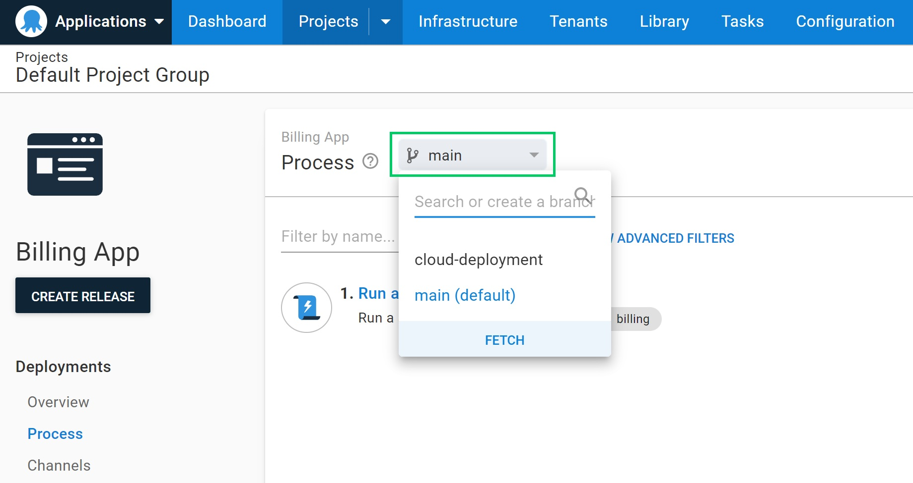

Since we released the early-access preview of Octopus Config as Code last year, there have been many questions about how to use the feature for the best results. This article explains some good practices for using config as code and how to adjust your strategy in different situations.

## Why use config as code?

Git is the perfect solution for versioning code and keeping track of changes over time. It has established patterns for branching the code and for publishing and approving changes. It also allows you to compare versions and travel back in time if you need to.

The Octopus Config as Code feature lets you store your deployment process as configuration files in a Git repository rather than in the Octopus database. You can use config as code to:

- Branch your configuration and test changes in the branch before merging them
- Review and collaborate on changes using pull requests
- Clone an existing project to use as a template for future projects
- Track changes to the deployment configuration using the same tools you already use for your application code
- Edit your deployment configuration in your preferred text editor or within the Octopus app

The configuration is stored as human-readable files that use Octopus Configuration Language (OCL). OCL was designed to make it easier to read and edit the deployment process and review any changes. There is a [Visual Studio Code extension to make it easier to work with OCL files](https://marketplace.visualstudio.com/items?itemName=octopusdeploy.vscode-octopusdeploy).

Not everything is moved into the repository when you enable version control. A list of version-controlled resources is available in our [configuration as code reference](https://octopus.com/docs/projects/version-control/config-as-code-reference).

:::warning
Switching on version control for your project is a one-way change. You can't move the project back into the Octopus database once it's in a repository. You can clone an existing project to try config as code and confirm that it meets your needs before enabling it for your production projects.
:::

## Where to store your configuration

One of the first decisions you will need to make is where to store your deployment configuration files. You can keep your configuration:

- Alongside your application code
- In a separate deployment repository

Read on, to learn when each option works best and when to avoid them. You might have noticed that you can arrange these possibilities along a scale from a one-to-one relationship with applications to a single large repository. We recommend keeping your deployment configuration in the same repository as the application code, but there are specific circumstances where the other options may be suitable.

After setting up config as code, you can [move your deployment configuration files](https://octopus.com/docs/projects/version-control/moving-version-control) if you change your mind.

### Alongside application code

Placing your deployment configuration alongside your application code is the pattern we recommend. It is best  _to evolve your deployment process alongside your application code_. Putting the configuration in the same location as the application aligns with DevOps practices, where engineers take end-to-end responsibility for their applications.

If you opt to store your configuration in the application repository, each application will have its own `.octopus` directory with the configuration files. This arrangement makes it easy to find the appropriate deployment process for each application.

If you don't want changes to the deployment process to trigger a build of your application, you can mask the `.octopus` folder in your build server.

This pattern is ideal when the team is responsible for both the application and its deployment.

### Deployment-specific repository

If you need to separate the deployment configuration from the application repository, you can create a deployment-specific repository. You should only use a separate repository to create a firm divide between the application and its deployment process. For example, if you need to limit who can access the deployment repository or if you need to enforce a different policy for changes.

Your organization design can inform whether you use:

- Individual deployment repositories per application
- A deployment repository per Octopus Space
- A central deployment repository

When choosing a design for your repositories, consider how many branches you might create. The Octopus app will show all branches in the branch switcher. If you group multiple projects into a single repository, you should also place each project in a sub-directory within the `.octopus` folder.

## Using config as code effectively

Once you have switched to version control, you will have access to some familiar tools that can help you succeed with your deployments. Two of these are branches and pull requests.

You can use branches to contain the risk when changing your deployment process. You can create and switch branches in the Octopus app for a version-controlled project. You can also create and edit branches outside of the Octopus app. Whether you choose to use the Octopus app, a text editor, or both, the process will always be up to date with the branch.

## When config as code is the wrong option

Many deployment resources don't belong to a project, for example; spaces, tenants, environments, and accounts. We didn't intend for config as code to handle the version control of these items.

You can use the [Octopus Deploy Terraform Provider](https://registry.terraform.io/providers/OctopusDeployLabs/octopusdeploy/latest/docs) to handle these resources. You can find out [how to get started with the Terraform provider for Octopus Deploy on our blog](https://octopus.com/blog/octopusdeploy-terraform-provider).

You might also consider sharing a single configuration between multiple projects to keep the process in sync. However, this requires many non-project resources to be kept identical between projects, which quickly becomes hard to manage.

Instead of sharing the same OCL files between multiple projects, you should create a custom tool to interact with the [Octopus Deploy REST API](https://octopus.com/docs/octopus-rest-api) to enforce the desired process configuration. You can read more in our documentation for [synchronizing multiple instances](https://octopus.com/docs/administration/sync-instances).

## Conclusion

You can now confidently choose an appropriate strategy for config as code. You should know how to select a suitable location in version control for your configuration files, understand how to use branches and pull requests to manage your deployment process, and when config as code is not the right tool for the job.

On our [roadmap],(https://octopus.com/company/roadmap) you can keep updated on future additions, such as config as code for runbooks.